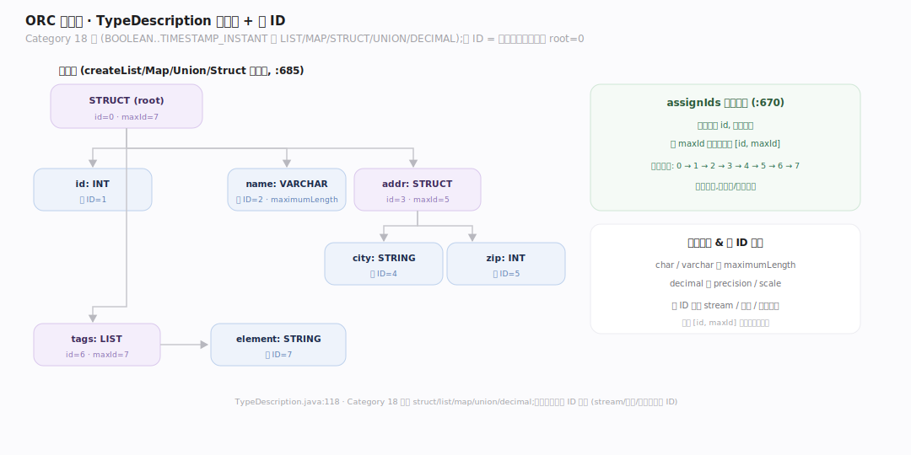
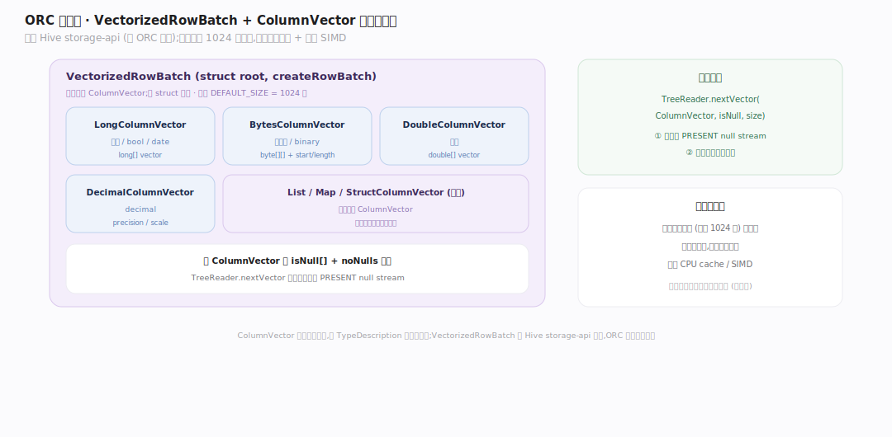
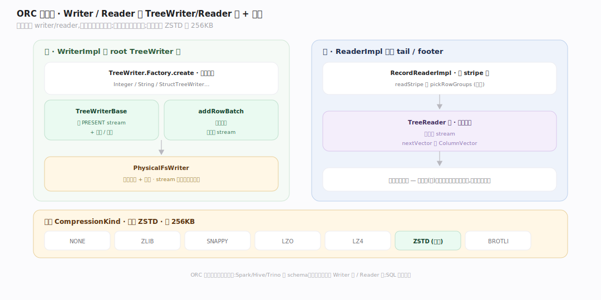

# ORC 原理 · 接触面主线 · 读写 API、类型系统与向量批

> **定位**：属"接触面主线"(计算引擎可见)。ORC 的接触面是**读写库 API**:类型树 TypeDescription(定 schema)、VectorizedRowBatch(列式批读写)、WriterImpl/ReaderImpl(TreeWriter/Reader 树)、压缩。给引擎集成,非终端 SQL。调用【文件布局】【列编码】等支撑主线。源码基准 **ORC(5f34b04a4)**(`java/core/`)。

ORC 怎么被用?**通过读写库**:计算引擎(Spark/Hive/Trino)定义 schema(TypeDescription 类型树)、给/取 VectorizedRowBatch(列式内存批)、调 Writer 写文件 / Reader 读文件。写走 TreeWriter 树(每列一个),读走 TreeReader 树。理解类型树 + 向量批 + Writer/Reader 树,就懂了 ORC 的用法接触面。

---

## 一、类型系统:TypeDescription 树 + 列 ID

schema 是**类型树** `TypeDescription`(`TypeDescription.java:118`),`Category` 18 种:BOOLEAN…TIMESTAMP_INSTANT,含 LIST/MAP/STRUCT/UNION/DECIMAL 复合类型。

- **树结构**:struct 有 fieldNames + 子类型,list/map/union 有子类型;`createList/Map/Union/Struct` 连父子(`:685`)。
- **列 ID = 前序(深度优先)编号**,root=0:`assignIds` 先给自己 id、再递归子,存 `maxId` 记子树范围(`:670`)。整个格式靠列 ID 定位(stream/统计/索引都按列 ID)。
- char/varchar 带 maximumLength,decimal 带 precision/scale。

**为什么列 ID 前序**:稳定编号让每列的 stream、统计、索引可按 ID 索引;子树 [id, maxId] 范围支持整子树操作。

---

## 二、VectorizedRowBatch:列式内存批

ORC 读写单位是**列式批** VectorizedRowBatch + ColumnVector(来自 Hive storage-api,非 ORC 树内定义):

- ColumnVector 子类:`LongColumnVector`(整数/bool/date)、`BytesColumnVector`(字符串/binary)、`DoubleColumnVector`、`DecimalColumnVector`、`ListColumnVector`/`MapColumnVector`/`StructColumnVector`(复合)。
- `TypeDescription.createRowBatch`:struct root 每子一个 ColumnVector;非 struct 单列(`TypeDescription.java:539`)。默认批大小 `DEFAULT_SIZE`。
- 读端 `TreeReader.nextVector(ColumnVector, isNull, size)` 填批,先应用 PRESENT null stream(`TreeReaderFactory.java:405`)。

**为什么向量批**:一次处理一批(默认 1024 行)的一列——列式向量化,分摊调用开销、用满 CPU cache/SIMD,是列存高性能读写的内存表示。

---

## 三、Writer / Reader:TreeWriter/Reader 树 + 压缩

读写靠**每列一个 writer/reader 的树**:

- **WriterImpl**:持 root TreeWriter 树(`TreeWriter.Factory.create`,`WriterImpl.java:242`)——IntegerTreeWriter/StringTreeWriter/StructTreeWriter…每列一个;`TreeWriterBase` 建 PRESENT stream + 索引/统计;`addRowBatch` 喂批;`PhysicalFsWriter` 做物理布局 + 压缩。
- **ReaderImpl**(`impl/ReaderImpl.java:67`):解析 tail/footer(倒读 extractFileTail 重载,`impl/ReaderImpl.java:770`);`RecordReaderImpl`(`impl/RecordReaderImpl.java:83`)驱动逐 stripe 读(`readStripe` 调 pickRowGroups);TreeReader 树解码列 stream 填 ColumnVector。
- **入口**:`OrcFile.createWriter`(`OrcFile.java:1097`)/ `OrcFile.createReader`(`OrcFile.java:389`)——引擎从这两个静态工厂拿 Writer/Reader,再走各自的树。
- **压缩** `CompressionKind`:`NONE/ZLIB/SNAPPY/LZO/LZ4/ZSTD/BROTLI`,默认 **ZSTD**(`OrcConf.java:55`),块大小 **256KB**。stream 编码后再块压缩。

TreeWriter/Reader 树结构镜像类型树——每个节点(列)负责自己类型的编码/解码,复合类型递归到子。

---

## 拓展 · 接触面关键结构一览

| 结构 | 定义 | 职责 |
|---|---|---|
| TypeDescription | `TypeDescription.java:118` | schema 类型树 + 列 ID |
| assignIds | `TypeDescription.java:670` | 前序编号赋列 ID(root=0) |
| VectorizedRowBatch / ColumnVector | Hive storage-api | 列式内存批 |
| WriterImpl / TreeWriter | `impl/WriterImpl.java:242` | 每列 writer 树 + addRowBatch |
| ReaderImpl | `impl/ReaderImpl.java:67` | 解析 tail/footer 建 RecordReader |
| RecordReaderImpl / TreeReader | `impl/RecordReaderImpl.java:83` | 每列 reader 树解码填批 |
| OrcFile.createWriter/createReader | `OrcFile.java:1097` / `:389` | 引擎拿 Writer/Reader 的静态工厂 |
| CompressionKind | `CompressionKind.java:26` | ZLIB/SNAPPY/ZSTD…默认 ZSTD |

## 调优要点（关键开关）

- **orc.compress**(默认 ZSTD):ZSTD 压缩率/速度均衡;SNAPPY 更快压缩率低;NONE 最快最大。
- **orc.compress.size**(默认 256KB):压缩块大小;大块压缩率高但随机读放大。
- **batch size**(默认 1024):向量批行数;大批吞吐高但内存占用大。
- **schema 设计**:列 ID 稳定;演进(加列)在树尾加,避免打乱已有 ID。

## 常见误区与工程要点

- **误区:ORC 是查询引擎/有 SQL。** 不。它是读写库,链接进 Spark/Hive/Trino;引擎调 ORC API 读写文件,SQL 在引擎里。
- **误区:ORC 逐行读写。** 列式向量批(VectorizedRowBatch,默认 1024 行一批的每列),向量化处理,非逐行。
- **误区:列 ID = 列名/位置。** 列 ID 是前序编号(root=0),稳定;stream/统计/索引都按 ID 定位,与名字/位置解耦。
- **误区:VectorizedRowBatch 是 ORC 定义的。** 来自 Hive storage-api(依赖),ORC 复用;ColumnVector 子类同源。
- **归属提醒**:类型树驱动【列编码】选择;向量批读写经【文件布局】的 stripe;压缩在【文件布局】postscript 声明;读时剪枝在【谓词下推】。

## 一句话总纲

**ORC 接触面是给引擎集成的读写库(非终端 SQL):schema 是 TypeDescription 类型树(18 种 Category 含 struct/list/map/union/decimal,列 ID 前序编号 root=0 贯穿 stream/统计/索引);读写单位是 VectorizedRowBatch(Hive storage-api 的列式批,默认 1024 行,ColumnVector 按类型分子类)向量化处理;WriterImpl 持每列一个 TreeWriter 树编码进 stream+攒统计、ReaderImpl/RecordReaderImpl 的 TreeReader 树逐 stripe 解码填批,压缩默认 ZSTD(块 256KB);Spark/Hive/Trino 定 schema、给取向量批调 ORC 读写文件。**
