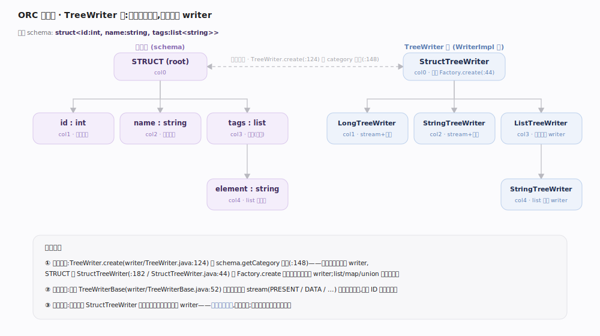
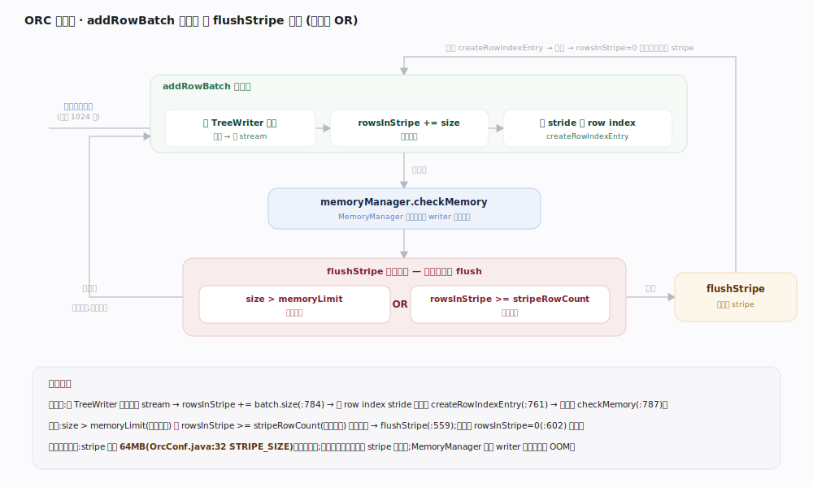
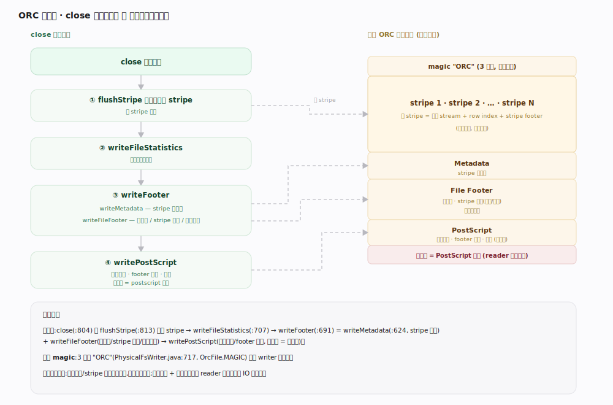

# ORC 原理 · 支撑主线 · 写路径

> **定位**：属"写入能力域"。管一次写文件的全流程:WriterImpl 建 TreeWriter 树、addRowBatch 逐批喂列、内存/行数触发 flushStripe、close 写 footer + postscript。是【文件布局】的生产者,驱动【列编码】填 stream、【列统计与布隆】攒统计、【行组与索引】建 row index。源码基准 **ORC(5f34b04a4)**(`java/core/`)。

写一个 ORC 文件不是"攒齐全部行再落盘",而是**流式分 stripe 写**:引擎不断 `addRowBatch` 喂列式批,writer 编码进 stream、边写边攒统计与 row index;内存或行数到阈值就 `flushStripe` 把一个 stripe 落盘、清空重来;最后 `close` 收尾写 footer 和 postscript。写侧结构是一棵 **TreeWriter 树**,与类型树同构、每列一个 writer。理解 TreeWriter 树 + flushStripe 触发 + close 收尾,就懂了 ORC 文件怎么被造出来。

---

## 一、TreeWriter 树:每列一个 writer

`WriterImpl` 按类型树建一棵**同构的 TreeWriter 树**:

- 入口 `TreeWriter.create(schema, ...)`(`writer/TreeWriter.java:124`)按 `schema.getCategory` 分派(`:148`):原始类型建对应 writer,`STRUCT` 建 `StructTreeWriter`(`:182`)并 `Factory.create` 递归建每个子字段的 writer(`StructTreeWriter.java:44`);list/map/union 同理递归(`ListTreeWriter.java:47`、`MapTreeWriter.java:50`)。
- 每个 `TreeWriterBase`(`writer/TreeWriterBase.java:52`)持有自己的输出 stream(PRESENT/DATA/…)与统计累加器。
- 写一批时,`StructTreeWriter` 把批里各列分派给对应子 writer——**列式并行编码**,而非逐行。

**为什么树结构**:嵌套类型(struct/list/map)的写入天然递归;TreeWriter 树与类型树、列 ID 一一对应,让每列的 stream/统计各归其位。

---

## 二、addRowBatch 与 flushStripe 触发

`addRowBatch(VectorizedRowBatch)`(`WriterImpl.java:733`)是写主循环:

- 把批交给根 TreeWriter 编码进各 stream;`rowsInStripe += batch.size`(`:784`),超大批按 row index stride 切段并 `createRowIndexEntry`(`:761`)。
- 每批末 `memoryManager.checkMemory(...)`(`:787`)——由 `MemoryManager`(`:112`)全局管所有 writer 的内存配额。
- **触发 flushStripe** 的两条件(`:349`):`size > memoryLimit`(内存超限)**或** `rowsInStripe >= stripeRowCount`(行数超限)。
- `flushStripe`(`:559`):先补最后一个 `createRowIndexEntry`(`:561`),把各 stream + row index + stripe footer 落盘,累加 stripe 信息与文件级统计,`rowsInStripe = 0`(`:602`)重来。

**为什么两个阈值**:stripe 默认 64MB(`OrcConf.java:32`,`STRIPE_SIZE`)控字节体量,行数上限防超宽表单 stripe 行太少;内存管理器让多 writer 共享内存时不 OOM。

---

## 三、close:写 footer 与 postscript

`close`(`WriterImpl.java:804`)收尾:

- 先 `flushStripe`(`:813`)落最后一个未满 stripe;
- `treeWriter.writeFileStatistics`(`:707`)汇总文件级统计;
- `writeFooter`(`:691`)→ `writeMetadata`(`:624`,stripe 级统计)+ `physicalWriter.writeFileFooter(builder)`(`:718`,类型树/stripe 目录/文件统计);
- `writePostScript`(`:630`→ `PhysicalFsWriter.writePostScript:475`):写压缩方式、footer 长度、版本,**末字节 = postscript 长度**。
- 文件开头的 3 字节 magic `"ORC"`(`PhysicalFsWriter.java:717`,`OrcFile.MAGIC`)在建 writer 时已写。

**为什么尾部写 footer/postscript**:写时行数/stripe 边界事先未知,只能全写完才知全貌;尾部索引 + 末字节长度让 reader 倒读一次小 IO 拿全图(见【读路径】)。

---

## 拓展 · 写路径关键结构一览

| 结构 / 方法 | 位置 | 职责 |
|---|---|---|
| TreeWriter.create | `writer/TreeWriter.java:124` | 按 category 建 writer 树 |
| StructTreeWriter | `writer/StructTreeWriter.java:44` | 递归建子字段 writer,列式分派 |
| addRowBatch | `WriterImpl.java:733` | 写主循环,编码 + 攒 row index |
| checkMemory / flushStripe 触发 | `WriterImpl.java:349` | size>limit 或 rows>=上限则 flush |
| flushStripe | `WriterImpl.java:559` | 落一个 stripe,清零重来 |
| MemoryManager | `WriterImpl.java:112` | 全局内存配额,多 writer 共享 |
| close → writeFooter → writePostScript | `WriterImpl.java:804/691/630` | 收尾写 footer + postscript |
| writeFileFooter / writePostScript(物理) | `PhysicalFsWriter.java:717` / `:475` | 物理落 footer(类型树/stripe 目录/文件统计)+ 不压缩 postscript |

## 调优要点（关键开关）

- **orc.stripe.size**(默认 64MB):大 stripe 扫描/压缩高效但写内存高、并行粒度粗;小 stripe 反之。
- **orc.stripe.row.count**:行数上限,配合字节上限触发 flush,防超宽表单 stripe 行太少。
- **orc.memory.pool**:写侧内存池占比,多并发 writer 时调低避免 OOM。
- **批大小**:`addRowBatch` 的批越大越摊薄调用开销,但太大增内存;默认 1024 行合适。

## 常见误区与工程要点

- **误区:writer 攒齐全部行才落盘。** 流式分 stripe 写,内存/行数到阈值就 flushStripe 落盘清空——支持超大文件恒定内存。
- **误区:逐行写。** 写单位是 VectorizedRowBatch(列式批),TreeWriter 树列式并行编码。
- **误区:footer 在文件开头。** footer + postscript 在尾部(写完才知全貌),开头只有 3 字节 magic。
- **误区:内存超限才 flush。** 内存超限**或**行数超上限任一即 flush,两条件并行。
- **归属提醒**:编码进 stream 在【列编码】;统计累加在【列统计与布隆】;row index 建在【行组与索引】;压缩在【压缩与流分块】;最终布局在【文件布局】。

## 一句话总纲

**ORC 写路径是流式分 stripe 写:WriterImpl 按类型树建同构的 TreeWriter 树(TreeWriter.create 按 category 分派、Struct/List/Map 递归建子 writer,每列一个持 stream+统计累加器);addRowBatch 把列式批交根 writer 列式并行编码、边写边攒 row index 与统计;每批末 MemoryManager.checkMemory,当 size>memoryLimit 或 rowsInStripe>=行数上限即 flushStripe 落一个 stripe(默认 64MB)清零重来;close 先 flush 末 stripe,再 writeFileStatistics + writeFooter(类型树/stripe 目录/文件统计)+ writePostScript(压缩方式/footer 长度,末字节=其长度),开头 3 字节 magic "ORC" 建 writer 时已写——尾部索引让 reader 倒读一次拿全图。**
