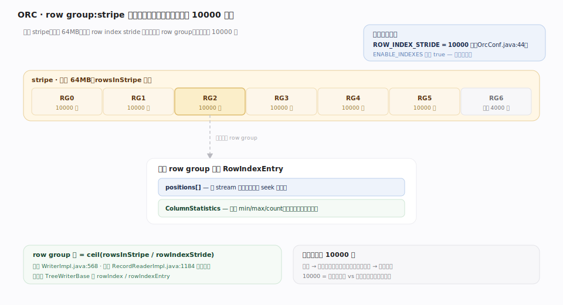
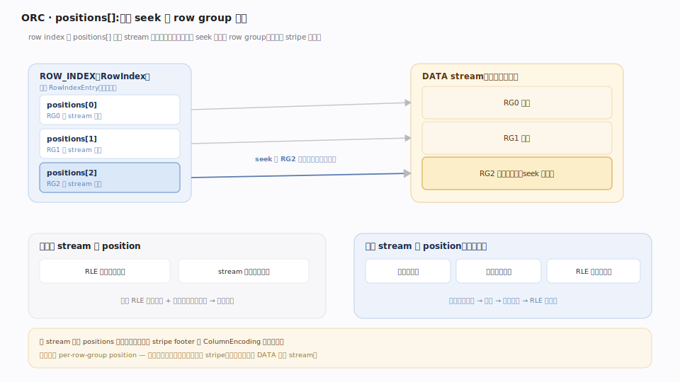
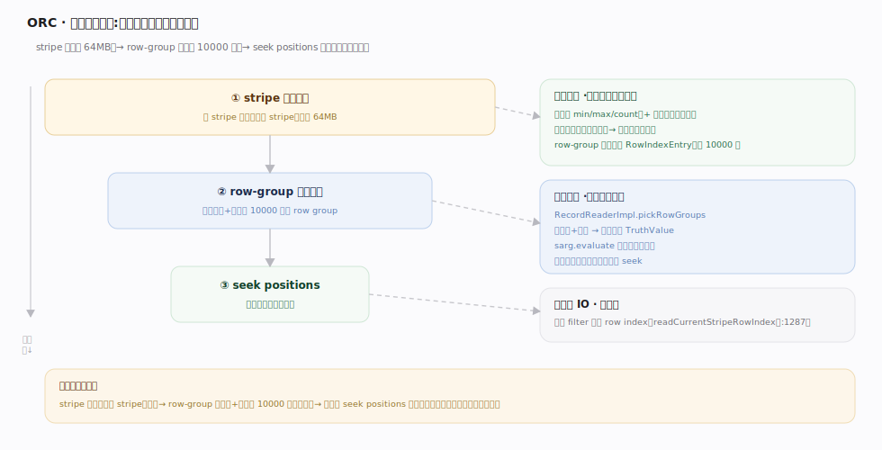

# ORC 原理 · 支撑主线 · 行组与索引

> **定位**：属"索引能力域"。管 stripe 内的细粒度可跳读单位:row group(默认每 10000 行)、row index(位置 + 统计)、精确 seek。是"跳 stripe"之下更细的"跳 row-group"能力。依赖【文件布局】的 index streams、供【谓词下推】跳读。源码基准 **ORC(5f34b04a4)**(`java/core/`)。

stripe(64MB)是粗跳读单位;stripe 内还要更细——**row group**(默认 10000 行)。每 row group 有 row index 条目:各 stream 的**位置**(让 seek 到该 row group 起点)+ 该 row group 的**列统计**(让按谓词跳过整 row group)。这让 ORC 能在一个 64MB stripe 里只读命中谓词的那几万行。理解 row group + row index,就懂了 ORC 的细粒度跳读。

---

## 一、row group:stripe 内的跳读单位

- **默认 row index stride = 10000 行**(`ROW_INDEX_STRIDE`,`OrcConf.java:44`);索引由 `ENABLE_INDEXES`(默认 true)开关。
- row group 数 = `ceil(rowsInStripe / rowIndexStride)`(写侧 `WriterImpl.java:568`、读侧 `RecordReaderImpl.java:1184` 都算)。
- 每个 **RowIndexEntry** = `positions[]`(各 stream 位置)+ 该 row group 的 `ColumnStatistics`;`RowIndex` = 重复 entry。写侧在 `TreeWriterBase.createRowIndexEntry`(`impl/writer/TreeWriterBase.java:323`)攒够一组时建条目并把 index 统计并入 file 统计。

**为什么 10000 行一组**:太大跳读粒度粗(读进无用行)、太小索引膨胀。10000 是"索引开销 vs 跳读精度"的平衡默认。

---

## 二、positions:精确 seek 到 row group

row index 的 `positions[]` 让读端能 **seek 到任意 row group 起点**,不用从 stripe 头顺读:

- **未压缩**:position = (RLE 游程字节偏移, 该 stream 内待消费值数)。
- **压缩**:position = (压缩块起点, 块内解压字节数, RLE 内待消费值数)——先定位压缩块、解压、再定位块内偏移。
- 多 stream 列的 positions **按固定序**拼接(与 stripe footer 的 ColumnEncoding 段一致)。
- **字典无 per-row-group position**——整个字典读入(即使只读部分 stripe)。

seek 能力是跳读的物理基础:剪掉某 row group 后,直接 seek 到下一个命中的 row group,跳过中间字节。

---

## 三、索引与谓词下推联动

row group 级统计 + positions 是谓词下推的燃料(详见谓词下推篇):

- 读端 `RecordReaderImpl.pickRowGroups` 用每 row group 的 `ColumnStatistics`(+ 布隆)对每个谓词算 `TruthValue`,`sarg.evaluate` 决定该 row group 读不读(`RecordReaderImpl.java:1177`)。
- 命中的 row group → 用 positions seek 过去读;不命中 → 跳过。
- 只有过滤列的 row index stream 按需读(`readCurrentStripeRowIndex`,`rowIndexColsToRead` 只含 filter 列)——不为无关列读索引。实际由 `StripePlanner.readRowIndex`(`impl/reader/StripePlanner.java:393`)按 `sargColumns` 掩码读入。

**层级跳读**:stripe 级统计跳整 stripe(粗)→ row group 级统计跳 10000 行组(细)→ 命中组 seek 精读。三级由粗到细,读得越来越少。

---

## 拓展 · 行组与索引关键结构一览

| 结构 | 定义 | 职责 |
|---|---|---|
| ROW_INDEX_STRIDE | `OrcConf.java:44` | row group 大小(默认 10000 行) |
| stride 边界对齐 | 写侧 `WriterImpl.java:568` / 读侧 `RecordReaderImpl.java:1184` | 写读两端皆按同一 stride 算 row-group 边界 |
| RowIndexEntry | (proto) | positions[] + row-group 列统计 |
| ROW_INDEX stream | (Stream.Kind 6) | 存 row index(在 index area) |
| pickRowGroups | `RecordReaderImpl.java:1177` | 按统计选读哪些 row group |
| pickRowGroups(内部) | `RecordReaderImpl.java:1285` | 无 sarg 时全读、有则逐组求值 |
| readCurrentStripeRowIndex | `RecordReaderImpl.java:1287` | 只为 filter 列读索引 |
| createRowIndexEntry | `impl/writer/TreeWriterBase.java:323` | 写侧攒满一组时建 RowIndexEntry |
| StripePlanner.readRowIndex | `impl/reader/StripePlanner.java:393` | 读侧按 sargColumns 掩码读 index stream |
| StripePlanner | `impl/reader/StripePlanner.java:65` | stripe 读取规划(算流位置、读索引) |
| ENABLE_INDEXES | `OrcConf.java:42` | orc.create.index 开关(默认 true) |

## 调优要点（关键开关）

- **orc.row.index.stride**(默认 10000):调小跳读更精但索引大;调大反之。查询选择性高时小 stride 收益大。
- **orc.create.index**(默认 true):关掉省写开销但失去 row-group 跳读——几乎不该关。
- **数据排序**:按过滤列排序让 row-group 统计 min/max 紧凑、跳读更狠(否则每组都覆盖全域跳不掉)。
- **只读 filter 列索引**:读端自动只为谓词列读 row index,减少索引 IO。

## 常见误区与工程要点

- **误区:ORC 只能跳 stripe。** stripe 级(粗)之下还有 row group 级(每 10000 行,细)跳读——粒度细得多。
- **误区:row index 只有统计。** 还有 positions——让 seek 到 row group 起点(压缩/未压缩不同格式),是跳读的物理基础。
- **误区:字典能按 row group 跳。** 字典无 per-row-group position,整个读入;跳读作用于 DATA 引用 stream。
- **误区:所有列都读 row index。** 只为谓词(filter)列读 row index,无关列不读——省索引 IO。
- **归属提醒**:row index 存在【文件布局】的 index streams;row-group 统计属【列统计与布隆】;用统计做剪枝决策在【谓词下推】;seek 定位的 stream 由【列编码】决定格式。

## 一句话总纲

**ORC 在 stripe(粗)内用 row group(默认每 10000 行,ROW_INDEX_STRIDE)做细粒度跳读:每 row group 一个 RowIndexEntry = positions+ 该组的列统计;读端 pickRowGroups 用组统计+布隆对每个谓词算 TruthValue 决定读不读、命中组 seek 精读、只为 filter 列读索引;stripe 级→row-group 级→seek 三级由粗到细,读得越来越少。**
