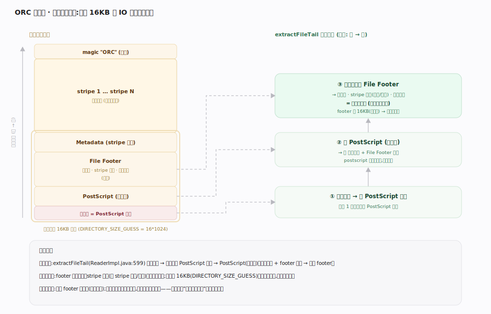
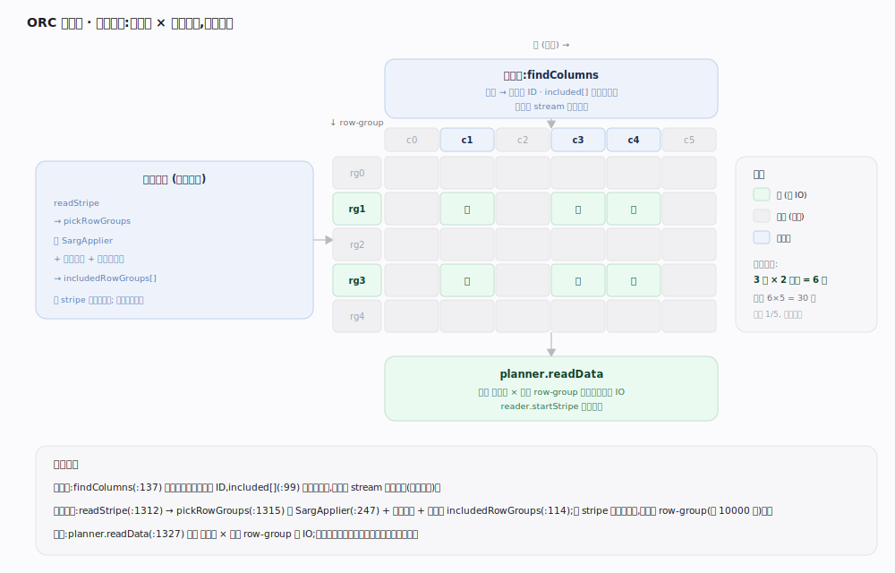
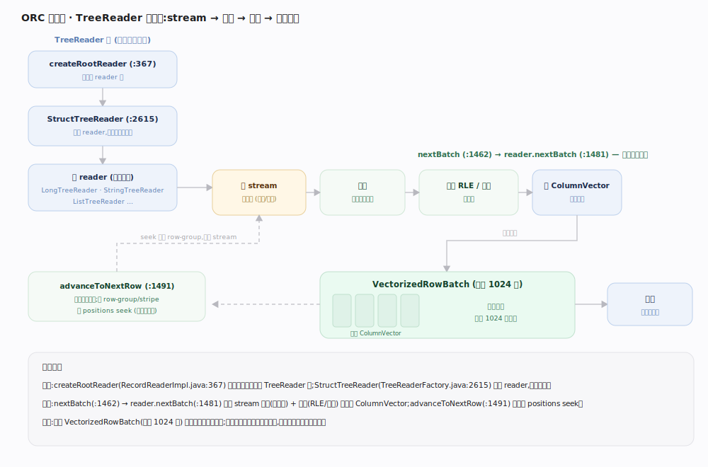

# ORC 原理 · 支撑主线 · 读路径

> **定位**：属"读取能力域"。管一次读文件的全流程:倒读尾部拿全图 → 列裁剪 + 谓词选 stripe/row-group → TreeReader 树逐 stripe 解码填 batch。是【文件布局】的消费者,消费【行组与索引】的 positions、【列统计与布隆】+【谓词下推】的剪枝结果、【列编码】的解码、【压缩与流分块】的解压。源码基准 **ORC(5f34b04a4)**(`java/core/`)。

读一个 ORC 文件的精髓是"**尽量少读**":先倒读尾部一次小 IO 拿到全文件地图(footer),按查询要的列**裁剪**掉无关 stream、按谓词 + 统计**跳过**整 stripe / row-group,只对命中的数据 seek + 解压 + 解码填进列式批。读侧结构是一棵 **TreeReader 树**,与类型树同构、镜像写侧。理解倒读拿图 → 列裁剪 + 行组跳过 → TreeReader 解码,就懂了 ORC 怎么把"扫得少、扫得快"落到读上。

---

## 一、倒读尾部:一次小 IO 拿全图

`ReaderImpl` 建立时先**倒读文件尾部**:

- `extractFileTail(fs, path, maxLength)`(`ReaderImpl.java:599`)读末尾一段;默认猜测 `DIRECTORY_SIZE_GUESS = 16 * 1024`(`ReaderImpl.java:75`)——16KB 通常够覆盖 postscript + footer。
- 读法:末字节给 postscript 长度 → 解析 postscript(不压缩)拿压缩方式 + footer 长度 → 解压解析 footer(类型树、stripe 目录、文件级统计)。
- 若 footer 超出首次 16KB(列极多),再补一次读。拿到 footer 即拥有**全文件地图**:每个 stripe 的偏移/长度、每列类型、文件级统计。

**为什么倒读**:写时 footer 在尾部(见【写路径】);读时一次小尾读就拿到全图,无需扫描文件主体——这是列存"打开即知全貌"的物理基础。

---

## 二、列裁剪 + 谓词选 stripe/row-group

RecordReader 建立时按查询做**双重裁剪**:

- **列裁剪**:按 reader schema 只选需要的列——`findColumns`(`RecordReaderImpl.java:137`)把列名解析到文件列 ID,`included[]` 标记选中列(`:99` "file included columns indexed by the file's column ids"),无关列的 stream **根本不读**。
- **谓词选块**:`readStripe`(`:1312`)→ `pickRowGroups`(`:1315`)用 SargApplier(`:247`)+ 各级统计 + 布隆算出 `includedRowGroups[]`(`:114`);整 stripe 无匹配则跳过、stripe 内按 row-group 粒度跳。
- `planner.readData(indexes, includedRowGroups, ...)`(`:1327`):只对选中列 × 选中 row-group 的字节区间发 IO,`reader.startStripe`(`:1328`)准备解码。

**为什么两级裁剪**:列裁剪砍"读哪些列"(列存红利),谓词选块砍"读哪些行块"(统计跳读);二者叠加让一次查询往往只读文件的一小片。

---

## 三、TreeReader 树:解码填 batch

解码走一棵与类型树同构的 **TreeReader 树**:

- `TreeReaderFactory.createRootReader(readerSchema, ctx)`(`RecordReaderImpl.java:367`)建 reader 树;`StructTreeReader`(`TreeReaderFactory.java:2615`)持子 reader,递归镜像类型树。
- `nextBatch(batch)`(`RecordReaderImpl.java:1462`):`reader.nextBatch(batch, batchSize, ...)`(`:1481`)从各 stream 解压(【压缩与流分块】)+ 解码(【列编码】RLE/字典)填每列 ColumnVector;`advanceToNextRow`(`:1491`)推进到下一批,跨 row-group/stripe 时按 positions seek。
- 填满一个 VectorizedRowBatch(默认 1024 行)返回给引擎向量化处理。

**为什么树 + 向量批**:嵌套类型递归解码天然树形;按批返回列式内存让上层引擎向量化执行,避免逐行开销。

---

## 拓展 · 读路径关键结构一览

| 结构 / 方法 | 位置 | 职责 |
|---|---|---|
| extractFileTail | `ReaderImpl.java:599` | 倒读尾部拿 postscript+footer |
| DIRECTORY_SIZE_GUESS | `ReaderImpl.java:75` | 尾读猜测 16KB |
| findColumns / included[] | `RecordReaderImpl.java:137/99` | 列裁剪:列名→列 ID |
| readStripe / pickRowGroups | `RecordReaderImpl.java:1312/1315` | 谓词选 stripe/row-group |
| planner.readData / startStripe | `RecordReaderImpl.java:1327/1328` | 只读选中列×选中行组 |
| createRootReader / StructTreeReader | `RecordReaderImpl.java:367` / `TreeReaderFactory.java:2615` | 建解码树 |
| StripePlanner | `impl/reader/StripePlanner.java:65` | 算流位置、按需读 index/data |
| nextBatch | `RecordReaderImpl.java:1462` | 解压+解码填列式批 |

## 调优要点（关键开关）

- **投影下推**:只 select 需要的列,列裁剪才生效——`SELECT *` 读全部 stream。
- **谓词下推**:把过滤条件编成 SearchArgument 传入(见【谓词下推】),否则 pickRowGroups 退化为全读。
- **数据排序**:按过滤列排序让 row-group 统计紧凑、跳读更狠。
- **orc.compress.size / 尾读**:大 footer(列极多)可能二次尾读;列极多场景关注 footer 体量。

## 常见误区与工程要点

- **误区:读要顺序扫全文件。** 倒读一次拿 footer 全图,再只读选中列 × 选中行组——通常只读一小片。
- **误区:谓词只能跳 stripe。** 列裁剪(选列)+ stripe 级 + row-group 级(每 10000 行)三重砍,粒度到万行。
- **误区:逐行读。** TreeReader 树按 VectorizedRowBatch(默认 1024 行)列式填批返回。
- **误区:跳过的块也解压。** 只对选中列 × 选中 row-group 发 IO + 解压 + 解码,跳过的字节完全不碰。
- **归属提醒**:全图来自【文件布局】footer;跳读判据在【列统计与布隆】,决策在【谓词下推】;seek positions 在【行组与索引】;解压在【压缩与流分块】、解码在【列编码】;类型映射在【schema 演进】。

## 一句话总纲

**ORC 读路径的精髓是"尽量少读":ReaderImpl 建立时 extractFileTail 倒读末尾(猜测 16KB DIRECTORY_SIZE_GUESS)——末字节给 postscript 长度、postscript 给压缩方式+footer 长度、解压 footer 拿全文件地图(类型树/stripe 目录/文件统计);RecordReader 做双重裁剪——findColumns 把列名解析到列 ID 只读选中列的 stream(列裁剪)、readStripe 里 pickRowGroups 用 SargApplier+三级统计+布隆算 includedRowGroups 跳整 stripe/row-group(谓词选块),planner.readData 只对选中列×选中行组发 IO;TreeReaderFactory.createRootReader 建与类型树同构的 TreeReader 树,nextBatch 从 stream 解压+解码(RLE/字典)填每列 ColumnVector、按 positions seek 跨块,填满 1024 行的 VectorizedRowBatch 返给引擎向量化处理。**
