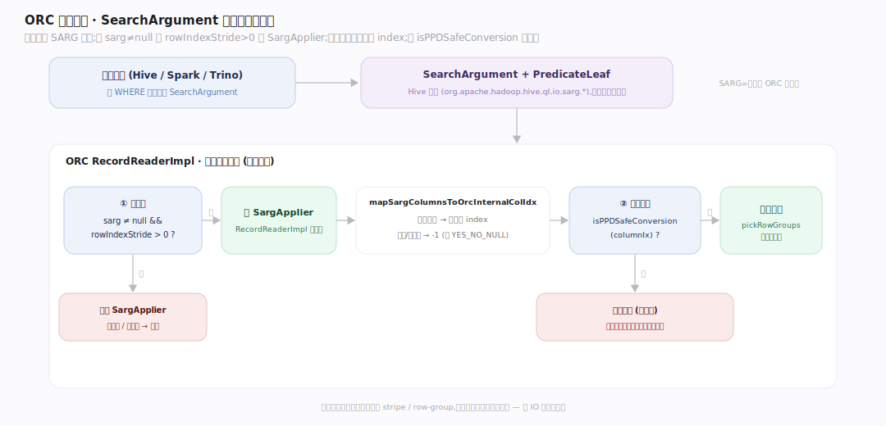
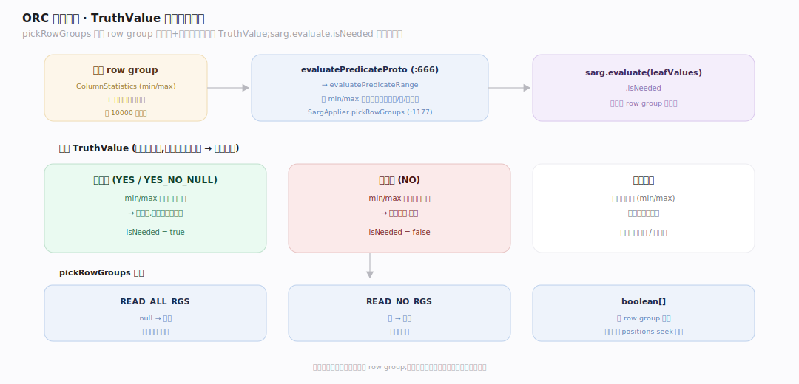
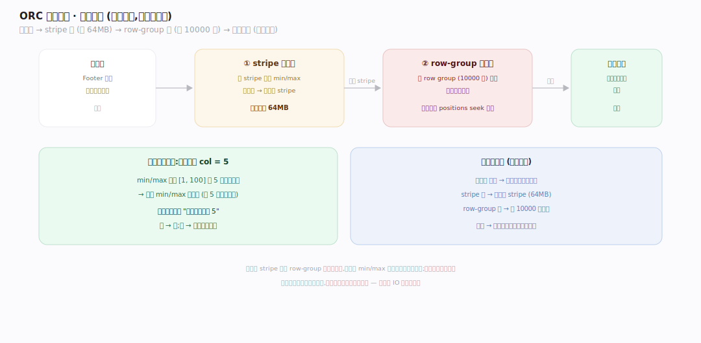

# ORC 原理 · 支撑主线 · 谓词下推（SearchArgument）

> **定位**：属"剪枝能力域"。管查询谓词如何用统计跳过数据:SearchArgument 求值、三级 TruthValue、stripe/row-group 剪枝。是列存"扫得快"的兑现环节。依赖【列统计与布隆】的统计、【行组与索引】的 row-group。源码基准 **ORC(5f34b04a4)**(`java/core/`)。

列存扫得快,不只靠"只读需要的列",更靠"跳过不需要的行块"。查询谓词(如 `WHERE age>30`)以 **SearchArgument(SARG)** 传给 ORC reader,reader 用各级 min/max 统计 + 布隆过滤器判断"这个 stripe/row-group 可能有匹配行吗?"——不可能则整块跳过。理解 SARG + TruthValue 剪枝,就懂了 ORC 谓词下推。

---

## 一、SearchArgument:谓词下推入口

`SearchArgument` + `PredicateLeaf` 是 Hive 类型(`org.apache.hadoop.hive.ql.io.sarg.*`,引擎构造后传入)。ORC reader:

- 仅当 `sarg != null && rowIndexStride > 0` 才建 `SargApplier`(`RecordReaderImpl.java:246`)——无谓词或无索引则不剪。
- **谓词→列映射**:`mapSargColumnsToOrcInternalColIdx` 把谓词列名解析到文件列 index,虚拟/分区列映 `-1`(当 `YES_NO_NULL` 处理)(`RecordReaderImpl.java:193`)。
- 只有 `evolution.isPPDSafeConversion(columnIx)` 为真才应用下推(调用点 `:1217`,定义在 `impl/SchemaEvolution.java:303`)——类型演进不安全的转换退回不剪(保正确)。

SARG 是引擎和 ORC 的契约:引擎把 WHERE 谓词编成 SARG,ORC 用它剪枝——不匹配就不读。

---

## 二、TruthValue:三态求值剪枝

核心是**用统计对谓词求三态真值**:

- `pickRowGroups` → `SargApplier.pickRowGroups`:对每 row group 的 `ColumnStatistics`(+ 布隆)算每个谓词叶的 `TruthValue`,再 `sarg.evaluate(leafValues).isNeeded` 决定该组读不读(`RecordReaderImpl.java:1177`)。
- 返回 `READ_ALL_RGS`(null,全读)/ `READ_NO_RGS`(空,全跳)/ `boolean[]`(逐 row group 标记)。
- 核心求值 `evaluatePredicateProto(stats, predicate, bloomKind, ..., bloom)` → `evaluatePredicateRange`(`:666`)——用 min/max 判谓词可能真/假/不确定。

**为什么三态**:统计是范围(min/max),不能精确判每行——只能说"这块肯定无匹配(min/max 都不满足→跳)"或"可能有(读进来精确过滤)"。YES/NO/YES_NO_NULL 三态表达这种不确定性。

---

## 三、stripe + row-group 两级剪枝

下推在两级生效(由粗到细):

- **stripe 级**:用 stripe 级统计,谓词 min/max 不匹配则跳整个 stripe(64MB 一下没了)。
- **row-group 级**:存活 stripe 内,用每 row group(10000 行)统计跳不匹配的组;命中组用 positions seek 精读。
- **布隆加持**:等值谓词(`col = 5`)光靠 min/max 不够(5 在 [1,100] 范围内但可能不存在),布隆过滤器进一步判"这块里有没有 5"——无则跳(详见列统计与布隆篇)。

层级:文件级统计(读不读此文件)→ stripe 级(跳 stripe)→ row-group 级(跳 10000 行)→ 布隆(等值精跳)。逐级读得更少。

---

## 拓展 · 谓词下推关键结构一览

| 结构 | 定义 | 职责 |
|---|---|---|
| SargApplier | `RecordReaderImpl.java:246` | 建于 sarg≠null 且有索引 |
| SargApplier(类) | `RecordReaderImpl.java:1110` | 封装谓词求值 + row-group 选择 |
| pickRowGroups | `RecordReaderImpl.java:1177` | 按统计选读哪些 row group |
| mapSargColumnsToOrcInternalColIdx | `RecordReaderImpl.java:193` | 谓词列→文件列 index |
| evaluatePredicateProto | `RecordReaderImpl.java:666` | 统计→TruthValue 求值 |
| evaluatePredicateRange | `RecordReaderImpl.java:719` | min/max 范围判真/假/不定 |
| isPPDSafeConversion(调用) | `RecordReaderImpl.java:1217` | 类型演进安全才下推 |
| isPPDSafeConversion(定义) | `impl/SchemaEvolution.java:303` | 判该列转换是否安全下推 |

## 调优要点（关键开关）

- **构造有效 SARG**:引擎侧把 WHERE 谓词下推成 SARG 才能剪枝;复杂表达式可能推不下去。
- **数据排序**:按谓词列排序让 stripe/row-group 的 min/max 紧凑,剪枝率高(否则每块覆盖全域剪不掉)。
- **布隆过滤器**:等值/IN 查询列建布隆,补 min/max 之不足。
- **类型演进注意**:不安全的类型转换会禁用下推(保正确),schema 演进时留意。

## 常见误区与工程要点

- **误区:下推能精确过滤行。** 下推只跳"整块肯定无匹配"的 stripe/row-group;块内行仍需引擎精确过滤——下推减 IO 不代替过滤。
- **误区:min/max 能处理等值查询。** `col=5` 时 5 在 [min,max] 内跳不掉;需布隆过滤器判"块内有没有 5"。
- **误区:任意谓词都下推。** 只有解析到文件列 + 类型转换安全(isPPDSafeConversion)的才下推;虚拟列/不安全转换退回不剪。
- **误区:剪枝是 ORC 自动全做。** 需引擎传入 SARG;无 SARG 或无索引(rowIndexStride=0)则不剪,全读。
- **归属提醒**:剪枝用的统计在【列统计与布隆】;跳读的 row group 在【行组与索引】;命中后解码在【列编码】;SARG 由计算引擎构造。

## 一句话总纲

**ORC 谓词下推用统计跳数据:引擎把 WHERE 谓词编成 SearchArgument 传入,reader(仅 sarg≠null 且有索引时)建 SargApplier、把谓词列映射到文件列 index(类型转换安全 isPPDSafeConversion 才下推),pickRowGroups 用各级 ColumnStatistics+布隆对每谓词算三态 TruthValue、sarg.evaluate 决定读不读(READ_ALL/NO_RGS/boolean[]);两级剪枝——stripe 级跳 64MB、row-group 级跳 10000 行、布隆补等值查询之不足;下推减 IO(跳整块肯定无匹配的),块内行仍由引擎精确过滤。**
