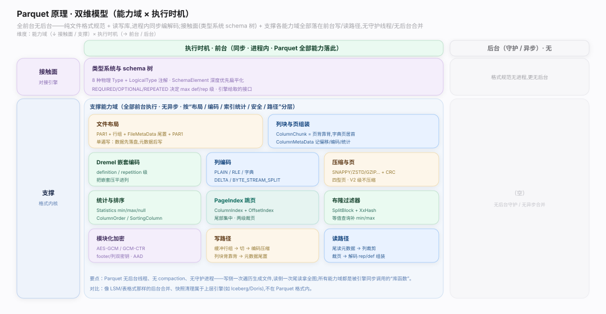
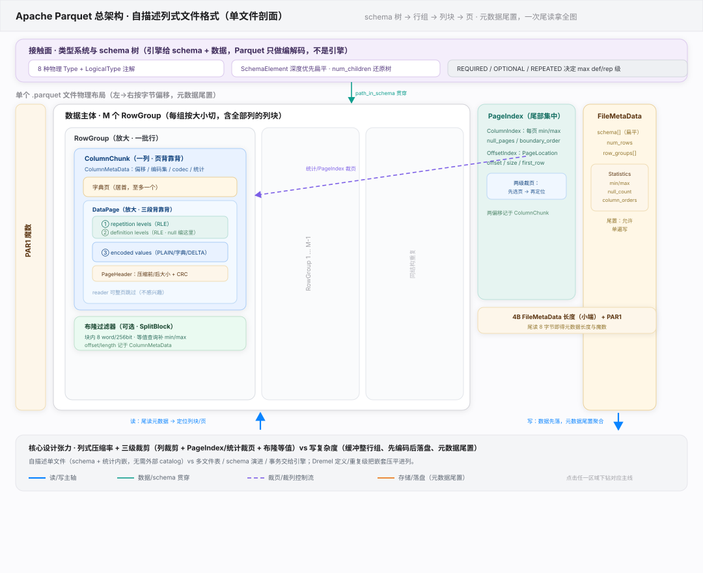
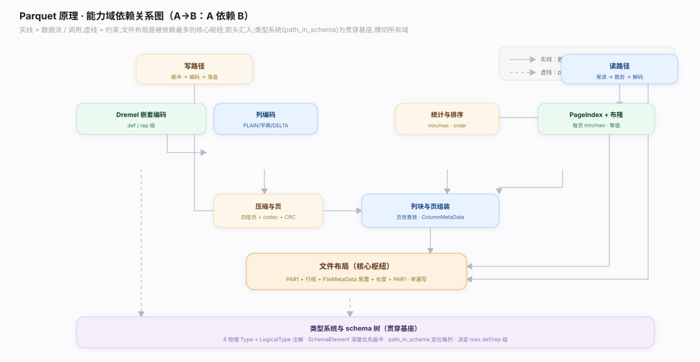

# Parquet 原理 · 全景主线框架

> **定位**：统领全部原理文档。Apache Parquet 是**列式文件格式**（自描述列存文件规范 + Thrift 元数据 IDL，被 Spark/Trino/DuckDB/Arrow/Iceberg 读写——不是引擎、不是表格式）。世界观：**文件 = 按列组织的字节流 + Thrift 尾置元数据 + 多级统计/索引**；数据切成多个 Parquet 文件，每文件内按「行组 × 列块 × 页」三级切分，配 Statistics / PageIndex / 布隆过滤器 按谓词跳读。理解「文件布局 + Dremel 嵌套编码 + 列编码 + 统计跳读」即懂 Parquet。源码基准 **apache/parquet-format**（`src/main/thrift/parquet.thrift` + 各 `*.md` 规范）。

---

## 一、双维模型：能力域 × 执行时机

能力域 × 执行时机两维：接触面（类型系统 + schema 树 + 排序语义）面向计算引擎，支撑侧管文件布局 / Dremel 嵌套编码 / 列编码 / 压缩与页 / 列块组装 / 统计与排序 / PageIndex / 布隆 / 加密 / 读写路径。全前台、无后台守护——纯文件格式规范 + 读写库，进程内同步读写。类型系统定义见 `parquet.thrift:32`（`enum Type`），排序语义见 `parquet.thrift:1082`（`union ColumnOrder`）。

---

## 二、总架构图

写：引擎按 schema 建列写入器 → 缓冲行组、每列切页编码（`Encodings.md`）+ 压缩（`Compression.md`）→ 列块背靠背落盘、边写边攒 Statistics（`parquet.thrift:267`）→ 全部行组写完把 `FileMetaData`（`parquet.thrift:1386`）尾置 + 4B 长度 + `PAR1`。读：倒读末 8 字节拿 `FileMetaData` 全图 → `path_in_schema` 列裁剪 + Statistics/布隆/PageIndex（`parquet.thrift:1264`/`1239`）裁页 → 解压命中页、解码 rep/def（`README.md:166`）组装回嵌套行交引擎。Parquet 是链接进 Spark/Trino/DuckDB 的库，非独立进程。

---

## 三、接触面 × 能力域 依赖矩阵

写依赖文件布局（行组/列块结构）+ Dremel 嵌套编码（rep/def）+ 列编码（PLAIN/RLE/字典/DELTA）+ 压缩与页 + 统计（建 min/max）+ 类型系统；读依赖文件布局（倒读）+ 统计/PageIndex/布隆（裁块裁页）+ Dremel 编码（解码组装）+ 类型系统（列定位）。

---

## 四、能力域依赖关系图

实线=数据流/调用，虚线=约束。贯穿层 **path_in_schema（列路径）** 横切类型/编码/统计：schema 树深度优先扁平化后（`SchemaElement.num_children`，`parquet.thrift:535`）每个叶子列有唯一路径，列块、Statistics、PageIndex、布隆都按列路径定位，谓词也映射到列路径。

---

## 拓展 · 13 条主线分层归位

| 层 | 主线 | 一句话职责 |
|---|---|---|
| 接触面 | **类型系统与 schema 树** | 8 种物理 Type + LogicalType 注解 + 扁平树 num_children |
| 布局 | **文件布局（核心）** | PAR1 + N 列 × M 行组 + FileMetaData 尾置 |
| 编码 | **Dremel 嵌套编码** | def/rep 展开嵌套，null 编进 def 级 |
| 编码 | **列编码** | PLAIN / RLE / 字典 / DELTA / BYTE_STREAM_SPLIT |
| 页 | **压缩与页** | codec + PageType 四型 + DataPageV2 免解压读级 |
| 组装 | **列块与页组装** | ColumnChunk→ColumnMetaData，字典页居首，页背靠背 |
| 统计 | **统计与排序** | Statistics min/max/null + ColumnOrder/BoundaryOrder |
| 索引 | **PageIndex 跳页** | ColumnIndex + OffsetIndex 尾部集中，两级裁页 |
| 索引 | **布隆过滤器** | SplitBlock + XxHash，等值裁剪补 min/max |
| 安全 | **模块化加密** | AES-GCM，footer/列双密钥，AAD 防换页 |
| 流程 | **写路径** | 单遍写，元数据尾置 |
| 流程 | **读路径** | 倒读拿全图 + 裁列裁页 + rep/def 组装 |

## 深化 · 三条贯穿声明（Parquet 区别于行存/表格式）

| 声明 | 内涵 | 对比 |
|---|---|---|
| **按列存，三级切分** | 行组（水平切一批行）× 列块（每列一段）× 页（列块内最小编码/压缩单元），同列值连续 → 高压缩 + 列裁剪 | 与 CSV/Avro 等行存根本不同 |
| **Dremel 嵌套编码是招牌** | 用重复级 rep + 定义级 def 把任意 struct/list/map 嵌套无损压平成列，null 编进 def 级不单独占位 | 源自 Google Dremel 论文，Parquet 的核心创新 |
| **多级统计/索引支撑跳读** | 行组 Statistics + PageIndex 每页 min/max + SplitBlock 布隆；谓词层层裁到页级，只读命中字节 | 列存"扫得快"的关键，纯文件格式不管表/事务 |

## 一句话总纲

**Parquet 是列式文件格式——单文件按「行组 × 列块 × 页」三级切分字节布局（PAR1 魔数开合、FileMetaData 尾置、倒读末 8 字节拿全图），用 Dremel 重复级/定义级把嵌套结构无损压平成列、null 编进 def 级，列内按 PLAIN/RLE/字典/DELTA 编码再 codec 压缩；配 Statistics（行组）+ PageIndex（每页 min/max）+ SplitBlock 布隆（等值）多级索引支撑谓词下推层层裁到页级；path_in_schema 列路径贯穿类型/编码/统计/裁剪；单遍写（元数据尾置）、读时裁列裁页 + 解码 rep/def 组装；纯文件格式规范 + 读写库，不管表/事务，是 Spark/Trino/DuckDB/Arrow/Iceberg 调用的底层列存砖块。**
