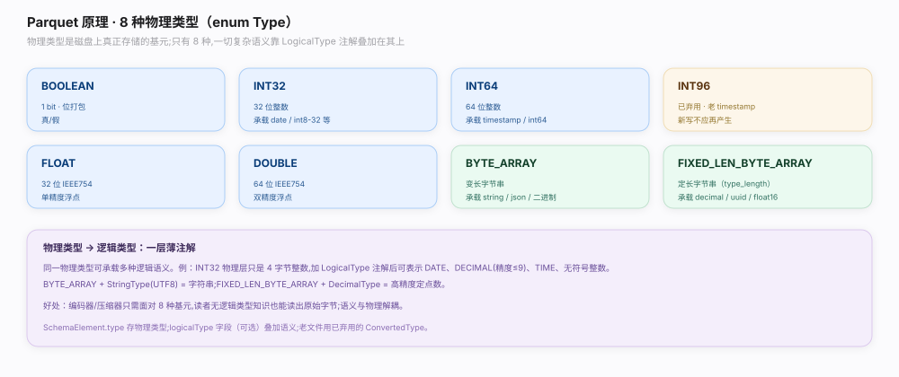
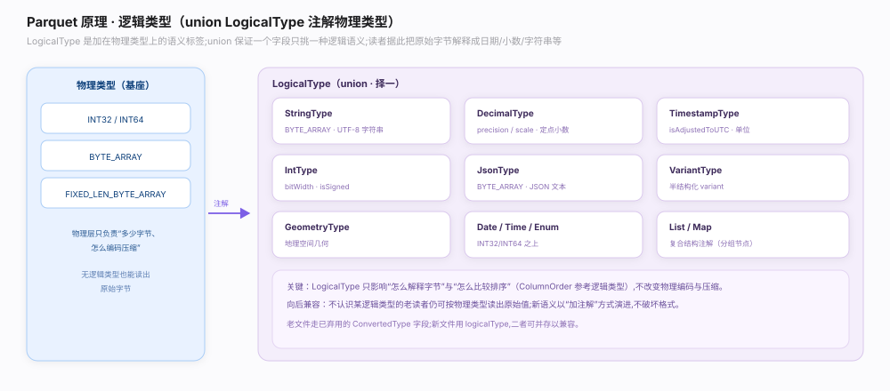
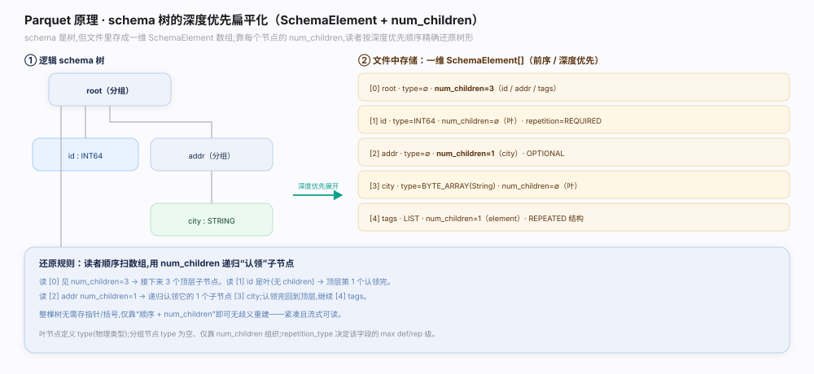

# Parquet 原理 · 接触面 · 类型系统与 schema 树

> **定位**：属"接触面"——计算引擎读写 Parquet 的第一道门。管两件事：**物理类型**（叶子列在磁盘上真正存成什么 8 种基元字节）与**逻辑类型**（在物理类型上贴的语义注解，如 UTF8/DECIMAL/TIMESTAMP），以及把嵌套 schema **深度优先扁平化**成 `SchemaElement` 列表的 schema 树。是【文件布局】的骨架、【Dremel 嵌套编码】算 max level 的依据、【统计与排序】ColumnOrder 的作用对象。源码基准 **parquet-format**（`parquet.thrift`）。

Parquet 的类型系统是**两层**：磁盘上只有 8 种物理基元类型（真正决定字节怎么放），语义靠 `LogicalType` 注解叠加（同一物理 BYTE_ARRAY 可注解成字符串、JSON、DECIMAL……）。schema 不是嵌套树在文件里存，而是**深度优先前序遍历压平**成一个 `SchemaElement` 数组，每个元素用 `num_children` 指明子节点数——读者据此重建树。理解「8 物理 + N 逻辑注解 + 扁平树」三点就懂 Parquet 怎么描述数据形状。

---

## 一、8 种物理类型：磁盘基元

`enum Type`（`parquet.thrift:32`）定义仅有的 8 种物理存储类型：`BOOLEAN`、`INT32`、`INT64`、`INT96`（已废弃，仅遗留时间戳）、`FLOAT`、`DOUBLE`、`BYTE_ARRAY`（变长）、`FIXED_LEN_BYTE_ARRAY`（定长）。这是磁盘上真正的字节形态——所有值最终都落到这 8 种之一。物理类型少而稳，是编码/压缩的作用对象；语义丰富性交给逻辑类型。

**为什么只有 8 种**：物理类型越少，编码器/解码器实现越简单通用；富语义用注解叠加，既不膨胀基元集，又能向前兼容（老读者忽略不认识的注解仍能按物理类型读出字节）。

---

## 二、LogicalType：语义注解

`union LogicalType`（`parquet.thrift:478`）是贴在物理类型上的语义标签：`STRING`（UTF8，物理 BYTE_ARRAY）、`DECIMAL`（带精度/标度）、`DATE`、`TIME`、`TIMESTAMP`（带时区/单位）、`INTEGER`（带位宽/有无符号）、`JSON`、`BSON`、`UUID`、`ENUM`、`LIST`、`MAP`、`VARIANT` 等。它取代了早期的 `ConvertedType`（保留兼容）。同一物理 `BYTE_ARRAY` 可注解成 STRING / JSON / DECIMAL / UUID，语义完全不同但字节存法一致。

**为什么用 union 注解而非新增物理类型**：解耦"怎么存"和"是什么"。引擎按物理类型解码字节、按逻辑类型解释含义；不认识某注解的老读者仍能按物理类型读出原始字节，天然向前兼容。

---

## 三、schema 树：深度优先扁平化

Parquet 的 schema 是一棵树（root=message，内部节点=group，叶子=基元列），但在 `FileMetaData.schema` 里以**深度优先前序遍历压平**成 `SchemaElement`（`parquet.thrift:512`）数组存储：

- 每个 `SchemaElement` 带 `repetition_type`（`FieldRepetitionType`，`parquet.thrift:183`：REQUIRED / OPTIONAL / REPEATED）、可选 `type`（物理类型，叶子才有）、可选 `logicalType`。
- `num_children`（`parquet.thrift:535`）指明该节点的子节点数：group（内部节点）有 `num_children`、无 `type`；叶子有 `type`、无 `num_children`。读者按前序 + `num_children` 递归重建整棵树。
- 每个**叶子**列有唯一 `path_in_schema`（如 `["user","addr","city"]`），列块/统计/PageIndex/布隆全按此路径定位——这是全库的贯穿轴。

**为什么扁平化存**：树形结构序列化成前序数组 + `num_children` 后可一遍线性重建，无需递归 IDL 嵌套；且叶子路径天然唯一，成为定位一切列级结构的键。

---

## 拓展 · 类型系统关键结构一览

| 结构 | 位置 | 职责 |
|---|---|---|
| enum Type | `parquet.thrift:32` | 8 种物理基元类型 |
| union LogicalType | `parquet.thrift:478` | 语义注解（STRING/DECIMAL/TIMESTAMP…） |
| struct SchemaElement | `parquet.thrift:512` | 扁平树的一个节点 |
| num_children | `parquet.thrift:535` | group 子节点数，重建树的依据 |
| enum FieldRepetitionType | `parquet.thrift:183` | REQUIRED/OPTIONAL/REPEATED |
| union ColumnOrder | `parquet.thrift:1082` | 每列的排序语义（min/max 怎么比） |

## 调优要点（关键开关）

- **优先用逻辑类型而非旧 ConvertedType**：新读者按 `LogicalType` 精确解释时区/精度，避免歧义。
- **DECIMAL 选物理载体**：小精度用 INT32/INT64 更省，超长用 FIXED_LEN_BYTE_ARRAY。
- **避免 INT96**：已废弃，仅为兼容老 Hive 时间戳；新数据用 INT64 + TIMESTAMP 逻辑类型。
- **嵌套深度适度**：过深 schema 抬高 max def/rep level 位宽，略增编码开销。

## 常见误区与工程要点

- **误区：Parquet 有几十种类型。** 物理类型只有 8 种；丰富性来自 `LogicalType` 注解叠加。
- **误区：schema 以嵌套树存。** 以深度优先前序数组 + `num_children` 扁平存，读时重建。
- **误区：字符串是独立物理类型。** 字符串 = 物理 BYTE_ARRAY + STRING(UTF8) 逻辑注解。
- **误区：repetition_type 只描述 null。** REPEATED 表示可重复（list 语义），OPTIONAL 才是可空；二者不同。
- **归属提醒**：由 repetition_type 算 max def/rep level 在【Dremel 嵌套编码】；min/max 怎么比在【统计与排序】ColumnOrder。

## 一句话总纲

**Parquet 类型系统两层：磁盘上仅 8 种物理基元类型（BOOLEAN/INT32/INT64/INT96 废/FLOAT/DOUBLE/BYTE_ARRAY/FIXED_LEN_BYTE_ARRAY，`parquet.thrift:32`）决定字节形态，语义靠 `union LogicalType`（`:478`，STRING/DECIMAL/TIMESTAMP/UUID…）注解叠加而非新增物理类型，天然向前兼容；schema 是树但在 FileMetaData 里深度优先前序压平成 `SchemaElement`（`:512`）数组，group 带 `num_children`（`:535`）无 type、叶子带 type 无 num_children，读者按前序 + num_children 重建树，每叶子列唯一 `path_in_schema` 贯穿列块/统计/PageIndex/布隆的定位；repetition_type（`:183`：REQUIRED/OPTIONAL/REPEATED）供 Dremel 算 max level，ColumnOrder（`:1082`）定 min/max 比较语义。**
