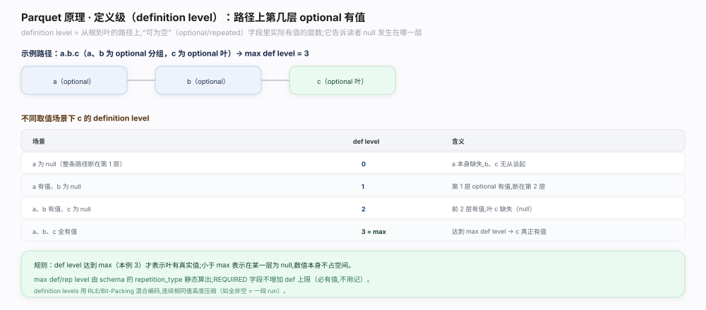
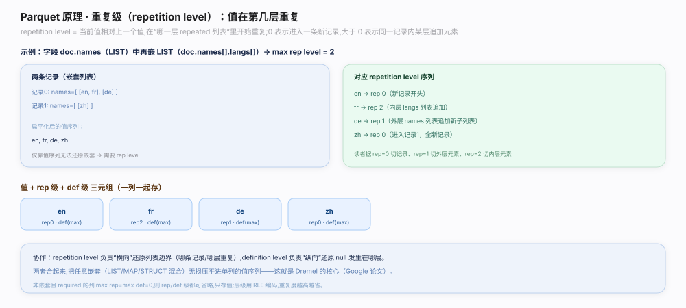
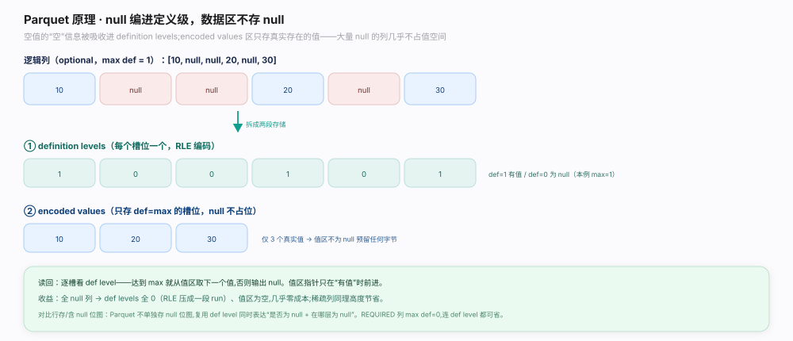

# Parquet 原理 · 支撑主线 · Dremel 嵌套编码

> **定位**：属"编码能力域"——Parquet 的招牌创新。管如何把任意 `struct`/`list`/`map` 嵌套结构**无损压平成列**：用**重复级 repetition level (rep)** 和**定义级 definition level (def)** 两串小整数记录每个叶子值的嵌套位置，null 编进 def 级不单独占位。由【类型系统】的 `repetition_type` 算出每列的 `max def/rep level`。是【列编码】的上游（rep/def 也用 RLE 编码），【读路径】组装嵌套行的逆运算依据。源码基准 **parquet-format**（`README.md` Nested Encoding 一节 + Dremel 论文）。

Parquet 能把嵌套 JSON/Protobuf 结构存成纯列而不丢信息，靠的是 **Dremel 编码**（源自 Google Dremel 论文）：每个叶子列除了值序列，再存两串整数——**定义级 def** 记"该值这条路径上定义到第几层（能区分值为 null、祖先为 null、真有值）"，**重复级 rep** 记"该值相对上一个值从第几层开始重复（划出 list 边界）"。两个 max level 由 schema 的 `repetition_type` 算出。理解「def 管 null/可选层、rep 管 list 边界」就懂了嵌套怎么变列。

---

## 一、定义级 def：区分 null 与缺失层

**定义级 def**（`README.md:166` Nested Encoding）记录一个叶子值沿其路径**实际定义到第几层**：

- 每遇到一个 `OPTIONAL` 或 `REPEATED` 节点，最大可能的 def level +1（`REQUIRED` 不增，因为必然存在）——这就是该列的 `max definition level`。
- 某个值的 def = 它实际定义到的层数：`def == max` 表示值真实存在；`def < max` 表示在某一 OPTIONAL 层就断了（该层为 null）。
- **null 不单独存一个占位值**，而是编码进 def 级：def 小于 max 即隐含 null，且能精确指出是哪一层为空（是整个 struct 为 null，还是最内层字段为 null）。

**为什么用 def 级编 null**：把"是否为空 + 空在哪一层"压成一个小整数，比每层各存一个 null 位省得多；def 级本身值域小、大量重复，用 RLE 编码近乎免费。

---

## 二、重复级 rep：划 list 边界

**重复级 rep**（`README.md:166`）记录一个叶子值**从第几层开始一个新的重复**，用来还原 `REPEATED`（list）的边界：

- `rep == 0`：该值是一条新记录（顶层）的开始。
- `rep == k`：该值在第 k 层 REPEATED 节点上续接（同一个 list 里的下一个元素）。
- `max repetition level` = 路径上 `REPEATED` 节点的个数。
- 读者靠连续值的 rep 序列判断：何时该在最内层 list 追加元素、何时该回退到外层开新 list、何时该开新记录——从而把扁平值序列重组回嵌套结构。

**为什么用 rep 级划边界**：list 长度不定、可嵌套 list-of-list，靠"从哪层开始重复"这一个整数就能无歧义还原所有层级的边界，无需存长度前缀。

---

## 三、null 编码与 max level 计算

综合：每个叶子列存**三样**——值序列（仅存真实存在的值）+ def 级序列 + rep 级序列。

- `max def level` 与 `max rep level` 由 schema 的 `repetition_type`（`parquet.thrift:183`）静态算出：REQUIRED 两者都不增；OPTIONAL 增 def；REPEATED 两者都增。
- rep/def 级值域很小（0..max，通常 ≤ 几），用**位打包 + RLE 混合**编码（见【列编码】），近乎零开销。
- 非嵌套且 REQUIRED 的列：max def=0、max rep=0，此时 rep/def 全为 0，规范允许**省略**不存（`README.md:184` Data Pages：非嵌套无 null 列不编级别）。

**为什么这样设计**：值序列只存"真的有的值"（null 不占值位），嵌套信息全压进两串小整数并高效编码——既无损保留任意嵌套，又保持列存的紧凑与高压缩。

---

## 拓展 · Dremel 编码关键点一览

| 概念 | 位置 | 职责 |
|---|---|---|
| Nested Encoding | `README.md:166` | rep/def 编嵌套的规范说明 |
| Data Pages 级别编码 | `README.md:184` | rep/def 在页内编在值之前 |
| definition level | `README.md:166` | 定义到第几层，编 null + 缺失层 |
| repetition level | `README.md:166` | 从第几层重复，划 list 边界 |
| repetition_type | `parquet.thrift:183` | REQUIRED/OPTIONAL/REPEATED 决定 max level |

## 调优要点（关键开关）

- **控制嵌套深度**：深嵌套抬高 max def/rep level 位宽（虽仍很小），并增加组装成本。
- **必填字段标 REQUIRED**：REQUIRED 不增 def/rep，非嵌套 REQUIRED 列可完全省略级别序列。
- **宽而浅优于窄而深**：同样字段数，浅结构 rep/def 更小、解码更快。
- **map 视作 list<struct<key,value>>**：Parquet 无原生 map，按此三层嵌套编码。

## 常见误区与工程要点

- **误区：null 单独存占位值。** null 编进 def 级（def<max 即 null），值序列只存真实值。
- **误区：list 存长度前缀。** 靠 rep 级"从第几层重复"还原边界，不存长度。
- **误区：每列都有 rep/def 序列。** 非嵌套、REQUIRED 且无 null 的列 max level=0，可省略级别。
- **误区：def 只表示 null/非 null。** def 是 0..max 的整数，能精确指出在哪一 OPTIONAL 层断开。
- **归属提醒**：rep/def 的具体位打包/RLE 编码在【列编码】；读时用 rep/def 组装嵌套行在【读路径】。

## 一句话总纲

**Parquet 用 Dremel 编码（源自 Google Dremel 论文，`README.md:166`）把任意 struct/list/map 嵌套无损压平成列：每个叶子列存值序列 + 定义级 def + 重复级 rep 三串——def 记该值沿路径定义到第几层（def==max 为真值、def<max 隐含某 OPTIONAL 层 null，null 不单独占值位）、rep 记从第几层开始重复（rep==0 开新记录、rep==k 在第 k 层 REPEATED 续接，划 list 边界）；max def/rep level 由 schema 的 repetition_type（`parquet.thrift:183`：REQUIRED 不增 / OPTIONAL 增 def / REPEATED 增两者）静态算出，级别值域小用位打包+RLE 近乎免费编码，非嵌套 REQUIRED 无 null 列可省略级别（`README.md:184`）；读时靠 rep/def 序列把扁平值重组回嵌套结构——既无损保留嵌套又保持列存紧凑。**
