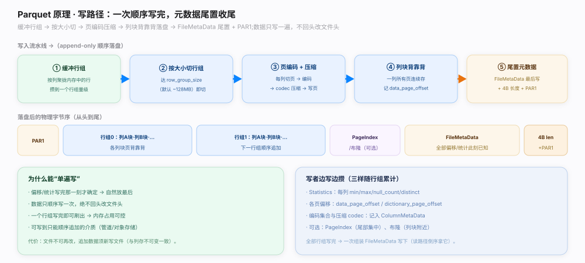

# Parquet 原理 · 支撑主线 · 写路径

> **定位**：属"写入能力域"——把一次写文件的全流程串起来。管：缓冲行组 → 按大小切 → 每列切页编码压缩 → 列块背靠背落盘 → 全部写完把 `FileMetaData`（`parquet.thrift:1386`）尾置 + 4B 长度 + `PAR1`。是【文件布局】的生产者，驱动【列编码】/【压缩与页】填页、【统计与排序】攒 Statistics、【PageIndex】/【布隆过滤器】建索引。源码基准 **parquet-format**（`README.md` File format 单遍写一节）。

写一个 Parquet 文件不是"攒齐全部行再落盘"，而是**流式单遍写**（`README.md:117`）：先写头魔数 `PAR1`，然后缓冲行进内存、按列聚拢，攒够一个行组量级就把这个行组的每列切页、编码、压缩、背靠背落盘，并记下各列偏移、累计每列统计；所有行组写完后一次性组装 `FileMetaData` 写在尾部，最后补 4B 长度 + `PAR1` 收尾。全过程数据只顺序写一遍、绝不回头改文件头。理解「缓冲行组 → 切 → 编码压缩 → 背靠背 → 尾置元数据」这条流水线就懂了文件怎么被造出来。

---

## 一、单遍写流水线

写流水线五步：

- **① 缓冲行组**：按列聚拢内存中的行，攒到一个行组量级（默认目标 ~128MB）。
- **② 按大小切行组**：达到 `row_group_size` 即切出一个行组，开始落盘。
- **③ 页编码 + 压缩**：每列切页 → 列编码（PLAIN/RLE/字典/DELTA，见【列编码】）→ codec 压缩（见【压缩与页】）→ 写页。
- **④ 列块背靠背**：一列所有页连续存成列块，记 `data_page_offset`/`dictionary_page_offset`；列块背靠背拼成行组。
- **⑤ 尾置元数据**：全部行组写完 → 组装 `FileMetaData`（`parquet.thrift:1386`）一次写下（此刻全部偏移/统计已知）→ 补 4B 长度 + `PAR1`。

落盘后的物理字节序：`PAR1` → 行组0（列A块·列B块…）→ 行组1 → …→（可选 PageIndex/布隆）→ FileMetaData → 4B 长度 + PAR1。

**为什么这条流水线**：一个行组写完即可刷出，内存占用与行组大小挂钩、可控；数据顺序写、偏移/统计写完才定，天然放最后——支撑单遍。

---

## 二、边写边攒与为何能单遍

写者随行组累计三样，写完自然有全图：

- **Statistics**（`parquet.thrift:267`）：每列 min/max/null_count/distinct_count，边编码边累计。
- **各页偏移**：`data_page_offset`、`dictionary_page_offset` 等，落盘时记下。
- **编码集合与压缩 codec**：记入 `ColumnMetaData`。可选 PageIndex（尾部集中）、布隆（列块附近）也在收尾阶段追加，偏移一并记入元数据。

能"单遍写"的根因（`README.md:117`）：偏移/统计写完那一刻才确定 → 自然放最后；数据只顺序写一次不回头改文件头 → 可写到只能顺序追加的介质（管道/对象存储）；读者末 8 字节即得元数据长度 → 反跳读元数据。代价：文件不可再改，追加数据须新写文件（与列存不可变一致）。

**为什么尾置支撑单遍**：与 ORC 的 postscript/footer 尾部索引同源——写时全貌未知，把索引放最后一次写，读时倒读拿全图（见【读路径】）。

---

## 拓展 · 写路径关键动作一览

| 步骤 / 结构 | 位置 | 职责 |
|---|---|---|
| 单遍流式写 | `README.md:117` | 数据只写一遍，元数据尾置 |
| 头/尾魔数 PAR1 | `README.md:96` | 开头标识 + 结尾 4B 长度前 |
| FileMetaData 尾置 | `parquet.thrift:1386` | 全部偏移/统计写完一次组装 |
| Statistics 累计 | `parquet.thrift:267` | 每列 min/max/null 边写边攒 |
| ColumnMetaData | `parquet.thrift:888` | 记偏移/编码集/codec/统计 |

## 调优要点（关键开关）

- **row_group_size**：大行组扫描/压缩高效、并行粗、写内存高；小行组反之。常对齐 HDFS block。
- **page_size**（默认 ~1MB）：小页裁页更细、随机读友好；大页压缩率略高、元数据开销小。
- **批量写**：按列成批喂值，摊薄编码调用开销；避免逐行写。
- **收尾开 PageIndex/布隆**：写侧几乎免费，换读侧裁页/等值裁块的大收益。

## 常见误区与工程要点

- **误区：writer 攒齐全部行才落盘。** 流式分行组写，攒够一个行组就刷出——支持超大文件恒定内存。
- **误区：元数据在文件头。** 尾置（写完才知全貌），开头只有 4 字节 `PAR1`。
- **误区：Parquet 文件可原地追加行。** 不可变；追加数据须写新文件（一批新文件构成表由 Iceberg 等管理）。
- **误区：写时就能随机改某列。** 单遍顺序写，不支持回改；改数据 = 重写。
- **归属提醒**：页内编码在【列编码】、压缩在【压缩与页】、统计在【统计与排序】、索引在【PageIndex】/【布隆过滤器】、最终布局在【文件布局】。

## 一句话总纲

**Parquet 写路径是流式单遍写（`README.md:117`）：先写头魔数 PAR1，然后①缓冲行进内存按列聚拢 →②攒够 row_group_size 切出行组 →③每列切页、列编码（PLAIN/RLE/字典/DELTA）+ codec 压缩写页 →④一列所有页连续成列块（记 data_page_offset/dictionary_page_offset）、列块背靠背拼行组 →⑤全部行组写完组装 FileMetaData（`parquet.thrift:1386`，此刻偏移/统计全已知）一次写下 + 4B 长度 + PAR1 收尾；写者随行组累计 Statistics（`:267`，每列 min/max/null）、各页偏移、编码集/codec 记入 ColumnMetaData，可选 PageIndex/布隆收尾追加；能单遍的根因是偏移/统计写完才定故尾置、数据只顺序写一遍不回头改文件头（可写到管道/对象存储）、读者末 8 字节即得元数据长度反跳读，代价是文件不可变、追加须新写文件——与 ORC 尾部索引同源。**
