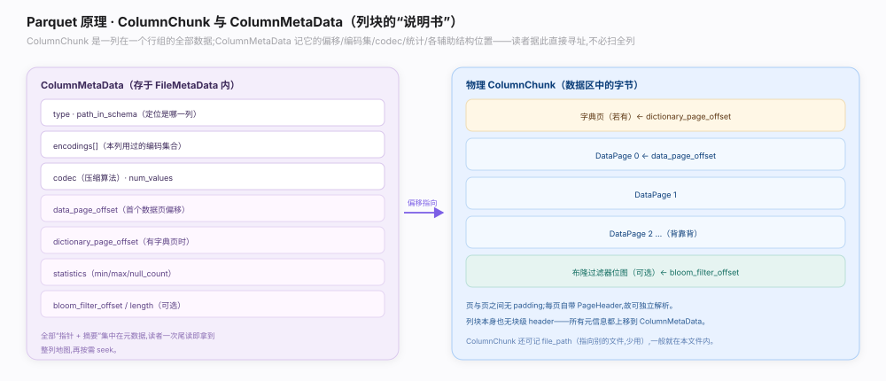
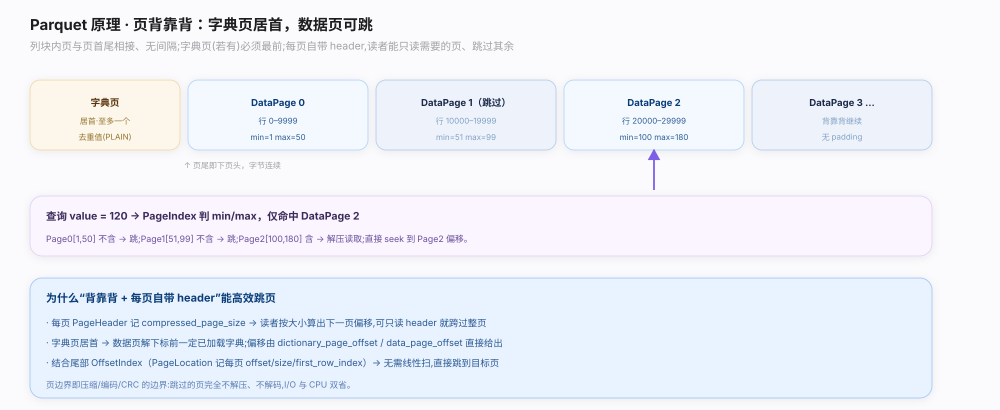

# Parquet 原理 · 支撑主线 · 列块与页组装

> **定位**：属"组装能力域"。管行组内一列的物理落地：`ColumnChunk`（`parquet.thrift:971`）指向该列在文件中的字节段，`ColumnMetaData`（`parquet.thrift:888`）记它的偏移/编码集/统计/大小；列块内字典页居首、数据页背靠背，读者可按偏移直接跳读。是【文件布局】的行组组成、【列编码】/【压缩与页】产物的容器、【读路径】列裁剪与页跳读的定位依据。源码基准 **parquet-format**（`parquet.thrift`）。

行组由每列一个**列块**拼成，列块是"一列在一个行组里的全部字节"。列块不是黑盒——它有一份 `ColumnMetaData` 记清了起始偏移、用了哪些编码、压缩 codec、总大小、值数、以及列级 Statistics。列块内部是页序列：若用字典编码，字典页排在最前，随后是数据页背靠背排列。理解「ColumnMetaData 是列块的目录 + 页背靠背可跳读」就懂了列怎么被定位和读取。

---

## 一、ColumnChunk 与 ColumnMetaData

- **ColumnChunk**（`parquet.thrift:971`）：行组里针对一列的结构，主要含 `file_offset` 和内嵌的 `meta_data`（`ColumnMetaData`）；也支持列块存于独立文件（`file_path`，用于跨文件列存，少见）。
- **ColumnMetaData**（`parquet.thrift:888`）是列块的"目录"，记：
  - `type`（物理类型）、`path_in_schema`（列路径，全库定位轴）；
  - `encodings[]`（这列用到的编码集合，如 RLE + RLE_DICTIONARY + PLAIN）、`codec`（压缩算法）；
  - `num_values`、`total_uncompressed_size`、`total_compressed_size`；
  - `data_page_offset`、`dictionary_page_offset`（有字典时）、`index_page_offset`；
  - `statistics`（列级 min/max/null_count）、可选 `bloom_filter_offset`、`encoding_stats`。

**为什么每列块都带完整元数据**：读者只需 `FileMetaData` 就能知道每列块在哪、多大、怎么编码/压缩、统计如何——无需先读数据即可规划"读哪些列块、能否按统计跳过"。

---

## 二、页背靠背与字典页居首

列块内部的页排列：

- 若该列用字典编码，**字典页（DICTIONARY_PAGE）排在列块最前**，`dictionary_page_offset` 指向它；随后数据页共享这张字典。
- 数据页**背靠背**（back-to-back）连续排列，每页前有各自的 `PageHeader`。`data_page_offset` 指向第一个数据页。
- 读者可从 `data_page_offset` 顺序读页，或结合 `OffsetIndex`（见【PageIndex】）跳到指定页的字节偏移，只读命中页。
- 页头里的 `uncompressed_page_size`/`compressed_page_size` 让读者无需额外索引就能一页页跳过（读完页头即知下一页起点）。

**为什么背靠背 + 字典居首**：背靠背布局让顺序读一气呵成、也支持按偏移随机跳页；字典页居首保证任何数据页解码前都能先加载字典，且字典只存一次被整列复用。

---

## 拓展 · 列块组装关键结构一览

| 结构 / 字段 | 位置 | 职责 |
|---|---|---|
| ColumnChunk | `parquet.thrift:971` | 行组内一列的字节段引用 |
| ColumnMetaData | `parquet.thrift:888` | 列块目录：偏移/编码/统计/大小 |
| data_page_offset | `parquet.thrift:888`（内字段） | 第一个数据页偏移 |
| dictionary_page_offset | `parquet.thrift:888`（内字段） | 字典页偏移（居列块首） |
| encodings[] | `parquet.thrift:888`（内字段） | 这列用到的编码集合 |
| statistics | `parquet.thrift:888`（内字段） | 列级 min/max/null_count |

## 调优要点（关键开关）

- **列裁剪即免读列块**：只投影需要的列 → 只读命中列的 ColumnChunk，其余字节一概不碰。
- **一次读整列块 vs 跳页读**：全列扫描顺序读整块最快；点查/谓词命中少时用 OffsetIndex 跳页更省。
- **字典页大小**：影响是否维持字典编码；过大字典页会拖慢首次加载。
- **列排布顺序**：把常一起查询的列相邻放，利于合并 IO（部分引擎/写库支持）。

## 常见误区与工程要点

- **误区：列块是不透明黑盒。** 列块自带 ColumnMetaData 目录，偏移/编码/统计全可读。
- **误区：字典页在数据页之间。** 字典页在列块最前（`dictionary_page_offset`），供整列数据页复用。
- **误区：必须顺序读完前面页才能读某页。** 有 OffsetIndex 时可直接 seek 到目标页偏移。
- **误区：一列在文件里连续。** 一列在**每个行组**里各有一个列块，跨行组不连续；同行组内该列块连续。
- **归属提醒**：页内编码在【列编码】、压缩在【压缩与页】、列级/页级统计在【统计与排序】/【PageIndex】、布隆偏移在【布隆过滤器】。

## 一句话总纲

**Parquet 行组由每列一个 ColumnChunk（`parquet.thrift:971`，含 file_offset + 内嵌 meta_data）拼成，列块是"一列在一个行组里的全部字节"；ColumnMetaData（`:888`）是列块目录，记 type/path_in_schema（定位轴）/encodings[]（编码集）/codec/num_values/total_(un)compressed_size/data_page_offset/dictionary_page_offset/statistics（min/max/null_count）/可选 bloom_filter_offset；列块内部若用字典则 DICTIONARY_PAGE 居首（dictionary_page_offset 指向、整列数据页复用一张字典），数据页背靠背连续（data_page_offset 指向首页，读完页头即知下一页起点），读者可顺序读整块或结合 OffsetIndex 跳到目标页偏移只读命中页；每列块自带完整元数据，让读者仅凭 FileMetaData 就能规划读哪些列块、能否按统计跳过——支撑列裁剪与页跳读。**
