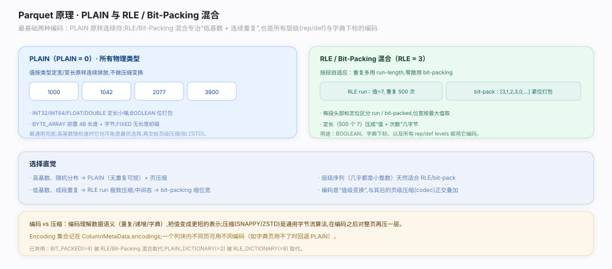
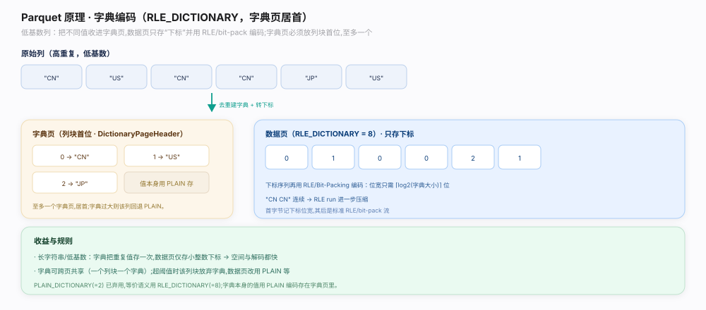
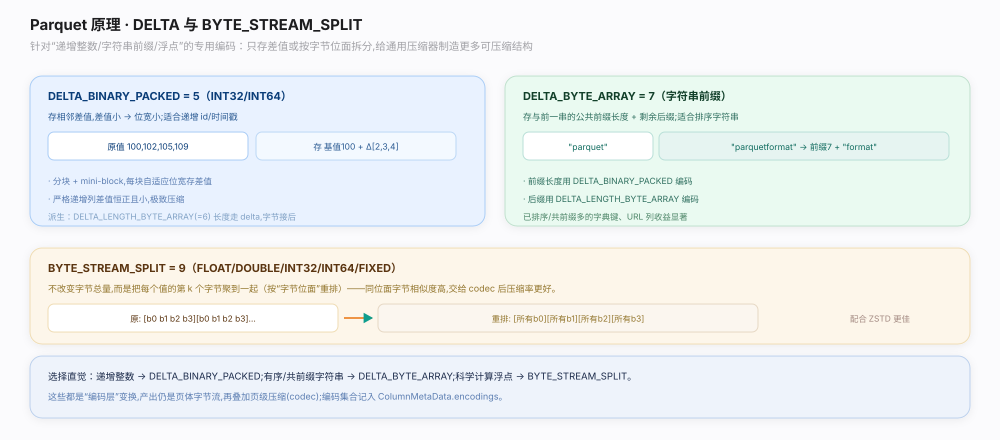

# Parquet 原理 · 支撑主线 · 列编码

> **定位**：属"编码能力域"。管把一列的值序列（及 rep/def 级别）编成紧凑字节的具体算法：`PLAIN`、`RLE`/位打包混合、字典编码（`PLAIN_DICTIONARY`/`RLE_DICTIONARY`）、`DELTA` 系列、`BYTE_STREAM_SPLIT`。是【压缩与页】的上游（先编码再压缩）、【Dremel 嵌套编码】rep/def 的落地手段。源码基准 **parquet-format**（`Encodings.md`、`parquet.thrift` enum Encoding）。

编码是 Parquet 高压缩的**第一道功夫**（压缩 codec 是第二道）：同列值同类型、常有规律（重复、递增、低基数），针对性编码能在通用压缩之前就把体积砍下来。`enum Encoding`（`parquet.thrift:573`）列出所有编码：PLAIN 原样、RLE/位打包管布尔与级别、字典管低基数、DELTA 管递增/字符串前缀、BYTE_STREAM_SPLIT 管浮点。理解「按数据特征选编码」就懂了列存为何这么小。

---

## 一、PLAIN 与 RLE/位打包混合

- **PLAIN**（`Encodings.md:50`）：值原样定长/变长写出，无压缩变换。是兜底编码，任何类型都支持；适合高基数、无规律的数据。
- **RLE/位打包混合**（`Encodings.md:92`，`enum Encoding` RLE=3）：把"重复游程"（run-length，连续相同值存"值 + 次数"）和"位打包"（bit-packing，多个小整数紧凑到最少位）交替混合，游程头的最低位标志用哪种。专治**布尔列**和 **rep/def 级别**（值域小、大量重复）——rep/def 级别几乎总用它，近乎零开销。

**为什么 RLE + 位打包混合**：数据既有长游程（用 RLE 一次表示）又有杂乱段（用位打包按最小位存），混合按段自适应取两者之长，比单一策略更省。

---

## 二、字典编码：低基数杀手

字典编码（`Encodings.md:76`）把不同的值收进一张**字典页**（存于列块首，见【列块与页组装】），数据页只存指向字典的**整数下标**，下标再用 RLE/位打包编码：

- 编码名：数据页用 `RLE_DICTIONARY`（`parquet.thrift:626`，值=8），字典页本身用 `PLAIN_DICTIONARY`（`:596`，值=2，历史遗留名）。
- 适合**低基数**列（如国家、状态、枚举）：N 个不同值只存一次，海量重复只存小下标。
- 写者自适应：字典增长超过阈值（字典页大小上限）就**回退**到 PLAIN，避免高基数列字典爆炸。

**为什么字典编码**：低基数列里真正的信息量 = 不同值的个数 + 出现模式；字典把"值"和"位置"解耦，值存一次、位置用极小整数，配合 RLE 常能压到原始的几十分之一。

---

## 三、DELTA 系列与 BYTE_STREAM_SPLIT

针对特定形态的专用编码：

- **DELTA_BINARY_PACKED**（`Encodings.md:201`）：存相邻整数的**差值**（再位打包），专治递增/近似递增整数（如自增 ID、时间戳）——差值小、位宽低。
- **DELTA_LENGTH_BYTE_ARRAY**（`Encodings.md:322`）：变长字节数组，先集中存所有长度（DELTA 编码）再存拼接的字节，避免每值一个长度前缀。
- **DELTA_BYTE_ARRAY**（`Encodings.md:345`）：增量前缀编码，存与上一个字符串的**公共前缀长度 + 后缀**，专治有序/相似字符串（如 URL、路径）。
- **BYTE_STREAM_SPLIT**（`Encodings.md:367`，`parquet.thrift:638`，值=9）：把浮点数的每个字节拆到不同流（所有值的第 0 字节一起、第 1 字节一起……），让相近浮点的高位字节聚集、更利于后续通用压缩。

**为什么这么多专用编码**：不同物理形态（递增整数 / 相似字符串 / 浮点）有不同的可压缩结构；专用编码先把结构性冗余榨干，再交给 codec 压残余，远胜单靠通用压缩。

---

## 拓展 · 编码选型一览

| 编码 | 位置 | 适用数据 |
|---|---|---|
| PLAIN | `Encodings.md:50` | 兜底，高基数无规律 |
| RLE / 位打包 | `Encodings.md:92` | 布尔 + rep/def 级别 |
| PLAIN_DICTIONARY / RLE_DICTIONARY | `parquet.thrift:596` / `:626` | 低基数（枚举/状态/国家） |
| DELTA_BINARY_PACKED | `Encodings.md:201` | 递增整数（ID/时间戳） |
| DELTA_LENGTH_BYTE_ARRAY | `Encodings.md:322` | 变长字节数组的长度集中 |
| DELTA_BYTE_ARRAY | `Encodings.md:345` | 有序/相似字符串（前缀增量） |
| BYTE_STREAM_SPLIT | `parquet.thrift:638` | 浮点（FLOAT/DOUBLE） |

## 调优要点（关键开关）

- **默认开字典**：低基数列字典编码收益巨大；写者会在字典超阈值时自动回退 PLAIN。
- **递增整数用 DELTA_BINARY_PACKED**：时间戳/自增 ID 差值极小，比 PLAIN 省数倍。
- **浮点用 BYTE_STREAM_SPLIT**：科学数据/传感器浮点常见收益，配 ZSTD 效果更佳。
- **字典页大小上限**：调大容纳更多不同值、迟回退；调小防高基数列字典占内存。

## 常见误区与工程要点

- **误区：编码就是压缩。** 编码（去结构冗余）在前，压缩 codec（去残余熵）在后，两道独立工序。
- **误区：字典编码总是最优。** 高基数列字典会爆炸，写者自动回退 PLAIN；别强制。
- **误区：rep/def 也要选编码。** rep/def 级别固定用 RLE/位打包混合，无需选。
- **误区：DELTA 只用于整数。** DELTA_BYTE_ARRAY/DELTA_LENGTH_BYTE_ARRAY 专门服务字符串/字节数组。
- **归属提醒**：编码后的字节由【压缩与页】再压；字典页位置在【列块与页组装】；哪些编码用在某列记于 ColumnMetaData.encodings。

## 一句话总纲

**Parquet 列编码是高压缩第一道功夫（codec 压缩是第二道）：`enum Encoding`（`parquet.thrift:573`）按数据特征选算法——PLAIN（`Encodings.md:50`，兜底/高基数）、RLE/位打包混合（`:92`，布尔 + rep/def 级别，游程与位打包按段自适应）、字典（数据页 RLE_DICTIONARY `parquet.thrift:626` + 字典页 PLAIN_DICTIONARY `:596`，低基数只存下标、超阈值回退 PLAIN）、DELTA 系列（DELTA_BINARY_PACKED `Encodings.md:201` 存整数差值、DELTA_LENGTH_BYTE_ARRAY `:322` 集中存长度、DELTA_BYTE_ARRAY `:345` 存字符串公共前缀+后缀）、BYTE_STREAM_SPLIT（`:638`，浮点按字节拆流利于压缩）；先编码榨干结构冗余、再交 codec 压残余熵，编码集合记于 ColumnMetaData.encodings。**
