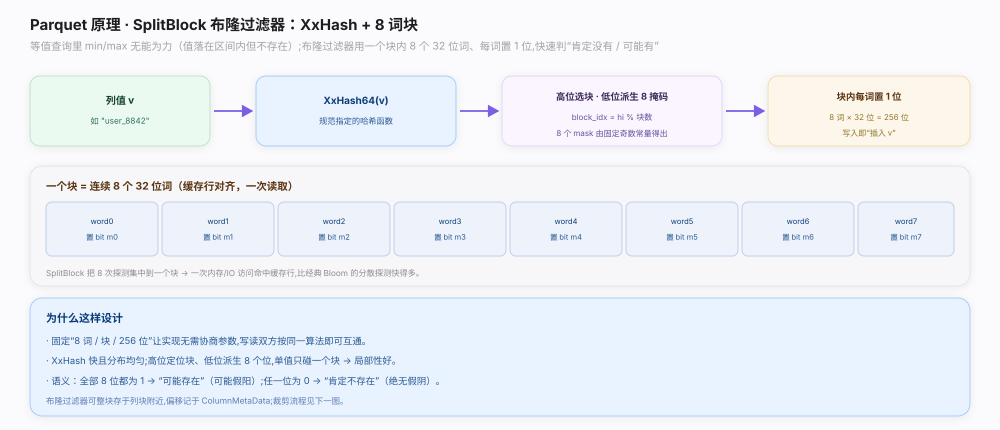
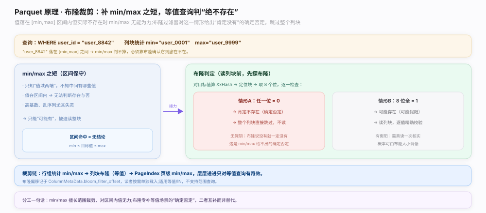

# Parquet 原理 · 支撑主线 · 布隆过滤器

> **定位**：属"索引能力域"——专补 min/max 在等值查询上的短板。管列块级的 **SplitBlock 分块布隆过滤器**（`SplitBlockAlgorithm` `parquet.thrift:766`）+ **XxHash**（`:776`）哈希 + `BloomFilterHeader`（`:799`）。当查询值落在 `[min,max]` 区间内但实际不存在时，min/max 无能为力，布隆给出"肯定不存在"的确定否定。是【统计与排序】的等值补充、【读路径】裁块的一环。源码基准 **parquet-format**（`BloomFilter.md`、`parquet.thrift`）。

min/max 擅长范围裁剪，但对"值在区间内却不存在"束手无策（高基数、乱序列尤甚）。布隆过滤器专补这一短板：为列块建一个紧凑位图，等值查询先探布隆——任一位为 0 就"肯定没有"，整块跳过。Parquet 用 **SplitBlock** 变体：把一个值的 8 次探测集中到一个缓存行对齐的块内，一次内存访问搞定，比经典分散探测的布隆快得多。理解「SplitBlock 结构 + 等值确定否定」就懂这一层。

---

## 一、SplitBlock + XxHash

`SplitBlockAlgorithm`（`parquet.thrift:766`）的构建（`BloomFilter.md`）：

- 对列值 v 算 `XxHash`（`parquet.thrift:776`，规范指定的哈希函数）→ 64 位哈希。
- 高位选块：`block_idx = hi % 块数`；低位派生 8 个掩码（由固定奇数常量得出）。
- 一个**块 = 连续 8 个 32 位词 = 256 位**（缓存行对齐），块内每词按对应掩码置 1 位；写入即"插入 v"。
- 8 词 × 32 位，单值只碰一个块 → 局部性好、一次内存/IO 访问命中缓存行。
- 位图整体存于列块附近，偏移记于 `ColumnMetaData.bloom_filter_offset`，头部 `BloomFilterHeader`（`parquet.thrift:799`）声明算法/哈希/大小。

**为什么 SplitBlock**：固定"8 词/块/256 位"让写读双方无需协商参数即可互通；把 8 次探测集中到一个块 → 一次访问命中缓存行，比经典 Bloom 的分散探测快得多；XxHash 快且分布均匀。

---

## 二、裁剪：等值判"绝不存在"

补 min/max 之短的裁剪逻辑：

- 场景：`WHERE user_id = "user_8842"`，列块统计 `min="user_0001"` `max="user_9999"`——目标值落在区间内，**min/max 判不掉**，必须靠布隆确认。
- 读列块前先探布隆：对目标值算 XxHash → 定位块 → 取 8 位逐一检查：
  - **任一位 = 0** → **肯定不存在**（确定否定，无假阴）→ 整个列块直接跳过不读。
  - **8 位全 = 1** → 可能存在（可能假阳）→ 读列块逐值精确校验。
- 语义铁律：布隆说"没有"就一定没有（无假阴）；说"有"可能是假阳（需真读核实）。假阳概率可由布隆大小调低。

**为什么布隆补 min/max**：min/max 只知值域两端、对区间内值无结论；布隆专给等值场景的"确定否定"。二者互补——min/max 擅长范围裁剪，布隆专治等值，非替代关系。仅适用等值/IN，不支持范围查询。

---

## 拓展 · 布隆过滤器关键结构一览

| 结构 | 位置 | 职责 |
|---|---|---|
| SplitBlockAlgorithm | `parquet.thrift:766` | 分块布隆算法（8 词/块/256 位） |
| XxHash | `parquet.thrift:776` | 规范指定的哈希函数 |
| BloomFilterHeader | `parquet.thrift:799` | 声明算法/哈希/压缩/大小 |
| bloom_filter_offset | `parquet.thrift:888`（ColumnMetaData 内） | 布隆位图在文件中的偏移 |

## 调优要点（关键开关）

- **只对等值查询高频的高基数列建布隆**：如 user_id、订单号；低基数列字典/统计已够。
- **调布隆大小控假阳率**：位图越大假阳越低但占空间，按查询选择性权衡。
- **配合 min/max/PageIndex**：范围裁剪靠统计，等值裁剪靠布隆，层层递进。
- **按需加载**：布隆位图单独存，读者只在有等值谓词时才读，平时不加载。

## 常见误区与工程要点

- **误区：布隆能做范围查询。** 只支持等值/IN；范围查询靠 min/max + PageIndex。
- **误区：布隆有假阴。** 无假阴——说"没有"就一定没有；只有假阳（说"有"可能没有）。
- **误区：所有列都该建布隆。** 只对等值高频、高基数列值得；否则白占空间。
- **误区：布隆替代 min/max。** 互补：min/max 管范围、布隆补等值区间内的确定否定。
- **归属提醒**：min/max 范围裁剪在【统计与排序】；页级裁剪在【PageIndex】；哈希/位图字节属本篇；裁块发生在【读路径】。

## 一句话总纲

**Parquet 布隆过滤器专补 min/max 在等值查询的短板：SplitBlockAlgorithm（`parquet.thrift:766`）对列值算 XxHash（`:776`）→ 高位选块（block_idx = hi % 块数）、低位派生 8 个掩码，一个块=连续 8 个 32 位词=256 位（缓存行对齐）、块内每词置 1 位，单值只碰一个块一次内存访问命中缓存行（比经典分散探测的 Bloom 快），位图存列块附近、偏移记 ColumnMetaData.bloom_filter_offset、头部 BloomFilterHeader（`:799`）声明算法哈希大小；裁剪时当目标值落在 [min,max] 区间内 min/max 判不掉，读列块前先探布隆——任一位为 0 则肯定不存在（确定否定、无假阴）整块跳过，8 位全 1 则可能存在（可能假阳）读块逐值校验；仅支持等值/IN 不支持范围，与 min/max（范围裁剪）互补而非替代。**
