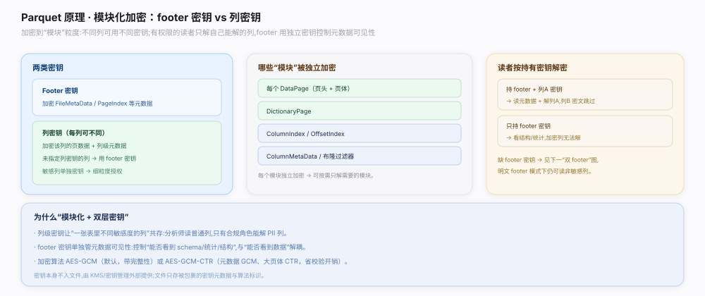
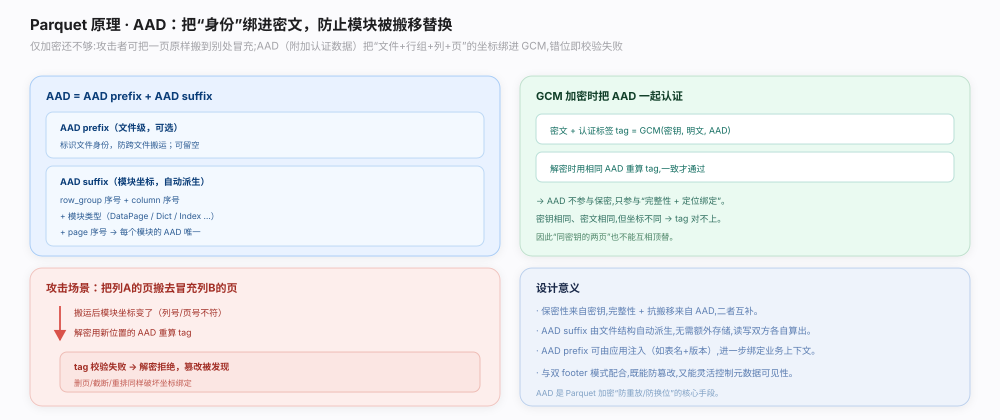
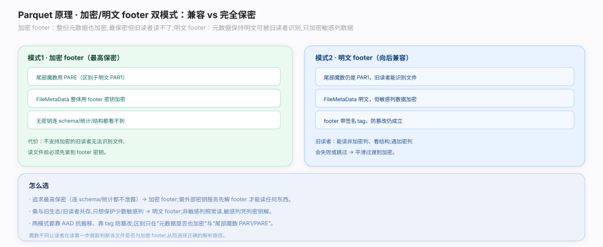

# Parquet 原理 · 支撑主线 · 模块化加密

> **定位**：属"安全能力域"。管文件级/列级的模块化加密：`EncryptionAlgorithm`（`parquet.thrift:1378`：`AesGcmV1` `:1354` / `AesGcmCtrV1` `:1366`）、footer 密钥 vs 列密钥双密钥模型（`EncryptionWithFooterKey` `:955` / `EncryptionWithColumnKey` `:958`）、AAD（附加认证数据）防篡改/换页、加密 footer 与明文 footer 双模式（`FileCryptoMetaData` `:1453`）。是安全合规场景的读写前置。源码基准 **parquet-format**（`Encryption.md`、`parquet.thrift`）。

Parquet 的加密是**模块化**的：不是整个文件一把锁，而是可对不同列用不同密钥分别加密（列级授权），footer 元数据可单独用 footer 密钥保护。加密用 AES-GCM（认证加密，防篡改）或 GCM-CTR（footer 认证、数据仅加密不认证以省开销）。每个加密模块带 AAD（含文件唯一前缀 + 模块类型/序号后缀），防止密文被整体搬运/换页而不被发现。理解「双密钥分权 + AAD 防换 + 双 footer 模式」就懂这一层。

---

## 一、双密钥模型：footer 密钥 vs 列密钥

模块化加密的核心是**分权**（`Encryption.md`）：

- **footer 密钥**：保护文件级 footer（`FileMetaData`）及未单独指定列密钥的列。持有 footer 密钥即可读元数据全图。
- **列密钥**：某些敏感列可用**独立列密钥**加密（`EncryptionWithColumnKey`，`parquet.thrift:958`），其余列用 footer 密钥（`EncryptionWithFooterKey`，`:955`）。
- 效果：不同角色分发不同密钥——只给 footer 密钥的人能读大部分列但读不到用独立列密钥加密的敏感列（列级授权）。
- 加密算法：`AesGcmV1`（`parquet.thrift:1354`，全模块 GCM 认证加密）或 `AesGcmCtrV1`（`:1366`，元数据 GCM 认证、数据页 CTR 仅加密不认证，省认证开销）。`union EncryptionAlgorithm`（`:1378`）二选一。

**为什么双密钥**：数据治理常要求"列级授权"——同一文件里薪资列只有 HR 能看、其他列人人可看。双密钥让加密粒度到列，一份文件服务多种权限，无需按权限拆多份。

---

## 二、AAD：防篡改与换页

AES-GCM 是**认证加密**，除密文还产生认证标签；Parquet 给每个加密模块喂 **AAD（Additional Authenticated Data，附加认证数据）**：

- AAD = **AAD prefix**（文件唯一标识，可选，防跨文件搬运）+ **AAD suffix**（模块类型 + 行组序号 + 列序号 + 页序号，防同文件内换页/换列）。
- 加密某页时把该页的 AAD 一起参与认证；解密时校验 AAD——若攻击者把 A 页密文搬到 B 页位置，AAD 后缀对不上，认证失败被发现。
- 这防的是**重放/换位攻击**：即便攻击者不解密，也不能通过搬运合法密文块伪造文件。

**为什么要 AAD**：单纯加密只防"看内容"，不防"搬运合法密文块重组文件"。AAD 把每个模块的"身份坐标"绑进认证，让密文离开原位就失效——保证完整性与位置绑定。

---

## 三、双 footer 模式：加密 footer vs 明文 footer

Parquet 支持两种 footer 模式（`Encryption.md`）：

- **加密 footer 模式**：整个 `FileMetaData` 用 footer 密钥加密，文件尾的 `FileCryptoMetaData`（`parquet.thrift:1453`）声明加密算法与密钥元信息，指引读者先拿密钥再解 footer。无密钥者连元数据都读不到。
- **明文 footer 模式**：`FileMetaData` 明文（含加密签名保完整性），只有各列数据加密。好处：不支持加密的老读者仍能读 schema/结构（但读不到加密列的数据）——**向后兼容**。
- 尾魔数区分：加密文件用 `PARE`（而非明文的 `PAR1`）等标识，读者据此走加密路径。

**为什么两种模式**：加密 footer 最安全（元数据都藏），但破坏兼容；明文 footer 牺牲元数据保密换取老工具能读结构。按"是否需元数据保密 + 是否需兼容老读者"权衡二选一。

---

## 拓展 · 模块化加密关键结构一览

| 结构 | 位置 | 职责 |
|---|---|---|
| union EncryptionAlgorithm | `parquet.thrift:1378` | AesGcmV1 / AesGcmCtrV1 二选一 |
| AesGcmV1 | `parquet.thrift:1354` | 全模块 GCM 认证加密 |
| AesGcmCtrV1 | `parquet.thrift:1366` | 元数据 GCM、数据 CTR 省认证 |
| EncryptionWithFooterKey | `parquet.thrift:955` | 列用 footer 密钥加密 |
| EncryptionWithColumnKey | `parquet.thrift:958` | 列用独立列密钥加密 |
| FileCryptoMetaData | `parquet.thrift:1453` | 加密 footer 模式的尾部密钥元信息 |

## 调优要点（关键开关）

- **敏感列单独列密钥**：实现列级授权，一份文件服务多权限角色。
- **AesGcmCtrV1 省 CPU**：数据页量大且信任存储介质完整性时，用 CTR 免数据页认证开销。
- **明文 footer 换兼容**：需老工具读 schema 时用；否则加密 footer 更安全。
- **AAD prefix 存储**：可存文件内或外部管理；外部管理更安全但需额外基础设施。

## 常见误区与工程要点

- **误区：加密就是整文件一把锁。** 模块化——可对不同列用不同密钥，footer 单独保护。
- **误区：加密就防篡改。** 需 AES-GCM 认证 + AAD 才防；纯加密只防"看内容"不防换位。
- **误区：加密文件老读者完全读不了。** 明文 footer 模式下老读者仍能读 schema/结构。
- **误区：GCM-CTR 和 GCM 一样安全。** CTR 数据页不认证，省 CPU 但不防数据页篡改，按信任度选。
- **归属提醒**：被加密的对象（footer/列块/页）布局在【文件布局】/【列块与页组装】；加密不改变编码/压缩，只在其后包一层。

## 一句话总纲

**Parquet 模块化加密按列分权而非整文件一把锁：EncryptionAlgorithm（`parquet.thrift:1378`）二选 AesGcmV1（`:1354`，全模块 GCM 认证加密）或 AesGcmCtrV1（`:1366`，元数据 GCM、数据页 CTR 省认证开销）；双密钥模型——敏感列用独立列密钥 EncryptionWithColumnKey（`:958`）、其余列与 footer 用 footer 密钥 EncryptionWithFooterKey（`:955`），实现列级授权（只给 footer 密钥者读不到独立密钥列）；每个加密模块喂 AAD（prefix 文件唯一标识防跨文件搬运 + suffix 模块类型/行组/列/页序号防同文件换页换列），把身份坐标绑进 GCM 认证使密文离位即失效防重放换位；两种 footer 模式——加密 footer（FileMetaData 全加密、FileCryptoMetaData `:1453` 指引密钥，最安全但破坏兼容）vs 明文 footer（元数据明文带签名、仅数据加密，老读者仍能读 schema、向后兼容），按元数据是否需保密 + 是否需兼容权衡。**
