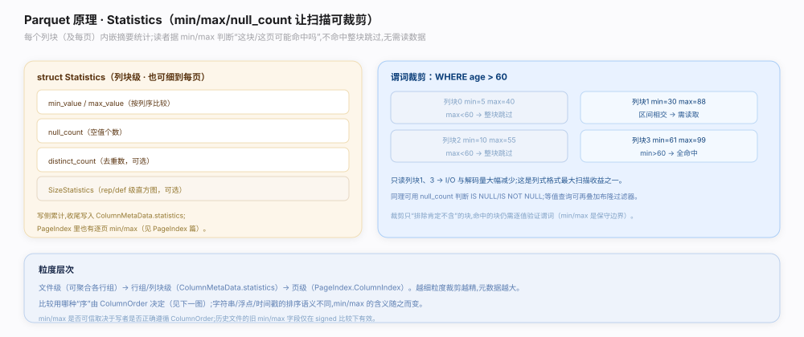

# Parquet 原理 · 支撑主线 · 统计与排序

> **定位**：属"统计能力域"——谓词下推的数据基础。管两类元数据：**Statistics**（`parquet.thrift:267`：min/max/null_count/distinct_count）供裁块裁页；**排序语义**（`ColumnOrder` `parquet.thrift:1082`、`SortingColumn` `:857`、`BoundaryOrder` `:672`）定义 min/max 怎么比、行组是否有序。是【PageIndex】/【布隆过滤器】的上游、【读路径】跳读的判据。特别处理 NaN、INT96 等比较特例。源码基准 **parquet-format**（`parquet.thrift`）。

统计是列存"扫得快"的关键：每个列块（及每页，见【PageIndex】）都攒 min/max/null_count，读者拿谓词一比，就能整块/整页跳过。但 min/max 有个隐含前提——**"比大小"的规则**：字符串按字节还是按 collation？浮点的 NaN 算不算数？有无符号整数怎么比？这些由 `ColumnOrder` 显式声明。再加 `SortingColumn` 声明行组按哪些列有序，读者可二分。理解「统计供裁剪 + ColumnOrder 定比较 + 特例要小心」就懂这一层。

---

## 一、Statistics：min/max/null_count

`Statistics`（`parquet.thrift:267`）挂在 `ColumnMetaData`（列块级）和 `ColumnIndex`（页级）上，含：

- `min_value` / `max_value`（新字段，按 ColumnOrder 语义比较；旧 `min`/`max` 已废弃因比较语义不明）；
- `null_count`（null 值数，供 `IS NULL`/`IS NOT NULL` 判定）；
- `distinct_count`（不同值数，选择性估计，可选）。
- 另有 `SizeStatistics`（`parquet.thrift:202`）：`unencoded_byte_array_data_bytes` + `repetition_level_histogram` / `definition_level_histogram`，供更精细的大小/嵌套估计。

谓词裁剪逻辑：`WHERE x > 100` 且列块 `max ≤ 100` → 整块无命中，跳过；`x = v` 且 `v` 不在 `[min,max]` → 跳过。

**为什么统计如此关键**：一次比较（谓词 vs min/max）就能省掉读整个列块/页的 IO 与解码，是列存查询快的核心杠杆；null_count 让空值判定无需读数据。

---

## 二、排序语义：ColumnOrder / SortingColumn / BoundaryOrder

min/max 有意义的前提是"怎么比大小"明确：

- **ColumnOrder**（`union ColumnOrder`，`parquet.thrift:1082`）：每列的排序语义，目前主要是 `TypeDefinedOrder`（按类型的自然序：整数按数值、字符串按 UTF-8 字节、浮点按 IEEE 但排除 NaN）。写在 `FileMetaData.column_orders`，让读者知道 min/max 该怎么解释。
- **SortingColumn**（`parquet.thrift:857`）：`RowGroup.sorting_columns` 声明行组按哪些列、升/降、null 排前/后有序。读者可对有序列**二分**定位，或做归并。
- **BoundaryOrder**（`enum BoundaryOrder`，`parquet.thrift:672`：UNORDERED / ASCENDING / DESCENDING）：`ColumnIndex` 里声明各页的 min/max 是否单调，若 ASCENDING 则裁页可二分而非逐页扫。

**为什么显式声明排序语义**：不同类型、不同 collation 的"大小"规则不同；只有写读双方约定同一 ColumnOrder，min/max 才可信；SortingColumn/BoundaryOrder 进一步把"有序"这一强属性暴露给读者以加速。

---

## 三、比较特例：NaN / INT96 / 未定义序

min/max 的坑主要在"比较无良定义"的情形：

- **浮点 NaN**：NaN 与任何值比较都为假，不能进 min/max。规范要求：统计忽略 NaN；若某页/块全是 NaN，则 min/max 不写。读者遇含 NaN 列需谨慎裁剪。
- **INT96**（已废弃）：无良定义的排序序，其 `ColumnOrder` 为**未定义**，因此**不应**依赖其 min/max 做裁剪。
- **旧 min/max 字段**：早期 `Statistics.min`/`max`（非 `min_value`/`max_value`）比较语义不明确，新读者应只信 `min_value`/`max_value` + ColumnOrder。
- **-0.0 与 +0.0**：视为相等，写者可任选其一作边界。

**为什么单列特例**：正确性铁律——凡"比较语义未定义"的情形（NaN、INT96、旧字段），宁可不裁剪也不能裁错，否则会漏读本该命中的数据。裁剪必须建立在可信的比较语义之上。

---

## 拓展 · 统计与排序关键结构一览

| 结构 | 位置 | 职责 |
|---|---|---|
| Statistics | `parquet.thrift:267` | min_value/max_value/null_count/distinct_count |
| SizeStatistics | `parquet.thrift:202` | 未编码字节数 + rep/def 直方图 |
| union ColumnOrder | `parquet.thrift:1082` | 每列排序语义（min/max 怎么比） |
| SortingColumn | `parquet.thrift:857` | 行组按哪些列升/降有序 |
| enum BoundaryOrder | `parquet.thrift:672` | 页 min/max 是否单调（可二分裁页） |

## 调优要点（关键开关）

- **写侧攒统计几乎免费**：编码时顺带算 min/max/null_count，收益（读时跳块）远大于开销。
- **写有序数据 + 声明 SortingColumn**：让读者二分/归并，范围查询大幅加速。
- **BoundaryOrder=ASCENDING**：写者若保证页间有序，声明它可把逐页裁页降为二分。
- **谨慎 distinct_count**：为估计值，别当精确基数用。

## 常见误区与工程要点

- **误区：所有列都能靠 min/max 裁剪。** INT96、含 NaN 的浮点、未定义序列不可信，别裁。
- **误区：用旧 min/max 字段。** 用 `min_value`/`max_value` + ColumnOrder，旧字段语义不明已废弃。
- **误区：NaN 参与 min/max。** 统计忽略 NaN；全 NaN 则不写 min/max。
- **误区：统计一定存在。** Statistics 可选，写者可能不写；读者须处理缺失（退化为不裁剪）。
- **归属提醒**：页级 min/max 的组织在【PageIndex】；等值裁剪补 min/max 在【布隆过滤器】；统计挂在 ColumnMetaData 见【列块与页组装】。

## 一句话总纲

**Parquet 统计是谓词下推的数据基础：Statistics（`parquet.thrift:267`，min_value/max_value/null_count/distinct_count，挂列块与页级）+ SizeStatistics（`:202`，未编码字节数 + rep/def 直方图）让读者一次比较（谓词 vs min/max）就整块/整页跳过、null_count 免读判空；min/max 的前提是比较语义明确——ColumnOrder（`union`，`:1082`，TypeDefinedOrder 按类型自然序）定"怎么比"、SortingColumn（`:857`）声明行组按哪些列升/降有序供二分归并、BoundaryOrder（`:672`：UNORDERED/ASCENDING/DESCENDING）声明页 min/max 是否单调可二分裁页；正确性铁律是凡比较语义未定义者不裁——浮点 NaN 不入 min/max（全 NaN 不写）、INT96 排序未定义不可依赖其统计、旧 min/max 字段语义不明须只信 min_value/max_value，宁可不裁也不裁错。**
