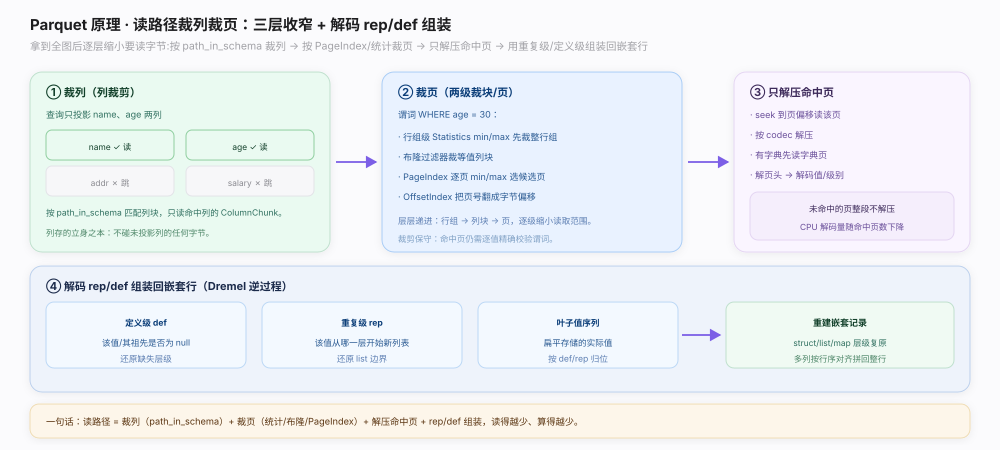

# Parquet 原理 · 支撑主线 · 读路径

> **定位**：属"读取能力域"——把一次读文件的全流程串起来。管：倒读末 8 字节拿 `FileMetaData`（`parquet.thrift:1386`）全图 → `path_in_schema` 列裁剪 → Statistics/布隆/PageIndex 裁块裁页 → 解压命中页、解码 rep/def（`README.md:166`）组装回嵌套行。是【文件布局】倒读的消费者，调用【统计与排序】/【PageIndex】/【布隆过滤器】裁剪、【列编码】/【压缩与页】解码、【Dremel 嵌套编码】组装。源码基准 **parquet-format**（`README.md`、`parquet.thrift`）。

读一个 Parquet 文件的核心哲学是**读得越少越好**：先花一次小 IO 从尾部拿到全文件地图，再逐层缩小要真正读取的字节——按投影列裁掉不要的列块，按谓词 + 统计/布隆/PageIndex 裁掉不命中的块和页，只解压命中页，最后用 rep/def 把扁平值组装回嵌套行。理解「尾读拿全图 → 裁列裁页 → 解码组装」这条流水线就懂了文件怎么被高效读出。

---

## 一、尾读：末 8 字节起步拿全图

元数据尾置，读者必先 seek 到文件尾：

- **步骤① 读末 8 字节**：`seek(EOF − 8)` 读 8 字节，后 4 字节校验 = `"PAR1"`，前 4 字节 = `FileMetaData` 长度 L（小端 int32）。开头也有 `PAR1` → 双魔数确认是 Parquet。
- **步骤② 回跳读 FileMetaData**：`seek(EOF − 8 − L)` 读 L 字节，Thrift 反序列化 `FileMetaData`（`parquet.thrift:1386`）。常与尾读合并成一次范围读（如猜读末尾 64KB 一次到位省 IO）。
- **步骤③ 拿到全图**：schema 类型树、各行组/列块偏移、每列 Statistics 与编码、PageIndex/布隆偏移——据此规划要读哪些列/页。

**为什么尾读省 IO**：不必扫全文件，一次小范围尾读即得全文件地图，再据地图精准定位要读的字节段。与 ORC 的 postscript/footer 尾部索引同源；代价是读文件必须能 seek 到尾部（不适合纯流式读入）。

---

## 二、裁列裁页 + 解码 rep/def 组装

拿到全图后逐层收窄（`README.md:166` Nested Encoding 的逆过程）：

- **① 裁列（列裁剪）**：查询只投影的列，按 `path_in_schema` 匹配列块，只读命中列的 `ColumnChunk`，其余列的任何字节都不碰——列存立身之本。
- **② 裁页（两级裁块/页）**：谓词 `WHERE age = 30` 时，行组级 Statistics min/max 先裁整行组 → 布隆过滤器裁等值列块（见【布隆过滤器】）→ PageIndex 逐页 min/max 选候选页（见【PageIndex】）→ OffsetIndex 把页号翻成字节偏移。层层递进：行组 → 列块 → 页。裁剪保守，命中页仍需逐值精确校验。
- **③ 只解压命中页**：seek 到页偏移读该页 → 按 codec 解压（有字典先读字典页）→ 解页头 → 解码值/级别。未命中页整段不解压，CPU 解码量随命中页数下降。
- **④ 解码 rep/def 组装**：定义级 def 还原缺失/null 层级、重复级 rep 还原 list 边界、叶子值序列按 def/rep 归位 → 重建 struct/list/map 嵌套记录；多列按行序对齐（借 `first_row_index`）拼回整行。

**为什么裁列裁页 + 组装**：读得越少、算得越少——列裁剪省 IO、页裁剪省 IO+解压、免解压省 CPU；rep/def 组装是 Dremel 编码的逆运算，把扁平列还原成引擎要的嵌套行。

---

## 拓展 · 读路径关键动作一览

| 步骤 / 结构 | 位置 | 职责 |
|---|---|---|
| 倒读末 8 字节 | `README.md:96` | 4B 长度 + PAR1 → 定位 FileMetaData |
| FileMetaData | `parquet.thrift:1386` | 全文件地图（schema/偏移/统计） |
| path_in_schema 列裁剪 | `parquet.thrift:888`（ColumnMetaData 内） | 只读投影列的列块 |
| 统计/布隆/PageIndex 裁块裁页 | `:267`/`:766`/`:1264` | 行组→列块→页三级裁剪 |
| rep/def 组装 | `README.md:166` | 逆 Dremel，重建嵌套行 |

## 调优要点（关键开关）

- **只投影必要列**：列裁剪是最大杠杆——少读列 = 少读列块字节。
- **下推谓词**：把 WHERE 下推到读路径，触发统计/布隆/PageIndex 裁块裁页。
- **合并小 IO**：把相邻列块/页的范围读合并成一次请求，对象存储尤其重要。
- **DataPageV2 + PageIndex**：免解压读级别/统计裁页，省解压 CPU。

## 常见误区与工程要点

- **误区：读 Parquet 要顺序扫全文件。** 先倒读尾部拿全图，再按需精准读命中字节段。
- **误区：裁剪是精确的。** 保守裁剪——统计/布隆说"可能有"的块/页仍需逐值校验谓词。
- **误区：读一列要扫全文件。** 一列在每个行组各有列块，按偏移直接 seek 命中列块，不扫其余。
- **误区：嵌套结构读出来还是扁平。** 靠 rep/def 组装还原 struct/list/map，多列按行号对齐拼整行。
- **归属提醒**：倒读布局在【文件布局】；裁块判据在【统计与排序】/【布隆过滤器】、裁页在【PageIndex】；解码在【列编码】/【压缩与页】、组装依据在【Dremel 嵌套编码】。

## 一句话总纲

**Parquet 读路径核心是读得越少越好：①尾读——seek(EOF−8) 读末 8 字节（后 4B 校验 PAR1、前 4B 得 FileMetaData 长度 L），回跳 seek(EOF−8−L) 读 L 字节反序列化 FileMetaData（`parquet.thrift:1386`）拿全图（schema/偏移/统计/索引偏移），常合并成一次尾部大猜读省 IO；②裁列——按 path_in_schema 只读投影列的 ColumnChunk 其余不碰；③裁页——谓词经行组 Statistics min/max 裁块 → 布隆裁等值列块 → PageIndex 逐页 min/max 选页 → OffsetIndex 翻字节偏移，行组→列块→页三级递进（保守，命中仍逐值校验）；④只解压命中页（有字典先读字典页、未命中页不解压省 CPU）；⑤解码 rep/def 组装（def 还原 null/缺失层、rep 还原 list 边界、叶子值按级别归位，`README.md:166` 逆 Dremel）、多列按 first_row_index 行号对齐拼回嵌套整行交引擎；与 ORC 尾部索引同源，代价是读需能 seek 到尾部。**
