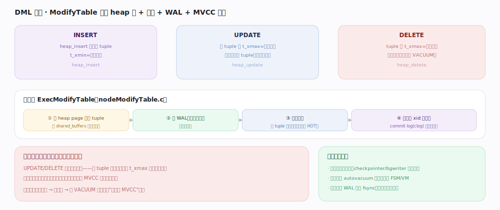
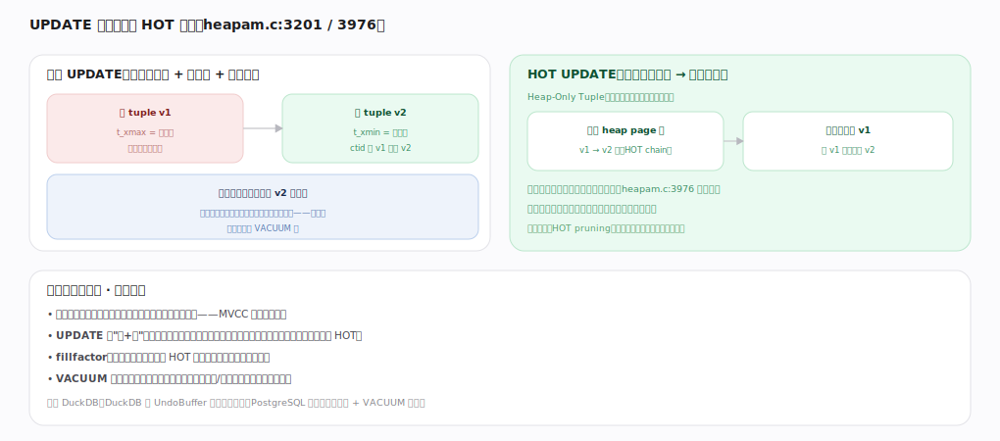

# PostgreSQL 核心原理 · DML 数据写入（INSERT / UPDATE / DELETE）

> **定位**：改数据接口主线，骨架 `ExecModifyTable → heap 写 → 索引维护 → WAL → MVCC 版本`。以**存储引擎**（heap tuple）与**事务与 MVCC**（xmin/xmax 多版本）为双轴，持久化靠 **WAL 与恢复**，死元组回收依赖后台 **VACUUM**。核实基准：官方源码 `postgres/src`（commit 572c3b2）。

## 一、总览：ModifyTable 驱动，写造版本

三类写共享执行算子 `ExecModifyTable`（`executor/nodeModifyTable.c:4625`），它按类型分派到 `ExecInsert:874` / `ExecUpdate:2749` / `ExecDelete:1847`，各自再落到堆表写：

- **INSERT**：`heap_insert`（`access/heap/heapam.c:2004`）经 `heap_prepare_insert:2202` 填好头部（`t_xmin`=当前事务、`t_xmax`=0），把 tuple 追加进有空闲的页；
- **UPDATE**：`heap_update`（`heapam.c:3201`）给旧版本打 `t_xmax`=当前事务、`t_ctid` 指向新版本，再插入新 tuple（**不就地改**）；
- **DELETE**：`heap_delete`（`heapam.c:2717`）只给 tuple 打 `t_xmax`、不物理删除，空间留给 VACUUM。

统一路径：① 在 shared_buffers 缓冲页上改 tuple → ② 写 WAL（`XLogInsert`，`access/transam/xloginsert.c:482`，先于刷盘）→ ③ 维护索引（`ExecInsertIndexTuples`，`executor/execIndexing.c:311`，新版本通常需新索引项，除非 HOT）→ ④ 提交时经 CLOG（`access/transam/clog.c`）记事务状态定可见性。**关键：写不就地覆盖而是造版本**——旧数据留着供旧快照读，代价是死元组堆积、表膨胀，靠 VACUUM 回收。批量写还有 `heap_multi_insert`（`heapam.c:2282`，COPY 用）一次装多行摊平开销。

---

## 深化 · 版本链与 HOT 优化

普通 UPDATE：旧版本 v1 打 `t_xmax` 失效、新版本 v2 另存（`t_ctid` 从 v1 指 v2），**每个索引都要加指向 v2 的新项**（即使只改非索引列，也为所有索引维护——写放大），旧索引项等 VACUUM 清。

**HOT（Heap-Only Tuple）UPDATE**：`heap_update` 在 `heapam.c:3976` 处判定——`bms_overlap(modified_attrs, hot_attrs)`（`:3979`）检查被改列是否命中任何索引列，若全不命中则 `use_hot_update = true`（`:3981`）、`HeapTupleSetHotUpdated`（`:4032`）。此时新版本只在同一 heap page 内形成 HOT chain、**索引不动仍指向 v1**（查询经 v1 顺 `t_ctid` 链找到 v2），省去所有索引维护、减少写放大与索引膨胀；页内 `heap_page_prune_opt`（`access/heap/pruneheap.c:272`）在后续读时可就地回收 HOT 链上的死版本。

前提是**同页有空闲**：一旦 v2 放不下、跨页，就退化成普通更新、索引照样加项。工程含义：读写不互阻塞（MVCC 红利）、UPDATE 本质"删+插"、低 `fillfactor` 留页内空间提高 HOT 命中、VACUUM 不可少。

---

## 深化 · 失败路径与边界

| 场景 | 机理 | 后果 / 应对 |
|---|---|---|
| 唯一约束/外键冲突 | 插索引项（`ExecInsertIndexTuples`）时报错、整语句回滚 | 执行期错误，`EXPLAIN`（不带 ANALYZE）看不到；`ON CONFLICT` 走推测插入先占位再回退 |
| 写写冲突阻塞 | 两事务 UPDATE 同一行，后者在 `heap_update` 取行锁等前者结束 | RC 下前者提交后重取最新版本再改；RR/Serializable 报序列化失败 |
| 索引写放大 | 非 HOT 的 UPDATE 要更新表上所有索引 | 索引越多 UPDATE 越慢；一张表十几个索引时高频更新成瓶颈 |
| 膨胀与页分裂 | HOT 落空（跨页）+ 关掉 autovacuum | 死元组与旧索引项堆积、表和 B-tree 膨胀、扫描跳过大量死行 |
| COPY vs 单行 INSERT | `heap_multi_insert` 一次锁页装多行、批量记 WAL | 大批量导入用 COPY 常快一个数量级；`wal_level=minimal`+同事务建表可跳过部分 WAL |

---

## 拓展 · 写相关组件

| 组件 | 职责 | 锚点 |
|---|---|---|
| ExecModifyTable / ExecInsert/Update/Delete | 写算子分派 | `executor/nodeModifyTable.c:4625/874/2749/1847` |
| heap_insert / heap_update / heap_delete | 堆表写 + MVCC 标记 | `access/heap/heapam.c:2004/3201/2717` |
| heap_multi_insert | 批量插入（COPY） | `access/heap/heapam.c:2282` |
| ExecInsertIndexTuples | 维护索引项 | `executor/execIndexing.c:311` |
| clog（commit log） | 记事务提交/回滚状态 | `access/transam/clog.c` |
| WAL | 先写日志 | `access/transam/xloginsert.c:482` |

---

## 调优要点（关键开关）

- `fillfactor`（建表/索引时）：留页内空闲提高 HOT 命中，写多的表可调低于 100。
- 更新尽量只碰非索引列，触发 HOT 减少索引写放大。
- 批量写用 `COPY`（走 `heap_multi_insert`）而非逐行 INSERT；大事务减少提交次数。
- autovacuum 参数（`autovacuum_vacuum_scale_factor` 等）按更新频率调，防膨胀。
- 精简冗余索引：索引越多，非 HOT 更新越慢。

---

## 常见误区与工程要点

- **以为 UPDATE 就地改**：实际是造新版本 + 旧版本失效；频繁更新累积死元组。
- **忽视索引写放大**：非 HOT 的 UPDATE 要更新所有索引，索引越多写越慢。
- **关掉 autovacuum**：死元组不回收 → 表/索引膨胀、XID 回卷风险。
- **把 DELETE 当立即释放空间**：只打删除标记，空间靠 VACUUM 回收。
- **以为 HOT 一定生效**：同页放不下就退化成普通更新、索引照样加项。

---

## 一句话总纲

**DML 三类写都经 `ExecModifyTable`：INSERT `heap_insert` 追加新 tuple、UPDATE `heap_update` 给旧版本打 t_xmax 并另存新版本、DELETE `heap_delete` 打 t_xmax 不物理删——写不就地覆盖而是造 MVCC 版本，改动在缓冲页上做、先写 WAL（`XLogInsert`）、维护索引（`ExecInsertIndexTuples`；被改列全不命中索引时走 HOT 免索引维护）、提交经 CLOG 定可见性；旧版本供旧快照读、死元组由 VACUUM 后台回收，低 fillfactor 与"只更新非索引列"能提高 HOT 命中减少写放大与膨胀。**
