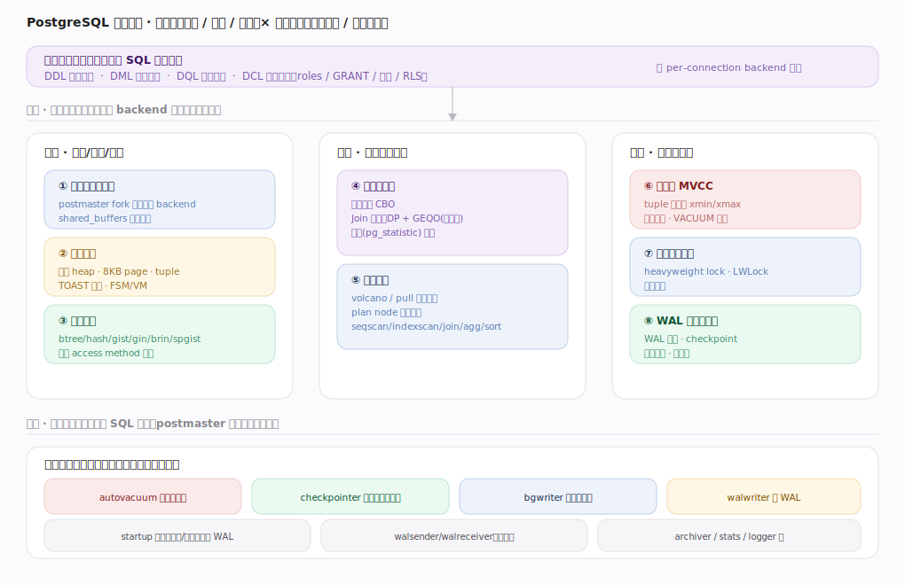
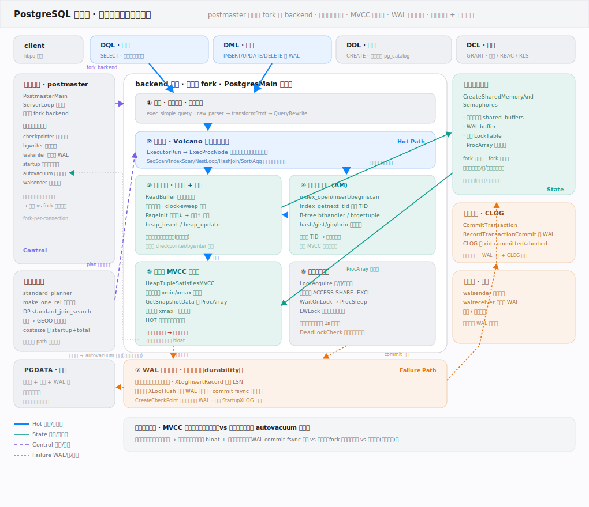
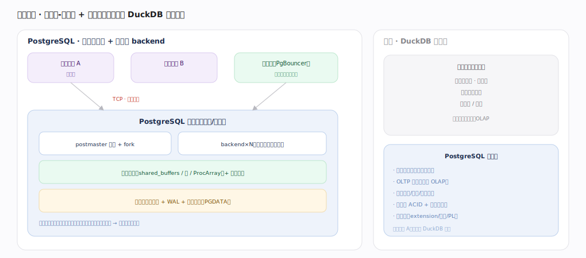
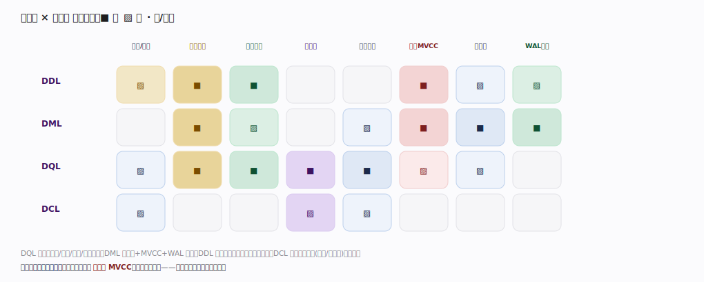

# PostgreSQL 核心原理 · 全景主线框架

> 统领全部原理文档：PostgreSQL 的 **4 条接口主线（DDL/DML/DQL/DCL）+ 8 条支撑能力域**，既无遗漏也无越界。核实基准 = 官方源码 `postgres/src`（master 分支 `commit 572c3b2`）。PostgreSQL 属**原型 A（SQL 存算引擎，自管存储 + SQL 接口）**，但与 DuckDB 相反：**经典客户端-服务器、进程级并发（postmaster 每连接 fork 一个 backend）、面向磁盘的行存 OLTP 数据库**。灵魂两主线：**进程与内存架构**（并发根基）与 **事务与 MVCC**（正确性根基）。

## 拓展 · 与 DuckDB 的心智对照

| 维度 | DuckDB | PostgreSQL |
|---|---|---|
| 部署形态 | 进程内嵌入库、无服务进程 | **独立服务器 + 每连接一个 backend 进程** |
| 并发模型 | 单进程多线程 morsel | **进程级并发**（fork per connection）+ 共享内存 |
| 存储 | 列存、单文件、面向 OLAP | **行存 heap、8KB page、多文件、面向 OLTP** |
| 执行 | push 向量化 | **volcano / pull 火山模型**（逐行拉取） |
| MVCC | UndoBuffer 版本链 + 乐观并发 | **tuple 多版本 xmin/xmax + VACUUM 回收死元组** |
| 权限 | 无多用户 GRANT | **完整 roles + GRANT/REVOKE + pg_hba 认证 + RLS** |

一句话：**DuckDB 是"嵌入式单机列存 OLAP"，PostgreSQL 是"客户端-服务器进程级行存 OLTP"——同族异构的两极。**

---

## 一、双维模型：能力域 × 执行时机

- **能力域**：接口主线（DDL/DML/DQL/DCL）面向用户 SQL；支撑侧按底座/计算/保障分 8 条——进程与内存架构、存储引擎、索引方法（底座）；查询优化器、执行引擎（计算）；事务与 MVCC、并发控制与锁、WAL 与恢复复制（保障）。
- **执行时机**：前台是每连接 backend 进程内同步处理；后台是 postmaster 派生的一批**辅助进程**——autovacuum（回收死元组）、checkpointer（刷脏页定检查点）、bgwriter（后台刷脏页）、walwriter（刷 WAL）、startup（回放 WAL 恢复）、walsender/walreceiver（流复制）。后台是横切的执行时机维度。

---

## 二、总架构：postmaster + backend + 共享内存 + 辅助进程

`postmaster`（`postmaster.c`，`ServerLoop:1678`）监听端口，每来一个连接就 fork 一个 `backend`（`BackendStartup:3576`）——它本身不处理 SQL。每个 backend 独立地址空间 + 私有内存（work_mem），在其内跑查询流水线（`tcop/postgres.c` 的 `exec_simple_query:1030`：Parser→Analyzer+Rewriter→Planner→Executor）；进程间经**共享内存**（shared_buffers 缓冲池、WAL buffers、锁表、ProcArray、快照）协作。读写数据经缓冲池、改动先写 WAL；磁盘上是行存 heap 数据文件、WAL、系统目录（pg_catalog）。进程级并发稳定、崩溃局限单连接，但每连接一进程开销大，高并发常配连接池。

---

## 三、部署形态：客户端-服务器 + 进程级并发

PostgreSQL 是长驻服务器：postmaster 监听并 fork，backend×N（每连接一个进程），共享内存 + 辅助进程 + 磁盘（PGDATA）。进程隔离带来稳定性（一个连接崩溃不影响其他），但每连接一进程开销大——高并发场景用连接池（PgBouncer）复用少量物理连接。定位：长驻多客户端、OLTP 为主、完整权限认证、强事务 ACID + 复制高可用、高度可扩展。与 DuckDB 的"嵌入式单机"形态相反。

---

## 四、接触面 × 能力域 依赖矩阵

**DQL** 调用优化器/执行/索引/存储全链；**DML** 以存储 + MVCC + WAL 为轴（写 tuple、生版本、记 WAL）；**DDL** 改系统目录（本身是表）且事务性；**DCL** 落在权限检查（优化/执行期）与目录。灵魂两域是**进程与内存架构**（并发根基）与**事务与 MVCC**（正确性根基）——所有写路径都强依赖后者。

---

## 深化 · 8 条支撑能力域分层

| 层 | 支撑能力域 | 一句话职责 | 内核锚点 |
|---|---|---|---|
| 底座 | **进程与内存架构** | postmaster fork backend、共享内存、辅助进程 | `postmaster/`、`storage/ipc/` |
| 底座 | **存储引擎** | 行存 heap、8KB page、tuple、TOAST、FSM/VM | `access/heap/`、`storage/` |
| 底座 | **索引方法** | btree/hash/gist/gin/brin/spgist + AM 抽象 | `access/{nbtree,gin,gist,brin,hash,spgist}` |
| 计算 | **查询优化器** | 代价模型 CBO、Join 定序 DP+GEQO、统计 | `optimizer/` |
| 计算 | **执行引擎** | volcano/pull 火山模型、plan node | `executor/` |
| 保障 | **事务与 MVCC** | tuple xmin/xmax、快照隔离、VACUUM | `access/heap/heapam_visibility.c`、`access/transam/` |
| 保障 | **并发控制与锁** | heavyweight lock、LWLock、死锁检测 | `storage/lmgr/` |
| 保障 | **WAL 与恢复复制** | WAL、checkpoint、崩溃恢复、流复制 | `access/transam/xlog*.c`、`replication/` |

---

## 六、三条贯穿全库的声明

1. **每连接一个 backend 进程，经共享内存协作。** 并发是进程级的——backend 私有内存做查询、shared_buffers/锁表/ProcArray 在共享内存里协调，崩溃隔离在单连接。
2. **MVCC = tuple 多版本 + 快照 + VACUUM。** 每行有 xmin/xmax 标记生死事务；读按快照判可见；旧版本（死元组）由 VACUUM 后台回收——这是理解一切读写可见性的钥匙。
3. **先写 WAL，后刷数据页。** 任何改动先落 WAL（write-ahead logging），checkpoint 才把脏页刷进数据文件；崩溃时回放 WAL 恢复、流复制把 WAL 传给备库——持久性与高可用的共同支柱。

---

## 常见误区与工程要点

- **以为 PostgreSQL 是多线程**：它是多进程（每连接一 backend）；高并发靠连接池而非线程。
- **UPDATE 就地改行**：不——UPDATE 生成新 tuple 版本、旧版本留着（MVCC），空间靠 VACUUM 回收。
- **忽视 VACUUM**：死元组不回收会导致表膨胀（bloat）与 XID 回卷风险；autovacuum 是必需的后台守护。
- **把行存当列存用**：PostgreSQL 是行存 OLTP 为主，纯分析大扫描不如列存引擎，但有并行/索引/扩展弥补。

---

## 一句话总纲

**PostgreSQL 是客户端-服务器、进程级并发的行存 OLTP 关系库：postmaster 监听并为每连接 fork 一个 backend，backend 在私有内存里跑 Parser→Analyzer/Rewriter→Planner(CBO,DP+GEQO)→Executor(volcano 逐行拉取) 流水线、经共享内存(shared_buffers/锁/ProcArray)协作；数据以 8KB page 的行存 heap tuple 保存、MVCC 用 xmin/xmax 多版本 + 快照可见性 + VACUUM 回收死元组、改动先写 WAL 由 checkpoint 落盘并支撑崩溃恢复与流复制；DDL/DML/DQL/DCL 四接口齐全，且有完整的 roles/GRANT/认证/RLS 权限体系。**
