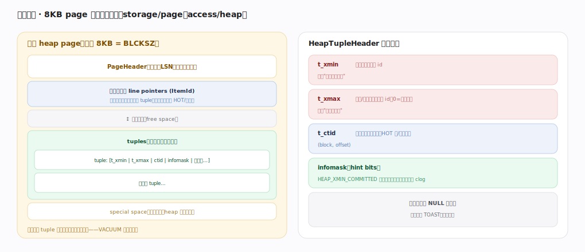
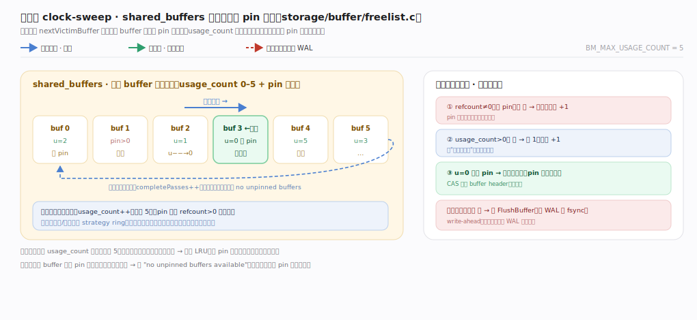

# PostgreSQL 核心原理 · 支撑能力域 · 存储引擎

> **定位**：底座能力域。自管**面向磁盘的行存**：8KB page 内多个 tuple（含 xmin/xmax），大值走 TOAST，配 FSM/VM 辅助图，经 shared_buffers 缓冲池读写。被 **DML**（写）、**DQL**（读）依赖，与**事务与 MVCC**（tuple 版本）深度耦合。核实基准：官方源码 `postgres/src`（commit 572c3b2）。

## 一、页与元组：8KB page 的行存布局

一个 heap page（默认 8KB BLCKSZ）布局为 `PageHeaderData`（`storage/bufpage.h:184`）自上而下：**页头**（含 `pd_lsn` 记该页最后一次改动对应的 WAL 位置，用于 WAL 顺序保证）→ **行指针数组** ItemId（从头向下增长，指向 tuple 的间接层，支撑 HOT 与页内整理）→ 中间**空闲空间**（`pd_lower`/`pd_upper` 界定，`bufpage.h:146-147`）→ **tuples**（从页尾向上增长）→ special space（索引页用）。行指针与 tuple 相向增长、中间是空闲区，VACUUM/prune 整理时压缩、行指针可复用。

`HeapTupleHeaderData`（`access/htup_details.h:153`）关键字段：**t_xmin**（插入事务 id）、**t_xmax**（删除/更新事务 id，0=有效）、**t_ctid**（指向本行最新版本，HOT/更新链）、**t_infomask**（hint bits 缓存事务提交状态省查 clog，如 `HEAP_XMIN_COMMITTED=0x0100`（`:204`）、`HEAP_HOT_UPDATED=0x4000`（`:295`）、`HEAP_ONLY_TUPLE=0x8000`（`:296`）标记 HOT 链上的堆专属 tuple）、列数据（含 NULL 位图）。这套头部就是 MVCC 与 HOT 的物理基础。

页的读写都经**缓冲池**：`ReadBuffer`（`storage/buffer/bufmgr.c:879`）→ 命中直接返回、未命中经 `BufferAlloc:2197` 找槽（`StrategyGetBuffer`，`storage/buffer/freelist.c:184`，用 **clock-sweep** `ClockSweepTick:110` 时钟扫描挑低 usage_count 的受害页）→ 若受害页脏则 `FlushBuffer:4526`（先确保其 WAL 已落盘）→ 装入新页；`BufferSync:3575` 由 checkpoint 批量刷脏。

---

## 二、TOAST 与辅助图

**TOAST（The Oversized-Attribute Storage Technique）**：一个 tuple 必须放进一页，当行超过 `TOAST_TUPLE_THRESHOLD`（`access/heaptoast.h:48`，约 2KB=8KB/4）时，`heap_toast_insert_or_update`（`access/heap/heaptoast.c:96`）对可 TOAST 的大字段（text/bytea/jsonb…）先**压缩**、仍超阈值就**切片**（每片按 `EXTERN_TUPLES_PER_PAGE=4`（`heaptoast.h:80`）存进该表专属的 TOAST 附表），主表只留一个指针；读取时 `heap_fetch_toast_slice`（`heaptoast.c:626`）按需取回。四种策略 PLAIN/MAIN/EXTERNAL/EXTENDED 控制压缩与外置。这让"大字段不撑爆主表页、且不影响窄行扫描密度"。

**两张辅助图**：**FSM（Free Space Map）** 记每页剩余空闲，`GetPageWithFreeSpace`（`storage/freespace/freespace.c:137`）帮 INSERT/UPDATE 快速找有空位的页（避免每次追加到末页导致膨胀），VACUUM 经 `RecordPageWithFreeSpace:194` 回填；**VM（Visibility Map）** 每页两 bit（all-visible/all-frozen），`visibilitymap_get_status`（`access/heap/visibilitymap.c:319`）让 **Index-Only Scan** 判断整页全可见即免回表、让 VACUUM 跳过全冻结页，`visibilitymap_set:255` 由 VACUUM 置位、`visibilitymap_clear:151` 在页被改动时清位。二者是性能杠杆。

---

## 深化 · 缓冲池：clock-sweep 淘汰与 pin

页读写都经 `shared_buffers` 缓冲池：一圈 buffer 槽，每槽带 `usage_count`（0–5，`BM_MAX_USAGE_COUNT=5`）与 pin 计数。`StrategyGetBuffer`（`storage/buffer/freelist.c:184`）用**时钟指针**轮转扫描——被 pin 的（refcount≠0）跳过、`usage_count>0` 的减 1 给二次机会、归零且未 pin 的即选为牺牲者（`ClockSweepTick:104` 推进指针）。命中已在池中的页则 `usage_count++`（封顶 5）→ 热页近似 LRU 存活。**不变式**：脏牺牲页驱逐前其 WAL 必先落盘（write-ahead）；大顺序扫描/批量写走 strategy ring 复用固定几个槽、不冲刷整池。**边界**：全部 buffer 都被 pin 时扫满一圈仍无空位 → 报 `no unpinned buffers available`。

---

## 深化 · 失败路径与边界

- **页满与更新退化**：INSERT 时 FSM 找不到足够空闲页则扩展新页；UPDATE 新版本放不下当前页则跨页存放、HOT 落空、所有索引都要加项（写放大）——低 `fillfactor` 预留页内空间可缓解。
- **缓冲池抖动**：大顺序扫描会用 `BufferAccessStrategy` 环形缓冲（ring buffer）限制占用，避免一次大扫描把整个 shared_buffers 冲刷掉（否则热数据被挤出、后续查询全 miss）。
- **TOAST 读放大**：频繁读被切片外置的大字段要多次访问 TOAST 附表；把不常用大字段与热字段分表，或用 EXTERNAL（不压缩、便于随机切片读）视访问模式而定。
- **校验和与坏页**：开 `data_checksums` 后读到 checksum 不符的页会报错拒绝返回脏数据（防静默损坏），代价是写时算校验和。

---

## 拓展 · 存储关键量与组件

| 项 | 值/职责 | 锚点 |
|---|---|---|
| BLCKSZ | 默认 8KB 页 | 编译期常量 |
| PageHeaderData | 页头 + pd_lsn/pd_lower/pd_upper | `storage/bufpage.h:184` |
| HeapTupleHeaderData | t_xmin/t_xmax/t_ctid/infomask | `access/htup_details.h:153` |
| shared_buffers | 缓冲池（clock-sweep 替换） | `storage/buffer/bufmgr.c:879` |
| TOAST | 大字段压缩/切片外置（>~2KB） | `access/heap/heaptoast.c:96` |
| FSM | 空闲空间图，找有空位的页 | `storage/freespace/freespace.c:137` |
| VM | 可见性图，支撑 IndexOnly/VACUUM 跳页 | `access/heap/visibilitymap.c:319` |

---

## 调优要点（关键开关）

- `shared_buffers`：缓冲池大小（常设物理内存 25%）；`effective_cache_size` 告知优化器 OS+DB 总缓存。
- `fillfactor`：写多的表调低于 100 提高 HOT 命中、减少跨页更新。
- `TOAST` 策略与大字段拆分：按访问模式选 EXTENDED/EXTERNAL/MAIN。
- `data_checksums`：生产建议开，早发现静默坏页。
- 大扫描后关注缓冲池命中率（ring buffer 已防冲刷，但冷查询仍会 miss）。

---

## 常见误区与工程要点

- **以为行就地更新**：UPDATE 造新版本、旧版本留页内（MVCC），空间靠 VACUUM。
- **大字段随便塞**：超阈值走 TOAST（压缩/切片），频繁读会有读放大，热字段宜分表。
- **忽视 FSM/VM**：FSM 找空位防膨胀、VM 支撑 IndexOnly 与 VACUUM 跳页，缺则退化。
- **shared_buffers 越大越好**：过大挤占 OS page cache，与之双缓存反而浪费。
- **大扫描冲刷缓冲池**：其实有 ring buffer 策略防护，但冷查询仍会 miss。

---

## 一句话总纲

**PostgreSQL 存储是面向磁盘的行存：8KB heap page（`PageHeaderData` 头 + 相向增长的行指针与 tuple + `pd_lsn`）里放多个 `HeapTupleHeaderData`（t_xmin/t_xmax/t_ctid/infomask，即 MVCC 与 HOT 的物理基础），页读写经 shared_buffers 缓冲池（`ReadBuffer`，clock-sweep 时钟扫描替换、脏页刷前先落 WAL）；超 ~2KB 的大字段由 `heap_toast_insert_or_update` 压缩/切片外置到 TOAST 附表，FSM 帮写找空闲页防膨胀、VM 支撑 Index-Only Scan 免回表与 VACUUM 跳过全冻结页——写不就地覆盖、死元组靠 VACUUM 回收是贯穿全篇的主线。**
