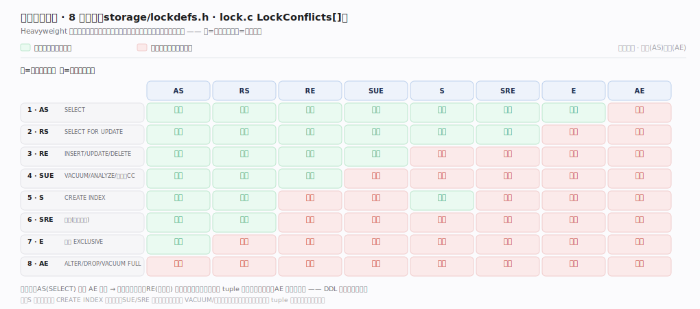

# PostgreSQL 核心原理 · 支撑能力域 · 并发控制与锁

> **定位**：保障能力域。MVCC 让读不加锁，但写写冲突、DDL、显式锁仍需锁——从重到轻三级（heavyweight / LWLock / spinlock），配死锁检测。被 **DML/DDL** 与**事务与 MVCC** 依赖。核实基准：官方源码 `postgres/src`（commit 572c3b2，`storage/lmgr/`）。

## 一、锁的层次：从重到轻三级

**① Heavyweight Lock**（表/行/对象级）：保护逻辑对象、事务期持有、进共享内存锁表、支持多种模式与死锁检测。入口 `LockAcquire`（`storage/lmgr/lock.c:806`）→ `LockAcquireExtended:833`，释放 `LockRelease:2110`。表锁 **8 种模式**（`storage/lockdefs.h`：`AccessShareLock=1`（SELECT，`:36`）… `RowExclusiveLock=3`（INSERT/UPDATE/DELETE，`:38`）… `AccessExclusiveLock=8`（ALTER/DROP/VACUUM FULL，`:45`）），相容矩阵决定并发：读读兼容、DDL 与写互斥；行锁（FOR UPDATE/写冲突）不占锁表而存在 tuple 头（t_xmax + infomask），仅冲突时才升级为等待。取不到锁就排队 `JoinWaitQueue`（`storage/lmgr/proc.c:1209`）并 `ProcSleep`（`storage/lmgr/proc.c:1378`）睡眠等待。锁表本身按 `NUM_LOCK_PARTITIONS` 分区（`storage/lock.h:353`）+ 每 backend 的 **fast-path** 弱锁本地计数（`FastPathLocalUseCounts`，`lock.c:179`）降低高频弱锁的共享锁表争用。

**② LWLock**（轻量读写锁，`storage/lmgr/lwlock.c`）：保护**共享内存结构**（缓冲池槽、WAL、ProcArray、SLRU）。`LWLockAcquire:1150`（共享/独占两模式）、`LWLockConditionalAcquire`（`storage/lmgr/lwlock.c:1321`，不等待试取）、`LWLockRelease`（`storage/lmgr/lwlock.c:1767`）；短临界区、**不进死锁检测**（约定加锁顺序避免死锁），高频低开销但争用会成扩展性瓶颈（如 WALInsertLock、ProcArrayLock）。**③ Spinlock**：保护极短原子操作，忙等不睡眠，LWLock 内部也用它。层次一句话：Heavyweight（对象/事务级、可等待、可死锁）→ LWLock（内存结构、短临界区、约定顺序无死锁）→ Spinlock（原子片段、忙等）。

---

## 二、死锁检测

PostgreSQL **不预防死锁而是检测**：一个事务等锁时先睡眠，若等待超过 `deadlock_timeout`（`DeadlockTimeout=1000` ms，`storage/lmgr/proc.c:62`）仍未拿到，被 `CheckDeadLock`（`proc.c:1887`）唤起做一次检测——`DeadLockCheck`（`storage/lmgr/deadlock.c:220`）用 `FindLockCycle`（`:446`）在"谁等谁"的等待图里找环。找到环就选一个牺牲者（通常触发检测的这个事务）报 `ERROR: deadlock detected` 强制回滚打破环，其余继续；应用需捕获并重试。之所以延时才查、而非每次等锁都查，是因为绝大多数等待会在超时前自然解除，避免频繁建图的开销。

Serializable 隔离另有一套：SSI 在 `storage/lmgr/predicate.c` 跟踪读写依赖（谓词锁），`CheckForSerializableConflictOut:3952` 与 `OnConflict_CheckForSerializationFailure:4465` 检测危险的读写依赖环，命中即序列化失败——这是"逻辑上的死锁"（数据依赖冲突），与物理锁死锁并行存在。

---

## 深化 · 表锁相容矩阵

Heavyweight 表锁有 8 种模式（`storage/lockdefs.h`），两个请求能否并发同持一表由 `LockConflicts[]`（`storage/lmgr/lock.c`）这张对称矩阵定：绿=兼容并发、红=互斥排队。**读要点**：`AccessShareLock`（SELECT）只与 `AccessExclusiveLock` 冲突 → 读几乎不挡人；`RowExclusiveLock`（增删改）彼此兼容（行级冲突交给 tuple 头 `t_xmax`，不占表锁）；`AccessExclusiveLock`（ALTER/DROP/VACUUM FULL）与一切冲突——DDL 一来全表让路。`Share` 自兼容（多个 `CREATE INDEX` 并存）、`ShareUpdateExclusive`/`ShareRowExclusive` 自冲突（同表仅一个 VACUUM/该模式）。这解释了为何一条被长事务挡住的 ALTER 会连带阻塞其后所有 SELECT。

---

## 深化 · 失败路径与边界

| 场景 | 机理 | 后果 / 应对 |
|---|---|---|
| 死锁经典成因 | 两事务以相反顺序更新同一批行 | 约定统一加锁/更新顺序、缩短事务、必要时显式 `SELECT ... FOR UPDATE` 一次性取全 |
| 锁等待雪崩 | 取 `AccessExclusiveLock` 的 ALTER 被长事务挡住、排队时又挡住其后所有新查询 | 瞬间连接耗尽；上线 DDL 务必设 `lock_timeout` |
| LWLock 争用瓶颈 | 高并发写下 WALInsertLock/ProcArrayLock 等热点 LWLock 争用 | CPU 空转在自旋/等待；从减少写热点、分区表、连接池缓解，非应用能直接调 |
| 锁表内存耗尽 | `max_locks_per_transaction` ×(max_connections+prepared) 定共享锁表容量 | 一事务锁定海量对象（DROP 大量分区）可能 `out of shared memory` |
| 咨询锁泄漏 | `pg_advisory_lock` 忘记 unlock 或误用 session 级会话锁 | 长期占用需手动清理 |
| 等待可视化 | `pg_stat_activity.wait_event` 标出等哪类锁（Lock/LWLock/BufferPin） | `pg_locks`+`pg_blocking_pids()` 还原"谁挡了谁"阻塞链——排查卡顿第一现场 |

---

## 拓展 · 锁相关组件

| 层 | 保护对象 | 死锁检测 | 锚点 |
|---|---|---|---|
| Heavyweight Lock | 表/行/对象（8 种模式） | 有（超时后建图找环） | `storage/lmgr/lock.c:806` |
| LWLock | 共享内存结构（缓冲/WAL/ProcArray） | 无（约定加锁顺序） | `storage/lmgr/lwlock.c:1150` |
| Spinlock | 极短原子操作 | 无（忙等） | `storage/lmgr/s_lock.c` |
| 死锁检测 | 等待图找环 | deadlock_timeout=1s 触发 | `storage/lmgr/deadlock.c:220` |
| SSI 谓词锁 | 读写依赖环 | 序列化失败 | `storage/lmgr/predicate.c:3952` |

---

## 调优要点（关键开关）

- 上线 DDL/批量写设 `lock_timeout`，防重锁排队引发查询雪崩。
- 统一多事务的加锁/更新顺序、缩短事务，从根上减少死锁。
- `deadlock_timeout` 一般不必调（1s 默认合适）；死锁频发应改应用逻辑。
- 监控 `pg_locks` 与等待事件（`pg_stat_activity.wait_event`）定位热点 LWLock/阻塞链。
- 大量对象操作前评估 `max_locks_per_transaction`，防锁表耗尽。

---

## 常见误区与工程要点

- **MVCC 下不用管锁**：读不加锁，但写写冲突、DDL、显式 FOR UPDATE 仍会阻塞/死锁。
- **PostgreSQL 预防死锁**：它是超时后检测并回滚牺牲者，应用需捕获重试。
- **表锁只有读写两种**：实为 8 种模式 + 相容矩阵，DDL 取重锁影响面大。
- **LWLock 会死锁**：它靠约定加锁顺序避免，不进死锁检测；但会成争用瓶颈。
- **咨询锁会自动释放**：session 级咨询锁需显式 unlock，泄漏要手动清。

---

## 一句话总纲

**并发控制在 MVCC（读不加锁）之上用三级锁：Heavyweight Lock（`LockAcquire`，表/行/对象、8 种模式相容矩阵、事务期持有、可死锁、fast-path+分区降争用）保护逻辑对象、LWLock（`LWLockAcquire`，共享/独占、约定顺序无死锁）保护共享内存结构、Spinlock 保护原子片段；死锁不预防而检测——等锁超过 deadlock_timeout(1s) 后 `DeadLockCheck`/`FindLockCycle` 在等待图找环、选牺牲者回滚，Serializable 另有 SSI 谓词锁检测读写依赖环报序列化失败；生产要点是统一加锁顺序防死锁、DDL 设 lock_timeout 防重锁雪崩、监控 pg_locks 与热点 LWLock 争用。**
