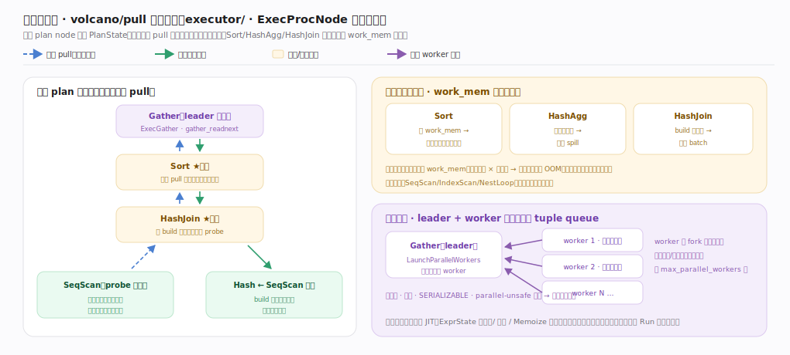

# PostgreSQL 核心原理 · 支撑能力域 · 执行引擎

> **定位**：计算能力域的执行侧。把优化器产的 plan tree 变成运行态 tree，用 volcano/pull 逐行拉取执行，并支持并行查询。是 **DQL/DML** 的执行底盘。与 DQL 主线分工：DQL 讲查询全链路，本篇讲执行器内部结构与并行。核实基准：官方源码 `postgres/src`（commit 572c3b2）。

## 一、执行器结构与并行查询

执行器三段（`executor/execMain.c`）：**Start**（`ExecutorStart:124`→`standard_ExecutorStart:143`，内 `InitPlan:847` 把 plan tree 递归建成 exec tree、建 `EState`（本次执行全局态）、`TupleTableSlot`（行在算子间传递的载体）、开表/索引）→ **Run**（`ExecutorRun:308`→`standard_ExecutorRun:318`，驱动 volcano 逐行拉取直到取尽或够 LIMIT）→ **End**（`ExecutorEnd:477`，关表/索引、释放 EState）。上层由 Portal（`tcop/pquery.c` `PortalStart:430`/`PortalRun:681`）统管。

**火山模型的运行态**：每个 plan node（不可变、可缓存）对应一个 `PlanState`（可变运行态，与 plan 分离）。建树 `ExecInitNode`（`executor/execProcnode.c:142`）为每种 node 装好 `Init/Proc/End` 回调；取行经 `ExecProcNodeFirst:448`（首次分派后替换成具体 ExecProc）向下 pull、逐行上返；`ExecEndNode:543` 收尾。表达式求值走 `ExprState`（可 JIT 编译成机器码消除解释开销）。写路径 `ExecModifyTable`（`executor/nodeModifyTable.c:4625`）同属执行器。

**并行查询**：`ExecGather`（`executor/nodeGather.c:138`，`ExecInitGather:54` 启动）作为 leader——postmaster fork 若干 parallel worker（各是独立进程）各扫一部分块，经共享内存 **tuple queue** 把结果传回，leader 用 `gather_readnext:312` 轮询汇聚（GatherMerge 保序归并）。受 `max_parallel_workers_per_gather` 控制，把 CPU 密集的扫描/Join/聚合分摊到多核，缓解 volcano 逐行的单核瓶颈。

---

## 深化 · 典型算子与并行落地

图已给出 pull 语义、三个落盘点与并行汇聚，此处只留锚点与边界。火山接口下每类算子是一个 ExecProc 实现：**SeqScan**（`nodeSeqscan.c:119`，流式、按快照过滤）、**Sort**（`nodeSort.c:50`）、**Agg**（`nodeAgg.c:2247`，HashAgg/GroupAgg）、**HashJoin**（`nodeHashjoin.c:802`，先 build 小表哈希再 probe）、**BitmapHeapScan**（`nodeBitmapHeapscan.c:174`）。其中 Sort/HashAgg/HashJoin 会物化，超 `work_mem` 落临时文件、是内存主要消费者（每节点各占一份，复杂计划 × 高并发易 OOM）。并行由 leader 侧 `LaunchParallelWorkers`（`access/transam/parallel.c:583`）fork 出 worker 进程、`ExecParallelCreateReaders`（`executor/execParallel.c:944`）建共享内存 tuple queue，worker 各扫不同块回传 Gather 汇聚；因 worker 是独立进程，计划片段经序列化传递，故写操作/游标/SERIALIZABLE/parallel-unsafe 函数会退回串行。

---

## 深化 · 失败路径与边界

- **work_mem 落盘退化**：Sort/HashAgg/HashJoin 的内存超 `work_mem` 时切到外部归并/批量落盘（临时文件），性能骤降；每个此类算子节点各占一份 work_mem，复杂计划 × 高并发易 OOM。
- **并行的启动与限制**：并行 worker 是 fork 出的进程，有启动成本；小查询不值得并行。写操作、游标、`SERIALIZABLE`、含 parallel-unsafe 函数的查询会**退回串行**。worker 数还受 `max_parallel_workers`/`max_worker_processes` 全局池限制，池耗尽时优化器估的并行度拿不满。
- **执行期错误**：唯一约束冲突、除零、类型转换失败等只在 Run 阶段暴露、触发事务回滚；`EXPLAIN`（不带 ANALYZE）只走到计划不执行，看不到这些。
- **游标即长快照**：Portal 持有的游标沿用其快照，长时间不关等价长事务、压住死元组回收。

---

## 拓展 · 执行器组件

| 组件 | 职责 | 锚点 |
|---|---|---|
| ExecutorStart/Run/End | 执行三段 | `executor/execMain.c:124/308/477` |
| InitPlan | plan→exec tree、建 EState | `executor/execMain.c:847` |
| ExecInitNode/ExecProcNode/ExecEndNode | 算子 Init/Proc/End 回调 | `executor/execProcnode.c:142/448/543` |
| PlanState / EState / TupleTableSlot | 运行态/全局态/行载体 | `executor/` |
| ExprState（可 JIT） | 表达式求值 | `jit/` |
| ExecModifyTable | 写算子 | `executor/nodeModifyTable.c:4625` |
| ExecGather / gather_readnext | 并行 leader 汇聚 | `executor/nodeGather.c:138/312` |

---

## 调优要点（关键开关）

- `work_mem`：排序/Hash 内存上限，不够则落盘；注意乘算子数与并发。
- `max_parallel_workers_per_gather` / `max_parallel_workers`：开并行、控并行度。
- JIT（`jit`/`jit_above_cost`）：大查询表达式编译提速，小查询关掉省编译开销。
- `EXPLAIN (ANALYZE, BUFFERS)`：看每算子真实行数/耗时/落盘与缓冲命中。
- 大聚合/排序观察是否落盘（Sort Method: external merge），酌情提 work_mem。

---

## 常见误区与工程要点

- **把 volcano 当向量化**：逐行迭代，纯分析大扫描不如列存向量化引擎。
- **并行一定更快**：小查询并行的启动/协调成本可能超过收益；写/游标/不安全函数会退串行。
- **work_mem 越大越好**：每算子各占一份，并发下可能爆内存。
- **JIT 永远赚**：小查询编译开销可能大于收益，按 `jit_above_cost` 阈值控。
- **EXPLAIN 能看执行期错误**：不带 ANALYZE 只到计划，执行期错误看不到。

---

## 一句话总纲

**执行引擎把 plan tree 经 `ExecutorStart`(`InitPlan` 建 exec tree/EState/TupleTableSlot)→`ExecutorRun`→`ExecutorEnd` 三段执行，内部是火山/pull 模型：每 plan node 对应 `PlanState`、经 `ExecInitNode`/`ExecProcNode`/`ExecEndNode` 逐行拉取、表达式用 ExprState（可 JIT）求值；并行查询由 `ExecGather` leader 汇聚 fork 出的 parallel worker 经共享内存 tuple queue 传回的结果分摊多核——逐行开销靠 JIT/并行/Memoize 缓解，work_mem 不足会落盘退化、写/游标/不安全函数会退回串行、执行期错误只在 Run 阶段暴露。**
