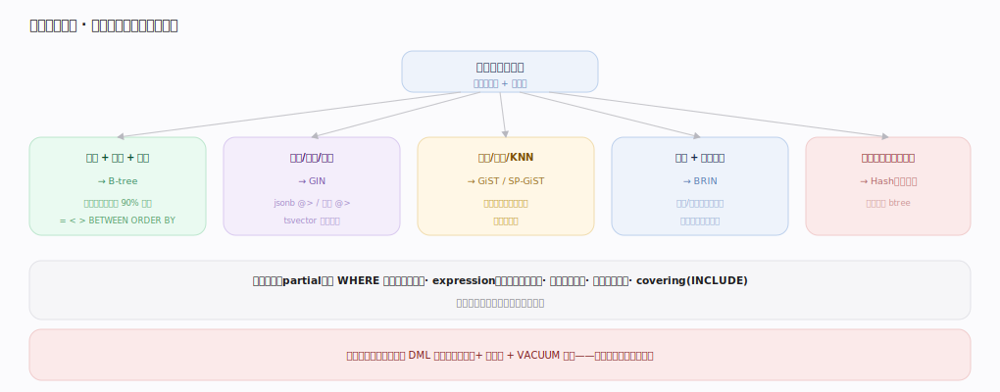
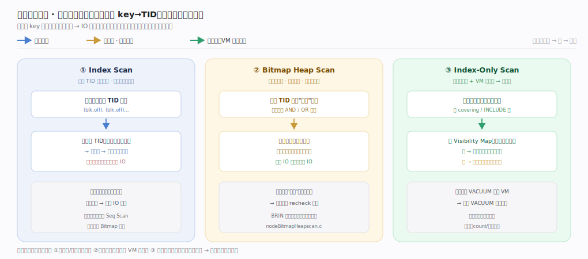

# PostgreSQL 核心原理 · 支撑能力域 · 索引方法

> **定位**：底座能力域。统一的 index access method（AM）抽象下提供六种索引，服务不同查询形态。被**查询优化器**（选扫描）、**DQL**（索引扫描）、**DML**（维护）依赖。核实基准：官方源码 `postgres/src`（commit 572c3b2）。

## 一、访问方法抽象与六种索引

所有索引实现同一组 **Index Access Method** 回调（登记在 `pg_am`，函数集 `IndexAmRoutine`：aminsert/ambeginscan/amgettuple/amvacuumcleanup…），执行器与优化器只对**接口**编程，索引类型可插拔（含扩展索引）——这与「table AM」对称，是可扩展性的体现。通用入口在 `access/index/indexam.c`：`index_insert:214`（DML 维护）、`index_beginscan:257`（开扫描）、`index_getnext_tid:599`（取下一条 TID）、`index_getnext_slot:698`（取行）；它们再分派到各 AM 的实现。

六种：**B-tree**（默认，有序键支撑等值+范围+排序+唯一约束；插入 `btinsert`（`access/nbtree/nbtree.c:206`）→ `_bt_doinsert`（`nbtinsert.c:105`），查找 `_bt_search`（`nbtsearch.c:100`）自根向叶二分、`_bt_first`（`nbtsearch.c:883`）定位扫描起点、`btgettuple`（`nbtree.c:230`）沿叶链取行）、**GIN**（倒排，一值→多 key，jsonb/数组/全文，"包含"查询利器，`access/gin`）、**GiST/SP-GiST**（通用平衡/空间划分树，几何/范围/KNN，PostGIS 靠它，`access/gist`、`access/spgist`）、**BRIN**（块范围索引，每段存 min/max，超大且物理有序的时序表，极小体积粗裁剪，`access/brin`）、**Hash**（仅等值，场景窄多数用 btree，`access/hash`）。共性：索引项存 (key → 堆表 TID)，扫描先在索引定位 TID、再按需回堆表取行（Index-Only Scan 借 VM 免回表）。

---

## 二、索引选型决策

选型看查询形态：等值+范围+排序+唯一→**B-tree**（90% 场景）、包含/全文/jsonb/数组→**GIN**、几何/范围/最近邻→**GiST**、超大物理有序时序（只需粗裁剪、要极小索引）→**BRIN**、纯等值且极致小→**Hash**。进阶：**部分索引**（`WHERE` 谓词，只索引热子集，省空间）、**表达式索引**（索引 `lower(x)` 等函数结果）、**多列索引**（复合 key，最左前缀原则）、**覆盖索引**（`INCLUDE` 附加列助力 Index-Only Scan）。

用不用索引由优化器按选择率与代价决定（见"查询优化器"）：命中占比越低越倾向索引、越高越倾向全表顺序读——建了索引不等于一定走。每个索引都要在 DML 时维护（非 HOT 更新要更新所有索引），故索引是"查询加速 vs 写入放大 + 空间"的权衡。

---

## 深化 · 从索引到堆表：三种回表形态

图已给出三形态的 IO 结构，此处只留不变式与锚点。代价随选择率排序：低选择率 **Index Scan** 逐 TID 随机回堆最划算；中等或多索引 AND/OR 组合走 **Bitmap Heap Scan**（`BitmapHeapNext`，`executor/nodeBitmapHeapscan.c:174`），攒"按页"位图把随机 IO 摊成顺序 IO（BRIN `bringetbitmap`（`access/brin/brin.c:572`）只能产位图、天然走此路；位图有损时回页需 recheck）；查询列被索引覆盖且 VM 确认整页全可见则 **Index-Only Scan** 免回表最快。写侧每个索引都要维护（`gininsert`（`access/gin/gininsert.c:865`）、`gistinsert`（`access/gist/gist.c:166`）、`brininsert`（`access/brin/brin.c:349`）、`hashinsert`（`access/hash/hash.c:271`）），这正是"索引越多写越慢"的根源。

---

## 深化 · 失败路径与边界

| 场景 | 机理 | 后果 / 应对 |
|---|---|---|
| 索引不被使用 | 选择率过高/统计陈旧/类型排序规则不匹配（`LIKE 'abc%'` 需 `text_pattern_ops`）/函数未用表达式索引 | 优化器弃用索引走 Seq Scan；`EXPLAIN` 是排查第一手段 |
| 写放大与膨胀 | 每个索引在非 HOT 更新时都要加新项 | 索引越多 UPDATE 越慢；B-tree 页分裂膨胀需 `REINDEX CONCURRENTLY` 重建 |
| CREATE INDEX 阻塞写 | 普通 `CREATE INDEX` 取 ShareLock 阻塞该表写 | 生产用 `CREATE INDEX CONCURRENTLY`（不阻塞写、非事务、中途失败留 INVALID 索引需 DROP） |
| 唯一约束冲突 | 唯一索引插入重复键时于 `_bt_doinsert` 报错 | 整语句回滚，执行期错误 |
| GIN 更新慢 | GIN 一行拆成很多 key、写入重 | 用 `fastupdate`+`gin_pending_list_limit` 攒批延迟合并缓解 |

---

## 拓展 · 索引能力速览

| 索引 | 适用查询 | 特点 | 锚点 |
|---|---|---|---|
| B-tree | 等值/范围/排序/唯一 | 默认，最通用 | `access/nbtree/nbtree.c:206` |
| GIN | 包含/全文/jsonb/数组 | 倒排，一值多 key，写较重 | `access/gin/gininsert.c:865` |
| GiST | 几何/范围/KNN | 通用平衡树，可扩展 | `access/gist/gist.c:166` |
| SP-GiST | 空间划分/前缀 | 非平衡分区树 | `access/spgist` |
| BRIN | 超大物理有序时序 | 段存 min/max，极小 | `access/brin/brin.c:349` |
| Hash | 纯等值 | 场景窄 | `access/hash/hash.c:271` |

---

## 调优要点（关键开关）

- 优先 B-tree 覆盖等值/范围/排序/唯一；特殊形态才选 GIN/GiST/BRIN。
- 部分索引（WHERE 热子集）与覆盖索引（INCLUDE）省空间、助 Index-Only Scan。
- 生产建索引用 `CREATE INDEX CONCURRENTLY` 不阻塞写。
- 精简冗余索引：索引越多，非 HOT 更新越慢、空间越大。
- 膨胀后 `REINDEX CONCURRENTLY` 重建；GIN 写重表调 fastupdate 参数。

---

## 常见误区与工程要点

- **建了索引就一定走**：选择率高时全表更省；优化器按代价选，用 EXPLAIN 验证。
- **索引不要钱**：每个索引占空间、拖慢非 HOT 更新（写放大）。
- **B-tree 万能**：包含/全文/几何/时序各有更优选型（GIN/GiST/BRIN）。
- **LIKE 前缀能走普通 btree**：需 `text_pattern_ops` 操作符类或 pg_trgm。
- **CREATE INDEX 无害**：普通建索引阻塞写，生产用 CONCURRENTLY。

---

## 一句话总纲

**PostgreSQL 索引统一在 Index Access Method 抽象（`pg_am`/`IndexAmRoutine`，通用入口 `index_insert`/`index_beginscan`/`index_getnext_tid`）下提供 B-tree（默认，`_bt_search`/`_bt_first` 二分定位）、GIN（倒排）、GiST/SP-GiST（通用/空间树）、BRIN（块范围粗裁剪）、Hash（等值）六型，索引项存 key→堆表 TID、扫描先定位再回表（借 VM 可 Index-Only 免回表）；选型看查询形态、用不用由优化器按选择率与代价定，配合部分/表达式/多列/覆盖索引——代价是每个索引都要在 DML 维护（写放大、膨胀），生产建索引用 CONCURRENTLY、膨胀后 REINDEX。**
