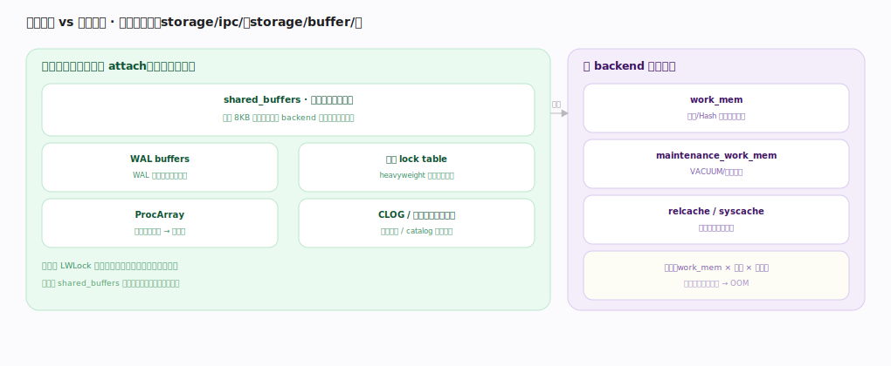

# PostgreSQL 核心原理 · 支撑能力域 · 进程与内存架构

> **定位**：底座、灵魂能力域之一。postmaster 每连接 fork 一个 backend + 一批辅助进程，进程间经共享内存协作——这是 PostgreSQL 并发的根基，被所有能力域依赖。核实基准：官方源码 `postgres/src`（commit 572c3b2）。

## 一、进程模型：postmaster 派生一切

`postmaster`（`postmaster/postmaster.c`，主入口 `PostmasterMain:497`）先建共享内存与信号量，再进 `ServerLoop:1678` 监听端口。每来一个连接就 `BackendStartup`（`:3576`）fork 一个 **backend** 子进程处理该连接（私有内存 work_mem，跑查询流水线）——postmaster 自己**不处理任何 SQL**，只做派生与监管。

启动早期它还 `StartChildProcess`（声明 `:455`；如 `StartChildProcess(B_CHECKPOINTER)` 在 `:1401`）拉起一批**辅助进程**：`CheckpointerMain`（`postmaster/checkpointer.c:206`，刷脏页定检查点）、`BackgroundWriterMain`（`bgwriter.c:89`，后台匀速刷脏页）、`WalWriterMain`（`walwriter.c:89`，刷 WAL）、`AutoVacLauncherMain`（`autovacuum.c:411`，派 worker 回收死元组）、startup（回放 WAL）、walsender/walreceiver（流复制）、archiver。

监管闭环：子进程崩溃时 SIGCHLD → `process_pm_child_exit`（`:2261`）收尸，`PostmasterStateMachine`（`:2911`）决定重启还是整体退出——若某 backend **崩溃**，postmaster 会重置共享内存（因崩溃可能损坏它）并踢掉所有连接自保；immediate shutdown/子进程卡死时按 `SIGKILL_CHILDREN_AFTER_SECS=5`（`:370`）超时后强杀。取舍：进程级隔离稳定（正常退出只影响单连接）、但 fork + 私有内存初始化不便宜——高并发用连接池 PgBouncer 复用少量物理连接。对照 nginx 固定 worker 事件循环，PostgreSQL 是每连接一进程，连接模型截然不同。

---

## 二、共享内存 vs 私有内存

启动时 `CreateSharedMemoryAndSemaphores`（`storage/ipc/ipci.c:120`）一次性划出**共享内存段**，所有进程 attach 到同一块：**shared_buffers**（缓冲池，缓存数据页，最大结构）、**WAL buffers**（未刷盘的 WAL 记录）、**锁表**（heavyweight lock 的 LOCK/PROCLOCK 哈希）、**ProcArray**（所有活跃事务的 PGPROC，取快照的来源）、CLOG/子事务等 SLRU 缓存。每个 backend 启动时 `InitProcess`（`storage/lmgr/proc.c:393`）把自己的 PGPROC 挂进 ProcArray、登记到共享结构。

**私有内存**：每个 backend 独立地址空间——work_mem（排序/Hash 的临时内存，每个算子节点各占一份）、maintenance_work_mem（VACUUM/建索引）、temp_buffers（临时表）、catalog 缓存（syscache/relcache，见 DDL）。协作只能经共享内存（进程间不共享私有内存），共享结构的并发访问由 **LWLock** 保护（如缓冲映射表用 `NUM_BUFFER_PARTITIONS=128`（`storage/lwlock.h:83`）个分区锁降争用）。这就是"每连接一进程、经共享内存协作"的物理落地。

---

## 深化 · 失败路径与边界

| 场景 | 机理 | 后果 / 应对 |
|---|---|---|
| backend 崩溃连带停摆 | 一个 backend 段错误 → postmaster 判定共享内存可能污染 | 重启所有 backend、重置共享内存（短暂全库中断）；进程隔离的边界 |
| 连接数与内存膨胀 | 每连接一进程，ProcArray/锁表按 `max_connections` 预分配 | 设太高耗尽内存与信号量；高并发正解是连接池而非调高该值 |
| shared_buffers 双缓存 | 依赖 OS page cache 做二级缓存 | 常设物理内存 25% 左右；太大挤占 OS cache 导致双份缓存浪费 |
| 僵尸与孤儿进程 | postmaster 崩溃时子 backend 继续运行 | 靠 `postmaster.pid` 与 shmem header 防止两个实例误挂同一段 |

---

## 拓展 · 进程与内存组件

| 组件 | 类型 | 职责 | 锚点 |
|---|---|---|---|
| postmaster | 主进程 | 监听、fork、监管重启 | `postmaster/postmaster.c:497` |
| backend | 每连接一进程 | 跑查询流水线（私有内存） | `postmaster.c:3576` |
| checkpointer | 辅助进程 | 定检查点刷脏页 | `postmaster/checkpointer.c:206` |
| bgwriter | 辅助进程 | 后台匀速刷脏页 | `postmaster/bgwriter.c:89` |
| autovacuum launcher | 辅助进程 | 派 VACUUM worker | `postmaster/autovacuum.c:411` |
| shared_buffers/ProcArray/锁表 | 共享内存 | 缓冲池/快照来源/锁 | `storage/ipc/ipci.c:120` |
| work_mem/relcache | 私有内存 | 排序 Hash/目录缓存 | 每 backend 私有 |

---

## 调优要点（关键开关）

- `shared_buffers`：缓冲池大小，常设物理内存 25%（余量留给 OS page cache）。
- `max_connections`：进程数上限；高并发用连接池（PgBouncer）而非一味调高。
- `work_mem`：每算子节点各占一份，注意乘并发；`maintenance_work_mem` 给 VACUUM/建索引。
- 关注辅助进程健康（checkpointer/bgwriter/autovacuum 是否落后）。
- `huge_pages` 可减少大 shared_buffers 的 TLB 开销。

---

## 常见误区与工程要点

- **以为 PostgreSQL 是多线程**：它是多进程（每连接一 backend），高并发靠连接池。
- **shared_buffers 越大越好**：过大挤占 OS page cache，25% 附近常最优。
- **无视连接数开销**：每连接一进程 + 私有内存，几千直连会耗尽内存/信号量。
- **backend 崩溃只影响自己**：异常崩溃会触发全库重置共享内存、踢掉所有连接。
- **辅助进程可有可无**：checkpointer/bgwriter/autovacuum 缺失会致膨胀与刷盘尖峰。

---

## 一句话总纲

**PostgreSQL 是进程级并发：postmaster（`PostmasterMain`/`ServerLoop`）监听端口、每连接 `BackendStartup` fork 一个私有内存 backend 跑查询、并 `StartChildProcess` 拉起 checkpointer/bgwriter/walwriter/autovacuum 等辅助进程，崩溃经 `process_pm_child_exit`+`PostmasterStateMachine` 收尸重启；进程间只能经 `CreateSharedMemoryAndSemaphores` 划出的共享内存（shared_buffers/WAL buffers/锁表/ProcArray）协作、由 LWLock 分区保护，backend 各自持有 work_mem/relcache 私有内存——隔离稳定但每连接开销大，高并发靠连接池、异常崩溃会触发全库共享内存重置。**
