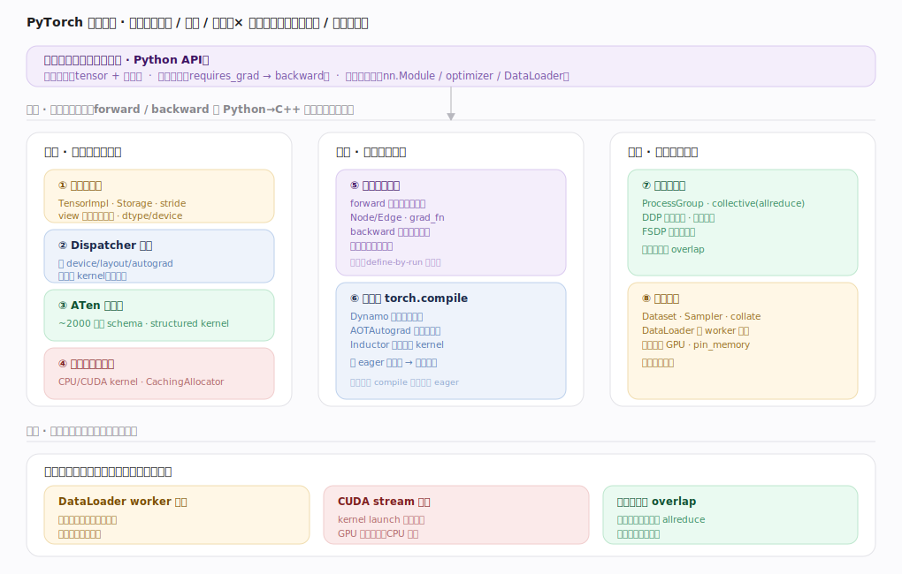
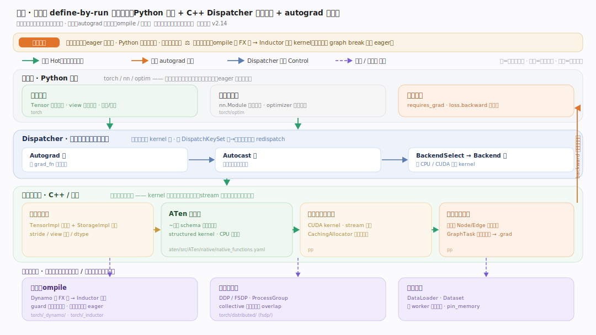
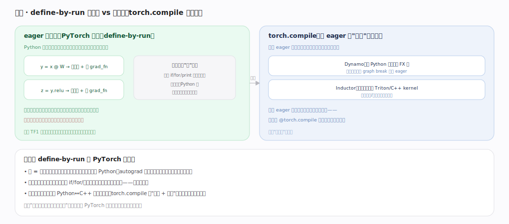
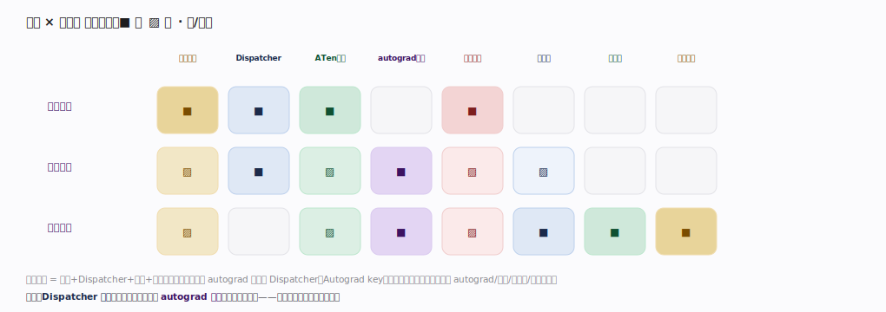

# PyTorch 核心原理 · 全景主线框架

> 统领全部原理文档：PyTorch 的 **3 条接口主线（张量编程 / 自动微分 / 建模与训练）+ 8 条支撑能力域**，既无遗漏也无越界。核实基准 = 官方源码 `pytorch/pytorch` **v2.13.0**（HEAD `cf30153`；下文所有 `文件:行号` 锚点均对此 tag 核对）。PyTorch 是**深度学习框架 —— 张量计算 + 自动微分库**，在方法论原型库里属**新家族**，走"接触面 × 能力域 × 执行时机"元模式判型。灵魂三条：**eager 动态图（define-by-run）**、**Dispatcher 分层分发**、**Autograd 反向引擎**。

## 〇、与数据库/引擎家族的心智对照（读前必看）

PyTorch 不是数据系统，先立几条认知：

| 维度 | 数据库/查询引擎 | PyTorch |
|---|---|---|
| 用户接触面 | SQL / 配置 | **Python 编程 API**（张量 + 算子 + autograd + nn） |
| 核心资源 | 表/行/列 | **张量（tensor）**：多维数组 + 可微性 |
| "执行计划" | 优化器生成静态计划 | **define-by-run**：边跑边建反向图，图是副产物 |
| 分发 | 按算子选物理实现 | **Dispatcher 按 device/autograd 分层选 kernel** |
| 加速 | 向量化/并行 | eager 逐算子 + **torch.compile（Dynamo+Inductor）**可选编译 |

一句话：**数据库以"数据 + 查询计划"为中心，PyTorch 以"张量 + 动态微分图"为中心。**

---

## 一、双维模型：能力域 × 执行时机

- **能力域**：接口（张量编程/自动微分/建模训练）面向用户 Python；支撑侧按表示/计算/扩展分 8 条——张量与存储、Dispatcher 分发、ATen 算子库、设备后端与内存（表示）；自动微分引擎、编译栈（计算）；分布式训练、数据加载（扩展）。
- **执行时机**：前台是 forward/backward 在 Python→C++ 调用栈内同步逐算子执行；后台异步是 DataLoader worker 进程预取、CUDA stream 异步执行（kernel launch 立即返回）、分布式通信与计算 overlap。后台是横切的执行时机维度。

---

## 二、总架构：一个算子调用穿过的分层栈

以贯穿示例 `y=model(x); loss.backward; opt.step` 看：① Python 前端（torch/nn/optim，经 pybind 下到 C++）→ ② **Dispatcher**（`Dispatcher.h:71`，按 `DispatchKeySet` 分层：Autograd key 记反向图节点再 redispatch → Autocast 等切面 → Backend key 选 CPU/CUDA kernel）→ ③ **ATen 算子库**（~2000 算子，`native_functions.yaml` 声明 schema，structured kernel 分离形状推导与计算）→ ④ **设备后端**（CPU 向量化/CUDA 调 cuBLAS/cuDNN，异步 stream）+ ⑤ 内存（CUDACachingAllocator 显存池化、Storage 引用计数、view 共享）。`backward` 沿前向建好的反向图逆序遍历（`engine.cpp:1294`）又走一遍 ②③④。

---

## 三、形态：define-by-run 动态图

**eager 动态图**（默认）：Python 每执行一个算子就立即算、顺手记一个反向图节点（grad_fn），图随代码"跑"出来、可用任意 if/for 控制流、好调试、用完即弃。对照静态图（先定义整图再喂数据，快但难调试）。**torch.compile** 在 eager 里就地编译加速：Dynamo 抓字节码成 FX 图（抓不了就 graph break 回退 eager）、Inductor 融合算子生成 Triton/C++ kernel——既保留 eager 灵活又拿图编译性能，加一行 `@torch.compile` 即可。这条"动态优先、编译加速可选"路线是 PyTorch 与静态图框架的根本分野。

---

## 四、接口 × 能力域 依赖矩阵

张量编程 = 存储 + Dispatcher + 算子 + 设备；自动微分强依赖 autograd 引擎与 Dispatcher（Autograd key）；建模训练调用面最广，连 autograd/编译/分布式/数据加载。灵魂两域是 **Dispatcher 分发**（所有算子必经）与 **autograd 引擎**（可微性根基）——几乎被所有接口依赖。

---

## 五、8 条支撑能力域的分层归位

| 层 | 支撑能力域 | 一句话职责 | 内核锚点 |
|---|---|---|---|
| 表示 | **张量与存储** | TensorImpl/Storage/stride/view/dtype/device | `c10/core/TensorImpl.h:510` |
| 表示 | **Dispatcher 分发** | 按 DispatchKey 分层选 kernel（灵魂） | `aten/src/ATen/core/dispatch/Dispatcher.h:71` |
| 表示 | **ATen 算子库** | ~2000 算子 schema、structured kernel | `aten/src/ATen/native/native_functions.yaml:536` |
| 表示 | **设备后端与内存** | CPU/CUDA kernel、CachingAllocator、stream | `c10/cuda/CUDACachingAllocator.cpp:1722`（malloc） |
| 计算 | **自动微分引擎** | 反向图 Node/Edge、backward 遍历 | `torch/csrc/autograd/engine.cpp:1294` |
| 计算 | **编译栈** | Dynamo→AOTAutograd→Inductor | `torch/_dynamo/convert_frame.py:1633`、`torch/_inductor/compile_fx.py:2685` |
| 扩展 | **分布式训练** | ProcessGroup、DDP、FSDP、collective | `torch/nn/parallel/distributed.py:466`、`c10d/reducer.cpp:895` |
| 扩展 | **数据加载** | DataLoader、Dataset、多 worker 预取 | `torch/utils/data/dataloader.py:149` |

---

## 六、三条贯穿全库的声明

1. **张量是带元信息的内存视图，算子皆经 Dispatcher。** Tensor = TensorImpl（sizes/strides/dtype/device + 可选 AutogradMeta）+ 共享的 Storage；任何算子调用都进 Dispatcher 按 DispatchKeySet 分层选 kernel——这是所有能力的总线。
2. **梯度来自动态反向图（define-by-run）。** 前向每个可微算子在 Autograd 层留下 grad_fn 节点连成图，`backward` 从 loss 反向拓扑遍历、链式累积梯度到叶子张量的 `.grad`——不需要预先声明计算图。
3. **eager 是默认，编译是可选加速。** 逐算子 eager 直观灵活；torch.compile（Dynamo 抓图 + Inductor 融合 codegen）在不改写法的前提下补上性能——动态优先、编译加速。

---

## 常见误区与工程要点

- **以为要先建静态图**：PyTorch 是 define-by-run，正常写 Python，反向图自动生成。
- **忽视 Dispatcher**：不理解分层分发就看不懂 autograd/autocast/设备为何"自动"生效。
- **CUDA 计时不同步**：kernel 异步执行，测时间要 `torch.cuda.synchronize`，否则测的是 launch 时间。
- **数据加载成瓶颈**：GPU 快但 DataLoader 慢会数据饥饿；调 num_workers/pin_memory/预取。

---

## 一句话总纲

**PyTorch 是 define-by-run 的张量计算 + 自动微分框架：用户用 Python 写张量算子（Tensor=TensorImpl+Storage），每次算子调用经 Dispatcher 按 DispatchKeySet 分层（Autograd 记反向图节点→Autocast→Backend 选 CPU/CUDA kernel）落到 ATen 算子与设备后端（CachingAllocator 管显存、stream 异步）；前向顺手建反向图、backward 沿图逆序链式累积梯度到 .grad、optimizer 更新参数；eager 默认灵活可调试，torch.compile（Dynamo+Inductor）可选编译加速，分布式训练与数据加载支撑规模化。**
