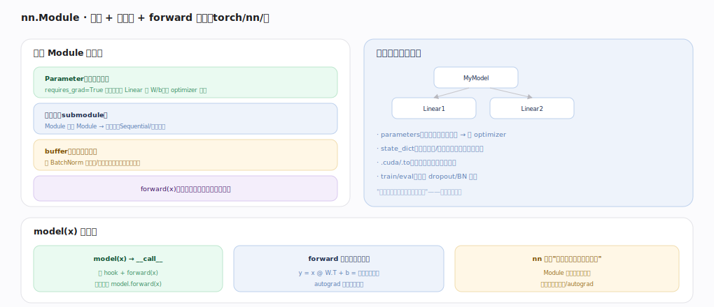
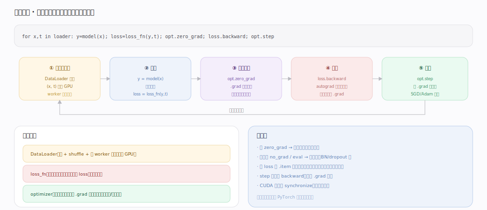

# PyTorch 核心原理 · 接口主线 · 建模与训练

> **定位**：最高层用户接触面——用 `nn.Module` 组织带权重的模型、用训练循环学习。它把张量编程 + 自动微分封装成"搭模型 + 训模型"的工作流，连接**自动微分引擎**、**数据加载**、**分布式训练**、**编译栈**多个能力域。核实基准：官方源码 `pytorch/pytorch` v2.13.0（`torch/nn/modules/module.py`、`torch/optim/`）。

## 一、nn.Module：参数 + 子模块 + forward 的树

一个 `Module`（`torch/nn/modules/module.py:407`）装：**Parameter**（可学权重，requires_grad 张量，经 `register_parameter`（`module.py:592`）登记进 `_parameters`）、**子模块**（Module 嵌 Module 组成树，存 `_modules`）、**buffer**（非学习状态如 BatchNorm 均值/方差，经 `register_buffer`（`module.py:528`）登记进 `_buffers`，随模型保存不更新）、**forward(x)**（用户重写的前向计算，默认 `_forward_unimplemented`，`module.py:526`）。

树结构带来"一次操作递归作用于整棵模型"的红利：`parameters`（`module.py:2665`，收集所有权重交 optimizer）、`state_dict`（`module.py:2194`，导出/加载权重）、`_apply`（`module.py:930`，`.cuda/.to` 递归搬设备的底座）、`train`（`module.py:2885`，切换 dropout/BN 行为）。

调用 `model(x)` 走 `__call__`（`module.py:85`）→ `_call_impl`（`module.py:1782`）：先跑 forward_pre_hooks、再跑 `forward`、再跑 forward_hooks（无 hook 时快路径直接 `forward_call(*args)`，`module.py:1789`）——**别直接 `.forward`**（绕过 hook）。forward 里就是一串可微张量算子、autograd 顺手建反向图——**nn 只是"张量算子的有状态封装"，计算仍落到张量/autograd**。

---

## 二、训练循环：五步闭环

几乎所有训练脚本的骨架：① DataLoader 取一批 `(x,t)` 搬 GPU（worker 后台预取）→ ② 前向 `y=model(x)` 建图、`loss=loss_fn(y,t)` → ③ `opt.zero_grad`（`torch/optim/optimizer.py:1024`，默认 `set_to_none=True` 把 `.grad` 置空而非清零）清梯度（`.grad` 默认累加）→ ④ `loss.backward` autograd 引擎遍历图填每个参数 `.grad` → ⑤ `opt.step`（`optimizer.py:1093`）按 `.grad` 更新参数 → 下一批循环。

三大配角：**DataLoader**（批 + shuffle + 多 worker 预取喂满 GPU）、**loss_fn**（把预测与标签算成标量 loss 作反向起点）、**optimizer**（`Optimizer`，`optimizer.py:339`，持 `param_groups`（`:396`）与 `state`（`:395`），用 `.grad` 按算法更新）。以 SGD 为例：`SGD.step`（`torch/optim/sgd.py:106`）遍历各 param_group、取梯度、维护 `momentum_buffer`（`sgd.py:145`）按动量更新参数——optimizer 只持参数引用、读 `.grad`、写参数，不碰计算图。

---

## 拓展 · 建模训练常用件

| 类别 | 常用 | 锚点/说明 |
|---|---|---|
| Module 基类 | 参数/子模块/buffer 的树 | `torch/nn/modules/module.py:407` |
| register_parameter/buffer | 登记可学权重 / 状态 | `module.py:592` / `:528` |
| parameters / state_dict | 收集权重 / 存取 | `module.py:2665` / `:2194` |
| __call__ / _call_impl | 跑 hook + forward | `module.py:85` / `:1782` |
| Optimizer | 持 param_groups + state | `torch/optim/optimizer.py:339` |
| zero_grad / step | 清梯度 / 更新 | `optimizer.py:1024` / `:1093` |
| SGD.step | 动量更新示例 | `torch/optim/sgd.py:106` |

---

## 深化 · 五步闭环的数据/状态流

| 步 | 动作 | 读 | 写 | 锚点 |
|---|---|---|---|---|
| 1 取批 | DataLoader 预取 batch | 磁盘/内存 | (x,t) 张量 | `torch/utils/data/dataloader.py:149` |
| 2 前向 | model(x)+loss | 参数 | 反向图 + loss | `module.py:1782` |
| 3 清梯度 | zero_grad | — | `.grad`=None | `optimizer.py:1024` |
| 4 反向 | loss.backward | 反向图 | 各参数 `.grad` | `engine.cpp:1294` |
| 5 更新 | opt.step | `.grad` + state | 参数 + momentum_buffer | `optimizer.py:1093` / `sgd.py:145` |

---

## 调优要点（关键开关）

- 训练/推理切 `model.train`（`module.py:2885`）/ `model.eval`（BN/dropout 行为不同）。
- 混合精度 `torch.autocast` + `GradScaler` 省显存提速。
- 一行 `model = torch.compile(model)` 通常显著提速（见编译栈）。
- 多卡包 `DistributedDataParallel`（见分布式训练）。
- `DataLoader(num_workers=N, pin_memory=True)` 避免数据饥饿。

---

## 常见误区与工程要点

- **直接调 `model.forward(x)`**：绕过 `_call_impl`（`module.py:1782`）里的 hook；应 `model(x)`。
- **忘 eval**：推理时 BN/dropout 仍按训练行为 → 结果错。
- **loss 记录拖图**：用 `loss.item` 取标量，否则整张图不释放、显存涨。
- **optimizer 没拿到全部参数**：自定义 Module 要正确 `register_parameter`/挂子模块才被 `parameters`（`module.py:2665`）收集。
- **以为 zero_grad 清零**：默认 `set_to_none=True`（`optimizer.py:1024`）置空而非填 0，语义与显存略有差异。

---

## 一句话总纲

**建模与训练把张量 + autograd 封装成工作流：nn.Module（module.py:407）以"参数 + 子模块 + buffer + forward"组成树、register_parameter/buffer 登记状态、parameters/to/train 一次操作递归作用全模型，model(x) 经 _call_impl（:1782）跑 hook+forward、forward 就是可微算子串；训练是五步闭环——取批→前向建图→zero_grad→backward 填 .grad→optimizer.step（optimizer.py:1093）更新，配 DataLoader/loss_fn/optimizer 三配角，并可叠加 autocast/torch.compile/DDP 加速与扩展。**
