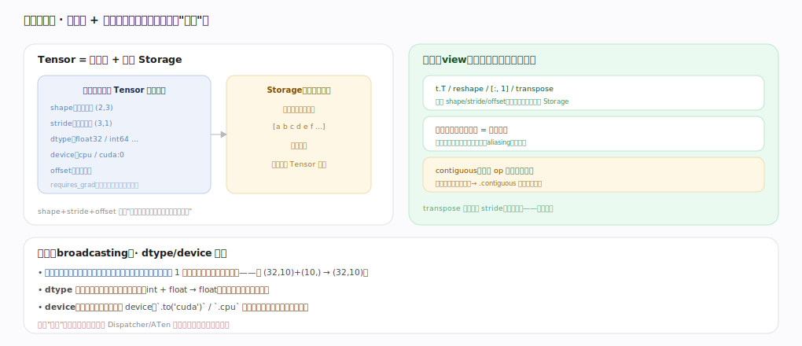

# PyTorch 核心原理 · 接口主线 · 张量编程

> **定位**：最底层的用户接触面——用张量（多维数组）+ 算子写数值计算。它是一切上层（autograd/nn）的基石，强依赖**张量与存储**、**Dispatcher 分发**、**ATen 算子库**、**设备后端与内存**四个能力域。核实基准：官方源码 `pytorch/pytorch` v2.13.0。

## 一、张量与视图：元信息 + 共享存储

Python 的 `Tensor`（`torch/_tensor.py:102`，继承 C++ 的 `torch._C.TensorBase`）= **元信息**（shape/stride/dtype/device/offset，每张量各一份，加可选 requires_grad）+ 指向 **Storage**（一维连续内存、引用计数、可被多张量共享）。这些元信息就是 TensorImpl 的字段：`sizes_and_strides_`（`c10/core/TensorImpl.h:619` 的 sizes()）、`data_type_`（dtype，`TensorImpl.h:2921`，取值见 `c10/core/ScalarType.h`）、device（`c10/core/Device.h:31`）、`storage_offset_`（`TensorImpl.h:2912`）。shape+stride+offset 决定"如何在一维内存里索引出多维视图"。

**视图（view）**：`t.T`/`reshape`/切片/`transpose` 只改元信息、与原张量共享同一 Storage（零拷贝、改视图=改原张量，要小心别名副作用）；某些算子要求 `contiguous`（连续内存），转置后 `is_contiguous_`（`TensorImpl.h:2964`）翻 false，需 `.contiguous()` 触发拷贝重排。**广播**（形状不同逐元素运算时从尾维对齐、大小 1 维自动扩展，由 `TensorIteratorBase`（`aten/src/ATen/TensorIterator.h:246`）统一处理）、**dtype 提升**（int+float→float）、**device**（算子要求同设备、`.to('cuda')` 显式搬运）都是"自动"行为，背后由算子在 Dispatcher/ATen 实现。

---

## 二、算子的即时执行与操作族

**即时执行（eager）**：`z=x+y` 立刻算出结果、不攒图不延迟——可 print/断点/按值分支，调试友好，代价是逐算子派发开销（每次经 Dispatcher 的 `computeDispatchKeySet` + kernel 查表，见 `aten/src/ATen/core/dispatch/Dispatcher.h:613`，torch.compile 补）。**函数式 vs 原地**：`add`（结构化算子 `add.Tensor`，`aten/src/ATen/native/native_functions.yaml:536`）返回新张量（安全），`add_`（尾下划线）原地改（省内存但可能破坏 autograd 所需的中间值、改版本计数），`out=` 写进预分配张量。

**操作族**：逐元素/归约（add/relu/sum/mean，逐点算子经 TensorIterator 的 `for_each` 循环 + `add_stub`，`native/BinaryOps.cpp:437`）、线性代数（matmul/@/conv/einsum，委托 cuBLAS/cuDNN）、形状/索引（reshape/permute/cat/切片，只改元信息）、设备/类型（to/cuda/float）——~2000 个算子覆盖张量运算全谱，内部统一经 Dispatcher→ATen→后端 kernel。贯穿示例 `model(x)` 展开就是 `x @ W.T + b`：一次 matmul + 一次广播 add。

---

## 拓展 · 张量关键属性

| 属性 | 含义 | 锚点 |
|---|---|---|
| shape/stride | 多维视图如何映射一维内存 | `c10/core/TensorImpl.h:619` |
| dtype | float32/16/bf16/int64… | `c10/core/ScalarType.h` |
| device | cpu/cuda:N | `c10/core/Device.h:31` |
| storage_offset | 切片起始偏移 | `c10/core/TensorImpl.h:2912` |
| is_contiguous | 内存是否连续（缓存位） | `c10/core/TensorImpl.h:2964` |
| requires_grad | 是否追踪梯度（见自动微分主线） | `c10/core/TensorImpl.h:1404` |
| Python Tensor 壳 | 继承 TensorBase | `torch/_tensor.py:102` |

---

## 深化 · 函数式 / 原地 / out= 三种写法

| 写法 | 语义 | 内存 | 对 autograd | 例 |
|---|---|---|---|---|
| `y = x.add(z)` | 返回新张量 | 新分配输出 | 安全 | `native_functions.yaml:536`（add.Tensor） |
| `x.add_(z)` | 原地改 x | 复用 x 存储、改版本计数 | 可能破坏 saved 中间值 | `native_functions.yaml:548`（add_.Tensor） |
| `torch.add(x,z,out=o)` | 写进 o | 复用预分配 o | o 若被 saved 亦有风险 | `native_functions.yaml:559`（add.out） |

视图 vs 拷贝：`view/transpose/切片` 共享 Storage 零拷贝、`contiguous/clone` 才新分配（见"张量与存储"主线）。

---

## 调优要点（关键开关）

- 尽量用视图（reshape/permute）避免拷贝；只在必要时 `.contiguous()`。
- 混合精度用 `float16`/`bfloat16` + autocast 省显存提速。
- 批量搬设备用 `non_blocking=True` + pin_memory 重叠传输。
- 避免 Python 循环里逐元素操作，改用向量化算子（广播/批量），让 TensorIterator 一次处理整块。

---

## 常见误区与工程要点

- **以为视图是拷贝**：view 共享 Storage，改一个动全部；要独立副本用 `.clone`。
- **原地操作乱用**：`x.add_` 可能覆盖反向所需中间值、改版本计数导致 backward 报错。
- **跨设备直接运算**：cpu 张量与 cuda 张量运算报错，先 `.to` 对齐 device（`Device.h:31`）。
- **忽视 dtype**：int 张量除法/精度问题；训练一般 float32/bf16（`ScalarType.h`）。

---

## 一句话总纲

**张量编程是用"元信息（shape/stride/dtype/device，即 TensorImpl 字段）+ 共享 Storage"的多维数组写即时执行的算子：视图零拷贝地改元信息共享底层内存、广播/dtype 提升/设备规则经 TensorIterator 让运算"自动"对齐，~2000 个算子（逐元素/线代/形状/设备）统一经 Dispatcher→ATen→后端 kernel 执行；函数式/原地(add_)/out= 三种写法权衡内存与 autograd 安全——这是 autograd 与 nn 的计算基石。**
