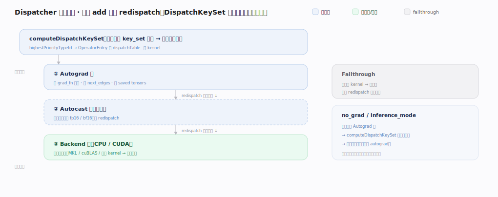

# PyTorch 核心原理 · 支撑能力域 · Dispatcher 分发

> **定位**：表示层、灵魂能力域之一。每次算子调用都经它按 DispatchKey 分层选 kernel——自动微分、混合精度、设备选择都做成可插拔的分发层。被所有算子调用依赖。核实基准：官方源码 `pytorch/pytorch` v2.13.0（`aten/src/ATen/core/dispatch/Dispatcher.h:71`）。

## 一、分层分发机制

`torch.add(a,b)` 的分发之旅：`OperatorHandle::call`（`Dispatcher.h:613`）先算 **DispatchKeySet**——`computeDispatchKeySet`（`aten/src/ATen/core/dispatch/DispatchKeyExtractor.h:24`）取输入张量 `key_set_` 的并集再滤掉 fallthrough 键，`highestPriorityTypeId`（`c10/core/DispatchKeySet.h:430`）取最高优先键去 `OperatorEntry` 的 kernel 表里 `lookup`（`aten/src/ATen/core/dispatch/OperatorEntry.h:182`）出 kernel → 命中 **Autograd kernel**（记反向图节点，`redispatch`（`Dispatcher.h:621`）划掉 Autograd 键从下一优先级继续）→ **Autocast 等切面**（按需转精度再 redispatch）→ **Backend kernel**（CPU/CUDA 真正算）。

关键：一次调用**逐层穿过多个 key**，每层做一件横切事再 redispatch 到下一层——"自动微分/混合精度/设备选择"不是 if-else 硬编码在算子里，而是**独立分发层**，可插拔可组合。**优先级来自枚举顺序**（`c10/core/DispatchKey.h:136` 的 `enum class DispatchKey`）：功能键（`AutogradOther` 在 `:315`、`AutocastCPU` 在 `:334`）排在后端键（CPU/CUDA）之上——枚举值越大优先级越高，保证先做 autograd 记账、再做 autocast、最后选后端算数。

**kernel 表**：每个算子一个 `OperatorEntry`（`OperatorEntry.h:70`），内部 `dispatchTable_`（`:237`，一个按运行期 key 索引的定长数组），`computeDispatchTableEntry`（`:310`）在注册/去注册时重算每格。**注册**：`TORCH_LIBRARY`（`torch/library.h:974`）声明算子、`TORCH_LIBRARY_IMPL`（`:1056`）+ `m.impl(...)` 把某 DispatchKey 的 kernel 填进表；扩展新后端只需注册对应 key 的 kernel。kernel 由 `KernelFunction`（`aten/src/ATen/core/boxing/KernelFunction.h:90`）承载，可 **boxed**（`callBoxed`，`:130`，统一走 Stack、通用但慢）或 **unboxed**（`call`，`:155`，直调原型、快）；`isFallthrough`（`:110`）标记"该层无事可做、直接落下一层"。

---

## 拓展 · 关键概念

| 概念 | 含义 | 锚点 |
|---|---|---|
| DispatchKey | CPU/CUDA/Autograd/Autocast/Sparse… 枚举 | `c10/core/DispatchKey.h:136` |
| DispatchKeySet | 张量携带的 key 集合（位集） | `c10/core/DispatchKeySet.h:167` |
| computeDispatchKeySet | 从输入张量算出本次调用的 key 集 | `DispatchKeyExtractor.h:24` |
| highestPriorityTypeId | 取集合里最高优先键 | `DispatchKeySet.h:430` |
| OperatorEntry | 单算子的 (key→kernel) 表 | `OperatorEntry.h:70` |
| dispatchTable_ / lookup | 定长 kernel 数组 / 查表 | `OperatorEntry.h:237` / `:182` |
| redispatch | 划掉当前 key 从下一优先级继续 | `Dispatcher.h:621` |
| KernelFunction boxed/unboxed | 装箱通用调用 / 直调 | `KernelFunction.h:130` / `:155` |
| fallback（兜底） | 某 key 无 kernel 时的后端兜底 | `Dispatcher.h:294` |

---

## 深化 · 一次 add 的分层轨迹

| 层（DispatchKey） | 干什么 | 之后 | 锚点 |
|---|---|---|---|
| Autograd | 建 grad_fn 节点、记 next_edges、存 saved tensors | redispatch 去掉 Autograd 键 | `DispatchKey.h:315`（AutogradOther） |
| Autocast（可选） | 把算子输入按策略转 fp16/bf16 | redispatch 去掉 Autocast 键 | `DispatchKey.h:334`（AutocastCPU） |
| Backend（CPU/CUDA） | 真正算数值（调 MKL/cuBLAS/自写 kernel） | 返回结果 | `OperatorEntry.h:182`（lookup） |
| Fallthrough | 该键无 kernel，直接落下一层不做事 | 立即 redispatch | `KernelFunction.h:110`（isFallthrough） |

`inference_mode` / `no_grad` 之所以"自动省 autograd"，正是让张量不带 Autograd 键、computeDispatchKeySet 算不出该层 → 整层被跳过。

---

## 调优要点（关键开关）

- 理解分发层帮助读懂 autocast/inference_mode 为何"自动"生效——本质是 key_set 里有无对应功能键。
- 自定义算子经 `TORCH_LIBRARY`（`torch/library.h:974`）+ `TORCH_LIBRARY_IMPL` 注册到对应 key，融入分发体系。
- 新硬件后端 = 注册新 DispatchKey 的 kernel，无需改上层；共性逻辑可注册 `registerFallback`（`Dispatcher.h:294`）兜底。
- 逐算子派发（每次 computeDispatchKeySet + lookup + 可能 boxed 装箱）有开销，是 eager 慢的根源之一 → torch.compile 抓图后绕过整条分发链。

---

## 常见误区与工程要点

- **以为 autograd 是算子里写的**：它是独立分发层（`DispatchKey.h:315`），靠张量携带 Autograd 键触发。
- **以为设备判断是 if 分支**：由 Backend key 经 `dispatchTable_` 查表分发到对应 kernel（`OperatorEntry.h:182`）。
- **忽视 redispatch**：分层的核心机制（`Dispatcher.h:621`），一次调用穿多层、每层划掉自己再往下。
- **扩展算子不注册 key**：不注册就 lookup 不到，算子对该后端"不存在"。
- **误以为 boxed 与 unboxed 等价**：boxed 走 Stack 通用但有装箱开销，热点路径尽量走 unboxed 直调（`KernelFunction.h:155`）。

---

## 一句话总纲

**Dispatcher 是所有算子调用的总线：`computeDispatchKeySet` 从输入张量 key_set 并集算出本次调用的 DispatchKeySet、`highestPriorityTypeId` 取最高优先键去 OperatorEntry 的 dispatchTable_ 查 kernel——先经 Autograd 层记反向图、再经 Autocast 切面、最后落 Backend(CPU/CUDA) kernel，每层做完 redispatch 划掉自己继续下探；autograd/混合精度/设备选择都做成可插拔可组合的分发层而非硬编码，扩展新后端/新算子只需按 DispatchKey 用 TORCH_LIBRARY_IMPL 注册 kernel。**
