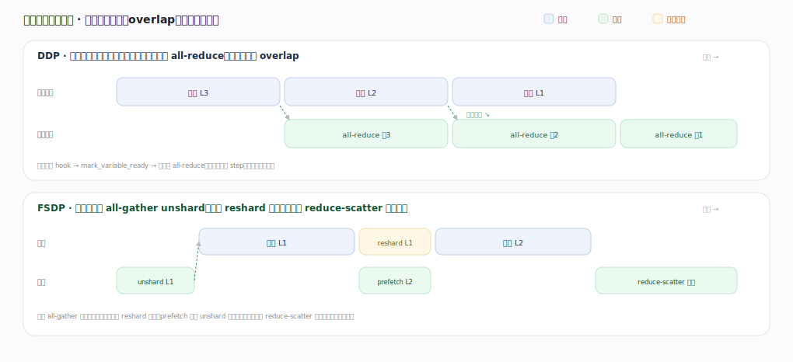

# PyTorch 核心原理 · 支撑能力域 · 分布式训练

> **定位**：扩展层。多卡/多机训练：DDP 数据并行（复制模型、同步梯度）、FSDP 分片（省显存）、底层 ProcessGroup + collective。被**建模与训练**在规模化时依赖。核实基准：官方源码 `pytorch/pytorch` v2.13.0（`torch/csrc/distributed/c10d/`、`torch/nn/parallel/distributed.py`、`torch/distributed/fsdp/`）。

## 一、DDP 数据并行

**DistributedDataParallel**（`torch/nn/parallel/distributed.py:466`）：每卡一个进程、各持一份模型副本 + 不同数据分片，前向 + 反向算本地梯度，反向时 **all-reduce** 把各卡梯度求平均——同步后梯度一致、各自 step、参数保持一致（无中心参数服务器）。

**核心在 C++ 侧的 Reducer**（`torch/csrc/distributed/c10d/reducer.cpp`）：构造时给每个参数的 `AccumulateGrad` 挂 autograd hook（`reducer.cpp:202` 的 `this->autograd_hook(variable_index)`），DDP 在 Python 侧转发这个 hook（`distributed.py:1298` 的 `self.reducer._autograd_hook(idx)`）。反向时某参数梯度就绪 → `mark_variable_ready`（`reducer.cpp:895`）→ 该参数所属桶全部就绪则 `mark_bucket_ready`（`reducer.cpp:936`）→ `all_reduce_bucket`（`reducer.cpp:978`）立即对这一桶发 all-reduce。

**关键优化：通信藏进反向**——梯度分桶（bucket，按参数注册逆序打包，一桶算完立即 all-reduce）、overlap 计算与通信（反向还在算前面层时后面层梯度已在传），通信几乎"免费"藏在计算背后。DDP 的 Reducer 在构造时创建（`distributed.py:1437` 的 `self.reducer = dist.Reducer(...)`），并用一个 `_DDPSink`（`distributed.py:378`）autograd.Function 兜住反向入口。**通信底座**：ProcessGroup（NCCL/Gloo 后端）+ collective 原语（all_reduce/all_gather/broadcast/reduce_scatter），数据分片靠 DistributedSampler 保证各 rank 不重叠。梯度就绪但无人用（unused parameters）时 Reducer 有 `find_unused_parameters` 逻辑标记跳过。

---

## 二、FSDP 分片

DDP 每卡存整份模型（显存不随卡数降，模型放不下就卡住）；**FSDP**（新版 `fully_shard`，`torch/distributed/fsdp/_fully_shard/_fully_shard.py:64`）把参数/梯度/优化器状态分片、每卡只常驻自己那份（显存 ≈ 单卡模型 / 卡数）。机制"用时临时聚齐、用完扔"，以 `FSDPParamGroup`（`_fsdp_param_group.py`）为单位：

- ① **前向到某层前 `unshard`**（`_fsdp_param_group.py:372`）：`foreach_all_gather`（`_fsdp_collectives.py:325`）聚齐该组完整参数，算完立即 `reshard`（`_fsdp_param_group.py:499`）释放非本片；
- ② **反向同理临时聚齐**算梯度，`post_backward`（`_fsdp_param_group.py:588`）里 `foreach_reduce`（`_fsdp_collectives.py:522`，本质 reduce-scatter）把梯度归约并分回各片；
- ③ 优化器只更本片。

核心权衡：**用通信换显存**（聚齐/散回可 overlap 藏延迟；prefetch 下一组参数）。一句话：DDP 复制、FSDP 分片，"任意时刻只完整拥有正在算的那组"是 FSDP 省显存的关键。数据并行(DDP/FSDP) × 张量并行 × 流水并行 = 大模型训练的并行三维度。

---

## 拓展 · 分布式组件

| 组件 | 职责 | 锚点 |
|---|---|---|
| DistributedDataParallel | 数据并行外壳 | `torch/nn/parallel/distributed.py:466` |
| Reducer | 梯度桶 + hook + all-reduce | `torch/csrc/distributed/c10d/reducer.cpp` |
| autograd_hook / mark_variable_ready | 梯度就绪触发 | `reducer.cpp:202` / `:895` |
| all_reduce_bucket | 一桶就绪即发 all-reduce | `reducer.cpp:978` |
| fully_shard（FSDP2） | 参数/梯度/优化器分片 | `torch/distributed/fsdp/_fully_shard/_fully_shard.py:64` |
| unshard / reshard | 用时聚齐 / 用完释放 | `_fsdp_param_group.py:372` / `:499` |
| foreach_all_gather / foreach_reduce | 聚参数 / 归约梯度 | `_fsdp_collectives.py:325` / `:522` |
| ProcessGroup / collective | NCCL/Gloo + all_reduce 等原语 | `torch/csrc/distributed/c10d/` |

---

## 深化 · DDP vs FSDP 对比

| 维度 | DDP | FSDP |
|---|---|---|
| 每卡参数 | 整份副本 | 仅本片 |
| 显存随卡数 | 不降（模型放不下即卡） | ≈ 模型/卡数 |
| 通信原语 | all-reduce（梯度） | all-gather（参数）+ reduce-scatter（梯度） |
| 通信量 | 较少 | 较多（换显存） |
| 触发点 | 梯度就绪 hook（`reducer.cpp:895`） | 层前 unshard / 层后 reshard（`_fsdp_param_group.py:372/499`） |
| 适用 | 单卡放得下 | 超大模型放不下单卡 |

---

## 调优要点（关键开关）

- 单卡放得下用 DDP（简单高效，Reducer 分桶 overlap）；放不下用 FSDP（省显存）。
- GPU 间用 NCCL 后端；调 `bucket_cap_mb` 让梯度桶大小与 overlap 生效。
- 配 DistributedSampler，否则各卡重复训同样数据。
- FSDP 开 prefetch（提前 unshard 下一组）藏通信延迟；超大模型叠加张量并行/流水并行（3D 并行）。

---

## 常见误区与工程要点

- **DDP 能省显存**：不能，每卡整份副本；省显存用 FSDP 的分片（`_fsdp_param_group.py`）。
- **忘 DistributedSampler**：各 rank 训重叠数据、等价缩小数据集。
- **通信是纯开销**：DDP 的 `all_reduce_bucket`（`reducer.cpp:978`）与 FSDP 的 all-gather 都尽量 overlap 藏进计算。
- **FSDP 无脑更省**：通信更多（all-gather + reduce-scatter），小模型上可能不划算。
- **以为 hook 在 Python 里**：真正的梯度就绪 hook 在 C++ Reducer（`reducer.cpp:202`），Python 只转发。

---

## 一句话总纲

**分布式训练把训练扩到多卡多机：DDP（distributed.py:466）每卡复制模型跑不同数据、C++ Reducer 给参数挂 autograd hook（reducer.cpp:202），梯度就绪即 mark_variable_ready→分桶 all_reduce_bucket 并与计算 overlap（无参数服务器）；FSDP（fully_shard）把参数/梯度/优化器分片、层前 unshard(foreach_all_gather) 聚齐、层后 reshard 释放、reduce-scatter 分回梯度，用通信换显存以放下超大模型；二者都建在 ProcessGroup + collective（NCCL）之上、靠 DistributedSampler 分数据——数据并行是大模型三维并行（数据/张量/流水）之一。**
