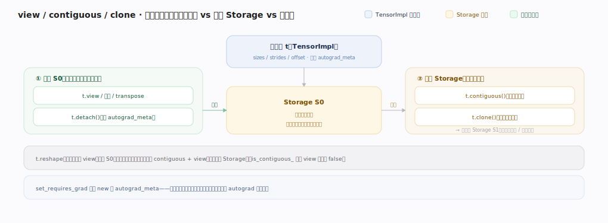

# PyTorch 核心原理 · 支撑能力域 · 张量与存储

> **定位**：表示层底座。定义张量的内核表示（TensorImpl）与底层内存（Storage），是一切算子与 autograd 的数据载体。被所有能力域依赖。核实基准：官方源码 `pytorch/pytorch` v2.13.0（HEAD `cf30153`）。

## 一、TensorImpl 解剖

Tensor 是薄壳：用户面的 `at::TensorBase`（`aten/src/ATen/core/TensorBase.h:93`）只含一个成员 `c10::intrusive_ptr<TensorImpl, UndefinedTensorImpl> impl_`（`TensorBase.h:928`），拷贝张量 = 对 impl_ 加引用计数、几乎零成本。真正的元信息在 **TensorImpl**（`c10/core/TensorImpl.h:510`，继承 `c10::intrusive_ptr_target`——引用计数嵌在对象内部，省一次独立分配）里逐字段展开：

- `sizes_and_strides_`（形状 + 步长，用内联小向量 `impl::SizesAndStrides` 存，低维张量不额外堆分配；访问器 `sizes()` 在 `TensorImpl.h:619`）；
- `storage_offset_`（`TensorImpl.h:2912`，切片的起始偏移）、`numel_`（`:2917`，缓存的元素总数）、`is_contiguous_` 位（`:2964`，缓存"内存是否连续"避免每次重算）；
- `data_type_`（`:2921`，即 dtype，`caffe2::TypeMeta`）；
- **`key_set_`（`TensorImpl.h:3055`，`DispatchKeySet`——记录 CPU/CUDA、是否需要 autograd 等）**，这是算子分发的起点；
- `autograd_meta_`（`:2901`，`std::unique_ptr<AutogradMetaInterface>`，可选：只有 requires_grad 或非叶子才分配，含 grad_fn / grad）；
- `storage_`（`:2875`，`Storage`，指向 StorageImpl）。

**StorageImpl**（`c10/core/StorageImpl.h:55`，同样是 `intrusive_ptr_target`）才是"底层内存"：`data_ptr_`（`StorageImpl.h:378`，`DataPtr`——裸指针 + 删除器 + 设备三合一，删除器决定归还到哪个分配器）、`size_bytes_`（`:379`，字节数，`SymInt` 以支持符号形状）、`allocator_`（`:397`，CPU 分配器 / CUDACachingAllocator）+ 引用计数。**多个 TensorImpl 可共享同一个 StorageImpl**：view/切片新建 TensorImpl 但只复制元信息、共享底层字节，Storage 引用计数归零才真正释放内存。

两个关键设计：① key_set 长在张量上→算子据此选分发层（"自动 autograd / 设备选择"的物理根源）；② 元信息与数据分离→view 零拷贝、张量拷贝廉价、内存由引用计数自动回收。

---

## 拓展 · 张量内核字段

| 字段 | 含义 | 锚点 |
|---|---|---|
| `impl_`（薄壳） | TensorBase 唯一成员，intrusive_ptr | `aten/src/ATen/core/TensorBase.h:928` |
| `sizes_and_strides_` | 多维视图如何映射一维内存（内联小向量） | `c10/core/TensorImpl.h:619`（sizes()） |
| `storage_offset_` | 起始偏移（切片用） | `c10/core/TensorImpl.h:2912` |
| `data_type_` | dtype（TypeMeta） | `c10/core/TensorImpl.h:2921` |
| `key_set_` | 触发哪些分发层（device/autograd） | `c10/core/TensorImpl.h:3055` |
| `autograd_meta_` | grad_fn / grad（可选，惰性分配） | `c10/core/TensorImpl.h:2901` |
| `storage_` | 共享的底层内存（Storage） | `c10/core/TensorImpl.h:2875` |
| `data_ptr_` | 裸指针 + 删除器 + 设备 | `c10/core/StorageImpl.h:378` |
| `allocator_` | 归还内存到哪个分配器 | `c10/core/StorageImpl.h:397` |

---

## 深化 · view/contiguous 的三种内存关系

| 操作 | 新 TensorImpl | 共享 Storage | 触发拷贝 | 说明 |
|---|---|---|---|---|
| `t.view(...)` / 切片 / `transpose` | 是 | 是 | 否 | 只改 sizes/strides/offset；`is_contiguous_` 位（`TensorImpl.h:2964`）可能翻成 false |
| `t.contiguous()` | 是 | 否（已连续则原样返回） | 非连续时是 | 按行主序重排到新 Storage，`is_contiguous_default` 判定见 `TensorImpl.h:841` |
| `t.clone()` | 是 | 否 | 总是 | 深拷贝一份独立 Storage |
| `t.reshape(...)` | 是 | 尽量共享 | 无法零拷贝表达时才拷贝 | 连续则等价 view，否则退化为 contiguous+view |
| `t.detach()` | 是 | 是 | 否 | 共享数据但 autograd_meta_ 清空、切断梯度 |

`set_requires_grad`（`c10/core/TensorImpl.h:1404`）会惰性 new 出 `autograd_meta_`——这解释了为什么"不需要梯度的张量几乎零 autograd 开销"。

---

## 调优要点（关键开关）

- 优先视图/切片（零拷贝，只改 `sizes_and_strides_`）；需独立副本才 `.clone`。
- 大量小张量有 TensorImpl + StorageImpl 双重引用计数开销；批量化减少张量个数。
- `.untyped_storage()` 查底层 StorageImpl、`.data_ptr()` 比对是否共享内存、`.storage_offset()` 看切片偏移。
- meta 设备张量（只有元信息、`storage_` 为空）用于形状推断/编译，零显存——正是 structured kernel 的 meta 阶段所用。
- 转置/permute 后若下游算子要求连续，显式 `.contiguous()` 一次，避免算子内部反复隐式重排。

---

## 常见误区与工程要点

- **以为 Tensor 很重**：TensorBase 只有一个 intrusive_ptr 成员（`TensorBase.h:928`），重的是 StorageImpl 的字节。
- **view 当独立副本**：共享 Storage，改一个动全部；`is_contiguous_` 缓存位会随 view 失效。
- **忽视 key_set**：`key_set_`（`TensorImpl.h:3055`）决定张量触发哪些分发层，是"自动 autograd/设备"的根源。
- **手动管显存**：DataPtr 自带删除器、StorageImpl 引用计数归零自动释放，别手动 free。
- **误判 numel/contiguous 开销**：二者是缓存字段（`:2917`/`:2964`），改形状的算子负责刷新，读取是 O(1)。

---

## 一句话总纲

**张量与存储把 Tensor 表示为薄壳 `intrusive_ptr<TensorImpl>`（TensorBase 唯一成员 impl_）：TensorImpl 装元信息（sizes_and_strides / storage_offset / data_type / key_set / 可选 autograd_meta）+ 指向可共享的 StorageImpl（DataPtr + allocator + 引用计数）；元信息与数据分离使 view 零拷贝、张量拷贝廉价、内存引用计数自动回收，而张量上的 DispatchKeySet（key_set_）正是算子分发与"自动 autograd/设备"的起点。**
