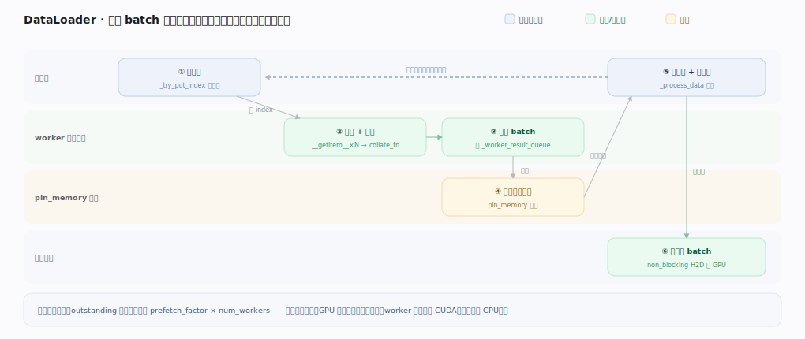

# PyTorch 核心原理 · 支撑能力域 · 数据加载

> **定位**：扩展层。用多 worker 进程后台预取、批处理，喂满 GPU 避免数据饥饿。被**建模与训练**依赖，是训练吞吐的隐形瓶颈。核实基准：官方源码 `pytorch/pytorch` v2.13.0（`torch/utils/data/`）。

## 一、DataLoader 流水线

流水线：**Dataset**（`__getitem__(i)` 返回一条样本，读盘/解码/变换，map 式或 iterable 式）→ **Sampler**（决定取样顺序，shuffle/分布式分片）→ **worker 进程池**（`num_workers` 个子进程并行取样本、后台预取，绕开 Python GIL）→ **collate_fn**（多条样本拼成 batch、stack 成张量）→ 交训练循环（`pin_memory` 锁页 → 异步搬 GPU 更快）。

`DataLoader`（`torch/utils/data/dataloader.py:149`）按 `num_workers` 分两条实现：`num_workers=0` 用 `_SingleProcessDataLoaderIter`（`dataloader.py:757`，主进程同步取），否则用 `_MultiProcessingDataLoaderIter`（`dataloader.py:791`）。多进程版的关键机制：

- **每 worker 一条索引队列** `_index_queues`（`dataloader.py:1187`），主进程 `_try_put_index`（`dataloader.py:1531`）把待取样本的索引轮流塞给各 worker；
- **worker 主循环** `_worker_loop`（`torch/utils/data/_utils/worker.py:244`）从索引队列取索引、经 `_MapDatasetFetcher`/`_IterableDatasetFetcher`（`torch/utils/data/_utils/fetch.py`）调 `Dataset.__getitem__` + `collate_fn`、把 batch 放回 `_worker_result_queue`（`dataloader.py:1134`）；
- **预取深度**：`prefetch_factor` 默认 2（`dataloader.py:293`），启动时预塞 `prefetch_factor * num_workers` 个任务（`dataloader.py:1275`）让每个 worker 手头始终有活；主进程 `_process_data`（`dataloader.py:1563`）取一个 batch 就 `_try_put_index` 补一个，保持流水线满载；
- **pin_memory**：若开启，另起一个 `pin_memory_thread` 跑 `_pin_memory_loop`（`torch/utils/data/_utils/pin_memory.py:18`），把 worker 送回的 batch 调 `pin_memory`（`pin_memory.py:55`）锁页，供训练循环 `non_blocking=True` 异步搬 GPU。

**为什么多进程**：数据预处理是 CPU 活（解码/增广），Python GIL 限单线程；多进程绕开 GIL 并行准备——训练用 batch N 时 worker 已在备 N+1，目标是 GPU 永不等数据；worker 经队列/共享内存把 batch 传回主进程，`prefetch_factor` 控预取深度。

---

## 拓展 · 数据加载组件

| 组件 | 职责 | 锚点 |
|---|---|---|
| DataLoader | 批 + 多 worker + 预取 | `torch/utils/data/dataloader.py:149` |
| _MultiProcessingDataLoaderIter | 多进程迭代器 | `dataloader.py:791` |
| _worker_loop | worker 主循环取样 | `torch/utils/data/_utils/worker.py:244` |
| Fetcher（map/iterable） | 调 __getitem__ + collate | `torch/utils/data/_utils/fetch.py` |
| _index_queues / _worker_result_queue | 派索引 / 收 batch | `dataloader.py:1187` / `:1134` |
| _try_put_index / _process_data | 补任务 / 取 batch | `dataloader.py:1531` / `:1563` |
| prefetch_factor（默认 2） | 每 worker 预取深度 | `dataloader.py:293` |
| _pin_memory_loop / pin_memory | 锁页加速 H2D | `_utils/pin_memory.py:18` / `:55` |

---

## 深化 · 一个 batch 的进程间旅程

| 步骤 | 位置 | 动作 | 锚点 |
|---|---|---|---|
| 派索引 | 主进程 | 轮流塞 index 到各 worker 队列 | `dataloader.py:1531` |
| 取样+组批 | worker 子进程 | __getitem__ × N → collate_fn | `_utils/worker.py:244` |
| 回传 batch | worker→主 | 放 _worker_result_queue | `dataloader.py:1134` |
| 锁页（可选） | pin_memory_thread | pin_memory 锁页 | `_utils/pin_memory.py:18` |
| 交训练 | 主进程 | _process_data 返回 + 补索引 | `dataloader.py:1563` |

预取满载条件：outstanding 任务数维持在 `prefetch_factor * num_workers`（`dataloader.py:1275`）——取一个补一个，GPU 到点就有下一批可用。

---

## 调优要点（关键开关）

- `num_workers`：太少 GPU 饿、太多内存/切换开销，按 CPU 核与 IO 实测。
- `pin_memory=True`（起 pin_memory_thread，`pin_memory.py:18`）+ `non_blocking=True`：重叠 CPU→GPU 传输。
- `prefetch_factor`（默认 2，`dataloader.py:293`）：加大平滑抖动、代价是内存。
- 大数据集用 `IterableDataset` 流式（走 `_IterableDatasetFetcher`），别全 load 进内存。
- 分布式配 `DistributedSampler`，各 rank 拿不重叠子集。

---

## 常见误区与工程要点

- **数据管道不是瓶颈**：GPU 快时它常是隐形瓶颈，先 profile（看 GPU 是否在等 `_process_data`）。
- **worker 里用 CUDA 句柄**：fork 后不可用；预处理留在 CPU，锁页交 pin_memory_thread。
- **num_workers 越多越好**：过多引发内存与进程切换开销、`_worker_result_queue` 反压。
- **忘 pin_memory**：H2D 传输走可分页内存慢、无法与计算充分异步。
- **prefetch_factor 设 0**：会报错（`dataloader.py:1111` 校验），多进程下须 ≥1。

---

## 一句话总纲

**数据加载用 DataLoader（dataloader.py:149）组织流水线：Dataset 出单样本、Sampler 定顺序（含分布式分片）、num_workers 个子进程跑 _worker_loop 绕开 GIL 并行取样 + collate_fn 拼 batch 放回结果队列、prefetch_factor（默认 2）预塞任务保持每 worker 满载、pin_memory_thread 锁页供 non_blocking 异步搬 GPU；主进程取一个 batch 就 _try_put_index 补一个，让训练用当前 batch 时 worker 已备好下一批——数据管道常是训练吞吐的隐形瓶颈。**
