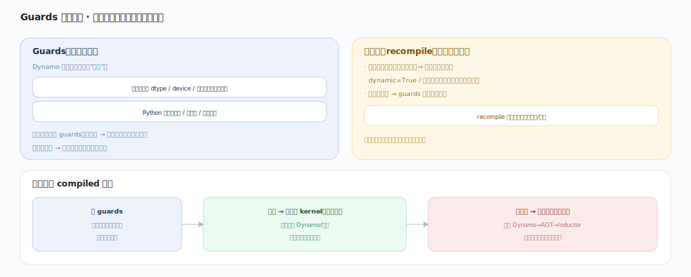

# PyTorch 核心原理 · 支撑能力域 · 编译栈

> **定位**：计算层。torch.compile 在 eager 之上就地编译加速——Dynamo 抓图 → AOTAutograd 联合前后向 → Inductor 生成融合 kernel。是"动态优先、编译加速可选"的落地。核实基准：官方源码 `pytorch/pytorch` v2.13.0（`torch/_dynamo/`、`torch/_inductor/`）。

## 一、三段栈

`torch.compile`（公开入口 `torch/__init__.py:2609`）本质是 `torch._dynamo.optimize`（`torch/_dynamo/eval_frame.py:1669`）的封装，返回一个 `OptimizedModule`（`eval_frame.py:430`）。三段：

**① Dynamo（抓图）**：用 CPython 的帧求值 API 拦截字节码，`_compile`（`torch/_dynamo/convert_frame.py:1633`）符号执行字节码、把张量运算抽成 FX 图。抓不动的（打印/复杂 Python/数据依赖控制流）触发 **graph break** 回退 eager，图切成多段各自编译。产物是 FX 图 + 一组 guards（复用条件）。抓完的图交给后端：`OutputGraph.call_user_compiler`（`torch/_dynamo/output_graph.py:3046`）调用编译后端（默认 Inductor），`compile_and_call_fx_graph`（`output_graph.py:2704`）串起来。Dynamo 用 **FakeTensor** 做符号执行（只走形状/dtype 不算真值）。

**② AOTAutograd**：`aot_module_simplified`（`torch/_functorch/aot_autograd.py:1131`，函数式入口 `aot_function` 在 `:702`）提前把**前向图 + 反向图**一起 trace 出来、把复合算子降解成基础算子集（core aten ops）——这样训练（而非仅推理）也能整图编译，反向也被融合优化。

**③ Inductor（codegen）**：`compile_fx`（`torch/_inductor/compile_fx.py:2685`）是后端入口，`fx_codegen_and_compile`（`compile_fx.py:1787`）把 FX 图 lower 成 `GraphLowering`（`torch/_inductor/graph.py:362`）的 IR，`Scheduler`（`torch/_inductor/scheduler.py:4028`）做**算子融合** `fuse_nodes`（`scheduler.py:4986`）与调度，再由 `TritonScheduling`（`torch/_inductor/codegen/triton.py:7153`）的 `codegen_kernel`（`triton.py:6336`）为 GPU 生成 **Triton kernel**、CPU 走 `codegen/cpp.py` 生成 C++/OpenMP kernel。

**为什么快**：eager 逐算子每个一次派发 + 读写显存；编译后多算子融合成一个 kernel（一次读写、省派发），访存密集链（如 LayerNorm、逐点算子链）收益最大——一行 `torch.compile(model)` 写法不变。**优雅回退**：抓不了的片段自动 graph break 切回 eager、保证总能跑。

---

## 二、Guards 与重编译

Dynamo 编译时记录一组 **guards（假设）**：输入的 dtype/device/形状（或符号形状）、Python 变量类型/常量/分支走向。`_compile` 结束时 `build_guards`（`convert_frame.py:1903`）把这些假设编译成一个 `check_fn`，连同编译后的字节码打包成 `GuardedCode`（`convert_frame.py:1919`）缓存。每次进入被编译的帧先跑 `check_fn`：全满足→直接用缓存编译产物（快路径，编译收益来源）；任一不满足→**重编译**（慢路径，新增一份 GuardedCode）。

重编译代价：形状频繁变（变长序列）反复重编译很贵→`dynamic=True` 用符号形状（SymInt）少重编译；按值分支多→guards 多、命中率低；有 recompile 上限（超限则永久回退 eager）保护。首次编译有开销，稳定形状下摊薄后净赚。

---

## 拓展 · 编译栈组件

| 组件 | 职责 | 锚点 |
|---|---|---|
| torch.compile / optimize | 公开入口 → OptimizedModule | `torch/__init__.py:2609` / `eval_frame.py:1669` |
| Dynamo `_compile` | 字节码符号执行抓 FX 图 | `torch/_dynamo/convert_frame.py:1633` |
| call_user_compiler | 把图交给后端编译 | `torch/_dynamo/output_graph.py:3046` |
| build_guards / GuardedCode | 生成复用条件 + 缓存产物 | `convert_frame.py:1903` / `:1919` |
| AOTAutograd | 前后向联合 trace + 降解 | `torch/_functorch/aot_autograd.py:1131` |
| Inductor compile_fx | 后端 lower + codegen 入口 | `torch/_inductor/compile_fx.py:2685` |
| Scheduler.fuse_nodes | 算子融合 | `torch/_inductor/scheduler.py:4986` |
| TritonScheduling.codegen_kernel | 生成 Triton kernel | `torch/_inductor/codegen/triton.py:6336` |

---

## 深化 · 三段各自的输入/输出

| 段 | 输入 | 输出 | 抓不动时 | 锚点 |
|---|---|---|---|---|
| Dynamo | Python 字节码帧 | FX 图 + guards | graph break 回退 eager | `convert_frame.py:1633` |
| AOTAutograd | FX 前向图 | 前向+反向联合图（core aten） | 降解失败则保留复合算子 | `aot_autograd.py:1131` |
| Inductor | 联合算子图 | 融合后的 Triton/C++ kernel | 不支持的算子回退调 eager kernel | `compile_fx.py:2685` |

---

## 调优要点（关键开关）

- `torch.compile(model)` 起步；`mode="max-autotune"` 让 Inductor 自动调 kernel 参数更激进。
- 形状抖动大用 `dynamic=True` 走符号形状减重编译（否则每种形状一份 GuardedCode）。
- 减少 graph break（避免图中打印/不可抓 Python）提升编译覆盖，`torch._dynamo.explain` 可诊断 break 点。
- 首批慢是编译开销，稳定后看稳态吞吐。

---

## 常见误区与工程要点

- **首次慢=没用**：首次含 Dynamo 抓图 + Inductor codegen，看摊薄后稳态。
- **形状乱变仍编译**：guards 不命中反复重编译（`convert_frame.py:1903`）可能比 eager 还慢；用动态形状。
- **以为要改写模型**：加一行 `torch.compile` 即可，写法不变；抓不动处自动 graph break。
- **graph break 无感**：break 多则编译覆盖低、融合被切断、收益小。
- **以为只编译前向**：AOTAutograd（`aot_autograd.py:1131`）连反向一起 trace，训练也被优化。

---

## 一句话总纲

**编译栈是 torch.compile 的三段：Dynamo（convert_frame.py:1633）拦字节码符号执行抓 FX 图（不可抓则 graph break 回退 eager）、AOTAutograd（aot_autograd.py:1131）联合 trace 前后向并降解成 core aten 基础算子、Inductor（compile_fx.py:2685）经 Scheduler 融合再 codegen 出 Triton/C++ kernel；靠 build_guards 生成的 check_fn 缓存复用编译产物（形状/dtype 变则重编译），把 eager 的逐算子派发+访存开销压成融合 kernel——不改写法地"动态优先、编译加速"。**
