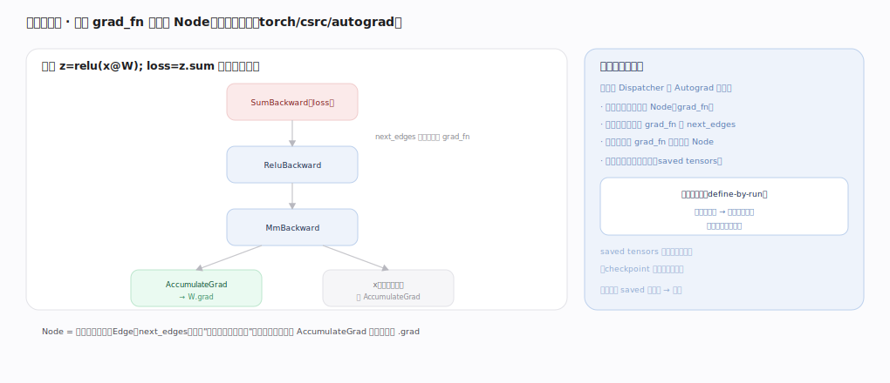

# PyTorch 核心原理 · 支撑能力域 · 自动微分引擎

> **定位**：计算层、灵魂能力域之一。前向时建反向图、backward 时按拓扑并行遍历求梯度——define-by-run 的内核实现。是**自动微分接口**与训练的引擎。核实基准：官方源码 `pytorch/pytorch` v2.13.0（`torch/csrc/autograd/`）。

## 一、反向图结构

前向经 Dispatcher 的 Autograd 层时，为可微算子创建一个 **Node（grad_fn）**——`Node` 是 `torch/csrc/autograd/node.h:112` 的 `struct TORCH_API Node : c10::intrusive_ptr_target`，每个 Node 存：`next_edges_`（`node.h:681`，指向输入张量各自 grad_fn 的边）、`sequence_nr_`（`node.h:624`，前向创建顺序号，供反向定序）、一组 saved tensors。建图靠三步：`collect_next_edges`（`torch/csrc/autograd/function.h:71`）收集输入张量的 grad_fn 连成 `next_edges`、`set_history`（`torch/csrc/autograd/functions/utils.h:67`）把输出张量的 `grad_fn` 指向这个新 Node。

于是 `z=relu(x@W); loss=z.sum()` 建出 `SumBackward → ReluBackward → MmBackward` 的图，叶子（参数 W）挂 **AccumulateGrad** 把梯度写进 `.grad`（不需梯度的 x 不挂）。张量侧的元信息在 `AutogradMeta`（`torch/csrc/autograd/variable.h:225`）：`grad_`（`:228`，累积的梯度）、`grad_fn_`（`:229`，非叶子的生成节点）、`grad_accumulator_`（`:230`，叶子的 AccumulateGrad 弱引用）。

**图边算边连（define-by-run）**：控制流不同则每次图可不同、图默认反向后释放。**saved tensors** 由 `SavedVariable`（`torch/csrc/autograd/saved_variable.h:22`）承载，反向时 `SavedVariable::unpack`（`torch/csrc/autograd/saved_variable.cpp:130`）取回；它是显存大头（checkpoint 用重算换显存），且带版本计数——原地改被 saved 的张量会让版本号对不上、backward 报错。`register_hooks`（`saved_variable.cpp:261`）支持自定义 saved tensor 的打包/卸载（如换显存到 CPU）。

---

## 二、Engine 执行反向

`Engine::execute`（`torch/csrc/autograd/engine.cpp:1294`）分四步：① **算依赖计数** `compute_dependencies`（`engine.cpp:1256`）从 loss 出发遍历图，对每条 `next_edges()` 的目标 `dependencies[next_ptr] += 1`（`engine.cpp:1278` 附近），得到"每个 Node 有几个下游还没算完"，存进 `GraphTask::dependencies_`（`torch/csrc/autograd/graph_task.h:31`）→ ② 依赖=0 的根 Node 入 **ready queue**（`ReadyQueue`，`engine.h:86`，内部是按 sequence_nr 排序的 `std::priority_queue`，`engine.h:112`，保证拓扑序：先算完下游才算上游）→ ③ `evaluate_function`（`engine.cpp:1064`）调 `Node::operator()`（`node.h:154`→纯虚 `apply`，`node.h:616`）算出输入梯度、经 `InputBuffer` 累加到输入 Node → ④ 每个下游算完，上游依赖 `--it->second`，降到 0（`engine.cpp:1180` 附近的 `--it->second == 0`）就 `is_ready=true` 入队，否则暂存 `GraphTask::not_ready_`（`graph_task.h:30`）等其余梯度到齐，直到叶子 AccumulateGrad 写 `.grad`。

**并行**：Engine 为每个设备维护一条 `device_ready_queues_`（`engine.h:236`），`thread_main`（`engine.cpp:518`）是 worker 主循环——各 worker 从自己设备的 ready queue `pop`（`engine.cpp:260`）取 Node 执行，无依赖分支天然并行反向；`ReadyQueue::push`（`engine.cpp:232`）把新就绪 Node 入对应设备队列。同一张量多路径的梯度由 InputBuffer 自动求和。要点：backward 是**图上反向传播非重跑前向**、默认只给叶子留 `.grad`、`retain_graph` 才能二次 backward、`create_graph` 把反向算子本身也建图以支持高阶导数。

---

## 拓展 · autograd 引擎组件

| 组件 | 职责 | 锚点 |
|---|---|---|
| Node（Function） | 一个反向算子节点 | `torch/csrc/autograd/node.h:112` |
| next_edges_ | 指向输入 Node 的边 | `node.h:681` |
| collect_next_edges / set_history | 建图：连边 + 记 grad_fn | `function.h:71` / `functions/utils.h:67` |
| AutogradMeta | 张量上的 grad_fn/grad | `variable.h:225` |
| SavedVariable / unpack | 反向所需中间量（显存大头） | `saved_variable.h:22` / `saved_variable.cpp:130` |
| Engine::execute | 反向入口 | `engine.cpp:1294` |
| compute_dependencies | 算每 Node 依赖计数 | `engine.cpp:1256` |
| evaluate_function | 执行单 Node + 递减依赖 | `engine.cpp:1064` |
| ReadyQueue（优先队列） | 拓扑序调度 + per-device | `engine.h:86` / `:236` |
| thread_main | worker 主循环 | `engine.cpp:518` |

---

## 深化 · 一次 backward 的状态流转

| 步骤 | 数据结构 | 关键动作 | 锚点 |
|---|---|---|---|
| 建依赖 | `dependencies_` map | 遍历 next_edges，计数 +1 | `engine.cpp:1256` |
| 初始就绪 | ReadyQueue | 依赖=0 的 root 入队 | `engine.cpp:232` |
| 执行 Node | apply / InputBuffer | 算局部梯度、累加到输入 | `engine.cpp:1064` / `node.h:616` |
| 递减依赖 | dependencies_ / not_ready_ | `--计数`；到 0 入队否则暂存 | `engine.cpp:1180` 附近 |
| 叶子收敛 | AccumulateGrad | 写入张量 `.grad` | `variable.h:230`（grad_accumulator_） |

失败/边界：saved 张量被原地改 → 版本计数不符、`unpack` 报错；图已释放又二次 backward → 需 `retain_graph=True`；非标量直接 backward → 需传 `gradient=`。

---

## 调优要点（关键开关）

- 显存紧张用 `checkpoint`（重算换显存，少存 SavedVariable，`saved_variable.h:22`）。
- 二阶导用 `create_graph=True`（让反向算子本身建图）；一般训练不用。
- 避免对 saved 张量做原地操作（版本计数不符→报错）。
- 多路径梯度由 InputBuffer 自动求和——共享子模块时注意梯度叠加语义。
- 多卡/多设备反向天然并行（per-device ready queue，`engine.h:236`），无依赖分支同时跑。

---

## 常见误区与工程要点

- **以为 backward 重跑前向**：它是沿已建图（next_edges_）反向传播、调各 Node 的 `apply`。
- **以为图能反复用**：默认反向后释放 saved tensors，需 `retain_graph`。
- **原地操作破坏图**：覆盖 SavedVariable 中间值 → 版本计数不符、backward 报错。
- **非叶子想要 grad**：AutogradMeta 默认不留非叶 `.grad`，需 `retain_grad`。
- **以为反向是串行**：Engine 用 per-device worker + 优先队列，拓扑允许时并行。

---

## 一句话总纲

**自动微分引擎实现 define-by-run：前向每个可微算子在 Autograd 层建一个 Node（node.h:112）、用 collect_next_edges 把输入 grad_fn 连成 next_edges_ 动态反向图、叶子挂 AccumulateGrad；backward 时 Engine::execute（engine.cpp:1294）先 compute_dependencies 算依赖计数、依赖=0 入按 sequence_nr 排序的 ReadyQueue、per-device worker 线程并行调各 Node 的 apply、经 InputBuffer 累加、递减依赖直到叶子 .grad——图边算边连、用完即释、多路径梯度自动求和。**
