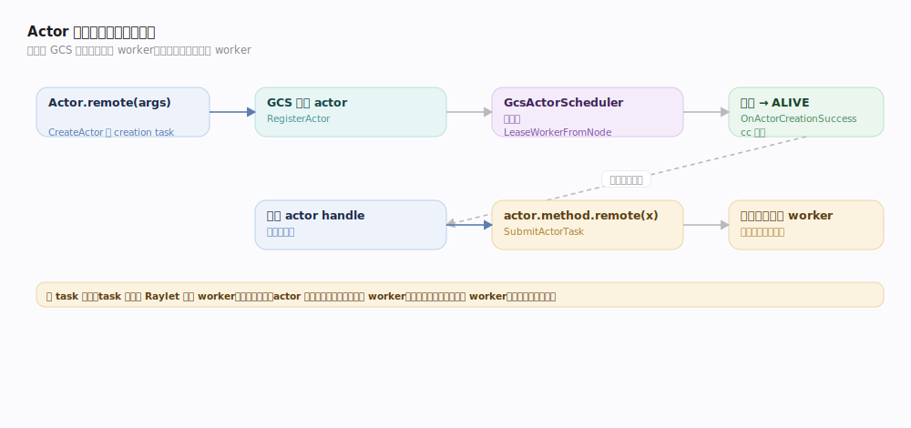
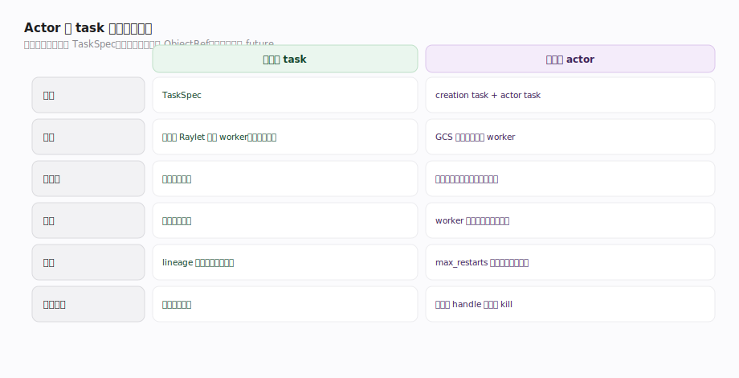
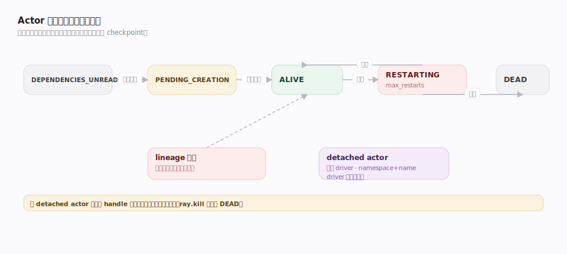

# Ray 接口主线 · Actor 编程模型

> **定位**：task/actor 二元模型里"有状态"的一半。`@ray.remote` 装饰**类**得到一个 **actor**——一个持有状态、生命周期独立、方法在固定 worker 上串行执行的远程对象。它把"有状态服务/参数服务器/模型副本"这类负载纳入 Ray。核实基准 `src/ray/core_worker/core_worker.cc`、`src/ray/gcs/actor/`（commit 2a70ac4）。

## 一、Actor 的创建与调用两条路径

- **创建**：`Actor.remote(args)` → CoreWorker `CreateActor`（`core_worker.cc:2076`）。它构建一个特殊的 **actor creation task**，并**向 GCS 注册 actor**（`GcsActorManager::RegisterActor`，`gcs_actor_manager.cc:660`）。GCS 是 actor 的权威注册表，保存 actor 元数据、handle、状态（PENDING→ALIVE→DEAD）。
- **调度出生**：GCS 收到 `CreateActor`（`gcs_actor_manager.cc:794`）后，`GcsActorScheduler::Schedule`（`gcs_actor_scheduler.cc:50`）为 actor 选节点并 `LeaseWorkerFromNode`（`:235`）租一个 worker 作为该 actor 的常驻宿主；创建成功回调 `OnActorCreationSuccess`（`:1652`）把状态置 ALIVE 并广播给引用者。
- **调用**：拿到 actor handle 后 `actor.method.remote(x)` → `SubmitActorTask`（`core_worker.cc:2415`）。actor task 也是 TaskSpec，但**调度目标固定为该 actor 的 worker**，且按提交顺序**串行**执行（保证状态一致）。返回值同样是 ObjectRef。

## 二、Actor 与 task 的统一与差异

| 维度 | 无状态 task | 有状态 actor |
|---|---|---|
| 载体 | TaskSpec | actor creation task + actor task |
| 调度 | 每次向 Raylet 租新 worker（去中心化） | 创建时 GCS 调度定居一个 worker，之后方法直投该 worker |
| 执行序 | 无序、可并行 | **按提交序串行**（默认单线程） |
| 状态 | 无（纯函数） | worker 进程内持有实例状态 |
| 容错 | lineage 重算（幂等假设） | `max_restarts` 重建 actor（状态从头/checkpoint） |
| 生命周期 | 执行完即回收 | 常驻，直到 handle 全部释放或显式 kill |

**统一点**：二者都编译成 TaskSpec、共享对象存储与 ObjectRef、返回值都是 future。actor 方法调用本质是"路由到固定 worker 的 task"。

## 三、生命周期与容错

- **重启**：actor 进程/节点挂掉，GCS `RestartActor`（`gcs_actor_manager.cc:1444`）依 `max_restarts` 重建；重建后状态丢失（除非应用自做 checkpoint）。
- **lineage 重建**：actor 也可因下游对象丢失被重建以重放方法——`HandleRestartActorForLineageReconstruction`（`gcs_actor_manager.cc:340`）。
- **detached actor**：脱离 driver 生命周期、有全局命名（namespace + name），driver 退出仍存活，供跨 job 共享。
- **回收**：非 detached actor 的所有 handle 释放后自动销毁；`ray.kill(actor)` 强制终止。

## 深化表

| 技术点 | 机制 | 源码锚点 |
|---|---|---|
| 创建 actor | 构 creation task + GCS 注册 | `core_worker.cc:2076`、`gcs_actor_manager.cc:660` |
| GCS 处理创建 | 选节点、租 worker、置 ALIVE | `gcs_actor_manager.cc:794`、`gcs_actor_scheduler.cc:50/235` |
| 方法调用 | SubmitActorTask 定向直投、串行 | `core_worker.cc:2415` |
| 重启容错 | max_restarts 重建 | `gcs_actor_manager.cc:1444` |
| lineage 重建 actor | 为重放方法而重建 | `gcs_actor_manager.cc:340` |
| 创建成功广播 | 通知所有 handle 持有者 | `gcs_actor_manager.cc:1652` |

## 调优要点

- **有状态才用 actor**：无状态计算优先 task（更易并行与容错）。
- **并发**：默认串行；`max_concurrency` 开线程池、或 async actor 用协程处理 IO-bound。
- **actor 池**：把并行度需求转成"多个 actor 组成池"而非单 actor 高并发。
- **detached + namespace** 做长驻服务；及时释放 handle 让普通 actor 回收。
- **checkpoint**：重启会丢内存状态，长任务自行落盘关键状态。

## 常见误区

- ❌ "actor 方法能并发跑" → 默认**串行**，除非显式 async/并发组。
- ❌ "actor 挂了状态会自动恢复" → 重启只重建进程，**内存状态丢失**，需应用自做 checkpoint。
- ❌ "actor 调度和 task 一样去中心化" → actor 创建**经 GCS 集中调度**定居 worker，方法才直投。
- ❌ "driver 退出 actor 都会死" → **detached actor** 独立于 driver 存活。

## 一句话总纲

**Actor 是「向 GCS 注册、由 GCS 调度定居一个 worker、方法按序串行执行」的有状态远程对象——它与 task 共享 TaskSpec/对象存储/ObjectRef，差别只在调度集中化、执行串行化、状态常驻化。**
