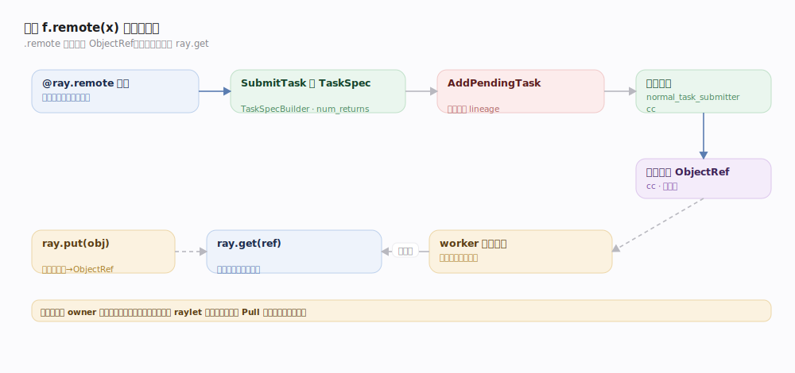
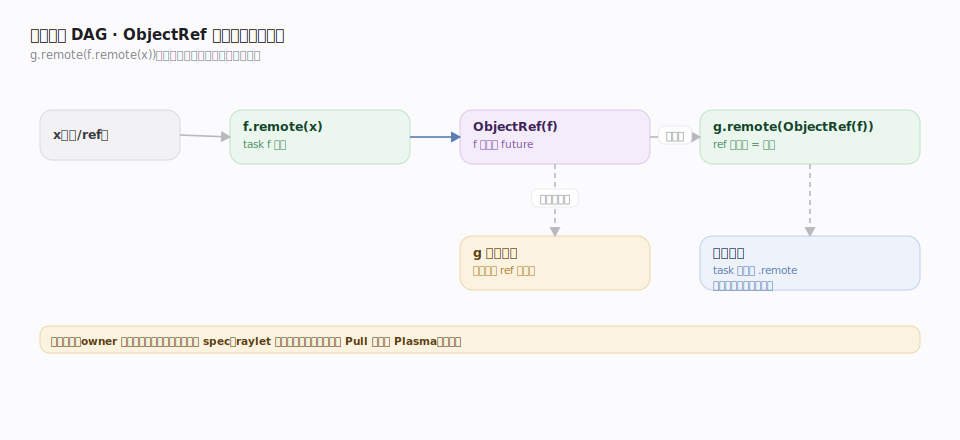
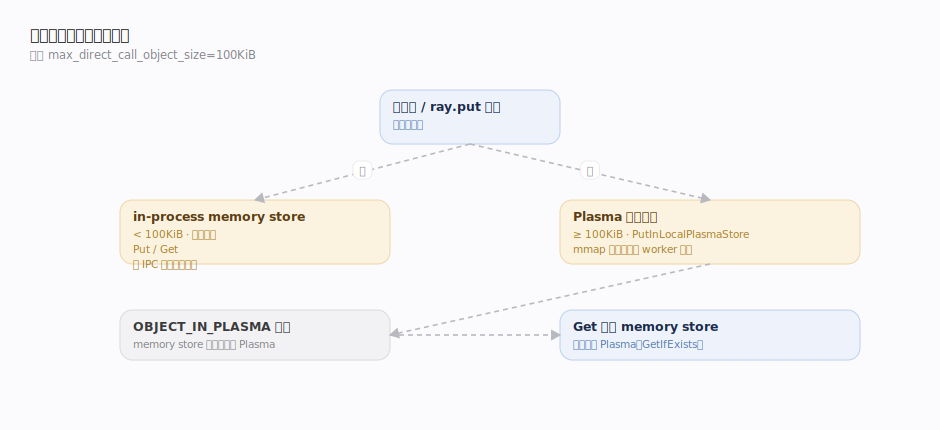

# Ray 接口主线 · 远程任务与对象

> **定位**：Ray 最基础的接触面——把普通 Python 函数变成可在集群任意节点异步执行的 **remote task**，用 **`ObjectRef`（分布式 future）** 串起数据流。这是 task/actor 二元模型里"无状态"的一半，也是理解 `ObjectRef` 贯穿层的入口。核实基准 `src/ray/core_worker/core_worker.cc`（commit 2a70ac4）。

## 一、从 `@ray.remote` 到 ObjectRef 的一次调用

一次 `f.remote(x)` 的完整链路：

1. **装饰**：`@ray.remote` 把函数登记为可远程调用；`.remote(args)` 触发提交。
2. **构建 TaskSpec**：CoreWorker `SubmitTask`（`core_worker.cc:1995`）用 `TaskSpecBuilder` 组装任务规格——`TaskID::ForNormalTask`、函数描述符、参数、`num_returns`、资源需求、scheduling_strategy、depth（调用深度）。
3. **登记 lineage**：`task_manager_->AddPendingTask`（`task_manager.cc:319`）在 owner 本地记录该 task 及其返回 ObjectRef，用于将来容错重算。
4. **异步提交**：`io_service_.post` 把 spec 交给 `normal_task_submitter_->SubmitTask`（`normal_task_submitter.cc:34`），**立即返回** `returned_refs`（ObjectRef 列表）给调用方——不阻塞。
5. **值就绪**：worker 执行完把返回值写入对象存储；`ray.get(ref)`（`Get:1326`）阻塞直到就绪并取回。

`ray.put(obj)` 直接把一个现成对象放入存储、返回 ObjectRef（`Put:1055`），常用于把大对象一次上传、多 task 共享。

## 二、隐式依赖 DAG 与参数解析

ObjectRef 作为参数传给另一个 task，就形成**数据依赖**：`g.remote(f.remote(x))`。Ray 不需要显式声明 DAG——**把 ObjectRef 当参数即是声明依赖**。task 只有在其所有参数 ObjectRef 就绪后才可被调度执行；依赖解析发生在 owner 侧（提交前解引用本地已知值）与 raylet 侧（等待远程依赖 Pull 到本地）。这套隐式 DAG 支持**动态生成**：task 内部可继续 `.remote` 派生新 task（嵌套并行），无需预先构图。

## 三、两级对象存储的取值决策

| 场景 | 值存哪 | 依据 |
|---|---|---|
| 小返回值 / 小 `ray.put`（<100KiB） | in-process **memory store**（`memory_store.cc:174`） | `max_direct_call_object_size=100*1024`（`ray_config_def.h:245`） |
| 大对象 | **Plasma 共享内存**（`PutInLocalPlasmaStore:1076`） | 超过内联阈值，避免 RPC 拷贝、支持零拷贝共享 |
| 对象已在 Plasma | memory store 存 `OBJECT_IN_PLASMA` 哨兵 | 让 `Get` 知道去 Plasma 找（`CreateOwnedAndIncrementLocalRef:1122`） |

`Get`（`core_worker.cc:1326`）先查 memory store（`GetIfExists:159`），遇 `OBJECT_IN_PLASMA` 哨兵再转 Plasma；`Wait`（`:1509`）等待一批 ref 中任意 N 个就绪，用于流式消费。

## 深化表

| 技术点 | 机制 | 源码锚点 |
|---|---|---|
| 任务提交 | TaskSpecBuilder 组 spec → AddPendingTask → 异步 submit | `core_worker.cc:1995`、`task_manager.cc:319` |
| 立即返回 future | SubmitTask 同步返回 `returned_refs` | `core_worker.cc:2064` |
| ray.put | 直接放对象、返回 owned ObjectRef | `core_worker.cc:1055` |
| ray.get 取回 | 先 memory store 后 Plasma，阻塞等就绪 | `core_worker.cc:1326`、`memory_store.cc:247` |
| ray.wait | 等一批 ref 中 N 个就绪 | `core_worker.cc:1509` |
| 隐式依赖 | ObjectRef 作参数 = 声明数据依赖 | `normal_task_submitter.cc`（依赖解析） |
| 重试语义 | `max_retries`、`retry_exceptions` 写入 spec | `core_worker.cc:2058` |

## 调优要点

- **批量而非逐个 get**：`ray.get([r1,r2,...])` 或 `ray.wait` 流式消费，避免串行阻塞。
- **`ray.put` 大对象一次、多 task 共享**：省去每次序列化。
- **控制 task 粒度**：过细的 task（微秒级）调度/序列化开销占比高；聚合成合适粒度。
- **`num_returns` 与生成器**：返回大量小对象时用 `num_returns="dynamic"` 或 streaming generator 控背压。

## 常见误区

- ❌ "`.remote` 会阻塞到执行完" → 只返回 ObjectRef，**立即返回**，真正等待在 `ray.get`。
- ❌ "必须先构建 DAG 再执行" → **动态图**，task 内可派生 task，运行时才成形。
- ❌ "`ray.get` 里传 list 会逐个等" → 一次性等整批，且底层可并行 Pull。
- ❌ "小对象也走 Plasma" → <100KiB 走 in-process store，不进共享内存。

## 一句话总纲

**`.remote` 立即返回 ObjectRef（分布式 future），task 异步执行、以 ObjectRef 作参数隐式成 DAG，值按大小分流到 in-process/Plasma 两级存储，`ray.get` 才是唯一的阻塞点。**
