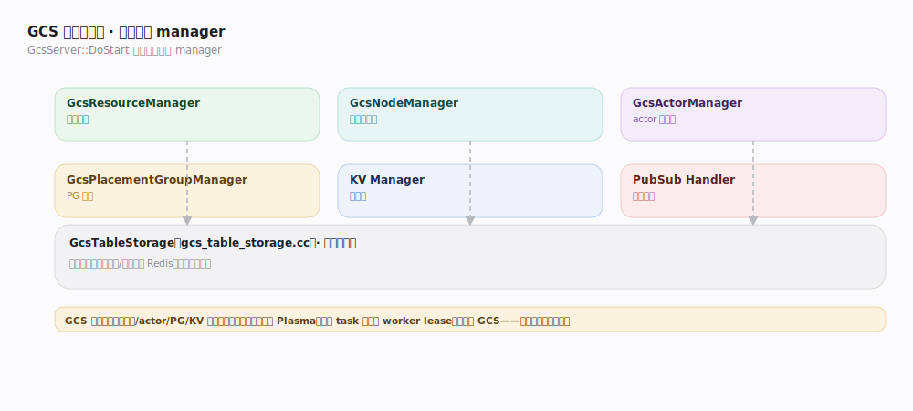
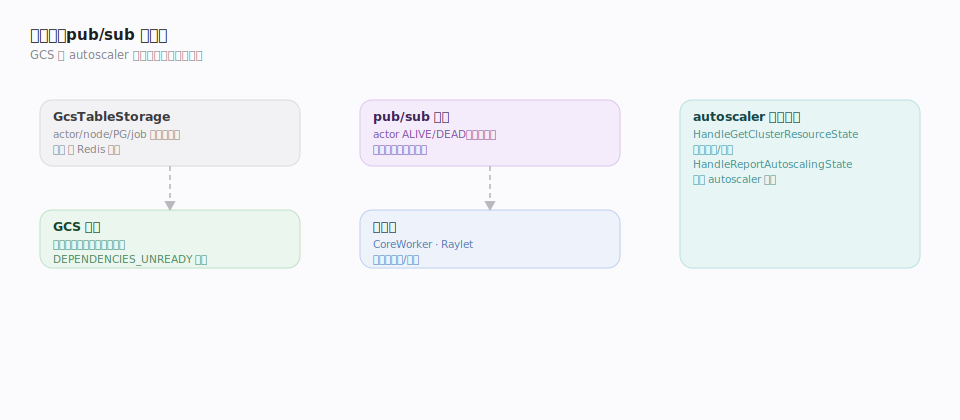

# Ray 支撑能力域 · 全局控制存储 GCS

> **定位**：Ray 集群的**控制面真源**。GCS（Global Control Store）跑在 head 节点，保存并广播集群的全局状态——节点列表、actor 注册表、placement group、job、KV 元数据——是"集群的真源之书"。它**只管控制面**：对象值走 Plasma、task 调度走 worker lease，都**不经 GCS**，这是 Ray 能扩到百万级细粒度 task 的关键。核实基准 `src/ray/gcs/gcs_server.cc`、`gcs_node_manager.cc`、`gcs_table_storage.cc`、`gcs/actor/gcs_actor_manager.cc`（commit 2a70ac4）。被三条接口主线与多数支撑域依赖。

## 一、GCS 全景：一进程多 manager

`GcsServer::DoStart`（`gcs_server.cc:314`）按序初始化一组子 manager，各管一类全局状态：

- **GcsResourceManager**（`InitGcsResourceManager`，`:317/489`）：汇总各节点上报的资源总量/可用量，供调度与 autoscaler 决策。
- **GcsNodeManager**（`InitGcsNodeManager`，`:412`）：节点注册表，`HandleRegisterNode`（`gcs_node_manager.cc:102`）纳入新节点、`AddNode`（`:572`）、`HandleUnregisterNode`（`:172`）/`DrainNode`（`:216`）下线节点。
- **GcsActorManager**（`InitGcsActorManager`，`:577`）：actor 注册表与状态机（见「Actor 生命周期与调度」）。
- **GcsPlacementGroupManager**（`InitGcsPlacementGroupManager`，`:636`）：placement group 编排（见「资源管理与放置组」）。
- **KV Manager**（`InitKVManager`，`:746`）：通用键值元数据（内部配置、集群元信息）。
- **PubSub Handler**（`InitPubSubHandler`，`:813`）：状态变更的发布订阅通道，让 worker 订阅 actor/节点状态。

所有 manager 共用一层 **GcsTableStorage**（`gcs_table_storage.cc`）作为持久化抽象，后端可为内存或 Redis。

## 二、表存储、pub/sub 与容错

- **表存储抽象**：`GcsTableStorage` 把 actor/node/placement group/job 各建一张逻辑表，屏蔽后端。默认内存存储（单机/测试）；生产可接 Redis 做持久化，让 GCS 崩溃后可**从存储恢复**全局状态。
- **pub/sub**：状态变更（actor ALIVE/DEAD、节点增删、资源更新）经 GCS pub/sub 广播；订阅者（CoreWorker、Raylet）据此更新本地视图——例如 actor handle 持有者收到 ALIVE 才发方法调用。
- **GCS 容错**：GCS 曾是单点，现支持重启后从表存储恢复状态、重连各 Raylet；`DEPENDENCIES_UNREADY` 之类状态在恢复时特判（`gcs_actor_manager.cc:839`）。job/actor 的生命周期归属让 GCS 能在 driver 退出时回收对应资源。
- **autoscaler 接口**：`GcsAutoscalerStateManager::HandleGetClusterResourceState`（`gcs_autoscaler_state_manager.cc:51`）把聚合后的资源需求/供给暴露给 autoscaler，`HandleReportAutoscalingState`（`:67`）回收 autoscaler 决策——GCS 是 autoscaler 与集群之间的状态枢纽。

## 深化表

| 技术点 | 机制 | 源码锚点 |
|---|---|---|
| GCS 启动编排 | DoStart 按序初始化各 manager | `gcs_server.cc:314` |
| 资源汇总 | GcsResourceManager 聚合上报 | `gcs_server.cc:317/489` |
| 节点注册表 | RegisterNode/AddNode/Drain | `gcs_node_manager.cc:102/172/216/572` |
| actor 注册表 | InitGcsActorManager | `gcs_server.cc:577` |
| placement group | InitGcsPlacementGroupManager | `gcs_server.cc:636` |
| KV 元数据 | InitKVManager | `gcs_server.cc:746` |
| pub/sub 广播 | InitPubSubHandler | `gcs_server.cc:813` |
| autoscaler 状态枢纽 | Get/Report 集群资源状态 | `gcs_autoscaler_state_manager.cc:51/67` |

## 调优要点

- **GCS 持久化后端**：生产接 Redis（或等价）让 GCS 可恢复；纯内存后端 GCS 挂了全局状态丢失。
- **head 节点资源**：GCS 集中处理注册/心跳/pub-sub，head 节点给足 CPU/内存，别和重计算 worker 混部。
- **控制面别塞数据**：不要把大对象或高频细粒度状态往 GCS KV 里放；GCS 是控制面，数据面走 Plasma。
- **心跳与超时**：节点心跳间隔与失活判定影响故障检测时延与误杀，按网络质量调。

## 常见误区

- ❌ "GCS 记录每个对象的引用计数" → 对象级引用计数在 owner 的 CoreWorker 本地，GCS 只管 actor/节点/PG/KV 等**集群级**状态。
- ❌ "所有 task 调度都问 GCS" → 普通 task 走去中心化 worker lease（问 Raylet）；只有 actor 创建、placement group 经 GCS。
- ❌ "GCS 挂了集群立刻全崩" → 有持久化后端时可恢复；且已运行的 task/对象在恢复期间多数不受影响。
- ❌ "pub/sub 是数据通道" → 它只广播控制面状态变更，不传对象值。

## 一句话总纲

**GCS 是跑在 head 节点的控制面真源——一进程内多 manager（资源/节点/actor/PG/KV/pub-sub）共用一层可持久化表存储，广播全局状态变更、承载 actor 与 PG 的集中编排、做 autoscaler 的状态枢纽；对象值与 task 调度都绕开它，这正是 Ray 可扩展的根基。**
