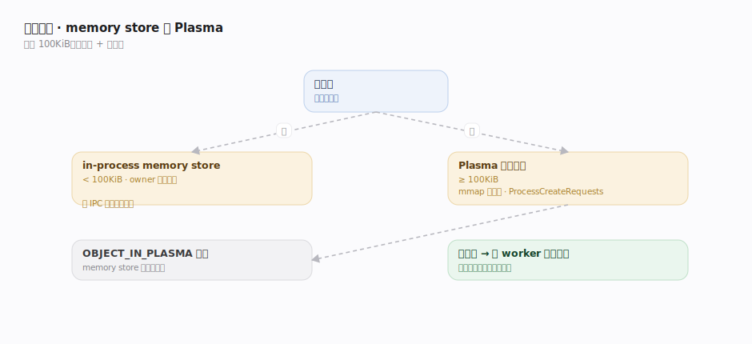
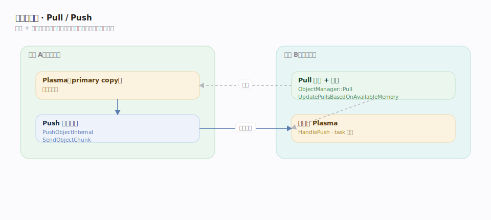
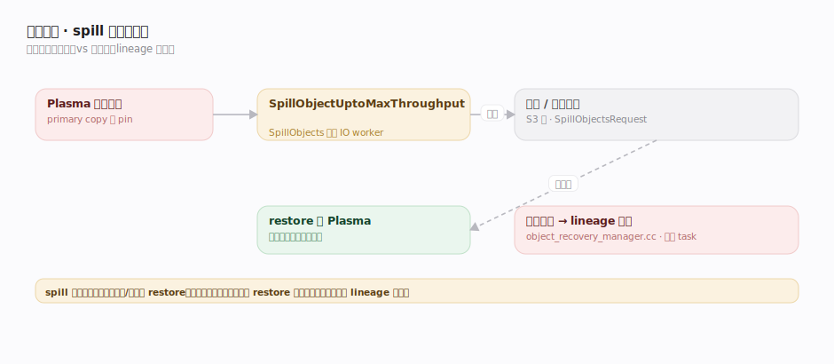

# Ray 支撑能力域 · 分布式对象存储

> **定位**：Ray 的**数据面**——`ObjectRef` 指向的值到底存在哪、怎么在节点间搬运、内存满了怎么办。灵魂是**每节点一份 Plasma 共享内存对象存储**（随 Raylet 起），配合 CoreWorker 内的 **in-process memory store** 构成两级存储；跨节点靠 ObjectManager 的 **Pull/Push**。核实基准 `src/ray/object_manager/plasma/store.cc`、`object_manager.cc`、`pull_manager.cc`、`src/ray/core_worker/store_provider/memory_store/memory_store.cc`、`src/ray/raylet/local_object_manager.cc`（commit 2a70ac4）。被「远程任务与对象」「Actor」「引用计数与容错」强依赖。

## 一、两级存储：memory store 与 Plasma

对象按大小分流到两级存储，阈值 `max_direct_call_object_size = 100*1024`（100KiB，`ray_config_def.h:245`）：

- **in-process memory store**（`CoreWorkerMemoryStore`）：小对象/小返回值直接留在 owner 进程堆内，`Put`（`memory_store.cc:174`）/`Get`（`:247`）/`GetIfExists`（`:159`），免 IPC 与序列化拷贝。
- **Plasma 共享内存**（`PlasmaStore`）：大对象放进随 Raylet 起的共享内存段。`CreateObject`（`plasma/store.cc:174`）分配一段共享内存，client `mmap` 后**零拷贝**读写；创建请求排队由 `ProcessCreateRequests`（`:509`）在内存不足时择机满足。
- **哨兵桥接**：对象进 Plasma 时，memory store 存一个 `OBJECT_IN_PLASMA` 哨兵，`Get` 命中哨兵即转 Plasma 取值。CoreWorker `PutInLocalPlasmaStore`（`core_worker.cc:1076`）负责把大对象落本地 Plasma。

**不可变 + 零拷贝**是共享内存能安全被多 worker 并发读的前提：对象一旦封存即只读，多个消费者 `mmap` 同一段物理内存，无需复制。

## 二、跨节点传输：Pull / Push

消费方所在节点没有某对象时，靠 ObjectManager 拉取：

- **Pull（拉）**：`ObjectManager::Pull`（`object_manager.cc:221`）登记一个 pull 请求，`PullManager::Pull`（`pull_manager.cc:53`）向拥有副本的节点发起拉取；`UpdatePullsBasedOnAvailableMemory`（`:233`）按可用内存**限流**激活哪些 pull bundle，避免拉爆本地 Plasma。
- **Push（推）**：`ObjectManager::Push`（`object_manager.cc:369`）/ `PushObjectInternal`（`:493`）把对象**分块**（`SendObjectChunk`，`:536`）主动推给目标节点；对端 `HandlePush`（`:591`）落盘到本地 Plasma。`HandlePull`（`:664`）响应远端的拉请求转为 Push。
- **依赖驱动**：task 执行前，Raylet 的 lease dependency manager 触发 Pull，把参数对象拉到 worker 本地 Plasma 才放行执行——这把「数据依赖」翻译成「对象传输」。

分块 + 内存感知限流让大对象传输可在有限内存下流水推进，而非一次性占满。

## 三、内存压力：spill 落盘与恢复

Plasma 内存有限，压力大时把对象溢出到外部存储：

- **spill**：`LocalObjectManager::SpillObjectUptoMaxThroughput`（`local_object_manager.cc:145`）在内存吃紧时持续把对象 spill 到磁盘/远端（S3 等），`SpillObjects`（`:253`）/`SpillObjectsInternal`（`:258`）委托 IO worker 执行 `SpillObjectsRequest`（`:305`）。
- **primary copy 与 pin**：owner 决定对象的 primary 副本所在；被 pin 的对象不能被 evict，直到引用计数允许释放。
- **恢复**：需要一个已 spill 的对象时从外部存储 restore 回 Plasma；若副本彻底丢失且不可 restore，则交由「引用计数与容错」按 lineage **重算**（`object_recovery_manager.cc`）。

spill 是**软容错**（值还在，只是换了介质）；lineage 重算是**硬容错**（值没了，重跑 task 再造）。二者互补。

## 深化表

| 技术点 | 机制 | 源码锚点 |
|---|---|---|
| 两级分流阈值 | <100KiB in-process，否则 Plasma | `ray_config_def.h:245` |
| memory store 存取 | 进程内小对象免 IPC | `memory_store.cc:159/174/247` |
| Plasma 创建对象 | 共享内存分配 + mmap 零拷贝 | `plasma/store.cc:174/509` |
| 大对象落本地 Plasma | PutInLocalPlasmaStore | `core_worker.cc:1076` |
| Pull 拉取 + 限流 | 内存感知激活 pull bundle | `object_manager.cc:221`、`pull_manager.cc:53/233` |
| Push 分块传输 | 主动分块推送 | `object_manager.cc:369/493/536` |
| 应答远端 pull/push | HandlePull/HandlePush | `object_manager.cc:591/664` |
| spill 落盘 | 内存压力下溢出到磁盘/远端 | `local_object_manager.cc:145/253` |

## 调优要点

- **对象存储内存**：`object_store_memory` 给足；给 spill 配好本地盘或对象存储目录，避免 spill 风暴。
- **局部性**：让消费 task 与其大参数对象同节点，减少跨网 Pull。
- **`ray.put` 大对象一次、多 task 共享**：省重复序列化；小对象别硬塞 Plasma（走 in-process 更快）。
- **背压**：大量小对象用 streaming generator / `num_returns="dynamic"` 控产出速率，避免 Plasma 被瞬时打满触发 spill。
- **避免长期 pin**：及时释放不再用的 ObjectRef，让 Plasma 能 evict/GC。

## 常见误区

- ❌ "对象靠多副本复制容错" → Ray 对象**不可变、按 lineage 重算**，spill 只是换介质不是持久多副本。
- ❌ "所有对象都进 Plasma" → <100KiB 走 in-process memory store。
- ❌ "Pull 会一次拉满内存" → PullManager 按可用内存**限流**激活。
- ❌ "spill 了就等于丢了" → spill 的值还在磁盘/远端可 restore；只有副本全丢才走 lineage 重算。

## 一句话总纲

**对象值按 100KiB 阈值分流到「in-process memory store（小、免 IPC）/ Plasma 共享内存（大、零拷贝）」两级，跨节点靠 ObjectManager 分块 Pull/Push（内存感知限流），内存压力下 spill 落盘（软容错），副本全丢再交 lineage 重算（硬容错）。**
