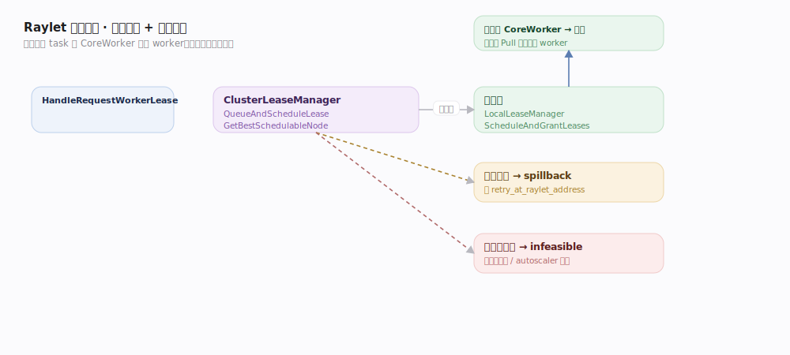
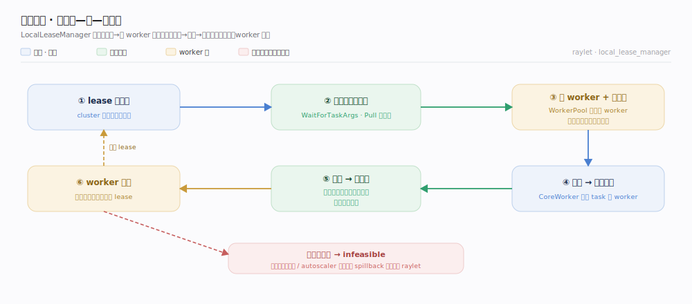
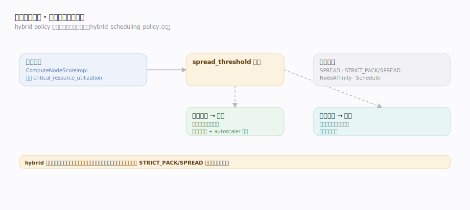

# Ray 支撑能力域 · 分布式调度

> **定位**：worker lease 请求到达 Raylet 之后，"选哪个节点、能不能在本地跑、跑不下怎么办"的决策机制。核心是 **cluster / local 两级 lease manager + cluster resource scheduler + 混合调度策略（hybrid policy）**。它是「远程 task 提交与依赖」去中心化流水线的**服务端一半**：CoreWorker 负责租与直投，Raylet 负责选点与授租。核实基准 `src/ray/raylet/scheduling/cluster_lease_manager.cc`、`local_lease_manager.cc`、`policy/hybrid_scheduling_policy.cc`、`src/ray/raylet/node_manager.cc`（commit 2a70ac4）。依赖「资源管理与放置组」（资源视图）、「全局控制存储 GCS」（集群资源上报）。

## 一、两级 lease manager：集群选点 + 本地授租

Raylet 收到 `HandleRequestWorkerLease`（`node_manager.cc:1890`）后，调度分两级：

1. **ClusterLeaseManager（集群级选点）**：`QueueAndScheduleLease`（`cluster_lease_manager.cc:45`）把 lease 入队；`ScheduleAndGrantLeases`（`:195`）对每个待调度 lease 调 `cluster_resource_scheduler_.GetBestSchedulableNode`（`:213/311`）在**全集群资源视图**里选最合适的节点。
   - 选中**本节点** → 交本地 lease manager 授租。
   - 选中**别的节点** → **spillback**：回一个 `retry_at_raylet_address` 让 CoreWorker 改投那个节点的 Raylet（对应客户端 `normal_task_submitter.cc:314` 的 spillback 分支）。
   - **无可行节点** → 记为 infeasible，等资源变化或 autoscaler 扩容。
2. **LocalLeaseManager（本地授租）**：`ScheduleAndGrantLeases`（`local_lease_manager.cc:126`）在本节点授租——完整的**资源借—用—还闭环**见下图。

本地授租是一条闭环：等 task 参数依赖 Pull 就绪（`WaitForTaskArgsRequests`）→ 从 WorkerPool 取空闲 worker 并从节点可用量中**扣减**声明的资源（借）→ 授租给 CoreWorker、task 直投该 worker 执行 → 执行完把资源**加回**可用量、worker 回池复用（还）；无可行节点则挂起等资源变化，或 spillback 改投别的 Raylet。**去中心化的本质**：Raylet 只决定"在哪个 worker 上跑"，跑起来后数据流由 CoreWorker 直投承载，调度器不再参与。

## 二、混合调度策略：打包与铺开的平衡

选点算法默认是 **hybrid policy**（`hybrid_scheduling_policy.cc`）——在"打包（少用节点、提升局部性）"与"铺开（避免热点）"之间取平衡：

- 给每个候选节点算一个 score：`ComputeNodeScoreImpl`（`:45`）以节点的**关键资源利用率**（`critical_resource_utilization`）为基础。
- **spread_threshold**（`:48`）是拐点：利用率**低于**阈值的节点优先按打包挑（填满一个再用下一个，提升局部性、利于 autoscaler 缩容）；一旦超过阈值就倾向铺开到利用率更低的节点，避免过载。
- `Schedule`（`:183`）综合 score 与 `spread_threshold_`（`:189`）选出最终节点；可叠加 node affinity、data locality 偏好（`preferred_node_id`）。
- 其它策略：`SPREAD`（尽量铺开）、`STRICT_PACK/STRICT_SPREAD`（放置组用，见「资源管理与放置组」）、`NodeAffinity`（钉到指定节点）。

hybrid 的价值：默认既省节点（利于缩容降本）又防单点过载，无需用户手调。

## 深化表

| 技术点 | 机制 | 源码锚点 |
|---|---|---|
| lease 入口 | Raylet 处理租 worker 请求 | `node_manager.cc:1890` |
| 集群级入队调度 | QueueAndScheduleLease | `cluster_lease_manager.cc:45` |
| 全集群选点 | GetBestSchedulableNode | `cluster_lease_manager.cc:195/213` |
| spillback 改投 | 回 retry_at_raylet_address | `cluster_lease_manager.cc`、`normal_task_submitter.cc:314` |
| 本地授租 | 等依赖就绪 + 取 worker | `local_lease_manager.cc:126` |
| 节点打分 | 关键资源利用率 score | `hybrid_scheduling_policy.cc:45/48` |
| 打包/铺开拐点 | spread_threshold | `hybrid_scheduling_policy.cc:56/183/189` |

## 调优要点

- **spread_threshold**：调大更倾向打包（省节点、利局部性、利缩容），调小更倾向铺开（防热点）。
- **scheduling_strategy**：用 `SPREAD` 分散副本、`NodeAffinity` 钉节点、`PlacementGroupSchedulingStrategy` 绑资源包。
- **data locality**：让 task 调度到其大参数对象所在节点，减少依赖 Pull 跨网。
- **infeasible 观测**：持续 infeasible 说明资源缺口，配合 autoscaler 扩容或修正资源需求声明。
- **task 粒度**：微秒级 task 的调度/租约开销占比高，聚合到合适粒度。

## 常见误区

- ❌ "调度是中央 driver 干的" → Ray 调度**去中心化**：CoreWorker 向 Raylet 租 worker，选点在 Raylet 的 cluster/local lease manager。
- ❌ "hybrid 只会铺开" → 低于 spread_threshold 时**优先打包**，超过才铺开。
- ❌ "spillback 是失败重试" → 是**本地放不下、改投更合适节点**的正常路径，非错误。
- ❌ "task 跑起来还归调度器管" → 授租后 task 直投 worker，调度器退出数据流。

## 一句话总纲

**Raylet 两级调度：ClusterLeaseManager 在全集群资源视图里 GetBestSchedulableNode 选点（本地/spillback/infeasible），LocalLeaseManager 等依赖就绪后从 WorkerPool 授租；默认 hybrid policy 以关键资源利用率打分、以 spread_threshold 在打包与铺开间取平衡——选完点后 task 由 CoreWorker 直投 worker。**
