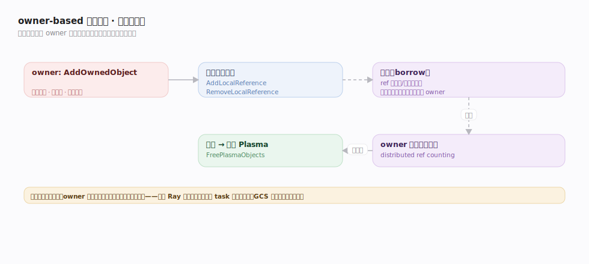
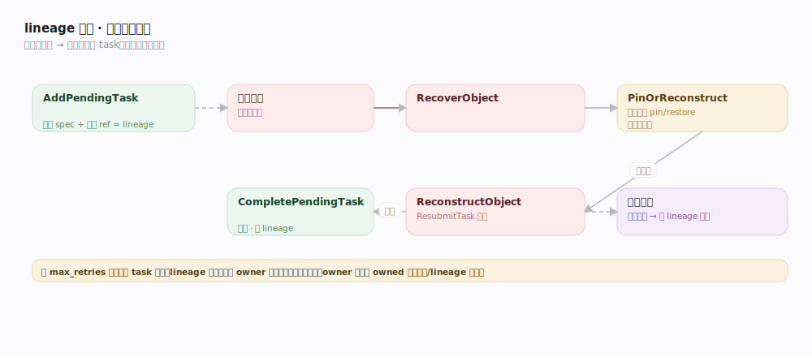

# Ray 支撑能力域 · owner-based 引用计数与容错

> **定位**：Ray 容错与内存回收的心脏。**谁创建 ObjectRef，谁就是它的 owner**；owner 的 CoreWorker 在本地 `ReferenceCounter` 里独立维护该对象的引用计数、值所在位置与创建它的 task lineage。引用归零则回收，值丢失则按 lineage 重算——**全程去中心化，GCS 不参与对象级引用**，这是 Ray 扩到百万级 task 的根基。核实基准 `src/ray/core_worker/reference_counter.cc`、`object_recovery_manager.cc`、`task_manager.cc`（commit 2a70ac4）。支撑「远程任务与对象」「Actor」「分布式对象存储」。

## 一、owner-based 引用计数：借用与归还

- **登记 owned 对象**：owner 创建对象时 `AddOwnedObject`（`reference_counter.cc:223`，内部 `AddOwnedObjectInternal:349`）记录元数据、值位置、初始引用。
- **本地引用增减**：ObjectRef 变量进出作用域触发 `AddLocalReference`（`:421`）/`RemoveLocalReference`（`:466`）。
- **借用（borrow）**：ObjectRef 作为参数传给别的 task/actor，或被返回给调用者，被**借用**——`AddBorrowedObject`（`:122`，内部 `AddBorrowedObjectInternal:129`）。借用者用完把借用信息**回传给 owner**，owner 据此合并引用状态。这套 **distributed ref counting** 让引用跨进程/节点仍能被 owner 精确追踪。
- **归零回收**：owner 侧所有本地引用 + 借用引用都归零后，对象可从 Plasma 释放；`FreePlasmaObjects`（`:719`）主动释放。
- **单点决策**：引用状态只在 owner 一处收敛，无需全局一致性协议——对比集中式引用表，这是可扩展性的关键取舍。

## 二、lineage 重建：值丢了就重算

对象**不可变**，因此丢失时可靠"重跑造它的 task"恢复，而非依赖多副本：

1. **lineage 登记**：提交 task 时 `TaskManager::AddPendingTask`（`task_manager.cc:319`）在 owner 本地记录 task spec 与其返回 ObjectRef——这就是 lineage（对象的"出生族谱"）。
2. **丢失检测**：消费方发现对象副本全丢，触发 `ObjectRecoveryManager::RecoverObject`（`object_recovery_manager.cc:24`）。
3. **先找副本再重算**：`PinOrReconstructObject`（`:93`）先查其它节点是否还有副本可 pin/restore；确实没有才 `ReconstructObject`（`:140`）。
4. **按 lineage 重放**：`ReconstructObject` 让 TaskManager 依登记的 spec `ResubmitTask`（`task_manager.cc:433`）重跑造它的 task；该 task 的参数若也丢了，**递归**沿 lineage 上溯重算（`RecoverObject` 对依赖再调用，`:169`）。
5. **落值清账**：task 成功后 `CompletePendingTask`（`task_manager.cc:1158`）落值、按需清理 lineage。
6. **边界**：受 `max_retries` 限制；重算假设 task **幂等**（有副作用的 task 慎设重试）；lineage 无限增长会占内存，故成功后适时截断。

**软/硬容错分工**：值还在（spill 到磁盘）→ restore（软）；值全丢 → lineage 重算（硬）。

## 深化表

| 技术点 | 机制 | 源码锚点 |
|---|---|---|
| 登记 owned 对象 | 元数据 + 值位置 + 引用 | `reference_counter.cc:223/349` |
| 本地引用增减 | 作用域进出 | `reference_counter.cc:421/466` |
| 借用与回传 | 跨进程 distributed ref counting | `reference_counter.cc:122/129` |
| 归零释放 Plasma | FreePlasmaObjects | `reference_counter.cc:719` |
| lineage 登记 | AddPendingTask 记 spec+ref | `task_manager.cc:319` |
| 丢失恢复入口 | RecoverObject | `object_recovery_manager.cc:24` |
| 先副本后重算 | PinOrReconstructObject | `object_recovery_manager.cc:93/140` |
| 按 lineage 重放 | ResubmitTask（可递归上溯） | `task_manager.cc:433`、`object_recovery_manager.cc:169` |
| 落值清账 | CompletePendingTask | `task_manager.cc:1158` |

## 调优要点

- **max_retries / max_task_retries**：按 task 幂等性设；有副作用的 task 设 0 或做幂等保护。
- **lineage 内存**：超长/宽的 lineage 占 owner 内存；`ray.put` 或 checkpoint 关键中间结果，截断重算链。
- **owner 存活是前提**：owner 进程挂了，其 owned 对象的引用与 lineage 随之失效——把长生命周期对象的 owner 放在稳定进程（如 detached actor）。
- **及时释放 ObjectRef**：不用的 ref 尽早出作用域，让引用归零、Plasma 可回收。

## 常见误区

- ❌ "对象靠多副本复制容错" → 靠 **lineage 重算**；不可变 + 可重跑是前提。
- ❌ "GCS 统一管引用计数" → 引用计数在**每个 owner 的 CoreWorker 本地**，去中心化。
- ❌ "重算一定成功" → 受 `max_retries` 限、假设幂等；副作用 task 重算可能出错。
- ❌ "owner 挂了对象还在" → owner 掌管对象命运，owner 丢失则其对象的引用/lineage 失效。

## 一句话总纲

**每个对象由创建它的 owner 在本地 ReferenceCounter 里追踪引用（含跨进程借用回传），归零即回收；值丢失时 ObjectRecoveryManager 先找副本、再按 owner 登记的 lineage 递归 ResubmitTask 重算——去中心化、不可变 + 可重跑，让 Ray 在百万级 task 下仍能精确回收与容错。**
