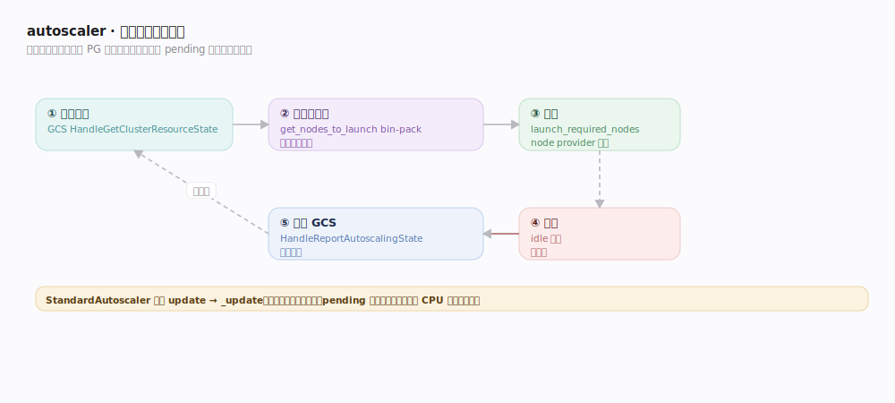
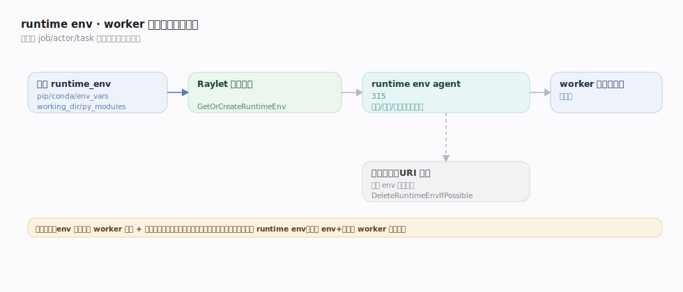

# Ray 支撑能力域 · 集群自动伸缩与运行时环境

> **定位**：集群的**生命周期基础设施**——两件事。① **autoscaler**：按 pending 的资源需求自动**增删物理节点**，让集群规模跟随负载（弹性降本）。② **runtime env**：在 worker 启动前**准备隔离的依赖环境**（pip/conda/env vars/working_dir），让不同 job/actor 带各自依赖而不污染基础镜像。二者都不在数据/调度关键路径上，是"让集群自己长大缩小、让 worker 有对的环境"的后台机制。核实基准 `python/ray/autoscaler/_private/autoscaler.py`、`resource_demand_scheduler.py`、`src/ray/gcs/gcs_autoscaler_state_manager.cc`、`python/ray/_private/runtime_env/agent/runtime_env_agent.py`、`src/ray/raylet/runtime_env_agent_client.cc`（commit 2a70ac4）。

## 一、autoscaler：需求驱动的扩缩环

autoscaler（`StandardAutoscaler`，`autoscaler.py:172`）跑一个周期性 `update`（`:367`）→ `_update`（`:379`）控制环，五步如上图：**①收集需求**（GCS `HandleGetClusterResourceState`，`gcs_autoscaler_state_manager.cc:51`，暴露待满足需求+供给+gang 请求）→ **②算要开多少**（`ResourceDemandScheduler.get_nodes_to_launch`，`resource_demand_scheduler.py:167`，bin-packing 装箱算各节点类型台数；`_get_concurrent_resource_demand_to_launch:388` 限流防过冲）→ **③扩容**（`launch_required_nodes`，`autoscaler.py:736`，经 node provider 云/K8s/本地拉起）→ **④缩容**（`:475` 按 min/max/idle 回收、`:1239` 杀失活）→ **⑤回报**（`HandleReportAutoscalingState`，`:67`，决策写回 GCS 闭环）。

**关键点**：autoscaler 管**物理节点数**（对比「资源管理与放置组」管**逻辑资源账本**）；它响应的是"调度不下、pending 的需求"，不是简单 CPU 利用率。

## 二、runtime env：worker 启动前的环境准备

runtime env 让依赖随 job/actor/task 走：

- **声明**：`ray.init(runtime_env=…)` 或 `@ray.remote(runtime_env=…)`（pip/conda/env_vars/working_dir/py_modules）。
- **agent 准备**：每节点跑一个 **runtime env agent**（`runtime_env_agent.py`，`RuntimeEnvAgent` 类，`:165`）。Raylet 拉起 worker 前经 `runtime_env_agent_client.cc` 的 `GetOrCreateRuntimeEnv`（`:369`）请求准备；agent 的 `GetOrCreateRuntimeEnv`（`runtime_env_agent.py:315`）**下载/安装/解压**依赖到隔离目录，带重试（`_create_runtime_env_with_retry`，`:371`），worker 起在该环境里。
- **缓存与复用**：相同 runtime env 的准备结果被缓存，`DeleteRuntimeEnvIfPossible`（`:551`）在无引用时清理，靠引用计数（URI 级）决定何时删。相同 env + 相同函数签名的 worker 可复用，避免反复安装。
- **层叠**：job 级 env 作默认，task/actor 级可覆盖。

**代价意识**：env 变更会触发新 worker 的依赖安装（非零成本），故把稳定依赖固化进镜像、只把差异放 runtime env。

## 深化表

| 技术点 | 机制 | 源码锚点 |
|---|---|---|
| autoscaler 控制环 | update → _update 周期驱动 | `autoscaler.py:172/367/379` |
| 需求/供给汇总 | GCS 暴露集群资源状态 | `gcs_autoscaler_state_manager.cc:51` |
| 算扩容节点 | bin-pack pending 需求 | `resource_demand_scheduler.py:167/388` |
| 拉起节点 | node provider 扩容 | `autoscaler.py:736` |
| 缩容/杀失活 | idle 超时 + 健康检查回收 | `autoscaler.py:475/1239` |
| 决策回写 | ReportAutoscalingState | `gcs_autoscaler_state_manager.cc:67` |
| env agent 准备 | GetOrCreateRuntimeEnv 装依赖 | `runtime_env_agent.py:165/315/371` |
| Raylet 请求准备 | 客户端 GetOrCreateRuntimeEnv | `runtime_env_agent_client.cc:369` |
| env 引用清理 | 无引用时删缓存 | `runtime_env_agent.py:551` |

## 调优要点

- **min/max workers、idle_timeout**：按负载波动设；idle 超时太长浪费、太短抖动（反复扩缩）。
- **upscaling_speed / 并发启动限流**：控制扩容激进度，避免瞬时拉起过多节点。
- **多节点类型**：给不同资源画像（CPU/GPU/内存）配节点类型，让 bin-packing 挑最省的。
- **runtime env 瘦身**：稳定依赖进镜像，只把差异放 env；避免超大 working_dir（有上传大小限制，剥离数据文件）。
- **env 复用**：固定函数签名 + 固定 env 促 worker 复用，减少反复安装。

## 常见误区

- ❌ "autoscaler 按 CPU 利用率扩缩" → 按**pending 的资源需求**（调度不下的 task/actor/gang），非利用率阈值。
- ❌ "autoscaler 和 placement group 是一回事" → PG 管逻辑资源预留；autoscaler 管物理节点增删（STRICT PG 放不下可触发扩容）。
- ❌ "runtime env 改一下很便宜" → 变更触发 worker 重建 + 依赖安装，非零成本。
- ❌ "worker 数固定 = CPU 数" → worker 由 WorkerPool 按 lease 动态起停，节点数由 autoscaler 弹性伸缩。

## 一句话总纲

**autoscaler 跑 update 控制环：从 GCS 读 pending 资源需求 → bin-pack 算要开的节点类型 → node provider 扩容、idle 超时缩容，决策回写 GCS（管物理节点、对比 PG 管逻辑资源）；runtime env agent 在 worker 启动前按声明下载安装隔离依赖、按引用计数缓存复用——二者是让集群自适应长大缩小、让 worker 有对的环境的后台基础设施。**
