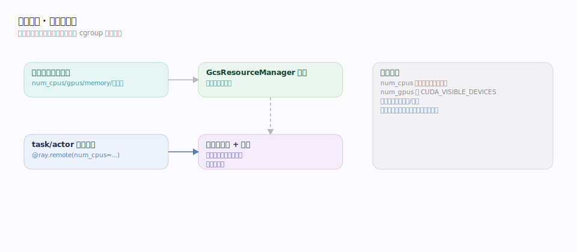
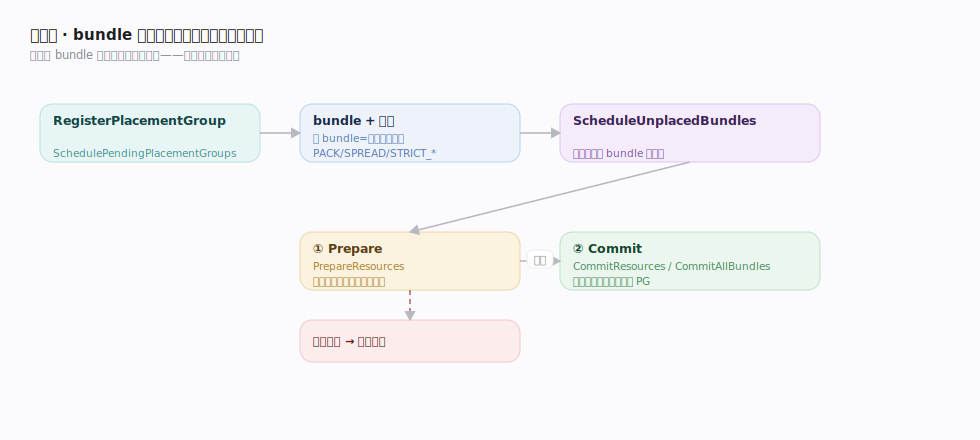

# Ray 支撑能力域 · 资源管理与放置组

> **定位**：Ray 的**逻辑资源模型**与**成组放置（gang scheduling）**。资源在 Ray 里是抽象的键值配额（CPU/GPU/memory/自定义），task/actor 声明需求、调度器按可用量匹配；**placement group** 则把多个资源 **bundle** 作为一个整体、按策略（PACK/SPREAD/STRICT_*）原子地预留到集群，服务于"训练进程组要同机/分散"这类需求。核实基准 `src/ray/gcs/gcs_placement_group_manager.cc`、`gcs_placement_group_scheduler.cc`（commit 2a70ac4）。依赖「全局控制存储 GCS」（PG 编排）、「分布式调度」（资源匹配），与「集群自动伸缩」互动（需求驱动扩容）。

## 一、逻辑资源：声明式配额

Ray 的资源是**逻辑账本**而非物理隔离：

- 每节点向 GCS 上报资源总量（`num_cpus`/`num_gpus`/`memory`/自定义如 `{"accelerator":2}`）；GcsResourceManager 汇总成全集群视图。
- task/actor 用 `@ray.remote(num_cpus=…, num_gpus=…, resources=…)` **声明需求**；调度器（见「分布式调度」）在有足够**可用**资源的节点上授租，并从该节点可用量中扣减，执行完归还。
- **只是记账**：`num_cpus` 不做 CPU 绑核，`num_gpus` 才通过设置 `CUDA_VISIBLE_DEVICES` 做软隔离。资源是"调度并发度的旋钮"，不是 cgroup 级硬隔离。
- **自定义资源**做标签/亲和：给特殊节点打自定义资源标签，task 声明该资源即被钉到这类节点。

这套声明式模型让"要多少给多少、按可用量并发"成为调度的统一语言。

## 二、放置组：bundle 的原子成组放置（两阶段提交）

placement group 把一组 **bundle**（每个 bundle = 一份资源需求，如 `{"CPU":1,"GPU":1}`）按策略整体预留：

- **策略**：`PACK`（尽量同节点，`gcs_placement_group_scheduler.cc:540`）、`SPREAD`（尽量分散，`:542`）、`STRICT_PACK`（必须同节点，`:544`）、`STRICT_SPREAD`（必须分散）。训练常用 STRICT_PACK/SPREAD 保证进程组拓扑。
- **注册**：`GcsPlacementGroupManager::RegisterPlacementGroup`（`gcs_placement_group_manager.cc:113`）落 GCS；`SchedulePendingPlacementGroups`（`:306`）驱动调度。
- **两阶段提交（2PC）**——原子预留的核心：`ScheduleUnplacedBundles`（`gcs_placement_group_scheduler.cc:41`）先按策略为每个 bundle 选节点，然后
  1. **Prepare**：`PrepareResources`（`:196`）向各选中节点**预留**资源（可回滚）。
  2. **Commit**：全部 prepare 成功后 `CommitResources`（`:229`）/`CommitAllBundles`（`:341`）提交，资源正式归该 PG。任一 prepare 失败则回滚，PG 整体重排队——**要么全成、要么全不成**，避免部分占用导致的死锁。
- **成功回调**：`OnPlacementGroupCreationSuccess`（`gcs_placement_group_manager.cc:252`）通知等待方；此后 task/actor 用 `PlacementGroupSchedulingStrategy` + bundle index 调度进这些预留槽位。

## 深化表

| 技术点 | 机制 | 源码锚点 |
|---|---|---|
| 资源上报汇总 | 节点上报 → GcsResourceManager | `gcs_server.cc:317/489` |
| 声明式需求 | num_cpus/num_gpus/自定义资源 | `@ray.remote(...)` |
| PG 注册 | RegisterPlacementGroup 落 GCS | `gcs_placement_group_manager.cc:113` |
| PG 调度驱动 | SchedulePendingPlacementGroups | `gcs_placement_group_manager.cc:306` |
| bundle 选点 | ScheduleUnplacedBundles 按策略 | `gcs_placement_group_scheduler.cc:41` |
| 2PC-Prepare | 各节点预留资源（可回滚） | `gcs_placement_group_scheduler.cc:196` |
| 2PC-Commit | 全成后提交 | `gcs_placement_group_scheduler.cc:229/341` |
| 放置策略 | PACK/SPREAD/STRICT_* | `gcs_placement_group_scheduler.cc:540-544` |
| 创建成功回调 | 通知等待方可用 | `gcs_placement_group_manager.cc:252` |

## 调优要点

- **资源声明要准**：`num_cpus` 决定并发度；声明过大浪费、过小超订导致过载。GPU 任务显式 `num_gpus`。
- **PG 策略选型**：同机通信密集用 (STRICT_)PACK；高可用/抗单点用 (STRICT_)SPREAD。
- **bundle 粒度**：bundle 太碎难放置、太粗浪费；按进程实际需求切。
- **PG 与 autoscaler**：STRICT PG 放不下会触发扩容（gang resource request）；预热或预留节点减少等待。
- **及时释放 PG**：用完 `remove_placement_group`，否则预留资源一直占用。

## 常见误区

- ❌ "num_cpus 会绑核/硬限制" → 逻辑记账，不做 cgroup 绑核；num_gpus 才设 CUDA_VISIBLE_DEVICES。
- ❌ "PG 会部分创建" → **两阶段提交、原子性**，要么全 bundle 就位要么整体回滚重排。
- ❌ "SPREAD 保证一定分散" → 非 STRICT 的 SPREAD 是**尽量**；要硬约束用 STRICT_SPREAD。
- ❌ "资源不够 task 会失败" → 会挂起等资源（可触发 autoscaler 扩容），而非直接失败。

## 一句话总纲

**资源是声明式逻辑账本（按可用量并发、非硬隔离），placement group 把多个 bundle 按 PACK/SPREAD/STRICT_* 策略、经两阶段提交（Prepare 预留 → Commit 提交，全成或全滚）原子地预留到集群——让"进程组同机/分散"的拓扑需求可被 gang scheduling 满足。**
