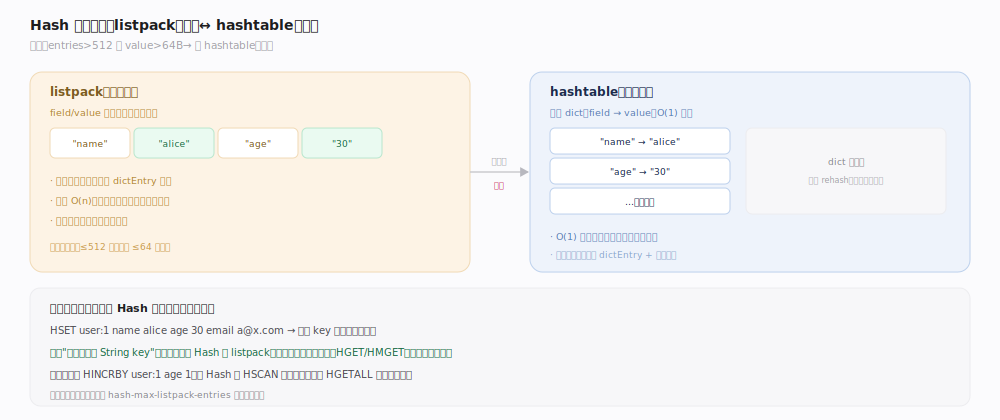
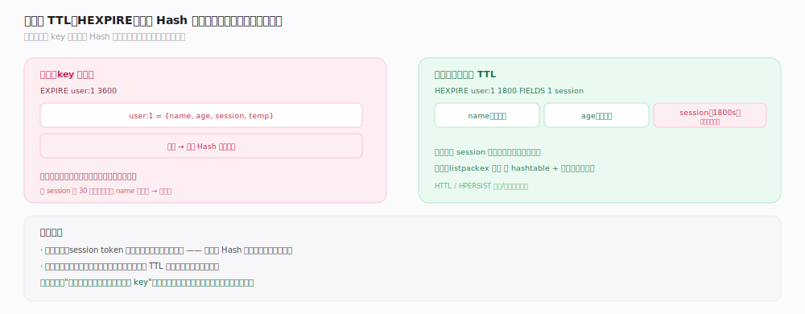

# Redis 原理 · Hash 哈希

> **定位**：Hash 是"key → 字段-值映射"的类型，适合表示对象（如一个用户的多个属性）。它依赖对象系统的两种编码（listpack / hashtable），小规模紧凑、大规模标准。近年新增字段级 TTL（HEXPIRE），并为此引入第三种编码 `listpackex`。
>
> 源码：`~/workdir/redis` unstable @e1cc3dc（2026-07，`version.h` 记 255.255.255）。主文件 `t_hash.c`，编码/阈值实现散落 `t_hash.c` / `object.c` / `config.c`。

## 一、两种编码：listpack ↔ hashtable

- **listpack**（小规模）：字段和值按 `field1, value1, field2, value2…` 交替存在一段连续内存里。省内存（无指针/dictEntry 开销），但查找是 O(n) 遍历。
- **hashtable**（大规模）：底层 dict，字段→值，O(1) 查找。
- **转换阈值**：写入前 `hashTypeTryConversion`（`t_hash.c:1537`）逐一评估——字段数超 `hash_max_listpack_entries` 时 `hashTypeConvert(..., OBJ_ENCODING_HT)`（`t_hash.c:1553-1554`），或某字段/值字节数超 `hash_max_listpack_value`（单值长度检查见 `t_hash.c:363`）也触发转换。真正执行编码切换的是 `hashTypeConvert`（`t_hash.c:3106`）。默认值在 `config.c`：`hash-max-listpack-entries`=512（`config.c:3405`）、`hash-max-listpack-value`=64（`config.c:3417`）。转换单向不可逆。

## 二、命令与对象存储模式

- **字段写入**：`HSET`（`hsetCommand`，`t_hash.c:3952`）/`HSETNX`（`hsetnxCommand`，`t_hash.c:3863`）；每次写入前都会走 `hashTypeTryConversion` 判断是否需要升级编码。
- **字段读取**：`HGET`（`hgetCommand`，`t_hash.c:4860`）/`HMGET`（`hmgetCommand`，`t_hash.c:4869`）/`HGETALL`（`hgetallCommand`，`t_hash.c:5426`）/`HDEL`（`hdelCommand`，`t_hash.c:5189`）。
- **原子计数**：`HINCRBY`（`hincrbyCommand`，`t_hash.c:4706`）/`HINCRBYFLOAT`（`hincrbyfloatCommand`，`t_hash.c:4763`）——字段级计数，如商品库存。
- **随机与扫描**：`HRANDFIELD`（`hrandfieldCommand`，`t_hash.c:5823`）随机取字段；`HSCAN`（`hscanCommand`，`t_hash.c:5439`）游标增量遍历大 Hash，不阻塞。
- **对象存储模式**：把一个对象的多个属性存一个 Hash（`user:1` → `{name, age, email}`），比"每属性一个 String key"省内存、支持部分字段读写。

## 深化 · 字段级 TTL（HEXPIRE）与 listpackex

传统 Redis 过期是 **key 级**（整个 Hash 一起过期）。较新版本支持**字段级 TTL**——单独给 Hash 的某个字段设过期。

- `HEXPIRE`（`hexpireCommand`，`t_hash.c:6381`）/`HPEXPIRE`（`hpexpireCommand`，`t_hash.c:6376`）给指定字段设过期，到点只删该字段而非整个 Hash；二者都汇入统一实现 `hexpireGenericCommand`（前置声明 `t_hash.c:64`）。
- **第三种编码 `listpackex`**：一旦给 listpack 编码的 Hash 设字段过期，会转成带过期扩展的 `OBJ_ENCODING_LISTPACK_EX`（转换点 `t_hash.c:2256`、`t_hash.c:2261`；结构定义见 `server.h:3933` 附近，`expire_time` 字段注释 `server.h:3163`）。写过期由 `hashTypeSetEx` 族完成（声明 `t_hash.c:224`，配套 init/done 见 `t_hash.c:221`/`:226`）。
- 用途：会话中不同属性不同有效期、缓存对象的部分字段刷新。

## 调优要点与误区

- `hash-max-listpack-entries`（默认 512，`config.c:3405`）/ `-value`（默认 64，`config.c:3417`）：大量小对象场景可调大阈值省内存，但会拉长 listpack 的 O(n) 查找。
- **误区："HGETALL 总是安全"**：大 Hash 的 `hgetallCommand`（`t_hash.c:5426`）会一次返回全部字段，可能阻塞——用 `HSCAN`（`t_hash.c:5439`）。
- **误区："Hash 比多个 String key 慢"**：小 Hash（listpack）反而更省内存，且对象语义更清晰。
- **误区："字段级 TTL 一直有"**：这是较新特性，依赖 `listpackex`（`t_hash.c:2256`）等新编码，老版本只有 key 级过期。

## 拓展 · HFE 的 ebuckets 与主动过期

字段级 TTL 不只是编码问题，还要能**主动清理到期字段**。Redis 为此引入 `ebuckets` 数据结构（`t_hash.c:16` 引入 `ebuckets.h`）——按到期时间组织字段，支持高效取最近到期项。每个带 HFE 的 Hash 有一份私有 ebuckets（`htExpireMetadata`，`t_hash.c:130`），记录该 Hash 内各字段的下一最小到期时间；同时向一份**全局 HFE ebuckets** 登记（`t_hash.c:169-170` 说明每次更新字段过期既更新 Hash 私有 ebuckets 也可能更新全局 DS），使后台主动过期循环能跨所有 Hash 找出到期字段清理，而非逐 key 扫描。listpackEx 编码的过期读写辅助集中在 `listpackEx functions` 区（`t_hash.c:1196`）。这套设计让"给百万 Hash 的字段各设不同 TTL"仍能被后台高效回收。

## 一句话总纲

**Hash 是字段-值映射，小规模用 listpack（连续内存、省指针开销、O(n)）、超 `hash-max-listpack-entries/value` 阈值经 `hashTypeConvert` 转 hashtable（O(1)）；适合把一个对象的多属性存一起支持部分读写与字段级计数，较新版本用 `listpackex` 编码支持字段级 TTL（HEXPIRE）。**
