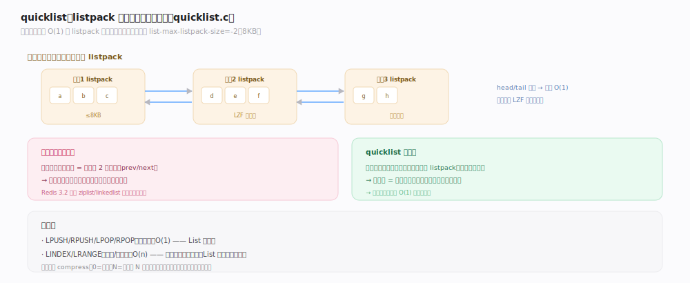
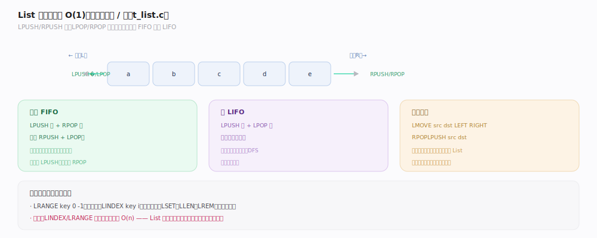
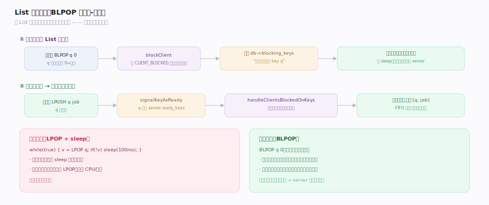

# Redis 原理 · List 列表

> **定位**：List 是有序、可重复的元素序列，双端可推可弹，适合队列/栈/消息缓冲。它依赖对象系统的 quicklist 编码（listpack 节点组成的双向链表），并与阻塞命令主线深度结合（BLPOP 等）。
>
> 源码：`~/workdir/redis` unstable @e1cc3dc（2026-07，`version.h` 记 255.255.255）。主文件 `t_list.c`，底层容器 `quicklist.c`，阻塞基座 `blocked.c`。

## 一、编码：listpack → quicklist

- **listpack**（小 List）：整个 List 存一段连续内存，节点少、指针零开销。
- **quicklist**（大 List）：**listpack 节点组成的双向链表**——既有链表的两端 O(1) 增删，又用 listpack 节点减少指针开销和内存碎片。
- **升/降级**：每次追加走 `listTypeTryConversionAppend`（`t_list.c:136`），删除后走 `listTypeTryConversion` 的收缩分支（`t_list.c:130`）。真正建 quicklist 时把 `list_max_listpack_size` 与 `list_compress_depth` 传入 `quicklistNew`（`t_list.c:46`）。
- **节点大小**：`list-max-listpack-size` 默认 -2（`config.c:3323`），负值映射为字节上限档位——`quicklist.c` 的 `optimization_level[] = {4096,8192,16384,32768,65536}`（`quicklist.c:49`），-2 即每节点 8KB；另有硬上限 `SIZE_SAFETY_LIMIT` 8192（`quicklist.c:69`）。超限拆新节点。
- **LZF 压缩**：中间节点可压缩（`__quicklistCompressNode`，`quicklist.c:236`，内部调 `lzf_compress`，`quicklist.c:254`；调度入口 `__quicklistCompress`，`quicklist.c:332`），`compress` 深度留头尾若干节点不压，因两端最常访问。

## 二、命令：双端队列 / 栈

- **两端推入**：`LPUSH`（`lpushCommand`，`t_list.c:529`）/`RPUSH`（`rpushCommand`，`t_list.c:534`）——O(1)。
- **两端弹出**：`LPOP`（`lpopCommand`，`t_list.c:914`）/`RPOP`（`rpopCommand`，`t_list.c:919`）——O(1)。
- **组合语义**：`LPUSH`+`RPOP` = 队列（FIFO）；`LPUSH`+`LPOP` = 栈（LIFO）。
- **按索引/范围**：`LINDEX`（`lindexCommand`，`t_list.c:621`）/`LRANGE`（`lrangeCommand`，`t_list.c:924`）——注意中间位置是 O(n)。
- **移动**：`LMOVE`（`lmoveCommand`，`t_list.c:1269`）/`RPOPLPUSH`（`rpoplpushCommand`，`t_list.c:1293`）原子地从一个 List 尾弹出、推入另一个头——可靠队列的基础。推入使 List 非空时会 `signalKeyAsReadyNonEmptyList`（如 `t_list.c:521`）通知阻塞的消费者。

## 深化 · 阻塞消费：BLPOP

`BLPOP`/`BRPOP`/`BLMOVE` 让消费者在 List 为空时阻塞等待，有元素时被唤醒——生产者-消费者队列的核心。

- 阻塞类命令统一走 `blockingPopGenericCommand`（`t_list.c:1306`）：`BLPOP`（`blpopCommand`，`t_list.c:1375`）/`BRPOP`（`brpopCommand`，`t_list.c:1380`）/`BLMOVE`（`blmoveCommand`，`t_list.c:1406`）。
- 空 List 上阻塞 → 调 `blockForKeys(c, BLOCKED_LIST, ...)`（调用点 `t_list.c:1371`；实现 `blocked.c:399`），把客户端从事件循环摘下，并登记到 `db->blocking_keys` 字典（`blocked.c:418`）。
- 生产者 `LPUSH` 使 List 非空 → `signalKeyAsReadyNonEmptyList`（`t_list.c:521`）把 key 排入 ready 列表 → 命令执行后统一由 `handleClientsBlockedOnKeys`（`blocked.c:346`）唤醒等待的消费者（FIFO 公平）。
- 相比"轮询 `LPOP` + sleep"，阻塞方式零延迟、零空轮询开销，且阻塞的是**客户端**而非服务线程。

## 调优要点与误区

- `list-max-listpack-size`（默认 -2 = 8KB/节点，`config.c:3323`）：调节点大小平衡内存与操作粒度；`optimization_level`（`quicklist.c:49`）给出各档字节上限。
- **误区："List 随机访问快"**：`LINDEX`/`LRANGE` 中间位置 O(n)，List 是为两端操作优化的，随机访问用别的结构。
- **误区："用 List 做可靠队列很简单"**：`RPOPLPUSH`/`LMOVE`（`t_list.c:1269`）+ 备份队列 + 确认才是可靠模式；但更推荐 Stream（有消费组+确认）。
- **误区："BLPOP 会拖慢 server"**：不会，`blockForKeys`（`blocked.c:399`）阻塞的是客户端不是线程。

## 拓展 · 大元素与 plain 节点

quicklist 节点默认把多个小元素打包进一个 listpack，但**单个超大元素**会破坏这一优化：`isLargeElement`（`quicklist.c:533`）判定元素是否过大（受 `packed_threshold`，`quicklist.c:52`，或字节上限约束），过大时该元素独占一个 **plain 节点**（不打包，直接存裸指针，插入路径见 `quicklist.c:546`）。节点容量上限由 `quicklistNodeLimit`（`quicklist.c:497`）依 `list-max-listpack-size` 换算成字节/条数双限，并受 `sizeMeetsSafetyLimit`（`quicklist.c:484`，即 `SIZE_SAFETY_LIMIT` 8192）兜底。这解释了"为什么往 List 塞几个巨大的 value 会让内存和压缩收益变差"——它们各自独占 plain 节点、无法被 LZF 压缩打包。

## 一句话总纲

**List 是有序可重复序列，大规模用 quicklist（listpack 节点的双向链表，兼顾两端 O(1) 与低指针开销，中间节点可 LZF 压缩）；LPUSH/RPOP 组合成队列或栈，BLPOP 经 `blockForKeys` 挂起客户端、由生产者推入时 `signalKeyAsReady` + `handleClientsBlockedOnKeys` 精准唤醒——零延迟零空轮询的生产者-消费者模式。**
