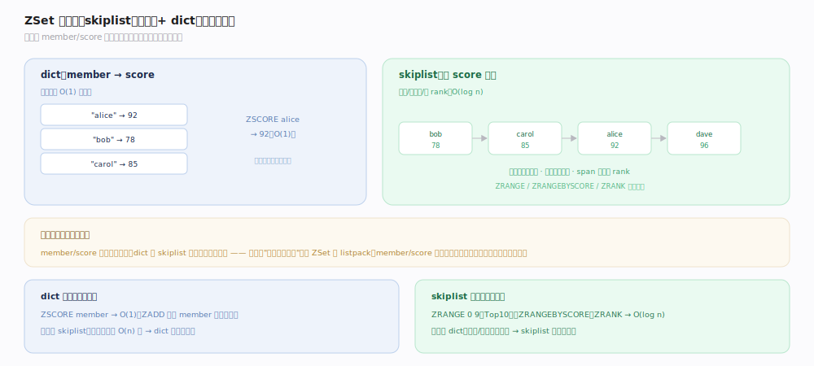
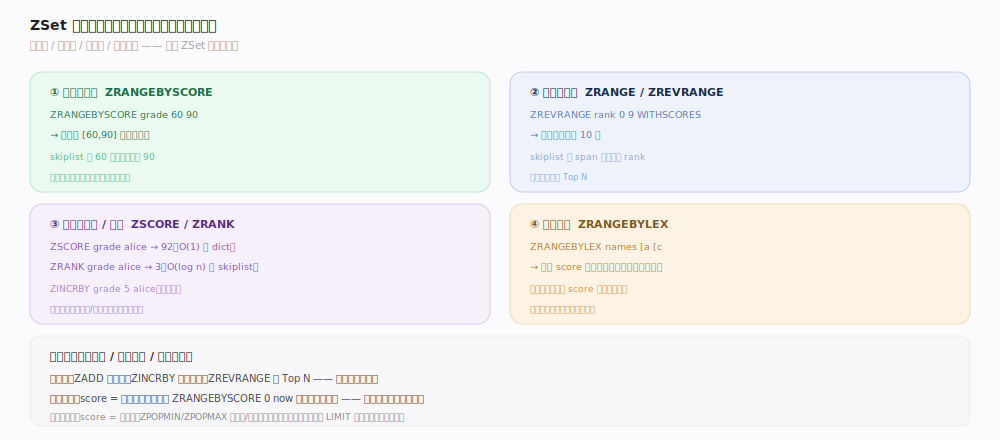

# Redis 原理 · Set / ZSet 集合

> **定位**：Set 是无序、去重的元素集合；ZSet（有序集合）在 Set 基础上给每个成员绑一个分数（score），按分数有序。二者依赖对象系统的多档编码（Set: intset/listpack/hashtable；ZSet: listpack/skiplist+dict），是标签、去重、排行榜、延迟队列的核心载体。
>
> 源码：`~/workdir/redis` unstable @e1cc3dc（2026-07）。主文件 `t_set.c` / `t_zset.c`，阈值默认在 `config.c`，跳表结构在 `server.h`。

## 一、Set 三档编码：intset / listpack / hashtable

- **intset**（纯整数小集合）：有序整数数组，`SADD` 保持有序、`SISMEMBER` 二分查找。INT16→32→64 单向升级。
- **listpack**（含非整数的小集合）：连续内存存元素。
- **hashtable**（大集合）：dict（member→NULL），O(1) 增删查。
- **建集合选型**：新建时按元素类型与规模预判——纯整数且 ≤ `set_max_intset_entries` 走 intset、否则 ≤ `set_max_listpack_entries` 走 listpack（判定见 `t_set.c:47`、`t_set.c:49`）。写入时 `setTypeAdd`（`t_set.c:116`）触发按需转换：`setTypeMaybeConvert`（`t_set.c:61`）在超阈值时升级，`maybeConvertIntset`（`t_set.c:78`）在 intset 混入非整数或超限时转 listpack/hashtable。转换单向不可逆。
- **默认阈值**（`config.c`）：`set-max-intset-entries`=512（`config.c:3412`）、`set-max-listpack-entries`=128（`config.c:3413`）、`set-max-listpack-value`=64B（`config.c:3414`）。
- **命令**：`SADD`（`saddCommand`，`t_set.c:626`）/`SREM`（`sremCommand`，`t_set.c:663`）/`SISMEMBER`（`sismemberCommand`，`t_set.c:783`）/`SCARD`（`scardCommand`，`t_set.c:821`）/`SMEMBERS`（`smembersCommand`，`t_set.c:1579`）/`SPOP`（`spopCommand`，`t_set.c:1065`）/`SRANDMEMBER`（`srandmemberCommand`，`t_set.c:1335`）；集合运算 `SINTER`（`sinterCommand`，`t_set.c:1574`）/`SUNION`（`sunionCommand`，`t_set.c:1945`）/`SDIFF`（`sdiffCommand`，`t_set.c:1993`）——交/并/差，标签系统的基础。

## 二、ZSet：skiplist + dict 双结构

大 ZSet 用 **skiplist + dict 组合**（`zset` 结构体 `server.h:1816`，成员 `dict` 在 `:1817`、`zsl` 在 `:1818`）：
- **dict**：`member → score`，`ZSCORE` 查分 O(1)（`zscoreCommand`，`t_zset.c:4092`）。
- **skiplist**：按 score 有序的跳表，支持范围查询、按 rank 定位。插入走 `zslInsert`（`t_zset.c:326`），按分数/成员求排名走 `zslGetRank`（`t_zset.c:645`，用 span 累加）。
- 小 ZSet 用 **listpack**（member/score 交替存），超 `zset-max-listpack-entries`（默认 128，`config.c:3415`）或 value > `zset-max-listpack-value`（默认 64B，`config.c:3419`）触发 `zsetConvertAndExpand(..., OBJ_ENCODING_SKIPLIST, ...)`（转换点 `t_zset.c:1659`，实现 `t_zset.c:1444`；对外包装 `zsetConvert`，`t_zset.c:1439`）。
- **为何两个结构**：dict 提供 O(1) 按名查分，skiplist 提供 O(log n) 按序/按范围访问——各取所长，互补覆盖 ZSet 的两类访问模式。

## 深化 · ZSet 的多种查询维度

ZSet 强大在于同一份数据支持多种正交查询维度（命令均在 `t_zset.c`）：
- **按分数范围**：`ZRANGEBYSCORE`（`zrangebyscoreCommand`，`t_zset.c:3633`，如"分数 60~90"）——skiplist 从 min 起点顺序扫。
- **按排名范围**：`ZRANGE`（`zrangeCommand`，`t_zset.c:3514`，如"前 10 名"）、`ZREVRANGE`（`zrevrangeCommand`，`t_zset.c:3521`，倒序）——用 span 定位 rank。
- **按成员查分/排名**：`ZSCORE`（O(1) 走 dict，`t_zset.c:4092`）、`ZRANK`（`zrankCommand`，`t_zset.c:4183`，O(log n) 走 skiplist span）。
- **原子增分**：`ZINCRBY`（`zincrbyCommand`，`t_zset.c:2103`，与 `ZADD` 共用 `zaddGenericCommand`，`t_zset.c:1962`；`zaddCommand`，`t_zset.c:2099`）——排行榜实时更新的核心。
- **按字典序**：`ZRANGEBYLEX`（`zrangebylexCommand`，`t_zset.c:3907`，score 全相同时按成员字典序范围查）。
- **弹出极值**：`ZPOPMIN`/`ZPOPMAX`（`zpopminCommand`/`zpopmaxCommand`，`t_zset.c:4393`/`:4398`）——优先级队列。

## 拓展 · 典型应用

| 场景 | 结构 | 关键命令 |
|---|---|---|
| 标签/关注关系 | Set | `SADD`/`SINTER`（共同关注）/`SISMEMBER` |
| 去重统计 | Set | `SADD`/`SCARD` |
| 排行榜 | ZSet | `ZADD`/`ZINCRBY`/`ZREVRANGE`（Top N） |
| 延迟队列 | ZSet | score=执行时间戳，`ZRANGEBYSCORE` 取到期任务 |
| 优先级队列 | ZSet | score=优先级，`ZPOPMIN`/`ZPOPMAX` |

## 常见误区与工程要点

- **误区："Set 有序"**：Set 无序，`SMEMBERS`（`t_set.c:1579`）返回顺序不保证（intset 恰好有序是实现细节，别依赖）。要有序用 ZSet。
- **误区："ZRANGEBYSCORE 大范围很快"**：`t_zset.c:3633` 在范围内元素多时仍要逐个返回 O(n+log n)，配 `LIMIT` 分页。
- **误区："SINTER 任意大集合都行"**：`sinterCommand`（`t_set.c:1574`）大集合求交是 O(n×m) 级开销，可能长时间阻塞单线程；只要基数用 `SINTERCARD` 或预计算。
- **工程点**：延迟队列用 ZSet + `ZRANGEBYSCORE now` 轮询到期项；排行榜用 `ZINCRBY`（`t_zset.c:2103`）实时更新 + `ZREVRANGE`（`t_zset.c:3521`）取榜。

## 一句话总纲

**Set 是去重集合（纯整数用 intset、小集合 listpack、大集合 hashtable，经 `setTypeMaybeConvert` 单向升级），支持交并差做标签/共同关注；ZSet 用 skiplist（按序/范围/rank，O(log n)，`zslInsert`/`zslGetRank`）+ dict（按名查分，O(1)）双结构，同一份数据支持按分数/排名/成员/字典序多维查询，是排行榜、延迟队列、优先级队列的核心。**
