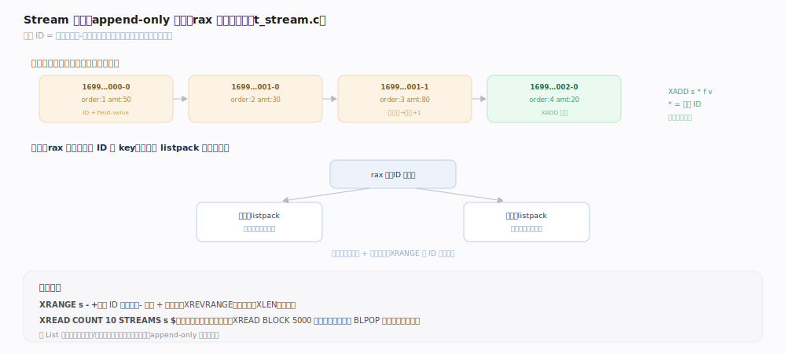
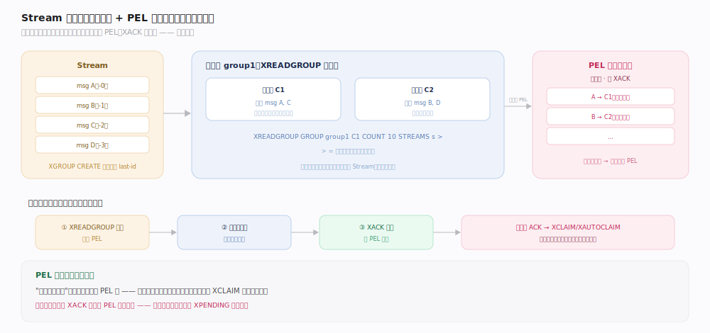
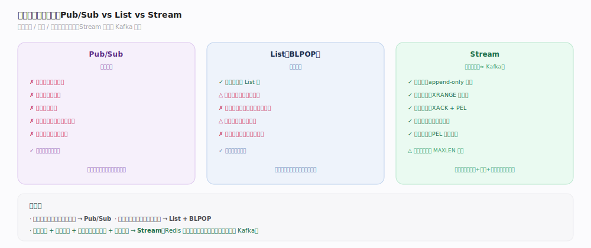

# Redis 原理 · Stream 流

> **定位**：Stream 是 Redis 5.0 引入的 **append-only 日志型**数据结构，专为消息流/事件溯源设计——它弥补了 Pub/Sub"不持久化、无确认"的短板，提供持久化存储、消费组、消息确认（ACK）。底层用 radix tree（rax）存储，是 Redis 里最接近 Kafka 语义的类型。
>
> 源码：`~/workdir/redis` unstable @e1cc3dc（2026-07）。主文件 `t_stream.c`，底层 rax 见 `rax.c`。

## 一、Stream 结构：radix tree of listpacks

- **消息条目**：每条消息有一个 **ID**（`<毫秒时间戳>-<序号>`，如 `1699000000000-0`）+ 一组 field-value 对。ID 单调递增，天然有序；下一 ID 由 `streamNextID`（`t_stream.c:170`）/`streamIncrID`（`t_stream.c:129`）推导。
- **底层编码**：`t_stream.c:65` 明确注明"Low level stream encoding: **a radix tree of listpacks**"——以消息 ID 为 key 组织 rax（`s->rax`，创建见 `t_stream.c:73`），同一 rax 节点内多条消息紧凑打包进一个 listpack（用 master entry + `STREAM_ITEM_FLAG_SAMEFIELDS` 复用字段名，`t_stream.c:21`），兼顾有序遍历与内存效率。
- **append-only 追加**：`XADD`（`xaddCommand`，`t_stream.c:2537`）调 `streamAppendItem`（`t_stream.c:505`）把新条目写入尾部 listpack；ID 可用 `*` 自动生成。历史消息保留（不像 List 弹出即消失，也不像 Pub/Sub 阅后即焚）。
- **读命令**：`XLEN`（`xlenCommand`，`t_stream.c:2762`）/`XRANGE`（`xrangeCommand`，`t_stream.c:2752`）/`XREVRANGE`（`xrevrangeCommand`，`t_stream.c:2757`，按 ID 范围读）/`XREAD`（`xreadCommand`，`t_stream.c:2778`，从某 ID 之后读，可 `BLOCK` 阻塞等新消息）。

## 二、消费组：可靠消费与负载均衡

消费组（Consumer Group）是 Stream 相对 Pub/Sub 的核心优势，提供**可靠消费 + 组内负载均衡**（均在 `t_stream.c`）：
- **XGROUP CREATE**（`xgroupCommand`，`t_stream.c:3553`）：建消费组，底层 `streamCreateCG`（`t_stream.c:3409`）记录该组的消费位点（last-delivered-id）。
- **XREADGROUP**（并入 `xreadCommand`，`t_stream.c:2778`，走消费组分支）：组内多消费者分摊消息——每条消息只投递给组内一个消费者（负载均衡）；消费者按需 `streamCreateConsumer`（`t_stream.c:3486`）/`streamLookupConsumer`（`t_stream.c:3510`）。
- **PEL（Pending Entries List）**：消息投递后进入 PEL——`streamCreateNACK`（`t_stream.c:2271`）建"未确认"记录，`raxTryInsert(group->pel, ...)` 挂到组级 PEL（`t_stream.c:2273`），同时挂到 `consumer->pel`（`t_stream.c:2140`）。记录"已投递未确认"。
- **XACK**（`xackCommand`，`t_stream.c:3889`）：消费者处理完显式确认，NACK 从组/消费者 PEL 移除。未确认的消息不丢——消费者崩溃后可重新认领。
- **XCLAIM / XAUTOCLAIM**（`xclaimCommand`，`t_stream.c:4480`；`xautoclaimCommand`，`t_stream.c:4723`）：把某消费者长期未确认（超空闲时长）的消息转交其他消费者——故障转移。

> **一句话**：PEL 是可靠消费的关键——"已投递未确认"的消息一直挂在 PEL（`t_stream.c:2273`）里，消费者崩溃也不丢，可被重新认领处理。

## 深化 · Stream vs List vs Pub/Sub 做消息

| 维度 | Pub/Sub | List（BLPOP） | Stream |
|---|---|---|---|
| 持久化 | 否（阅后即焚） | 是（在 List 中） | 是（append-only 日志） |
| 历史回溯 | 不能 | 弹出即消失 | 能（XRANGE 任意读历史） |
| 消费确认 | 无 | 无（弹出即"消费"） | 有（XACK + PEL） |
| 消费组/负载均衡 | 无（全员广播） | 需自己实现 | 原生（Consumer Group） |
| 多消费者 | 都收到全量 | 竞争消费 | 组内分摊 + 组间广播 |
| 崩溃恢复 | 消息丢失 | 处理中消息丢失 | PEL 重新认领，不丢 |

- **Pub/Sub**：实时广播、能容忍丢失的通知。
- **List**：简单队列、单一消费链路。
- **Stream**：需要持久化、确认、消费组、历史回溯的可靠消息——最接近 Kafka。

## 拓展 · 长度控制与内存

- **XADD ... MAXLEN ~ N**：限制 Stream 长度上限（`~` 近似修剪，性能更好），防止无限增长吃内存；修剪由 `streamTrim`（`t_stream.c:851`）执行，`XADD` 尾部顺带触发（`t_stream.c:2649`）。
- **XTRIM**：手动修剪（同样汇入 `streamTrim`，`t_stream.c:851`）。
- **MINID**：按最小 ID 修剪（保留某时间点之后的消息）。
- 这是 Stream 在依赖矩阵里对"内存淘汰"只是弱依赖的原因——它通常靠 MAXLEN 自我约束增长。

## 常见误区与工程要点

- **误区："Stream 和 Pub/Sub 差不多"**：本质不同——Stream 持久化 + 确认（`xackCommand`，`t_stream.c:3889`）+ 消费组，Pub/Sub 阅后即焚无确认。要可靠消息选 Stream。
- **误区："Stream 无限存不会有问题"**：会吃内存——生产必须配 `MAXLEN`/`MINID` 修剪（`streamTrim`，`t_stream.c:851`）。
- **误区："XREAD 会一直阻塞占线程"**：`XREAD BLOCK`（`t_stream.c:2778`）是客户端阻塞（同 BLPOP 机制），不占 server 线程。
- **误区："消息投递就算消费完成"**：投递只进 PEL（`t_stream.c:2273`），必须 XACK 才算完成；忘记 XACK 会导致 PEL 无限堆积。
- **工程点**：消费者崩溃用 `XAUTOCLAIM`（`t_stream.c:4723`）转移滞留消息；ID 用 `*` 自动生成保证单调递增（`streamNextID`，`t_stream.c:170`）；组间广播用多个消费组订阅同一 Stream。

## 一句话总纲

**Stream 是 append-only 日志型结构（rax of listpacks 存储，`t_stream.c:65`；ID=时间戳-序号 单调有序），`XADD`→`streamAppendItem` 追加，提供 Pub/Sub 没有的持久化、历史回溯、消费确认（`XACK` + PEL 待确认列表 `t_stream.c:2273`）与消费组（组内负载均衡、崩溃后 `XCLAIM`/`XAUTOCLAIM` 重新认领）——是 Redis 里最接近 Kafka 语义、做可靠消息的首选类型。**
