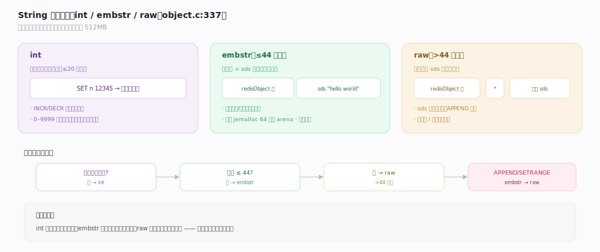

# Redis 原理 · String 字符串

> **定位**：String 是 Redis 最基础的数据类型——一个 key 对应一个二进制安全的值（最大 512MB）。它依赖对象系统的三种编码（int/embstr/raw），是计数器、缓存、位图、分布式锁等模式的载体。
>
> 源码：`~/workdir/redis` unstable @e1cc3dc（2026-07，`version.h` 记 255.255.255）。主文件 `t_string.c`，编码在 `object.c`，位操作在 `bitops.c`。

## 一、三种编码：int / embstr / raw

String 的 value 按内容与长度选编码（`object.c`）：
- **int**：值能被解析成长整数 → 存整数本身，省内存且 `INCR` 直接算术。0–9999 的小整数用**共享对象**：`OBJ_SHARED_INTEGERS`=10000（`server.h:127`），命中时直接返回 `shared.integers[value]`（`object.c:367-368`）并标 `OBJ_ENCODING_INT`（`object.c:372`），全库复用免分配。
- **embstr**：≤44 字节（`OBJ_ENCODING_EMBSTR_SIZE_LIMIT=44`，`object.c:337`）→ `createStringObject` 走连续分配分支（`object.c:339-340`），对象头与 sds 一次性分配在连续内存（贴合 jemalloc arena），分配/释放各一次、缓存友好。
- **raw**：>44 字节 → `tryCreateRawStringObject`（`object.c:346`），对象头与 sds 分两次分配，sds 可独立扩容。
- **编码归约**：写入时 `tryObjectEncoding`（`object.c:999`，实体 `tryObjectEncodingEx`，`object.c:939`）尝试把可整数化的 raw/embstr 收敛为 int、把长 raw 收缩为 embstr。对 embstr 做修改（如 `APPEND`）会转为 raw（embstr 视为只读优化）。

## 二、核心命令与原子计数

- **读写**：`SET`（`setCommand`，`t_string.c:435`，统一入口 `setGenericCommand`，`t_string.c:87`）/`GET`（`getCommand`，`t_string.c:475`）/`GETSET`（`getsetCommand`，`t_string.c:568`）/`GETEX`（`getexCommand`，`t_string.c:499`）/`SETEX`（`setexCommand`，`t_string.c:451`）/`SETNX`（`setnxCommand`，`t_string.c:446`，锁的基础）/`MSET`/`MGET`（`mgetCommand`，`t_string.c:717`；`msetGenericCommand`，`t_string.c:756`）。
- **原子计数**：`INCR`（`incrCommand`，`t_string.c:941`）/`INCRBY`（`incrbyCommand`，`t_string.c:949`）/`INCRBYFLOAT`（`incrbyfloatCommand`，`t_string.c:968`）统一走 `incrDecrCommand`（`t_string.c:901`）——单线程保证无竞争，是计数器、限流、ID 生成的基础。int 编码下直接算术运算。
- **子串**：`GETRANGE`（`getrangeCommand`，`t_string.c:650`）/`SETRANGE`（`setrangeCommand`，`t_string.c:580`，按字节偏移读写）、`APPEND`（`appendCommand`，`t_string.c:1369`，追加、触发 raw）、`STRLEN`（`strlenCommand`，`t_string.c:1412`）。

## 深化 · Bitmap 位操作

String 可当**位数组**用（每字节 8 位），用极少内存表示海量布尔状态（如 1 亿用户签到只需 ~12MB）。

- 底层仍是 String（raw 编码的字节数组），位操作直接改字节的某一位，实现在 `bitops.c`：`SETBIT`（`setbitCommand`，`bitops.c:849`）/`GETBIT`（`getbitCommand`，`bitops.c:902`）/`BITCOUNT`（`bitcountCommand`，`bitops.c:1623`）/`BITOP`（`bitopCommand`，`bitops.c:1241`）/`BITPOS`（`bitposCommand`，`bitops.c:1721`）。
- `SETBIT` 对越界偏移会自动把底层字节串扩容补零，因此稀疏高位写入可能放大内存。
- 典型场景：用户签到（每天一位）、活跃统计（`BITCOUNT`）、布隆过滤器基座、权限位、多维标签的位运算聚合（`BITOP AND/OR`）。

## 调优要点与误区

- `SETNX` + 过期是简易分布式锁基础，但需注意锁误删（用带唯一值的 `SET k v NX EX` + Lua 校验删除）。
- **误区："String 只能存文本"**：二进制安全，可存图片/序列化对象，但大 value（>10KB）建议评估。
- **误区："INCR 需要加锁"**：单线程 + `incrDecrCommand`（`t_string.c:901`）天然原子，不需要。
- **误区："频繁 APPEND 高效"**：`appendCommand`（`t_string.c:1369`）会把 embstr 转 raw 且可能反复扩容；大量拼接考虑别的结构。
- **误区："BITCOUNT 很轻"**：`bitcountCommand`（`bitops.c:1623`）对超大位串是 O(n) 字节扫描，范围参数可限定统计区间。

## 拓展 · 底层 SDS 与内存分档

raw/embstr 的值体是 **SDS（Simple Dynamic String）**，二进制安全（记录长度而非依赖 `\0`）。SDS 按字符串长度选不同 header 省内存（`sds.h`）：`sdshdr8`（`sds.h:32`，len<256）/`sdshdr16`（`sds.h:38`）/`sdshdr32`（`sds.h:44`）/`sdshdr64`（`sds.h:50`）分别用 1/2/4/8 字节记 len/alloc；极短串用 `SDS_TYPE_5`（`sds.h:57`，长度塞进 flags 高 5 位，无独立 len 字段，注释见 `sds.h:26`）。这套分档让"存一个 3 字节的 key 值"不必带 16 字节的长度头——是 embstr 连续分配（`object.c:339-340`）之外的第二层省内存设计。

## 一句话总纲

**String 是二进制安全的单值类型，按内容自动选 int（可算术，0–9999 共享对象）/embstr（≤44B 连续分配）/raw（长串）编码，写入经 `tryObjectEncoding` 归约；单线程让 INCR 等计数天然原子，还能当 Bitmap 用极少内存表示海量布尔状态。**
