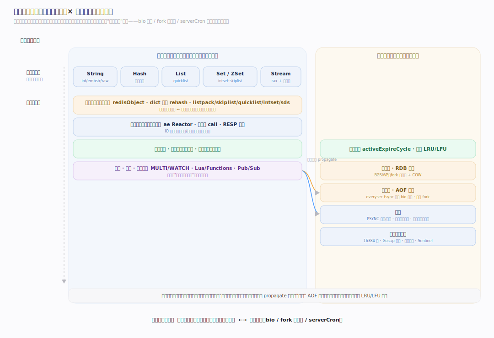
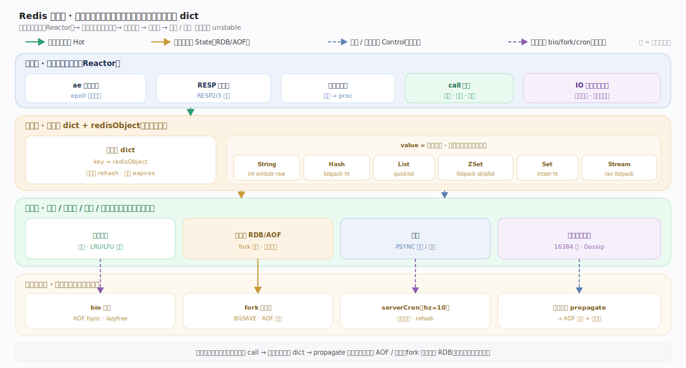
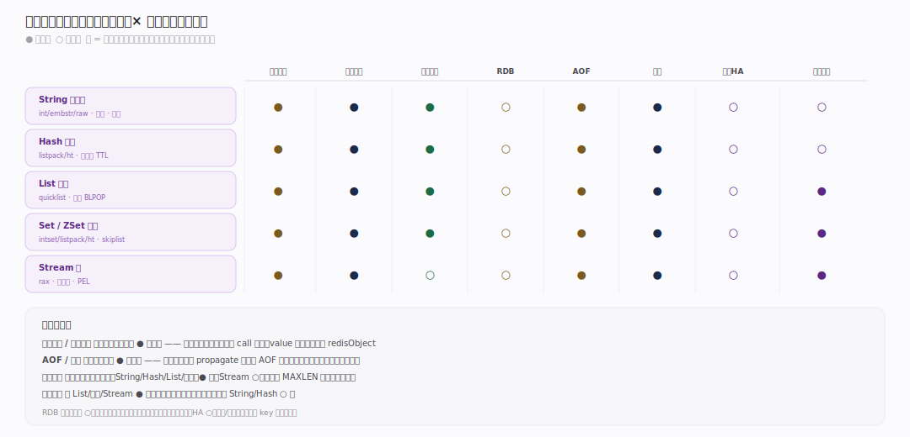

# Redis 原理 · 全景主线框架

> **定位**：Redis 是**内存数据结构存储（in-memory data structure store）**——不属于 SQL 存算 / 联邦查询 / 通用计算三原型，而是新家族。它的接触面不是 SQL，而是**面向数据类型的命令族**；它自管存储，但存储介质是**内存**（磁盘只作持久化备份）。本框架用"双维模型"把全部主线归位，供下钻各主线时先定位。
>
> 源码基准：Redis `unstable` 分支 @9e5614d（2026-07），路径 `~/workdir/redis`。全库事实以该源码为唯一裁决，参考资料只用于找线索。

---

## 一、元模式：接触面 × 能力域 × 执行时机

所有系统共享同一元模式，Redis 的取值：

> **接触面主线（用户下发什么）** = 面向 6 种核心数据类型的命令族（String / Hash / List / Set / ZSet / Stream）+ 通用键空间命令。
> **支撑能力域（背后的公共能力）** = 对象编码、事件网络、内存与过期淘汰、持久化（RDB/AOF）、复制、集群与高可用、事务脚本与发布订阅。
> **执行时机** = 前台单线程命令执行 vs 后台线程/子进程（bio、fork 子进程、定期 serverCron）。

---

## 二、总架构：一切都是内存里的 dict，外加两条落盘链路

Redis 的骨架异常简洁：**顶层是一个键空间 dict（key → redisObject），value 是五/六种数据类型对象，每种对象按规模选紧凑或标准编码**。围绕这个核心 dict，向外是单线程事件循环处理网络与命令，向下是 RDB/AOF 两条持久化链路，横向是复制流与集群总线。

三层归纳：
- **接入层（蓝）**：ae 事件循环（Reactor）+ 可选 IO 线程读写解析；RESP 协议编解码；命令表分派。
- **数据层（琥珀）**：键空间 dict + 过期 dict；redisObject + 底层编码（sds/listpack/quicklist/intset/skiplist/dict）。
- **保障层（绿/紫）**：内存淘汰与过期回收；RDB 快照与 AOF 日志（fork + bio）；复制（PSYNC + backlog）；集群（16384 槽 + Gossip）；Sentinel 高可用。

---

## 三、依赖矩阵：接触面 × 能力域

每条接触面命令族在执行时会穿过哪些能力域（●=强依赖，○=弱依赖）。

---

## 四、主线清单（一级标题锁定，不漂移）

**接触面主线 · 数据类型命令族（5）**
1. **String 字符串与位操作** — int/embstr/raw 三编码、INCR、SETRANGE/GETRANGE、Bitmap/位图
2. **Hash 哈希** — listpack↔hashtable、字段级 TTL（HEXPIRE）
3. **List 列表** — quicklist（listpack 节点链）、LPUSH/RPOP、阻塞 BLPOP
4. **Set 与 ZSet 集合与有序集合** — intset/listpack/hashtable；skiplist + listpack、按分/按名/按 rank 查询
5. **Stream 流与消费组** — radix tree（rax）存储、消费组、PEL 待确认列表

**支撑能力域 · 引擎内部（8）**
1. **对象系统与底层编码** — redisObject、dict 渐进式 rehash、listpack、skiplist、quicklist、intset、sds
2. **事件驱动网络与执行模型** — ae Reactor、单线程命令执行、IO 线程、RESP、serverCron
3. **内存管理 · 过期与淘汰** — 惰性+定期过期、maxmemory、近似 LRU/LFU、lazyfree
4. **持久化 · RDB** — 快照、fork/COW、RDB 文件格式、save points
5. **持久化 · AOF** — 命令追加、appendfsync、AOF 重写、Multi-Part AOF、混合持久化
6. **复制** — PSYNC 全量/部分重同步、复制积压缓冲、复制 ID、WAIT
7. **集群与高可用** — 16384 哈希槽、Gossip、MOVED/ASK、故障转移、Sentinel
8. **事务 · 脚本 · 发布订阅** — MULTI/WATCH（乐观锁）、Lua/Functions、Pub/Sub、键空间通知、阻塞命令

---

## 五、三条贯穿声明（全库一致，改一处查三处）

1. **单线程执行是 Redis 一致性的根**：所有命令在主线程串行执行（IO 线程只并行化读写/解析，不并行执行命令）。因此单命令天然原子、MULTI/EXEC 无需锁、Lua 脚本原子——这些不是各自实现的锁，而是**共享同一个"命令不被打断"的前提**。
2. **一切 value 都是 redisObject + 可切换编码**：数据类型是逻辑视图，底层编码（小规模用紧凑连续内存 listpack/intset、大规模用标准结构 hashtable/skiplist）按阈值自动升级且不可逆。编码选择贯穿数据类型主线与对象编码域。
3. **持久化/复制都建立在"命令传播"之上**：写命令执行后，同一份效果被传播到 AOF 缓冲、复制流。RDB 是时点快照、AOF 是操作日志、复制是把日志实时发给从库——三者共享 propagation 机制而非各写各的。

---

## 六、一句话总纲

**Redis = 一个单线程事件循环守着一张内存大 dict——value 是按规模自动换编码的数据结构对象，写操作被同一套 propagation 分发给 AOF 日志与复制流，fork 出的子进程负责 RDB 快照与 AOF 重写，内存不够时按近似 LRU/LFU 淘汰。**
