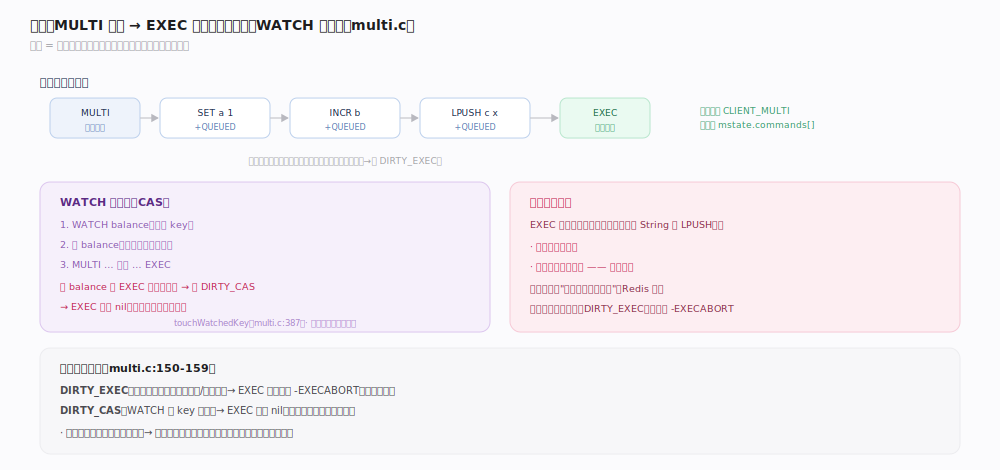
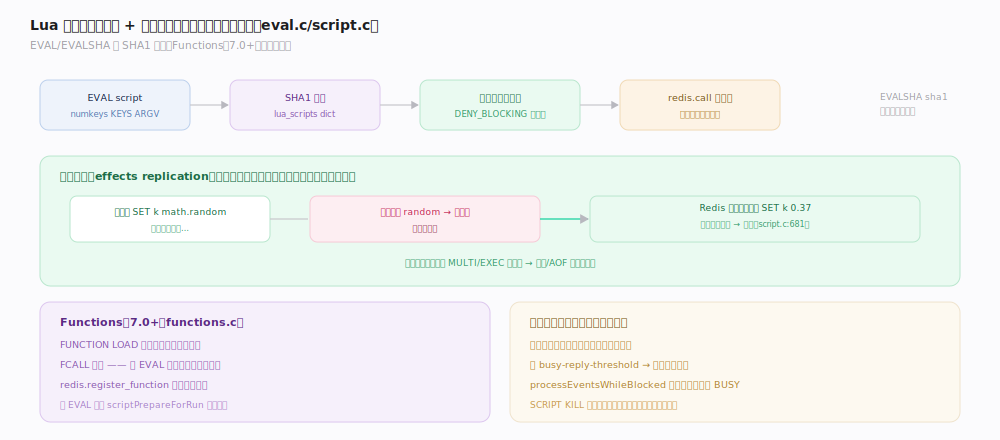
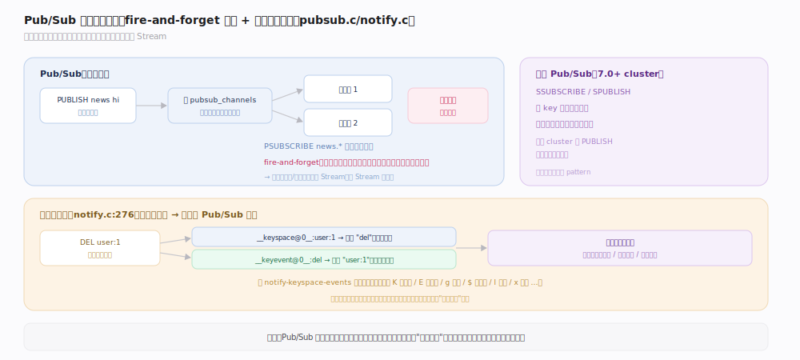
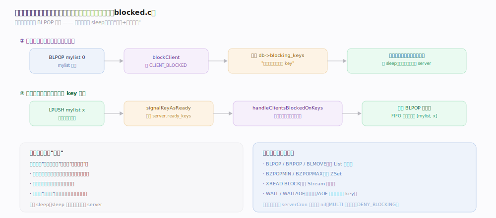

# Redis 原理 · 事务 · 脚本 · 发布订阅

> **定位**：本主线是建立在"单线程串行执行"之上的一组**组合命令能力**——事务（MULTI/WATCH）、Lua 脚本/Functions、发布订阅、键空间通知、阻塞命令。它们不各自实现锁，而是共享"命令不被打断"这一前提。依赖网络与执行主线（call/单线程），被上层业务模式广泛使用。
>
> 源码：`~/workdir/redis` unstable @9e5614d。

## 一、事务：MULTI/EXEC/WATCH

Redis 事务把多条命令打包，`EXEC` 时在单线程里连续执行、不被其他客户端插入。

- **命令排队**（`multi.c:35` `queueMultiCommand`）：`MULTI` 后（客户端置 `CLIENT_MULTI` 标记，`server.h:380`），命令不立即执行而是入队 `mstate.commands`，返回 `+QUEUED`。
- **EXEC 执行**：单线程连续 `call` 所有排队命令，期间不处理其他客户端命令——**原子**（不被打断）。
- **WATCH 乐观锁（CAS）**（`multi.c:387` `touchWatchedKey`）：`WATCH key` 后，若该 key 在 EXEC 前被任何客户端修改，该客户端被标 `CLIENT_DIRTY_CAS`，EXEC 返回 `nil`（放弃执行）。
- **无回滚**：EXEC 中某条命令运行时出错（如对 String 做 `LPUSH`），**其余命令照常执行**，不回滚。只有排队期语法错（`CLIENT_DIRTY_EXEC`）才整体 `-EXECABORT` 拒绝。

> **一句话**：Redis 事务的"原子"= 单线程连续执行不被打断，不是关系库的"要么全成要么全滚"——它没有回滚。

## 二、Lua 脚本与 Functions

脚本让多条命令在服务端**原子执行**，省去多次网络往返，且能做条件逻辑。

- **EVAL/EVALSHA**（`eval.c:552`）：`EVAL <script> <numkeys> key... arg...` 执行 Lua；脚本按 SHA1 缓存（`lua_scripts` dict），`EVALSHA <sha1>` 复用免重传。
- **原子性**：脚本像 MULTI 一样单线程执行、不被打断；执行期间设 `CLIENT_DENY_BLOCKING`（脚本内命令不阻塞）。
- **效果复制**（`script.c:681`）：脚本传播给 AOF/从库的是**执行产生的实际写命令**（而非脚本本身）——保证从库/回放确定性（脚本若含随机/时间会不一致）。多条效果自动包在 MULTI/EXEC 里传播。
- **Functions**（7.0+，`functions.c:1044`）：`FUNCTION LOAD` 加载函数库常驻服务端，`FCALL` 调用——比 EVAL 更适合管理复用逻辑。
- **慢脚本**：超 `busy-reply-threshold` 进入超时模式，`processEventsWhileBlocked` 让其他客户端能收到 BUSY 错误、可 `SCRIPT KILL`（未写时）。

## 深化 · 发布订阅与键空间通知

- **Pub/Sub**（`pubsub.c`）：`SUBSCRIBE channel` / `PUBLISH channel msg`——发布即转发给当前订阅者，**fire-and-forget，不持久化**（无订阅者则消息丢弃）。`PSUBSCRIBE` 支持模式匹配（`news.*`）。
- **分片 Pub/Sub**（7.0+ cluster，`pubsub.c:721`）：`SSUBSCRIBE`/`SPUBLISH` 按 key 的槽路由，消息只在持有该槽的分片内传播（解决 cluster 下 PUBLISH 全集群广播的开销）；分片模式不支持 pattern。
- **键空间通知**（`notify.c:276`）：数据变更时向 `__keyspace@<db>__:<key>`（载荷=事件名）和 `__keyevent@<db>__:<event>`（载荷=key）发通知，由 `notify-keyspace-events` 配置开启（标志 K/E/g/$/l/s/h/z/x/e/t…）。用途：缓存失效、过期监听。

## 深化 · 阻塞命令

`BLPOP`/`BRPOP`/`BLMOVE`/`WAIT`/`XREAD BLOCK` 等在条件不满足时阻塞客户端，条件满足时被唤醒——单线程下如何不阻塞整个 server？

- **阻塞而非忙等**（`blocked.c:74` `blockClient`）：客户端置 `CLIENT_BLOCKED`，从事件循环"摘下"（不再处理它的输入），主线程继续服务其他客户端。
- **就绪唤醒**（`blocked.c:346`）：`blockForKeys` 把"客户端等哪些 key"登记到 `db->blocking_keys`；当有 `LPUSH` 等写入使某 key 就绪，`signalKeyAsReady` 把它加入 `server.ready_keys`；命令执行后 `handleClientsBlockedOnKeys` 唤醒等待该 key 的客户端（FIFO 公平）。
- **超时**：阻塞带超时，到点由 serverCron 检查唤醒并返回 nil。

> **一句话**：阻塞命令不是让线程 sleep，而是把客户端从事件循环摘下、登记到"等待表"，由后续写操作的就绪信号精准唤醒——单线程照样支持阻塞语义。

## 拓展 · 能力对比

| 能力 | 原子性来源 | 能否条件逻辑 | 典型用途 |
|---|---|---|---|
| MULTI/EXEC | 单线程连续执行 | 否（WATCH 做 CAS） | 简单打包、乐观锁 |
| Lua/Functions | 单线程连续执行 | 是（脚本逻辑） | 复杂原子操作、减往返 |
| Pub/Sub | — | — | 消息广播、事件通知 |
| 键空间通知 | — | — | 缓存失效、过期回调 |
| 阻塞命令 | — | — | 队列消费、生产者-消费者 |

## 常见误区与工程要点

- **误区："Redis 事务能回滚"**：不能。运行时错误不回滚其余命令，只有排队期错误整体拒绝。
- **误区："脚本传的是脚本文本"**：默认传效果（实际写命令），不是脚本——所以脚本里用随机/时间不影响从库一致性。
- **误区："Pub/Sub 消息可靠"**：不持久化、不确认，订阅者断线期间的消息永久丢失；要可靠消息用 Stream。
- **误区："WATCH 是悲观锁"**：是乐观锁（CAS）——不加锁，冲突时 EXEC 失败让你重试。
- **工程点**：cluster 下 PUBLISH 全集群广播开销大，用分片 Pub/Sub；键空间通知有性能开销，按需开启特定事件类型。

## 一句话总纲

**事务（MULTI 排队 + EXEC 单线程连续执行，WATCH 提供乐观锁，无回滚）、Lua/Functions（原子执行且传播的是执行效果而非脚本）、Pub/Sub（fire-and-forget 不持久化）、键空间通知、阻塞命令（把客户端从事件循环摘下、由就绪信号唤醒）——全都建立在"单线程串行、命令不被打断"这一共同前提上，而非各自加锁。**
