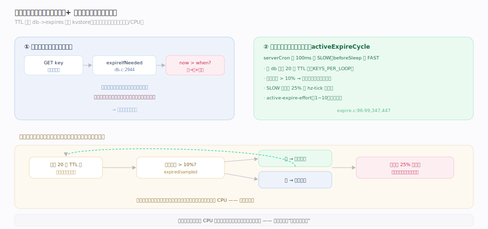
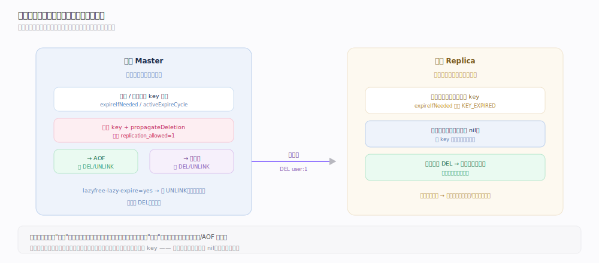
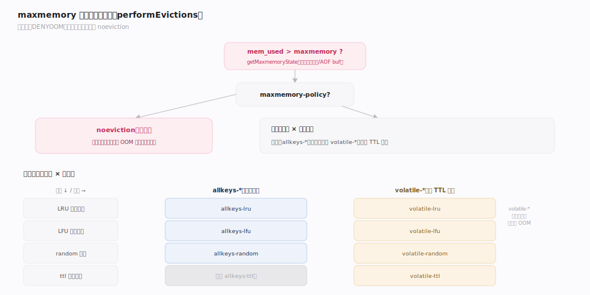
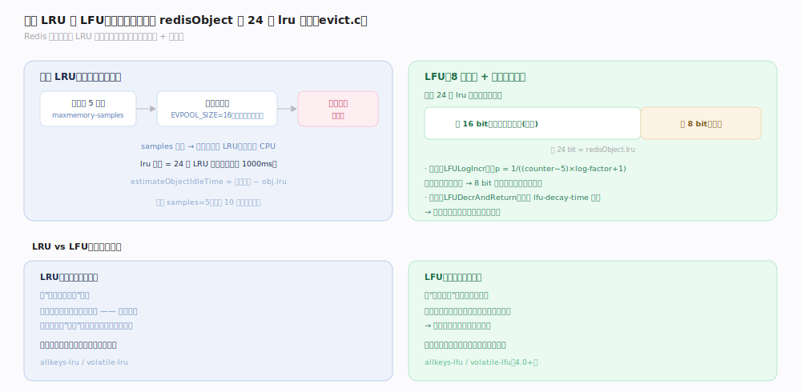

# Redis 原理 · 内存管理 · 过期与淘汰

> **定位**：本主线管 Redis 作为内存数据库的**生死线**——键如何过期回收、内存到顶时淘汰谁。它依赖对象系统（LRU/LFU 复用 `redisObject.lru` 字段）、被所有写命令间接触发（`processCommand` 前置检查内存）。前台惰性过期在命令路径上，后台定期过期与淘汰不阻塞主流程。
>
> 源码：`~/workdir/redis` unstable @9e5614d。

## 一、两种过期回收：惰性 + 定期

TTL 键单独存在 `db->expires`（独立 kvstore，`db.c:2753`）。Redis 用**惰性过期**（访问时才删）+ **定期过期**（后台采样删）组合，避免"为每个键起定时器"的开销。

- **惰性过期**（`db.c:2944` `expireIfNeeded`）：任何 `lookupKey` 访问键时检查 `now > when`（`db.c:2886`），过期则删除并传播 DEL/UNLINK。省 CPU，但冷键可能长期占内存。
- **定期过期**（`expire.c` `activeExpireCycle`）：serverCron（SLOW，每 100ms）+ beforeSleep（FAST）采样扫描带 TTL 的键。
  - 每轮每个 db 采样 `ACTIVE_EXPIRE_CYCLE_KEYS_PER_LOOP=20` 个键（`expire.c:96`）。
  - **自适应重复**（`expire.c:447`）：若本批过期比例 `expired*100/sampled > 10%`（`ACCEPTABLE_STALE`），说明过期键还很多，继续下一批；否则停。
  - **CPU 预算**（`expire.c:347`）：SLOW cycle 最多用 `25%` 的一个 hz-tick 时间片，防止过期扫描拖慢命令。
  - `active-expire-effort`（默认 1，可调至 10）放大采样力度。

## 二、过期在复制下的语义：从库不自行删

为保证主从数据一致，**从库不独立过期键**（`db.c:2983-2986`）：
- 从库上 `expireIfNeeded` 对逻辑过期的键返回 `KEY_EXPIRED`（读取时视为不存在），但**不删除**，等主库发来 DEL/UNLINK。
- 主库集中删除：`propagateDeletion` 把 DEL（或 lazyfree 时 UNLINK）发给 AOF 与所有从库（`db.c:2863`）。
- 这样避免"主从各自按本地时钟过期"导致的数据分歧。

> **一句话**：过期的"判定"在各节点独立（读时视为不存在），但过期的"删除"只由主库发起并传播——判定去中心、删除中心化。

## 深化 · maxmemory 淘汰：8 种策略

内存到达 `maxmemory` 时，写命令（`DENYOOM` 标记）执行前触发 `performEvictions`（`server.c:4608`），按策略淘汰键腾空间。默认 `noeviction`（拒绝写入并报错，`config.c:3273`）。

八种策略沿两个维度组合（`server.h:692-708`）：
- **淘汰范围**：`allkeys-*`（所有键）vs `volatile-*`（仅带 TTL 的键）。
- **淘汰依据**：`-lru`（最久未用）/ `-lfu`（最少频率）/ `-random`（随机）/ `volatile-ttl`（最近到期）。
- 特例 `noeviction`：不淘汰，写命令直接返回 OOM 错误。

`getMaxmemoryState`（`evict.c:384`）算需释放量：`mem_used = zmalloc_used - 不计内存`（副本输出缓冲、AOF 缓冲不计，避免淘汰反馈环），`mem_tofree = mem_used - maxmemory`。

## 深化 · 近似 LRU 与 LFU

Redis 不维护全局 LRU 链表（太贵），而用**采样近似**。

- **近似 LRU**：每次从候选中随机采 `maxmemory-samples`（默认 5，`config.c:3304`）个键，放入大小 16 的淘汰池（`EVPOOL_SIZE=16`，`evict.c:36`）按空闲时间排序，淘汰最久未用的。采样越多越接近真实 LRU，但越耗 CPU。
- **LFU**：`redisObject.lru`（24 bit）拆成 **高 16 bit 上次递减时间（分钟）+ 低 8 bit 访问计数**。
  - 计数用**概率对数增长**（`LFULogIncr`，`evict.c:281`）：访问越频繁，计数越难涨，8 bit 即可覆盖极大访问量而不溢出。
  - 计数随时间**衰减**（`LFUDecrAndReturn`）：按 `lfu-decay-time`（默认 1 分钟）递减，让历史热点冷却。
  - `lfu-log-factor`（默认 10）控制对数增长速率。

## 拓展 · lazyfree 与后台释放

删除大 key（如百万元素的 Hash）若在主线程同步 free，会长时间阻塞。lazyfree 把释放交给 bio 后台线程。

| 配置 | 默认 | 作用 |
|---|---|---|
| `lazyfree-lazy-eviction` | no | 淘汰时异步释放 |
| `lazyfree-lazy-expire` | no | 过期删除时异步释放 |
| `lazyfree-lazy-server-del` | no | DEL 隐式改 UNLINK 语义 |
| `lazyfree-lazy-user-del` | no | 用户 DEL 异步 |

`freeObjAsync`（`lazyfree.c:223`）仅当释放代价 `free_effort > 64` 且 `refcount==1` 时才交 bio（`BIO_LAZY_FREE`），否则同步释放（小对象异步反而更慢）。`UNLINK` = 显式异步删除，`DEL` = 同步删除。

## 调优要点（关键开关）

- `maxmemory`（默认 0=无限）：生产必设，留 25%~30% 给复制缓冲/碎片。
- `maxmemory-policy`（默认 noeviction）：缓存场景用 `allkeys-lru`/`allkeys-lfu`；持久化数据用 `volatile-*` 或保持 noeviction。
- `maxmemory-samples`（默认 5）：调到 10 更接近真实 LRU，CPU 略增。
- `lazyfree-lazy-*` + `activedefrag`：大 key/高碎片场景开启。
- `active-expire-effort`（默认 1）：过期键堆积时调高。

## 常见误区与工程要点

- **误区："TTL 到点键立即消失"**：不会。惰性 + 定期是采样删除，冷键可能过期后仍占内存一段时间，直到被访问或被采样到。
- **误区："LRU 是精确的"**：Redis 是采样近似 LRU，不是精确全局 LRU；`maxmemory-samples` 越大越准。
- **误区："从库会自己删过期键"**：不会，等主库传播删除；直接读从库可能读到主库已逻辑过期但未及传播的键（读时按逻辑过期处理返回空）。
- **工程点**：`DEL` 大 key 会阻塞主线程，用 `UNLINK`；淘汰反馈环——大量写触发淘汰、淘汰又是写，注意 `mem_tofree` 不计副本/AOF 缓冲。

## 一句话总纲

**带 TTL 的键靠"访问时惰性删 + 后台定期采样删（25% 时间片、按过期比例自适应）"回收，从库只判定不删除、等主库传播；内存到顶时按 8 种策略之一淘汰，LRU/LFU 都是采样近似（复用 redisObject 的 24 位 lru 字段），大对象释放交 bio 后台线程避免阻塞。**
