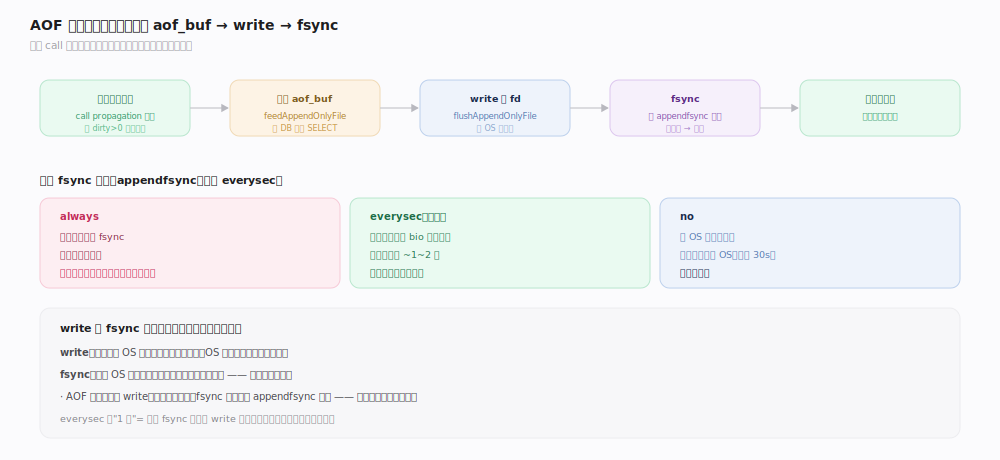
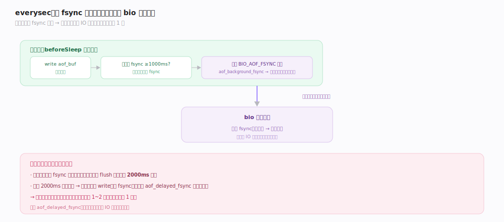
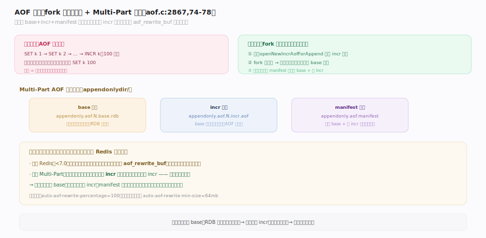
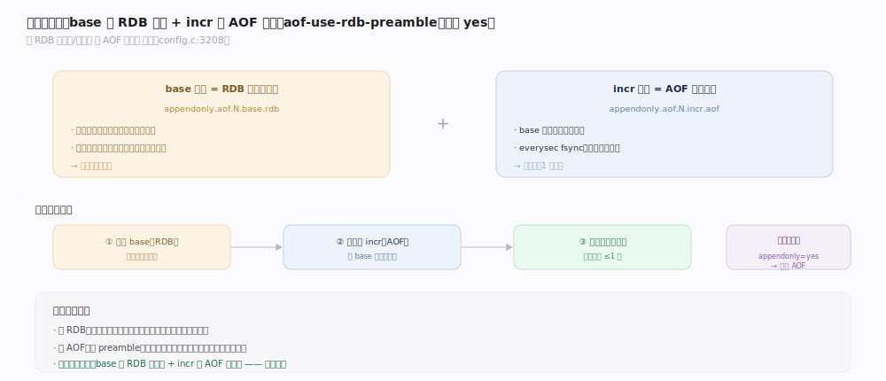

# Redis 原理 · 持久化 · AOF

> **定位**：AOF（Append Only File）是 Redis 的**操作日志**持久化——把每条写命令追加记录，重启时重放恢复。相比 RDB 的时点快照，AOF 数据丢失更少（最多 1 秒），代价是文件更大、恢复更慢。它复用 `call` 的命令传播机制（执行后写日志），fsync 交 bio 后台线程。
>
> 源码：`~/workdir/redis` unstable @9e5614d。此树用 **Multi-Part AOF**（base + incr + manifest），**无经典的 `aof_rewrite_buf` 内存差量缓冲**。

## 一、写入链路：执行后追加，三种 fsync 策略

- **追加**（`aof.c:1409` `feedAppendOnlyFile`）：命令**执行后**（在 `call` 的 propagation 阶段）把命令追加到内存缓冲 `aof_buf`；跨 DB 时先插一条 `SELECT`。
- **写盘**（`aof.c:1147` `flushAppendOnlyFile`）：把 `aof_buf` `write` 到 AOF 文件描述符（进入 OS 页缓存）。
- **fsync 策略**（`appendfsync`，默认 `everysec`，`config.c:3274`）——决定何时把 OS 页缓存真正刷到磁盘：

| 策略 | 行为 | 丢失窗口 | 性能 |
|---|---|---|---|
| `always` | 每条写命令后 fsync | 几乎不丢 | 最慢 |
| `everysec`（默认） | 每秒一次，交 bio 后台线程 | 最多 ~1~2 秒 | 均衡 |
| `no` | 交给 OS 决定何时刷 | 取决于 OS（可能 30s） | 最快 |

## 二、everysec：fsync 交给 bio 后台线程

`everysec` 是丢失与性能的平衡点：
- 距上次 fsync ≥1000ms 且当前无进行中的 fsync → `aof_background_fsync` 提交一个 `BIO_AOF_FSYNC` 任务给 bio 线程（`aof.c:983,1347`）。
- 主线程不等 fsync 完成，继续处理命令。
- **背压**：若上一个后台 fsync 还没做完，主线程最多推迟 2000ms 等它；超时则强行 write（不 fsync）并累加 `aof_delayed_fsync`（`aof.c:1186-1204`）——磁盘慢时丢失窗口可能扩到 1~2 秒。

> **一句话**：everysec 把"保证落盘"的 fsync 从命令关键路径挪到后台线程，用"最多丢 1 秒"换"命令不被磁盘 IO 拖慢"。

## 深化 · AOF 重写与 Multi-Part AOF

AOF 会越写越大（同一 key 反复改会留一堆历史命令）。**AOF 重写**用当前数据集生成一份最小命令集，压缩体积。

- **触发**（`aof.c:2867` `rewriteAppendOnlyFileBackground`）：`fork` 子进程，子进程按当前内存写一份紧凑 AOF。
- **Multi-Part AOF**（此树，`aof.c:74-78`）：AOF 不再是单文件，而是 `appendonlydir/` 目录下：
  - **base 文件**（`.base.rdb` 或 `.base.aof`）：重写时刻的全量快照。
  - **incr 文件**（`.incr.aof`）：base 之后的增量命令。
  - **manifest 文件**（`.manifest`）：记录 base 与各 incr 的清单与顺序。
- **父进程如何不丢重写期间的新写入**（关键差异）：重写开始时父进程 `openNewIncrAofForAppend` 打开一个**新的 incr 文件**继续追加（`aof.c:2856-2861`）——新写入直接落新 incr 文件，**不再用经典 Redis 的 `aof_rewrite_buf` 内存差量缓冲**。子进程写完 base，manifest 更新指向新 base + 新 incr。

## 深化 · 混合持久化（RDB preamble）

`aof-use-rdb-preamble`（默认 yes，`config.c:3208`）让 AOF 的 **base 部分用 RDB 二进制格式**，incr 部分仍是 AOF 命令文本：
- **加载快**：base 是 RDB，直接建结构，比重放大量命令快得多。
- **体积小**：RDB 紧凑。
- **丢失少**：incr 部分保留最近命令，仍是 1 秒级丢失。
- 兼二者之长：`.base.rdb`（RDB 格式全量）+ `.incr.aof`（命令增量）。

启动加载优先级：`appendonly=yes` 时**优先加载 AOF**（更新），否则加载 RDB（`server.c:7643-7663`）。

## 拓展 · bio 后台线程

`bio`（Background I/O，`bio.c`）承接会阻塞主线程的慢 IO：

| 任务类型 | 用途 |
|---|---|
| `BIO_CLOSE_FILE` | 关闭大文件（close 可能慢） |
| `BIO_AOF_FSYNC` | everysec 的 AOF fsync |
| `BIO_LAZY_FREE` | 大对象异步释放（见内存主线） |

## 调优要点（关键开关）

- `appendonly`（默认 no）：开启 AOF。
- `appendfsync`（默认 everysec）：`always` 最安全最慢、`everysec` 均衡、`no` 最快最险。
- `auto-aof-rewrite-percentage`（默认 100）/ `auto-aof-rewrite-min-size`（默认 64mb）：自动重写触发条件（比上次大 100% 且超 64MB）。
- `aof-use-rdb-preamble`（默认 yes）：混合持久化，建议保持。
- `no-appendfsync-on-rewrite`：重写期间是否暂停 fsync（防 fork 子进程与 fsync 争 IO）。

## 常见误区与工程要点

- **误区："everysec 绝不丢数据"**：磁盘慢时后台 fsync 堆积，主线程超时强写，丢失窗口可能到 1~2 秒。
- **误区："AOF 重写会阻塞"**：重写在 fork 子进程做，父进程照常写新 incr 文件，不阻塞。
- **误区："这个版本 AOF 重写用内存 diff 缓冲"**：不。Multi-Part AOF 让父进程写新 incr 文件，无 `aof_rewrite_buf`。
- **工程点**：RDB+AOF 同开时，重启优先用 AOF 恢复（数据更新）；AOF 目录是 `appendonlydir/`，别手动删其中文件破坏 manifest。

## 一句话总纲

**AOF 在命令执行后把写命令追加到 aof_buf、按 everysec 交 bio 后台线程 fsync（最多丢 1 秒）；越写越大时 fork 子进程重写成 Multi-Part 结构（RDB 格式 base + AOF 命令 incr + manifest 清单），重写期间父进程直接写新 incr 文件而非内存差量缓冲——恢复时 base 用 RDB 建结构快、incr 重放补最近命令。**
