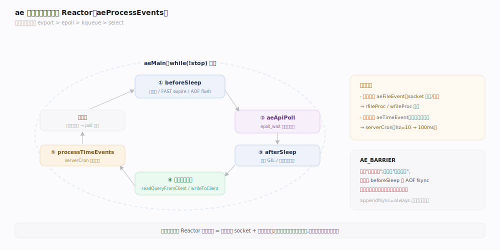
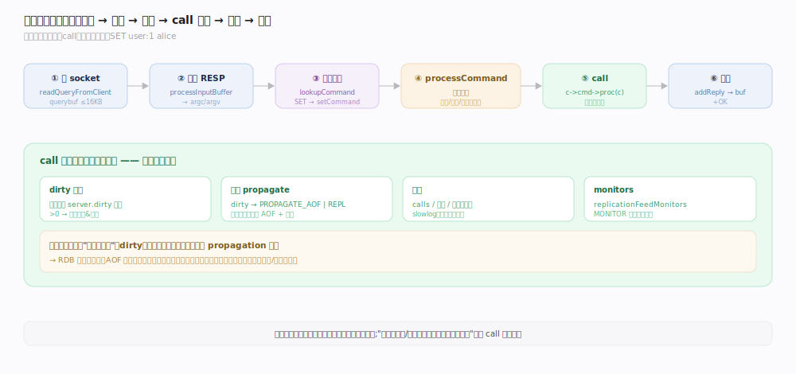
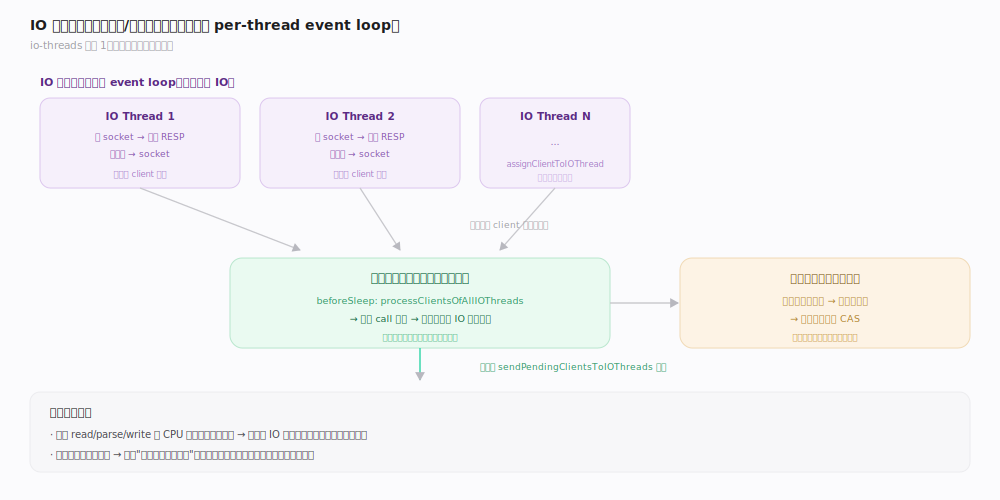
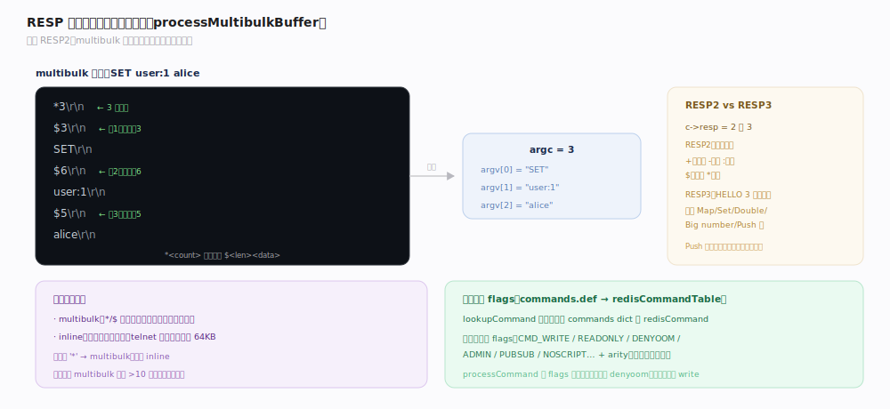

# Redis 原理 · 网络与执行模型

> **定位**：本主线是 Redis 的**执行骨架**——一个 ae 事件循环（Reactor）守着所有连接，命令在**主线程串行执行**。它被所有接触面命令族依赖，是 Redis"单命令原子、无需锁"的根源。IO 线程只并行化读写与协议解析，不并行执行命令。
>
> 源码：`~/workdir/redis` unstable @9e5614d。注意：此树用 **per-thread event loop** 的 IO 线程模型（`iothread.c`），比经典 Redis 6/7 的单 `io_threads.c` 更新。

## 一、ae 事件循环：Reactor 模式

Redis 的心脏是 `ae` 事件循环（`ae.c`）——一个单线程 Reactor：注册文件事件（socket 可读/可写）与时间事件（定时任务），用操作系统的多路复用原语等待，事件就绪时回调处理。

- **多路复用后端**（`ae.c:32-42`，编译期择优）：`evport`（Solaris）> `epoll`（Linux）> `kqueue`（BSD/macOS）> `select`（兜底）。
- **主循环 `aeMain`**（`ae.c:497`）：`while(!stop) aeProcessEvents(...)`。
- **`aeProcessEvents` 顺序**（`ae.c:365-473`）：`beforeSleep` → 算最近定时器的超时 → `aeApiPoll` 阻塞等事件 → `afterSleep` → 触发文件事件回调 → `processTimeEvents`。
- **AE_BARRIER**：可反转"先读后写"为"先写后读"，用于让 `beforeSleep` 里的 AOF fsync 先于回复发出。

## 二、单线程命令执行与 call

所有命令的实际执行都在**主线程**、通过 `call`（`server.c:3958`）串行完成——这是 Redis 一致性模型的地基。

一条命令的生命周期：
1. **读**：`readQueryFromClient`（`networking.c:3835`）从 socket 读入 `querybuf`（一次最多 `PROTO_IOBUF_LEN=16KB`）。
2. **解析**：`processInputBuffer`（`networking.c:3631`）按 RESP 协议切成 `argc/argv`；首字节 `*` 为 multibulk，否则 inline。
3. **查表**：`lookupCommand`（`server.c:3599`）用命令名在 `commands` dict 里查 `redisCommand`（表由 `commands.def` 的 `MAKE_CMD` 生成）。
4. **执行**：`processCommand` 做前置检查（内存、权限、集群重定向）后 `call(c, CMD_CALL_FULL)` → `c->cmd->proc(c)`（`server.c:4024`）。
5. **回复**：结果写入客户端的静态 `buf` 或溢出 `reply` 链表。

`call` 在执行命令前后还做：**dirty 追踪**（`server.dirty` 增量→判断是否需持久化/传播）、**耗时统计**（单调时钟）、**slowlog**（`server.c:4079`）、**monitors 转发**、**命令统计**（calls/微秒/延迟直方图，`server.c:4096`）、**传播**（dirty 则发往 AOF 与副本，`server.c:4131-4145`）。

> **一句话**：`call` 是 Redis 的"命令中枢"——不只调用命令处理函数，还负责把这次执行的副作用（dirty）分发给持久化和复制，并计入所有统计。

## 深化 · IO 线程：并行读写，串行执行

Redis 默认单线程（`io-threads=1`，`config.c:3289`）。开启多 IO 线程后，**读 socket + 解析协议 + 写回复**被分摊到多个 IO 线程，但**命令执行仍在主线程串行**。

- 此树中每个 IO 线程运行**自己的 event loop**（`IOThreadMain`，`iothread.c:860`），而非经典 Redis 的"主线程 park、IO 线程 fan-out"。
- 客户端**绑定**到某个 IO 线程（`client.tid`）；accept 时 `assignClientToIOThread` 选负载最轻的线程（`iothread.c:283`）。
- **仍串行的部分**：`call`、命令传播、过期删除——全在主线程。IO 线程把解析好的客户端交回主线程，主线程在 `beforeSleep` 里 `processClientsOfAllIOThreads` 处理。
- 老的 `io-threads-do-reads` 配置在此树已废弃（`config.c:452`）。

> **为何这样设计**：把 CPU 密集但可并行的网络 IO/解析卸载出去，同时保住"命令执行单线程"这个让一切无锁的前提——鱼与熊掌兼得。

## 深化 · RESP 协议与命令表

- **RESP2/RESP3**：`c->resp` 为 2 或 3，默认 RESP2（`config.c:3341`）。RESP3 增加了 Map/Set/Double 等类型，用于更丰富的回复。
- **multibulk**：`*<参数个数>\r\n` 后跟每个参数 `$<长度>\r\n<数据>\r\n`（`processMultibulkBuffer`，`networking.c:3219`）；未认证时拒绝 >10 个参数。
- **inline**：简单空格分隔命令，上限 `PROTO_INLINE_MAX_SIZE=64KB`。
- **命令表**：`redisCommandTable`（`server.c:3483`）由 `commands.def` 生成，每条含 proc/arity/flags（`CMD_WRITE`/`READONLY`/`DENYOOM`…）/key specs。

## 拓展 · serverCron 周期任务

`serverCron`（`server.c:1557`）是时间事件，按 `hz` 频率触发（默认 `hz=10`，即 100ms 一次；`server.h:118`），客户端多时动态翻倍。

| 任务 | 内容 | 源码 |
|---|---|---|
| clientsCron | 客户端超时、缓冲区收缩 | `server.c:1253` |
| databasesCron | activeExpireCycle(SLOW)、增量 rehash、dict resize | `server.c:1305` |
| 持久化触发 | 检查 save points 触发 BGSAVE、AOF 重写 | `server.c:1699-1733` |
| replicationCron | 复制心跳、超时检测 | `server.c:1769` |
| 统计 | 每 100ms 采样 ops/sec 等瞬时指标 | `server.c:1587` |

此外 `beforeSleep`（每次事件循环前）还跑一次 **FAST expire cycle**（`server.c:1992`）、处理 IO 线程返回的客户端、`handleClientsWithPendingWrites` 刷回复。

## 调优要点（关键开关）

- `io-threads`（默认 1）：CPU 多核 + 网络吞吐瓶颈时调到 2~8；命令执行不会因此并行。
- `hz`（默认 10）：调高让过期/清理更及时，但增加 CPU 空转；一般不动，用 `dynamic-hz`（默认开）自适应。
- `tcp-backlog` / `timeout` / `tcp-keepalive`：连接层调优。
- `maxclients`（默认 10000）：最大连接数，受 `ulimit -n` 制约。

## 常见误区与工程要点

- **误区："开了 IO 线程，命令就并行了"**：不会。IO 线程只并行网络读写/解析，命令执行永远单线程串行。
- **误区："单线程 = 慢"**：Redis 瓶颈通常在网络/内存带宽而非 CPU；单线程省去锁开销，配合多路复用可达十万级 QPS。
- **误区："一个慢命令只拖慢自己"**：单线程下，一个 O(n) 大命令（如 `KEYS *`、大 `SMEMBERS`）会**阻塞所有其他客户端**——这是最常见的线上事故。
- **工程点**：避免大 key 上的 O(n) 命令；用 `SCAN` 系列替代 `KEYS`；慢命令进 slowlog 排查。

## 一句话总纲

**一个 ae 事件循环（Reactor）用 epoll/kqueue 多路复用守着所有连接，命令统一经主线程的 call 串行执行——这既是单命令天然原子、无需锁的根源，也意味着任何 O(n) 大命令都会阻塞全局；IO 线程只并行读写与解析，绝不并行执行命令。**
