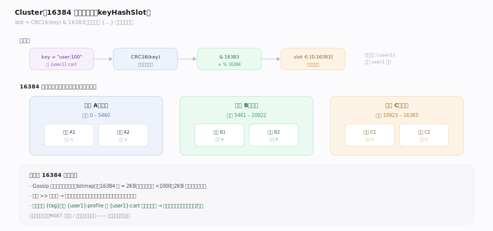
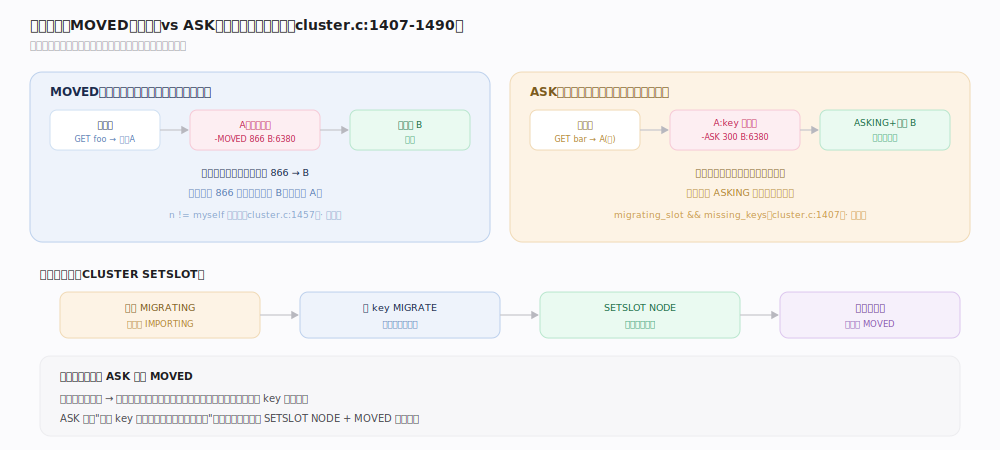
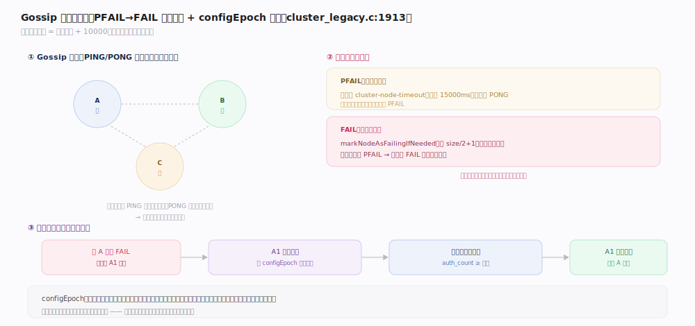
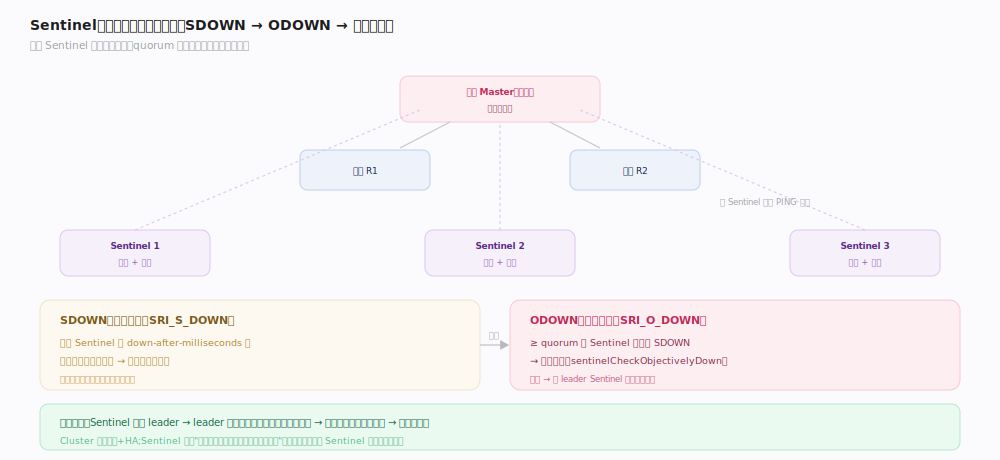

# Redis 原理 · 集群与高可用

> **定位**：本主线管 Redis 的**横向扩展**（Cluster 分片）与**故障自愈**（Cluster 故障转移 / Sentinel）。Cluster 依赖复制（每个分片是主从）；Sentinel 是不分片场景的高可用方案。二者解决的核心问题：单机内存/吞吐上限，以及主库宕机后的自动切换。
>
> 源码：`~/workdir/redis` unstable @e1cc3dc（2026-07；行号本 commit `grep -n` 实测）。`cluster.c` / `cluster.h` / `cluster_legacy.c` / `sentinel.c`。

## 一、Cluster：16384 哈希槽分片

Redis Cluster 把键空间切成 **16384 个哈希槽**，分配给多个主节点，实现数据分片与水平扩展。

- **槽映射**（`keyHashSlot`，`cluster.h:60` 定义的 static inline）：`slot = CRC16(key) & 16383`（即 `% 16384`）；`CLUSTER KEYSLOT` 等路径调它（如 `cluster.c:1096`）。
- **哈希标签**：key 含 `{...}` 时只对花括号内子串算槽——让相关 key（如 `{user1}:profile`、`{user1}:cart`）落同一槽，支持多键操作。
- **槽分配**：每个主节点负责一段槽区间（如节点 A 持 0–5460，B 持 5461–10922，C 持 10923–16383）。
- **每个分片是主从**：每个主节点带若干从库，主库宕机时从库晋升——分片内复用复制主线的机制。

## 二、请求路由：MOVED 与 ASK 重定向

客户端可能把命令发到不持有该槽的节点，集群用重定向纠正。

- **MOVED**（判定入口 `getNodeByQuery`，`cluster.c:1237`；`CLUSTER_REDIR_MOVED` 置位 `cluster.c:1488`，回包 `clusterRedirectClient`，`cluster.c:1499`）：目标槽稳定属于另一节点 → 回 `-MOVED <slot> <ip:port>`，客户端**更新本地槽表**并重发（永久性纠正）。
- **ASK**（`CLUSTER_REDIR_ASK` 置位 `cluster.c:1444`，同经 `clusterRedirectClient`，`cluster.c:1499`）：槽正在迁移中（`MIGRATING`/`IMPORTING`），且 key 已迁到目标节点 → 回 `-ASK <slot> <ip:port>`，客户端**本次**带 `ASKING` 前缀重发到目标（临时性，不更新槽表）。
- **TRYAGAIN**：迁移中部分 key 尚未就位 → 让客户端稍后重试。
- **槽迁移**：`CLUSTER SETSLOT` 把槽标记为迁移/导入状态，逐 key `MIGRATE`，完成后 `SETSLOT NODE` 正式转移归属。

## 深化 · Gossip 协议与故障转移

集群节点间通过 **Gossip 协议**（集群总线，端口 = 服务端口 + 10000）互相探测、传播状态。

- **消息类型**（`cluster_legacy.h:96` 起）：`PING`/`PONG`（心跳，携带部分节点状态）/`MEET`（加入集群，`cluster_legacy.h:98`）/`FAIL`（宣告某节点失败，`cluster_legacy.h:99`）。收到 Gossip 段由 `clusterProcessGossipSection`（`cluster_legacy.c:2120`）合并邻居看法。
- **失败检测两阶段**：
  - **PFAIL（疑似下线）**：某节点在 `cluster-node-timeout`（默认 15000ms，`config.c:3386`）内未回 PONG，标记它 PFAIL。
  - **FAIL（确认下线）**：`markNodeAsFailingIfNeeded`（`cluster_legacy.c:1913`，由 gossip 处理在 `cluster_legacy.c:2170` 调用）——当 `size/2 + 1`（多数主节点）都报告某主 PFAIL，升级为 FAIL 并广播。
- **故障转移**：主库 FAIL 后，其从库经 `clusterHandleSlaveFailover`（`cluster_legacy.c:4358`）发起选举，凭 `configEpoch` 争取多数主节点投票（`failover_auth_count >= 多数`），胜者晋升为新主、接管槽。

> **一句话**：Gossip 让状态去中心地传播，PFAIL→FAIL 的多数派确认避免误判，configEpoch 保证故障转移选举不脑裂。

## 拓展 · Sentinel：不分片的高可用

Sentinel（哨兵，`sentinel.c`）用于**单主多从、不分片**场景的高可用：
- **监控**：多个 Sentinel 进程监控主从，定期 PING。
- **SDOWN（主观下线）**（标志 `SRI_S_DOWN`，`sentinel.c:47`；检测 `sentinelCheckSubjectivelyDown`，`sentinel.c:4580`）：单个 Sentinel 认为主库不可达。
- **ODOWN（客观下线）**（标志 `SRI_O_DOWN`，`sentinel.c:48`；判定 `sentinelCheckObjectivelyDown`，`sentinel.c:4654`）：达到 `quorum` 个 Sentinel 都认为主库 SDOWN → 确认下线，随后 `sentinelStartFailover`（`sentinel.c:4053` 调用）择优（`sentinelSelectSlave`，`sentinel.c:4047`）晋升。
- **故障转移**：Sentinel 间选举一个 leader，由它选一个从库晋升为新主，重配其他从库指向新主，并通知客户端。

| 维度 | Cluster | Sentinel |
|---|---|---|
| 分片 | 是（16384 槽） | 否（单主多从） |
| 扩展 | 水平扩展容量+吞吐 | 只做高可用 |
| 客户端 | 需支持 MOVED/ASK | 透明（连 Sentinel 问主库地址） |
| 适用 | 大数据量、高吞吐 | 数据量单机可容纳、只要 HA |

## 调优要点（关键开关）

- `cluster-enabled`（默认 no，不可改）：启用集群模式。
- `cluster-node-timeout`（默认 15000ms，`config.c:3386`）：失败检测超时，太小易误判、太大切换慢。
- `cluster-require-full-coverage`（默认 yes，`config.c:3233`）：任一槽无主时是否整个集群停止服务。
- `cluster-enabled`（默认 no，`config.c:3246`，不可运行时改）：是否以集群模式启动。
- `cluster-replica-validity-factor`（默认 10，`config.c:3322`）：从库数据太旧时不参与晋升的判定因子。
- `cluster-replica-validity-factor`：从库晋升的数据新鲜度门槛。
- Sentinel：`quorum`（判 ODOWN 的票数）、`down-after-milliseconds`、`failover-timeout`。

## 常见误区与工程要点

- **误区："Cluster 支持任意多键操作"**：跨槽的多键命令（MGET/事务/Lua）会报错，除非用哈希标签 `{}` 让相关 key 同槽。
- **误区："MOVED 和 ASK 一样"**：MOVED 是永久归属变更（更新槽表），ASK 是迁移期临时重定向（不更新槽表，仅本次）。
- **误区："Cluster 有强一致"**：仍是异步复制，故障转移可能丢失未传播的写；`cluster-node-timeout` 内的分区也可能丢写。
- **误区："Sentinel 能分片"**：不能，Sentinel 只做故障转移；要分片用 Cluster。
- **工程点**：`cluster-node-timeout` 权衡误判与切换速度；生产每个分片至少 1 主 1 从；客户端用支持 Cluster 的库自动处理重定向。

## 一句话总纲

**Cluster 把键空间切成 16384 个哈希槽分给多个主节点（CRC16(key)&16383，哈希标签让相关键同槽），客户端按 MOVED（永久）/ASK（迁移临时）重定向路由；节点间用 Gossip 心跳，某主经"多数主节点确认 PFAIL→FAIL"后触发从库按 configEpoch 选举晋升；不分片只需高可用时用 Sentinel，靠 quorum 把 SDOWN 升级为 ODOWN 再故障转移。**
